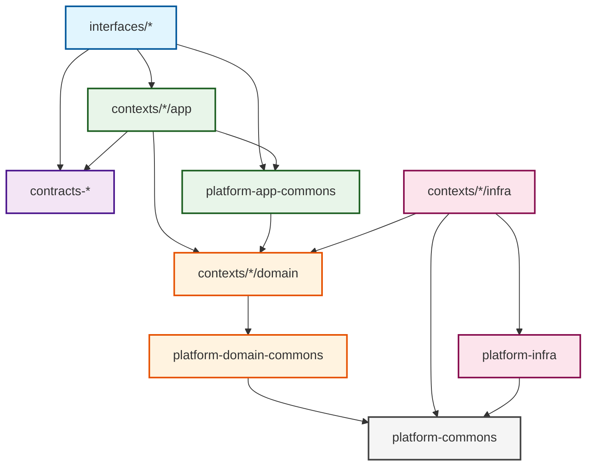

# Dependency Rules

This document defines the architectural dependency rules for the Scopes project to ensure clean architecture and maintainability.

## Module Dependency Hierarchy

The following diagram illustrates the expected dependency flow:



## Core Rules

### 1. Layer Dependencies
- **Interfaces Layer** → Can depend on: Contracts, Application layer
- **Application Layer** → Can depend on: Domain layer, Platform Application Commons
- **Domain Layer** → Can depend on: Platform Domain Commons
- **Infrastructure Layer** → Can depend on: Domain layer, Platform Infrastructure, Platform Commons
- **Platform Modules** → Self-contained, minimal cross-dependencies

### 2. Bounded Context Rules
- **Inter-context communication**: Only through `contracts-*` modules
- **Direct dependencies between contexts**: Forbidden
- **Infrastructure isolation**: `contexts/*-infrastructure` cannot depend on other contexts

### 3. Platform Module Rules
- **commons**: Pure abstractions and primitive types
- **domain-commons**: Domain-specific helpers and value objects
- **application-commons**: Application layer utilities
- **infrastructure**: System resource implementations (DB, Time, ID generation)

### 4. Forbidden Dependencies
- ❌ `infrastructure` → `application` (reverse dependency)
- ❌ `application-commons` → `platform-infrastructure`
- ❌ `domain-commons` → `platform-infrastructure`
- ❌ Direct context-to-context dependencies (must use contracts)
- ❌ `interfaces` → `domain` or `infrastructure` layers

## Verification

These rules are enforced through:
1. **Konsist Tests**: Automated architecture tests in `quality/konsist`
2. **Gradle Configuration**: Module dependencies in `build.gradle.kts`
3. **Code Reviews**: Manual verification during PR reviews

## Examples

### Valid Dependencies
```kotlin
// contexts/scope-management/application depends on domain
implementation(project(":scope-management-domain"))

// contexts use contracts for inter-context communication
implementation(project(":contracts-scope-management"))

// infrastructure depends on platform-infrastructure
implementation(project(":platform-infrastructure"))
```

### Invalid Dependencies
```kotlin
// ❌ Infrastructure depending on application
implementation(project(":scope-management-application"))

// ❌ Direct context dependency
implementation(project(":user-preferences-domain"))

// ❌ Domain depending on infrastructure
implementation(project(":platform-infrastructure"))
```
