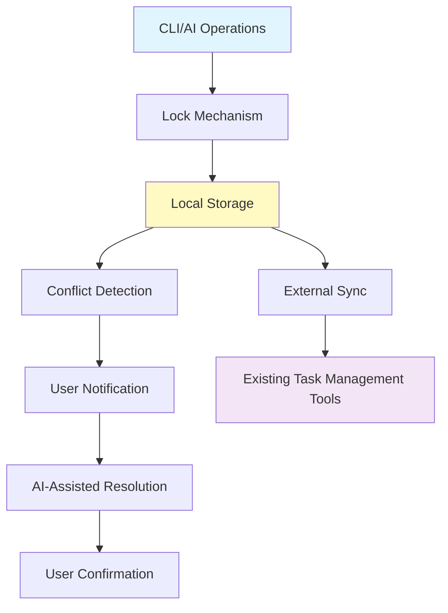

# ADR-0001: Adopt Local-First Architecture

## Status

Accepted

## Context

Scopes is designed as a task management system to support AI-driven development workflows. Unlike traditional cloud-based task management tools, there is a need to prioritize flexibility that allows developers to manage tasks at their own pace.

Key requirements driving this decision:

- Developers need environments where they can manage tasks at their own pace
- Core functionality must not depend on network connectivity
- Integration with existing task management tools (GitHub Issues, Jira, etc.)
- Flexible collaboration environment for AI-driven development

## Decision

**Adopt a local-first architecture where all core functionality operates completely in the local environment.**

### Key Design Principles

#### 1. Flexibility Through Local Management

- **Purpose**: Primary goal is management flexibility, not privacy
- **Effect**: Provides environment where users can manage at their own pace
- **Implementation**: All CRUD operations via local file system

#### 2. External Tool-Based Synchronization Strategy

- **Multi-device support**: Synchronization via existing task management tools
- **Direct sync**: Not implemented initially, may be considered based on future needs
- **Data migration**: Device-to-device transfer via export/import functionality

#### 3. Flexible Conflict Resolution Approach

- **Resolution timing**: Execute when user has interest
- **AI assistance**: Suggestions and interactive support via MCP or plugin-style CLI
- **No forced resolution**: Allow user-paced response, permit delayed resolution

#### 4. Concurrent Write Control

- **Lock functionality**: Prevent unintended overwrites by AI/humans
- **Granularity**: Minimum unit (item level such as issues, scopes)
- **Flexibility**: Adjustable based on use cases

## Consequences

### Positive

- **Offline operation**: Core functionality without network requirement
- **Management freedom**: Users can manage at their own pace
- **Data ownership**: Complete data control through local management
- **Performance**: Fast response through local processing
- **Privacy**: Completely private operation possible when needed

### Negative

- **Sync complexity**: Manual synchronization required between multiple devices
- **Backup responsibility**: Risk of local data loss
- **Initial learning cost**: Different operation method from traditional cloud tools
- **Team sharing**: External tools required for real-time team collaboration

### Neutral

- **Extensibility**: Future device-to-device sync functionality technically possible
- **AI integration**: Flexibility for feature expansion via external AI
- **Data migration**: Migration cost through export/import

## Alternatives Considered

### Alternative 1: Cloud-First Architecture

- **Description**: Store all data in cloud with local caching
- **Rejection reason**: Network dependency contradicts core requirement of developer autonomy

### Alternative 2: Hybrid Sync Architecture

- **Description**: Real-time sync with offline fallback
- **Rejection reason**: Project requirements do not mandate real-time capabilities, making the implementation complexity unjustified for the limited benefits

### Alternative 3: P2P Synchronization

- **Description**: Direct device-to-device sync without central server
- **Rejection reason**: Technical complexity and potential security concerns

## Related Decisions

- ADR-0002: Adopt AI-Driven Development Architecture

## Scope

- **Bounded Context**: Core scope management, local storage management
- **Components**: File storage layer, lock mechanism, conflict detection
- **External Systems**: Task management tools (GitHub Issues, Jira, etc.)

## Implementation Notes

### Architecture Overview

### Implementation Priority

1. **Phase 1**: Local CRUD operations and file-based storage
2. **Phase 2**: Basic lock functionality
3. **Phase 3**: Conflict detection and user notification
4. **Phase 4**: AI-assisted conflict resolution suggestions
5. **Phase 5**: External tool synchronization

### Technical Constraints

- **File system**: Depends on standard file operations
- **Platform**: Cross-platform support required
- **Permissions**: Depends on OS-level file permissions

## Tags

`architecture`, `local-first`, `offline`, `data-management`, `synchronization`
