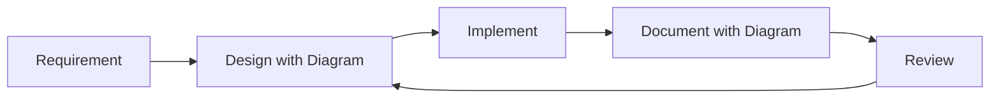
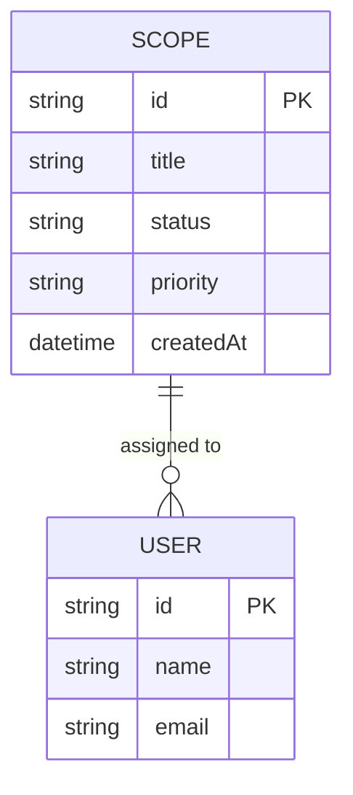
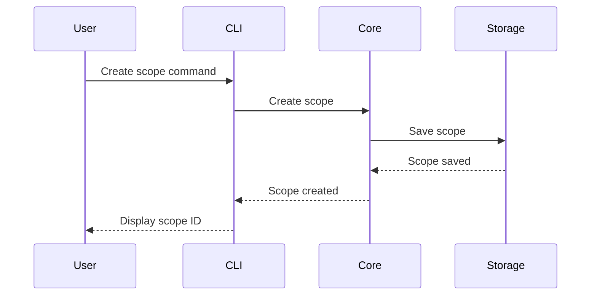

# ADR-0004: Diagrams-First Documentation

## Status

Accepted

## Context

During the development of ADRs and architectural documentation, we discovered that using Mermaid diagrams significantly improved understanding alignment between human developers and AI assistants. Text-based diagrams offer several advantages:

- **AI Collaboration**: Text-based formats can be easily processed and generated by AI assistants
- **Version Control**: Diagrams are tracked as text in Git, showing clear diffs
- **Platform Independence**: No need for specific drawing tools or licenses
- **GitHub Integration**: Native rendering support in GitHub markdown
- **Language Barrier Reduction**: Visual representations transcend language differences

The need for clear visual communication becomes even more critical when:

- Working with international teams
- Collaborating with AI assistants
- Explaining complex architectural relationships
- Documenting domain models and workflows

## Decision

**Adopt a "diagrams-first" approach for specification documentation, with Mermaid as the recommended tool for creating text-based diagrams.**

### Key Principles

#### 1. Visual Communication Priority

- Use diagrams to explain complex concepts whenever possible
- Supplement text descriptions with visual representations
- Prioritize clarity over aesthetic perfection

#### 2. Tool Flexibility with Mermaid Recommendation

- **Recommended**: Mermaid for its wide support and text-based nature
- **Acceptable**: Other text-based diagram tools (PlantUML, GraphViz)
- **Avoid**: Binary format diagrams that cannot be version controlled as text

#### 3. Diagram Types by Use Case

- **Architecture**: Component diagrams, deployment diagrams
- **Domain Models**: Entity relationship diagrams, class diagrams
- **Workflows**: Sequence diagrams, flowcharts, state diagrams
- **Data Flow**: Data flow diagrams, integration patterns

## Consequences

### Positive

- **Enhanced Understanding**: Visual representations reduce ambiguity
- **AI Compatibility**: AI assistants can read, generate, and modify diagrams
- **Version Control**: All changes tracked in Git with meaningful diffs
- **Accessibility**: No special tools required beyond a text editor
- **International Collaboration**: Reduces language barriers through visual communication

### Negative

- **Learning Curve**: Team members need to learn diagram syntax
- **Limited Aesthetics**: Text-based diagrams may lack visual polish
- **Tool Limitations**: Some complex visualizations may be challenging
- **Rendering Dependencies**: Viewers need Mermaid support (though GitHub provides this)

### Neutral

- **Standardization**: Team needs to agree on diagram conventions
- **Documentation Updates**: Existing docs may need diagram additions
- **Review Process**: Diagram reviews become part of code reviews

## Implementation Guidelines

### When to Use Diagrams

**Always Use Diagrams For**:

- System architecture overview
- Component relationships and dependencies
- Domain models and entity relationships
- Complex workflows and processes
- State machines and transitions
- API interaction patterns

**Consider Diagrams For**:

- Configuration relationships
- Deployment topologies
- Data transformations
- Error handling flows

### Mermaid Best Practices

### Example Templates

**Domain Model Example**:

**Workflow Example**:

### Documentation Standards

1. **Placement**: Include diagrams near related text explanations
2. **Titles**: Always provide descriptive titles for diagrams
3. **Annotations**: Add notes for complex parts
4. **Consistency**: Use consistent notation across all diagrams
5. **Updates**: Keep diagrams synchronized with code changes

## Alternatives Considered

### Alternative 1: Binary Format Diagrams

- **Description**: Use tools like Draw.io, Visio, or other GUI-based tools
- **Rejection reason**: Cannot track changes in Git, requires specific tools, creates collaboration barriers

### Alternative 2: No Diagram Standard

- **Description**: Let each developer choose their preferred method
- **Rejection reason**: Inconsistency reduces understanding, complicates maintenance

### Alternative 3: ASCII Art Only

- **Description**: Use only ASCII art for diagrams
- **Rejection reason**: Too limited for complex diagrams, harder to maintain

## Related Decisions

- ADR-0003: Adopt Industry Standards (Mermaid as a de facto standard)

## References

- [Mermaid Documentation](https://mermaid.js.org/)
- [GitHub Mermaid Support](https://github.blog/2022-02-14-include-diagrams-markdown-files-mermaid/)
- [CommonMark Specification](https://commonmark.org/)

## Tags

`documentation`, `diagrams`, `mermaid`, `collaboration`, `standards`

