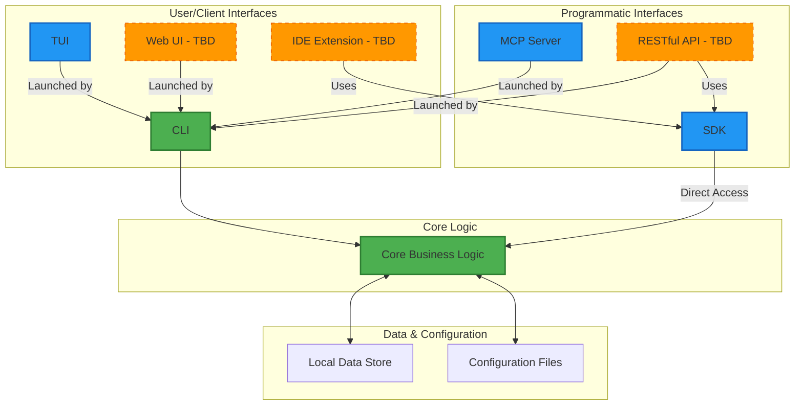

# ADR-0005: CLI-First Interface Architecture

## Status

Accepted

## Context

Scopes requires various interaction interfaces to serve different user needs and usage contexts. While the system is designed for developer productivity, the choice of interface implementation order and design principles will significantly impact adoption, maintainability, and extensibility.

Key considerations:

- Local-first architecture requires offline-capable interfaces
- AI-driven development needs programmatic access patterns
- Developer productivity demands efficient command-line workflows
- Future expansion may require graphical or integrated interfaces
- Consistency across interfaces is crucial for user experience

## Decision

We will adopt a CLI-first interface architecture with the following components:

### Primary Interface

- **Command-line interface (CLI)**: Primary and complete implementation of all core functionality
- Structured output formats (JSON, plain text) for programmatic use
- Interactive and non-interactive modes
- Serves as the foundation for other interfaces

### Programmatic Interfaces

- **Model Context Protocol (MCP) server**: AI integration interface launched via CLI
- **SDK/libraries**: Direct core access for common programming languages
- **RESTful API**: TBD - decision pending based on requirements

### Additional User Interfaces

- **Terminal User Interface (TUI)**: Enhanced interactive experience launched via CLI
- **IDE extensions**: TBD - decision pending based on requirements
- **Web UI**: TBD - decision pending based on requirements
- **Other interfaces**: TBD - based on user feedback and requirements

### Design Principles

1. **CLI as Primary Interface**
  - CLI serves as the primary and complete interface to core business logic
  - Core business logic implemented as a separate layer accessed by interfaces
  - MCP server and TUI launched via CLI flags
  - SDK provides direct programmatic access to the same core logic
  - Other interfaces may delegate to CLI commands or access core directly
  - Ensures consistency through shared core logic

2. **Unified Command Model**
  - Same conceptual operations across all interfaces
  - CLI commands generally map 1:1 to GUI actions and API endpoints
  - Consistent naming and behavior patterns
  - Interface-specific adaptations allowed when UI characteristics require different interaction patterns

3. **Progressive Enhancement**
  - Basic functionality works in all interfaces
  - Advanced features may be interface-specific
  - Graceful degradation when features unavailable

4. **Configuration-Driven Integration**
  - External system connections managed through configuration
  - No hard-coded providers or endpoints
  - Support for multiple integration patterns

5. **UI-Appropriate Interaction Patterns**
  - Choose appropriate patterns based on interface characteristics and user expectations
  - Long-running operations should use patterns suitable for each interface type
  - Examples:
    - CLI: Synchronous with progress indicators, or async with job tracking
    - GUI: Async with progress bars, notifications, or background processing
    - API: Async endpoints returning job IDs for polling or webhook callbacks

6. **Interface Launch Strategy**
  - MCP server and TUI launched via CLI commands
  - SDK provides direct library access to core business logic
  - External interfaces coordinate through shared core configuration
  - All interfaces access the same core business logic layer for consistency

### Architecture Diagram

### CLI Command Structure

Following industry-standard CLI conventions as per ADR-0003:

- **Resource-oriented design**: Commands organized around resources (scopes, contexts, etc.)
- **Consistent option patterns**: Standard flags for common operations
- **Clear verb-noun structure**: Intuitive command composition
- **Structured output formats**: Support for both human-readable and machine-parseable output

The specific command structure, naming conventions, and parameters will be determined during the detailed CLI design phase. See the [CLI Quick Reference](../../reference/cli-quick-reference.md) for the current command specification.

## Consequences

### Positive

- CLI foundation provides complete functionality from the start
- Flexibility to add interfaces based on actual user needs
- Consistent experience across different interaction methods
- Reduced maintenance through shared core logic
- Strong alignment with local-first and AI-driven principles
- Clear launch strategy for additional interfaces

### Negative

- Initial development focuses on command-line interface
- Additional development effort for each new interface
- Potential feature disparities between interfaces
- Learning curve for CLI-averse users
- Interface coordination complexity

### Neutral

- Need for comprehensive CLI documentation
- Requirement for structured output formats
- Investment in CLI testing and stability

## Related ADRs

- ADR-0001: Local-First Architecture (impacts offline capabilities)
- ADR-0002: AI-Driven Development Architecture (drives MCP requirement)
- ADR-0003: Adopt Industry Standards (defines standards-first approach)

## References

- [Command Line Interface Guidelines](https://clig.dev/)
- [GNU Coding Standards - Command Line Interfaces](https://www.gnu.org/prep/standards/html_node/Command_002dLine-Interfaces.html)
- [Model Context Protocol Specification](https://modelcontextprotocol.io/)

