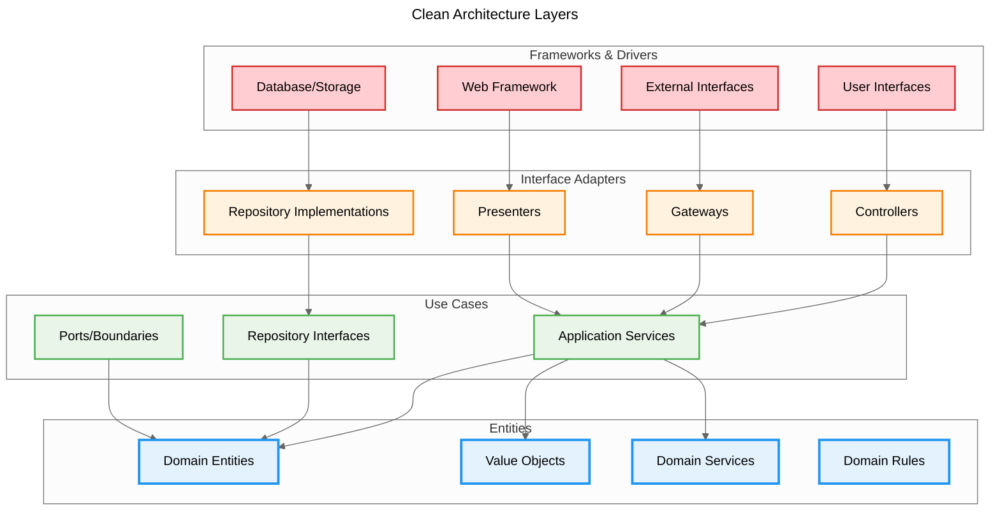

# ADR-0008: Clean Architecture Adoption

## Status

Accepted

## Context

The Scopes system has successfully adopted Domain-Driven Design (DDD) principles as defined in ADR-0007. While DDD provides excellent domain modeling capabilities, we need a complementary architectural pattern to:

- **Clarify dependency relationships** between different layers of the system
- **Enforce architectural boundaries** to prevent coupling between infrastructure and domain logic
- **Support multiple interfaces** (CLI, MCP Server, future TUI/Web) with consistent access to business logic
- **Enhance testability** by enabling isolated testing of each architectural layer
- **Facilitate future expansion** with clear guidelines for adding new components

The current architecture demonstrates good separation of concerns between domain logic, application services, and infrastructure implementations. However, the relationships between these layers and the dependency flow are not explicitly defined, which could lead to:

- **Accidental coupling** between layers
- **Inconsistent dependency directions** causing circular dependencies
- **Difficulty in testing** isolated components
- **Unclear boundaries** when adding new features

## Decision

We will adopt Clean Architecture principles to complement our existing Domain-Driven Design implementation. This decision establishes explicit architectural layers with clear dependency rules.

### Clean Architecture Layer Structure



### Dependency Rules

1. **Dependency Inversion**: Dependencies point inward only
2. **Interface Segregation**: Outer layers depend on inner layer interfaces
3. **Stable Dependencies**: Inner layers are more stable than outer layers
4. **Framework Independence**: Business logic independent of external frameworks

### Integration with DDD

Clean Architecture layers align with DDD concepts:

- **Entities Layer**: Domain entities, value objects, domain services
- **Use Cases Layer**: Application services, repository interfaces
- **Interface Adapters Layer**: Repository implementations, external service adapters
- **Frameworks & Drivers Layer**: User interfaces, external APIs, persistence mechanisms

## Consequences

### Positive

- **Clear Architectural Boundaries**: Explicit layer responsibilities and dependency rules
- **Enhanced Testability**: Each layer can be tested independently with appropriate test doubles
- **Framework Independence**: Business logic remains isolated from external dependencies
- **Scalability**: New interfaces (TUI, Web, API) can be added without affecting business logic
- **Consistency**: Uniform approach to adding new features across all layers
- **Maintainability**: Changes in outer layers don't affect inner layers

### Negative

- **Increased Complexity**: Additional abstractions and interfaces required
- **Learning Curve**: Team must understand Clean Architecture principles
- **Initial Overhead**: More code required for proper layering and abstractions
- **Potential Over-Engineering**: Risk of excessive abstraction for simple operations

### Neutral

- **Code Organization**: Requires reorganization of some existing code to align with layers
- **Testing Strategy**: May require updates to testing approach for layer isolation
- **Documentation**: Additional documentation needed for architectural guidelines

## Alternatives Considered

### Alternative 1: Layered Architecture (Traditional N-Tier)

- **Pros**: Simpler to understand, familiar to most developers
- **Cons**: Allows coupling between layers, difficult to test, framework-dependent
- **Rejected**: Would undermine the benefits of our DDD implementation

### Alternative 2: Hexagonal Architecture (Ports and Adapters)

- **Pros**: Clear separation of core and infrastructure, testable
- **Cons**: Less prescriptive about internal organization, could be confusing with DDD
- **Partially Adopted**: Clean Architecture incorporates hexagonal architecture concepts

### Alternative 3: Onion Architecture

- **Pros**: Similar benefits to Clean Architecture, domain-centric
- **Cons**: Less mature ecosystem, fewer established patterns
- **Rejected**: Clean Architecture provides better guidance and community support

### Alternative 4: Maintain Current Structure Without Formalization

- **Pros**: No additional work required, existing structure mostly correct
- **Cons**: Risk of architectural drift, unclear boundaries for new developers
- **Rejected**: Formalization provides long-term maintainability benefits

## Related Decisions

- **Built Upon**: [ADR-0007: Domain-Driven Design Adoption](./0007-domain-driven-design-adoption.md) - Clean Architecture provides the structural framework for DDD implementation
- **Influences**: [ADR-0005: CLI-First Interface Architecture](./0005-cli-first-interface-architecture.md) - CLI remains the primary interface but within Clear Architecture's outer layer
- **Supports**: [ADR-0001: Local-First Architecture](./0001-local-first-architecture.md) - Clean Architecture enables local-first design through dependency inversion

## Scope

### Bounded Context

- **Primary**: Scope Management Context
- **Future**: Additional contexts as system grows

### Components

- **Core Domain**: Domain entities, value objects, and domain services
- **Application Layer**: Use cases and application services
- **Infrastructure**: Repository implementations, external service adapters
- **Presentation**: User interfaces and external API endpoints

### External Systems

- **Local Storage**: File-based persistence
- **External APIs**: Project management tool integrations
- **AI Systems**: AI assistant integration endpoints

## Implementation Notes

### Dependencies

- **Prerequisite**: Understanding of existing DDD implementation
- **Concurrent**: Update coding guidelines with Clean Architecture patterns
- **Follow-up**: Update testing strategy for layer isolation

### Migration Strategy

1. **Assessment**: Evaluate current architecture against Clean Architecture principles
2. **Interface Definition**: Create explicit interfaces for cross-layer communication
3. **Dependency Injection**: Implement proper dependency injection for layer isolation
4. **Testing Updates**: Modify tests to validate layer boundaries
5. **Documentation**: Update architectural documentation and coding guidelines

### Implementation Guidelines

**Layer Organization**

- **Entities Layer**: Domain entities, value objects, domain services
- **Use Cases Layer**: Application services, repository interfaces, use case implementations
- **Interface Adapters Layer**: Repository implementations, external service adapters, data mappers
- **Frameworks & Drivers Layer**: CLI commands, API controllers, database drivers, external APIs

**Cross-Layer Communication**

- Use Data Transfer Objects (DTOs) for data exchange between layers
- Define clear interfaces for all cross-layer dependencies
- Implement dependency injection for loose coupling
- Avoid direct instantiation of concrete classes across layer boundaries

**Adding New Features**

1. Start with domain entities and business rules (Entities Layer)
2. Create use cases that orchestrate domain operations (Use Cases Layer)
3. Implement adapters for external systems (Interface Adapters Layer)
4. Add user interface components (Frameworks & Drivers Layer)

**Single Use Case Pattern**

Following the Single Responsibility Principle, each use case should be implemented as an individual class:

- **One Class Per Use Case**: Each use case class handles exactly one business operation
- **Request/Response Pattern**: Use DTOs for input and output to maintain layer separation
- **Interface Implementation**: Implement `UseCase<TRequest, TResponse>` interface for consistency
- **Dependency Injection**: Use DI container for repository and service dependencies
- **Descriptive Naming**: Use clear, operation-specific class names (e.g., `CreateScopeUseCase`)

This approach provides better testability, maintainability, and follows CQRS principles.

### Implementation Patterns

**Use Case Definition Pattern**

All use cases are defined by implementing the `UseCase<TRequest, TResponse>` interface rather than extending a base class.

**Rationale**: This approach provides greater flexibility by allowing a class to implement multiple interfaces and promotes composition over inheritance for sharing common logic, leading to a more decoupled and testable system.

**Example Implementation**:

```typescript
@injectable()
export class CreateScopeUseCase implements UseCase<CreateScopeRequest, CreateScopeResponse> {
  constructor(
    @inject(ScopeRepositorySymbol)
    private readonly scopeRepository: ScopeRepository
  ) {}

  async execute(request: CreateScopeRequest): Promise<CreateScopeResponse> {
    const scope = Scope.create(request.toCreateScopeData())
    await this.scopeRepository.save(scope)
    return ScopeResponse.fromScope(scope) as CreateScopeResponse
  }
}
```

### Testing Strategy

**Layer-Specific Testing Approach**

**Entities Layer Testing**

- Pure unit tests with no external dependencies
- Focus on business rule validation and domain logic
- Test entity state transitions and invariants
- High test coverage for core business logic

**Use Cases Layer Testing**

- Unit tests with mocked dependencies (repositories, external services)
- Test application workflow and orchestration logic
- Verify proper error handling and business rule enforcement
- Mock all external dependencies to ensure isolation

**Interface Adapters Layer Testing**

- Integration tests with real external systems
- Test data mapping and transformation logic
- Verify repository implementations with test databases
- Test external API integrations with contract testing

**Frameworks & Drivers Layer Testing**

- End-to-end tests covering complete user workflows
- UI testing for user interfaces and CLI commands
- System integration testing
- Performance and load testing

### Success Metrics

- **Code Quality**: Reduced coupling between layers measured through dependency analysis
- **Testability**: Ability to test each layer independently with appropriate test doubles
- **Maintainability**: Easier addition of new features without cross-layer impacts
- **Developer Experience**: Improved clarity for new team members understanding system structure

## Tags

`architecture`, `domain-design`, `clean-architecture`, `dependency-injection`, `testing`, `maintainability`
