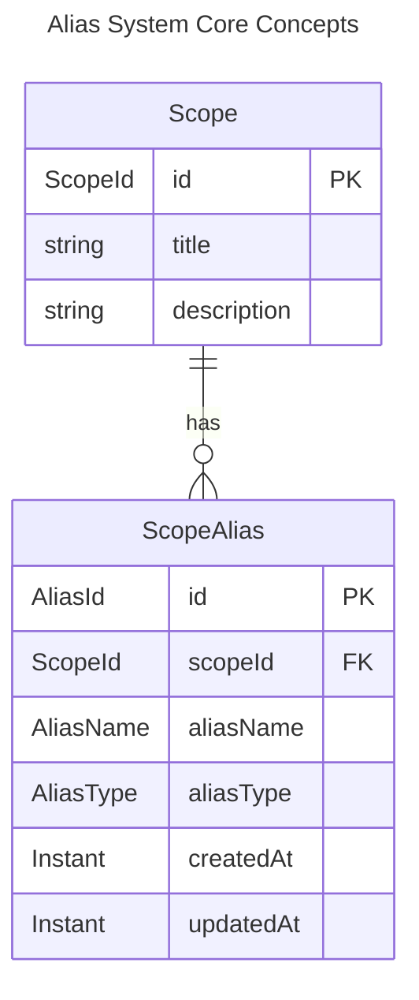
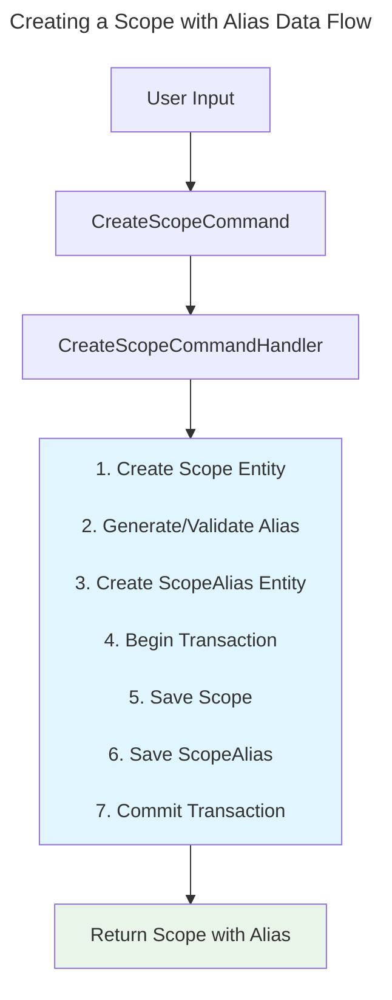
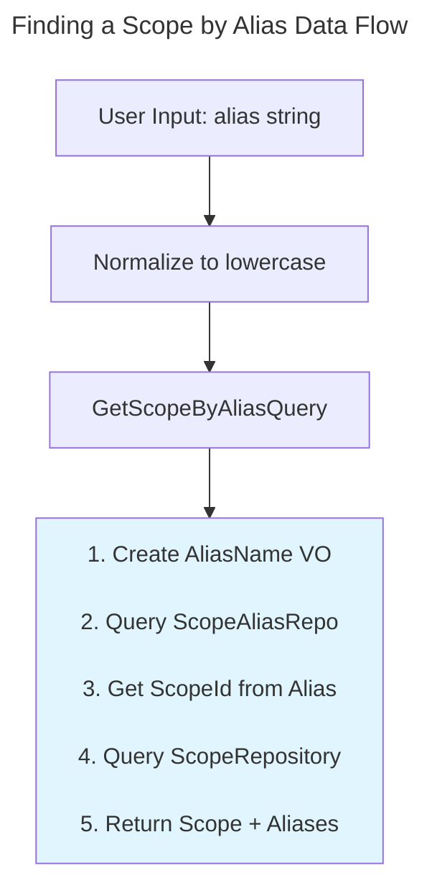

# Alias System Architecture

This document explains the architecture and design of the alias system in Scopes, following Domain-Driven Design (DDD) and Clean Architecture principles.

## Overview

The alias system provides human-friendly identifiers for scopes, replacing cryptic ULIDs with memorable names. It's designed to be fast, flexible, and user-friendly while maintaining data integrity and uniqueness constraints.

## Domain Model

### Core Concepts



### Value Objects

#### AliasName
- **Purpose**: Encapsulates alias validation and normalization
- **Rules**:
  - Length: 2-64 characters
  - Pattern: `[a-z][a-z0-9-_]{1,63}`
  - Case-insensitive (normalized to lowercase)
  - No consecutive special characters

```kotlin
@JvmInline
value class AliasName private constructor(val value: String) {
    companion object {
        fun create(value: String): Either<ScopeInputError.AliasError, AliasName>
    }
}
```

#### AliasId
- **Purpose**: Unique identifier for alias entities
- **Format**: ULID for time-ordered, globally unique IDs
- **Benefits**: Enables alias history tracking and audit trails

#### AliasType
- **Purpose**: Distinguishes between canonical and custom aliases
- **Values**:
  - `CANONICAL`: Primary auto-generated alias (exactly one per scope)
  - `CUSTOM`: User-defined additional aliases (zero or more per scope)

### Entity: ScopeAlias

The `ScopeAlias` entity represents the relationship between a scope and its alias:

```kotlin
data class ScopeAlias(
    val id: AliasId,
    val scopeId: ScopeId,
    val aliasName: AliasName,
    val aliasType: AliasType,
    val createdAt: Instant,
    val updatedAt: Instant
)
```

### Domain Services

#### AliasGenerationService
Generates canonical aliases using configurable strategies:

```kotlin
interface AliasGenerationService {
    suspend fun generateCanonicalAlias(aliasId: AliasId): Either<ScopeInputError.AliasError, AliasName>
    suspend fun generateRandomAlias(): Either<ScopeInputError.AliasError, AliasName>
}
```

#### AliasGenerationStrategy
Pluggable strategies for alias generation:

```kotlin
interface AliasGenerationStrategy {
    fun generate(seed: Long, wordProvider: WordProvider): String
    fun generateRandom(wordProvider: WordProvider): String
    fun getName(): String
}
```

## Application Layer

### Commands

#### Scope Creation with Alias
```kotlin
data class CreateScopeCommand(
    val title: String,
    val description: String? = null,
    val parentId: ScopeId? = null,
    val canonicalAlias: String? = null  // Optional custom canonical alias
)
```

#### Alias Management Commands
```kotlin
data class AddCustomAliasCommand(val scopeId: ScopeId, val aliasName: String)
data class RemoveAliasCommand(val aliasName: String)
data class GenerateCanonicalAliasCommand(val scopeId: ScopeId)
```

### Queries

```kotlin
data class GetScopeByAliasQuery(val aliasName: String)
data class GetAliasesByScopeIdQuery(val scopeId: ScopeId)
data class SearchAliasesQuery(val prefix: String, val limit: Int = 10)
```

### Command Handlers

#### CreateScopeCommandHandler
1. Creates the scope entity
2. Generates or validates canonical alias
3. Creates ScopeAlias entity
4. Saves both in a transaction

#### AddCustomAliasCommandHandler
1. Validates alias format
2. Checks for duplicates across all scopes
3. Creates new ScopeAlias with CUSTOM type
4. Saves to repository

## Infrastructure Layer

### Repository Implementation

#### ScopeAliasRepository
```kotlin
interface ScopeAliasRepository {
    suspend fun save(alias: ScopeAlias): Either<PersistenceError, Unit>
    suspend fun findByAliasName(aliasName: AliasName): Either<PersistenceError, ScopeAlias?>
    suspend fun findByScopeId(scopeId: ScopeId): Either<PersistenceError, List<ScopeAlias>>
    suspend fun existsByAliasName(aliasName: AliasName): Either<PersistenceError, Boolean>
    suspend fun removeByAliasName(aliasName: AliasName): Either<PersistenceError, Boolean>
}
```

### Performance Optimizations

#### Indexing Strategy
- Primary index on `aliasName` for fast lookups
- Secondary index on `scopeId` for listing aliases
- Prefix index for search operations

#### Caching
- In-memory cache for frequently accessed aliases
- LRU eviction policy
- Cache invalidation on updates

### Alias Generation

#### HaikunatorStrategy
Default strategy generating aliases like `quiet-river-x7k`:

```kotlin
class HaikunatorStrategy : AliasGenerationStrategy {
    override fun generate(seed: Long, wordProvider: WordProvider): String {
        val random = Random(seed)
        val adjective = selectWord(wordProvider.getAdjectives(), random)
        val noun = selectWord(wordProvider.getNouns(), random)
        val token = generateToken(random, 3)
        return "$adjective-$noun-$token"
    }
}
```

#### WordProvider
Configurable vocabulary for alias generation:

```kotlin
interface WordProvider {
    fun getAdjectives(): List<String>
    fun getNouns(): List<String>
}
```

## Data Flow

### Creating a Scope with Alias



### Finding a Scope by Alias



## Design Decisions

### Why Separate ScopeAlias Entity?
1. **Single Responsibility**: Scope focuses on task management, ScopeAlias on naming
2. **Flexibility**: Easy to add/remove aliases without modifying scope
3. **Performance**: Alias lookups don't require loading full scope data
4. **History**: Can track alias changes over time

### Why ULID for AliasId?
1. **Time-Ordered**: Natural chronological sorting
2. **Globally Unique**: No coordination required
3. **Compact**: More efficient than UUID
4. **Readable**: Can extract timestamp if needed

### Why Lowercase Normalization?
1. **User-Friendly**: No case sensitivity confusion
2. **Consistent**: Simplifies duplicate checking
3. **URL-Safe**: Works in web contexts
4. **Database-Agnostic**: Works with any collation

## Error Handling

### Domain Errors
```kotlin
sealed class ScopeAliasError : DomainError() {
    data class DuplicateAlias(val aliasName: String, val existingScopeId: ScopeId)
    data class AliasNotFound(val aliasName: String)
    data class CannotRemoveCanonicalAlias(val scopeId: ScopeId)
}
```

### Application Errors
Mapped from domain errors with additional context:
```kotlin
sealed class ApplicationScopeAliasError : ApplicationError() {
    data class AliasDuplicate(
        val aliasName: String,
        val existingScopeId: String,
        val attemptedScopeId: String
    )
}
```

## Testing Strategy

### Unit Tests
- Value object validation (AliasName, AliasId)
- Entity creation and constraints
- Service logic isolation

### Property-Based Tests
- Alias generation determinism
- Pattern compliance across generated names
- Uniqueness properties

### Integration Tests
- Full command/query flows
- Transaction boundaries
- Error propagation

### Performance Tests
- Lookup speed with large datasets
- Concurrent alias creation
- Search operation scaling

## Security Considerations

### Input Validation
- Strict pattern matching prevents injection
- Length limits prevent DoS
- Character restrictions ensure safety

### Access Control
- Alias operations inherit scope permissions
- No separate alias-level permissions
- Audit trail through AliasId timestamps

## Future Enhancements

### Planned Features
1. **Alias History**: Track all previous aliases for a scope
2. **Bulk Import/Export**: CSV/JSON alias mappings
3. **Smart Suggestions**: ML-based alias recommendations
4. **Alias Templates**: Organization-specific patterns

### Extensibility Points
1. **Custom Strategies**: Plug in domain-specific generation
2. **Word Providers**: Industry-specific vocabularies
3. **Validation Rules**: Organization policies
4. **Search Algorithms**: Fuzzy matching, soundex

## Conclusion

The alias system demonstrates clean separation of concerns, with clear boundaries between domain logic, application orchestration, and infrastructure. It provides a user-friendly interface while maintaining data integrity and performance at scale.
