# Automated Release Process

This document describes the automated release notes generation system implemented for Scopes.

## Overview

Scopes uses GitHub's native release notes generation combined with custom verification content to create comprehensive, standardized release notes for every release.

## Workflow Architecture

### Overview

```mermaid
graph LR
    %% Triggers
    Start([🏷️ Tag Push<br/>v*.*.* or<br/>Manual Dispatch]) 
    
    %% Main workflow stages
    Start --> Build[🏗️ Build<br/>Multi-Platform<br/>Artifacts]
    Build --> Security[🔐 Security<br/>Verification<br/>& SLSA]
    Security --> Release[🚀 GitHub<br/>Release<br/>Creation]
    
    %% Final outputs
    Release --> Output{📦 Release Assets}
    
    %% Output types
    Output --> Binaries[📱 Native Binaries<br/>Linux, macOS, Windows]
    Output --> Verification[🛡️ Security Files<br/>SLSA + SBOM + Checksums]
    Output --> Documentation[📄 Release Notes<br/>+ Installation Guide]
    
    %% Styling
    classDef triggerBox fill:#fff3e0,stroke:#e65100,stroke-width:2px
    classDef processBox fill:#e1f5fe,stroke:#01579b,stroke-width:2px  
    classDef outputBox fill:#e8f5e8,stroke:#1b5e20,stroke-width:2px
    classDef artifactBox fill:#f3e5f5,stroke:#4a148c,stroke-width:1px
    
    class Start triggerBox
    class Build,Security,Release processBox
    class Output outputBox
    class Binaries,Verification,Documentation artifactBox
```



### Detailed Job Flow

#### 1. Build Release Artifacts Job

```mermaid
graph TB
    subgraph Matrix ["🔄 Build Matrix (Parallel Execution)"]
        direction TB
        Linux[🐧 Ubuntu Latest<br/>Linux x64]
        MacOS[🍎 macOS Latest<br/>Darwin x64]  
        Windows[🪟 Windows Latest<br/>Win32 x64]
    end
    
    subgraph Steps ["📋 Build Steps (Each Platform)"]
        direction TB
        A[📥 Checkout Code] --> B[⚙️ Setup Environment<br/>GraalVM + Gradle]
        B --> C[🏷️ Extract Version<br/>from Tag/Input]
        C --> D[🔨 Native Compile<br/>Platform Binary]
        D --> E[📋 Generate SBOM<br/>CycloneDX Format]
        E --> F[#️⃣ Generate SHA-256<br/>Binary & SBOM Hashes]
        F --> G[📤 Upload Artifacts<br/>Binary + SBOM + Hash]
    end
    
    Matrix --> Steps
    
    %% Styling
    classDef matrixBox fill:#e3f2fd,stroke:#0277bd,stroke-width:2px
    classDef stepBox fill:#f1f8e9,stroke:#388e3c,stroke-width:1px
    
    class Matrix matrixBox
    class A,B,C,D,E,F,G stepBox
```



#### 2. Security & Provenance Generation

```mermaid
graph TB
    subgraph Collect ["📦 Collect Hashes"]
        direction TB
        DL1[📥 Download Linux Hashes] 
        DL2[📥 Download macOS Hashes]
        DL3[📥 Download Windows Hashes]
        DL1 --> Combine[🔗 Combine & Encode<br/>Base64 for SLSA]
        DL2 --> Combine
        DL3 --> Combine
        Combine --> Output1[📤 Output Combined<br/>Hash String]
    end
    
    subgraph Provenance ["🛡️ SLSA Provenance"]
        direction TB
        Input[📥 Combined Hashes<br/>Input]
        Input --> Generator[🔐 SLSA Framework<br/>Generic Generator]
        Generator --> Attest[📤 Generate Attestation<br/>multiple.intoto.jsonl]
    end
    
    Output1 --> Input
    
    %% Styling  
    classDef collectBox fill:#e8f5e8,stroke:#2e7d32,stroke-width:2px
    classDef provenanceBox fill:#fff3e0,stroke:#f57c00,stroke-width:2px
    
    class Collect collectBox
    class Provenance provenanceBox
```



#### 3. GitHub Release Creation

```mermaid
graph TB
    subgraph Downloads ["📦 Artifact Collection"]
        direction TB
        GetBinaries[📥 Download Binaries<br/>All Platforms]
        GetSBOM[📥 Download SBOM Files<br/>JSON & XML formats]  
        GetProvenance[📥 Download SLSA<br/>Provenance Files]
    end
    
    subgraph Processing ["⚙️ Release Processing"]
        direction TB
        GenNotes[📝 Generate Enhanced<br/>Release Notes]
        PrepAssets[📦 Prepare Assets<br/>Organize Files]
        GenNotes --> PrepAssets
    end
    
    subgraph Release ["🚀 GitHub Release"]
        direction TB
        CreateRelease[✨ Create Release<br/>Tag + Description]
        AttachAssets[📎 Attach All Assets<br/>Binaries + Security Files]
        Publish[🌐 Publish Release<br/>Public Availability]
        CreateRelease --> AttachAssets
        AttachAssets --> Publish
    end
    
    Downloads --> Processing
    Processing --> Release
    
    %% Styling
    classDef downloadBox fill:#e3f2fd,stroke:#1976d2,stroke-width:2px
    classDef processBox fill:#f3e5f5,stroke:#7b1fa2,stroke-width:2px
    classDef releaseBox fill:#e8f5e8,stroke:#388e3c,stroke-width:2px
    
    class Downloads downloadBox
    class Processing processBox
    class Release releaseBox
```



## How It Works

### 1. Automatic Categorization

Pull requests and commits are automatically categorized using labels defined in `.github/release.yml`:

- 🚀 **New Features**: `feature`, `enhancement`, `feat`, `new-feature`
- 🐛 **Bug Fixes**: `bug`, `bugfix`, `fix`, `hotfix`
- 📚 **Documentation**: `documentation`, `docs`
- 🔒 **Security**: `security`, `vulnerability`, `cve`
- ⚡ **Performance**: `performance`, `perf`, `optimization`
- 🧹 **Code Quality**: `refactor`, `refactoring`, `cleanup`, `code-quality`, `style`
- 🔧 **Infrastructure & CI/CD**: `ci`, `cd`, `infrastructure`, `build`, `workflow`, `github-actions`
- 📦 **Dependencies**: `dependencies`, `deps`, `dependency`
- 🔄 **Other Changes**: `chore`, `maintenance`, or catch-all for unlabeled items

### 2. Custom Security Content

Each release automatically includes:

- **Verification Instructions**: Quick one-liner installation with verification
- **Security Notice**: SLSA provenance and supply chain security information
- **Documentation Links**: Links to security guides and verification procedures
- **Artifact Information**: Details about checksums, SBOM files, and provenance

### 3. Release Notes Structure

The final release notes follow this structure:

```markdown
## 🔐 Verification Instructions
[Custom security content and quick verification]

## 🚀 What's Changed
[Auto-generated categorized changelog]

## Installation
[Standard installation instructions]

## Security & Verification
[Detailed SLSA and SBOM verification examples]
```

## For Maintainers

### Labeling Pull Requests

To ensure proper categorization, label your pull requests with appropriate labels:

```bash
# Examples
gh pr create --label "feature" --title "Add new CLI command"
gh pr create --label "bug" --title "Fix memory leak in task processing"
gh pr create --label "docs" --title "Update installation guide"
```

### Triggering Releases

Releases are triggered by pushing version tags:

```bash
# Create and push a release tag
git tag v1.0.0
git push origin v1.0.0

# Or for pre-releases
git tag v1.0.0-beta.1
git push origin v1.0.0-beta.1
```

### Excluding Content

To exclude certain PRs from release notes, use these labels:
- `skip-changelog`
- `duplicate`
- `invalid`
- `wontfix`

Bot accounts (dependabot, github-actions) are automatically excluded.

## Benefits

1. **Consistency**: Every release has the same structure and security information
2. **Automation**: No manual release notes creation required
3. **Security First**: Verification instructions are prominently displayed
4. **User-Friendly**: Clear categorization makes it easy to find relevant changes
5. **Maintainer-Friendly**: Simple labeling system for proper categorization

## Related Files

- `.github/release.yml` - Release notes configuration
- `.github/workflows/release.yml` - Release automation workflow
- `../guides/security-verification.md` - Security verification guide
- `../guides/sbom-verification.md` - SBOM verification guide
- `../../install/README.md` - Installation guide
