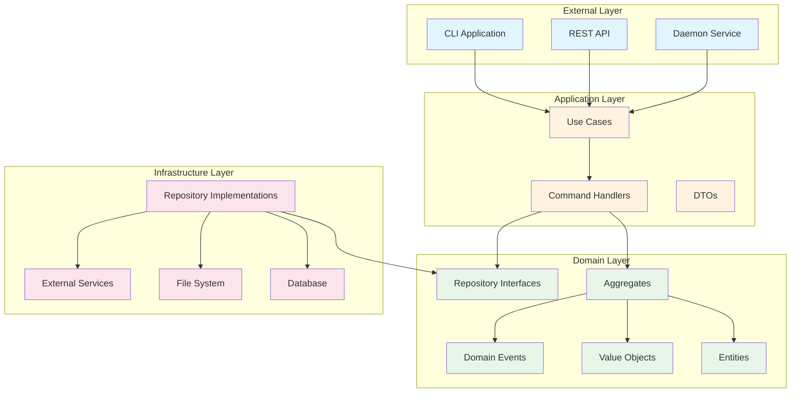

# Clean Architecture Implementation

## Overview

Scopes follows **Clean Architecture** principles to ensure maintainability, testability, and flexibility.

## Architectural Layers



## Layer Responsibilities

### 1. Domain Layer (Core Business Logic)
- **Location**: `domain/`
- **Contents**:
  - **Aggregates**: `ScopeAggregate` - Main aggregate root
  - **Entities**: `Scope`, `AspectDefinition`, `ContextView`
  - **Value Objects**: `ScopeId`, `ScopeTitle`, `ScopeDescription`, `AspectKey`, `AspectValue`
  - **Domain Events**: State change notifications
  - **Repository Interfaces**: Abstract persistence contracts
- **Dependencies**: None (pure business logic)
- **Testing**: Property-based tests for invariants

### 2. Application Layer (Use Cases)
- **Location**: `application/`
- **Contents**:
  - **Commands**: `CreateScope`, `UpdateScope`, `DeleteScope`
  - **Command Handlers**: Orchestrate domain operations
  - **DTOs**: `ScopeDto`, `CreateScopeResult`, `FilteredScopesResult`
  - **Application Services**: Cross-aggregate operations
- **Dependencies**: Domain layer only
- **Testing**: Integration tests for workflows

### 3. Infrastructure Layer (External Integrations)
- **Location**: `infrastructure/`
- **Contents**:
  - **Repository Implementations**: SQLite, file system
  - **External Service Adapters**: Git, MCP, sync services
  - **Configuration**: Database setup, connection pools
- **Dependencies**: Domain and Application layers
- **Testing**: Integration tests with test doubles

### 4. Presentation Layer (User Interfaces)
- **Location**: `apps/`
- **Contents**:
  - **CLI**: Command-line interface (`apps/cli/`)
  - **REST API**: HTTP endpoints (`apps/api/`)
  - **Daemon**: Background service (`apps/daemon/`)
- **Dependencies**: Application layer
- **Testing**: End-to-end tests

## Dependency Rules

1. **Dependency Direction**: Dependencies point inward (outer layers depend on inner layers)
2. **Domain Independence**: Domain layer has no external dependencies
3. **Interface Segregation**: Use interfaces to invert dependencies
4. **Framework Independence**: Business logic doesn't depend on frameworks

```kotlin
// ❌ Wrong: Domain depends on Infrastructure
class Scope(private val database: SQLiteDatabase) { ... }

// ✅ Correct: Domain defines interface, Infrastructure implements
interface ScopeRepository {
    fun save(scope: Scope): Either<ScopesError, Unit>
}

class SQLiteScopeRepository : ScopeRepository {
    override fun save(scope: Scope): Either<ScopesError, Unit> { ... }
}
```

## Functional Programming with Arrow

We use Arrow for functional programming patterns:

### Error Handling with Either
```kotlin
sealed class ScopesError
data class ValidationError(val message: String) : ScopesError()
data class NotFoundError(val id: ScopeId) : ScopesError()

fun createScope(title: String): Either<ScopesError, Scope> = either {
    val validatedTitle = ScopeTitle.create(title).bind()
    Scope.create(validatedTitle).bind()
}
```

### Immutability and Pure Functions
```kotlin
data class Scope(
    val id: ScopeId,
    val title: ScopeTitle,
    val description: ScopeDescription? = null
) {
    // Pure function - no side effects
    fun updateTitle(newTitle: ScopeTitle): Scope = 
        copy(title = newTitle)
}
```

## Testing Strategy

### 1. Unit Tests (Domain Layer)
- Property-based testing for value objects
- Invariant testing for aggregates
- Pure function testing

### 2. Integration Tests (Application Layer)
- Use case workflow testing
- Command handler testing
- Mock repository implementations

### 3. Architecture Tests (Konsist)
- Enforce Clean Architecture rules
- Validate layer dependencies
- Check naming conventions

```kotlin
@Test
fun `domain layer should not depend on infrastructure`() {
    Konsist.scopeFromModule("domain")
        .classes()
        .assertNot { it.resideInPackage("..infrastructure..") }
}
```

## Benefits

1. **Testability**: Each layer can be tested independently
2. **Maintainability**: Clear separation of concerns
3. **Flexibility**: Easy to swap implementations
4. **Business Focus**: Domain logic is framework-agnostic
5. **Evolutionary Design**: Can change external layers without affecting core

## Implementation Guidelines

1. Start with domain modeling (entities, value objects)
2. Define use cases based on user stories
3. Implement infrastructure as needed
4. Keep frameworks at the edges
5. Use dependency injection for wiring
6. Write tests at appropriate levels
7. Run `./gradlew konsistTest` to verify compliance