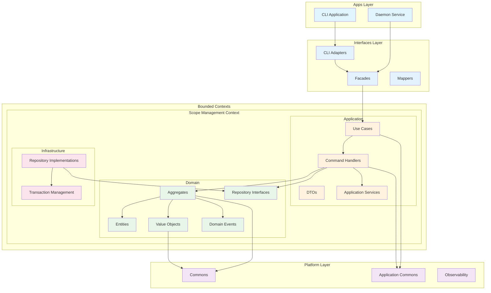

# Clean Architecture Implementation

## Overview

Scopes follows **Clean Architecture** principles to ensure maintainability, testability, and flexibility.

## Architectural Layers



## Layer Responsibilities

### 1. Bounded Contexts Layer
Each bounded context represents a distinct business capability and contains three sub-layers:

#### Scope Management Context (`contexts/scope-management/`)
The core bounded context handling all scope-related operations.

##### Domain Layer (Core Business Logic)
- **Location**: `contexts/scope-management/domain/`
- **Contents**:
  - **Aggregates**: `ScopeAggregate` - Main aggregate root with event sourcing
  - **Entities**: `Scope`, `AspectDefinition`, `ContextView`
  - **Value Objects**: `ScopeId`, `ScopeTitle`, `ScopeDescription`, `AspectKey`, `AspectValue`
  - **Domain Events**: `ScopeCreated`, `ScopeUpdated`, `ScopeDeleted`, etc.
  - **Repository Interfaces**: Abstract persistence contracts
  - **Domain Services**: `ScopeHierarchyService`, `AliasGenerationService`
- **Dependencies**: Platform commons only
- **Testing**: Property-based tests for invariants

##### Application Layer (Use Cases)
- **Location**: `contexts/scope-management/application/`
- **Contents**:
  - **Commands**: `CreateScope`, `UpdateScope`, `DeleteScope`
  - **Queries**: `GetScopeById`, `GetFilteredScopes`, `GetChildren`
  - **Command Handlers**: `CreateScopeHandler`, `UpdateScopeHandler`, `DeleteScopeHandler`
  - **Query Handlers**: `GetScopeByIdHandler`, `GetChildrenHandler`
  - **DTOs**: `ScopeDto`, `CreateScopeResult`, `FilteredScopesResult`
  - **Application Services**: `CrossAggregateValidationService`, `ActiveContextService`
  - **Port Interfaces**: `TransactionManager`
- **Dependencies**: Domain layer and platform application commons
- **Testing**: Integration tests for workflows

##### Infrastructure Layer (Technical Implementations)
- **Location**: `contexts/scope-management/infrastructure/`
- **Contents**:
  - **Repository Implementations**: `InMemoryScopeRepository`, `InMemoryContextViewRepository`
  - **Alias Generation**: `DefaultAliasGenerationService`, `HaikunatorStrategy`
  - **Transaction Management**: `NoopTransactionManager`
  - **Word Providers**: `DefaultWordProvider`
- **Dependencies**: Domain and Application layers
- **Testing**: Integration tests with test doubles

### 2. Interfaces Layer (Adapters)
- **Location**: `interfaces/`
- **Contents**:
  - **CLI Module** (`interfaces/cli/`):
    - Commands: `CreateCommand`, `GetCommand`, `ListCommand`, `UpdateCommand`, `DeleteCommand`
    - Adapters: `ScopeCommandAdapter`
    - Formatters: `ScopeOutputFormatter`
    - Mappers: `ErrorMessageMapper`
  - **Shared Module** (`interfaces/shared/`):
    - Facades: `ScopeManagementFacade`
    - DI Configuration: `InterfaceSharedModule`
- **Dependencies**: Application layer from bounded contexts
- **Testing**: Adapter tests

### 3. Apps Layer (Entry Points)
- **Location**: `apps/`
- **Contents**:
  - **CLI Application** (`apps/scopes/`):
    - Main entry point: `SimpleScopesCommand`
    - DI Configuration: `KoinCompositionRoot`, `CliAppModule`
  - **Daemon Service** (`apps/scopesd/`):
    - Background service: `DaemonApplication`
- **Dependencies**: Interfaces layer
- **Testing**: End-to-end tests

### 4. Platform Layer (Shared Infrastructure)
- **Location**: `platform/`
- **Contents**:
  - **Commons** (`platform/commons/`):
    - Core types: `ULID`, `Instant`
    - Validation: `ValidationResult`
  - **Application Commons** (`platform/application-commons/`):
    - Base types: `Command`, `Query`, `DTO`, `UseCase`
    - Ports: `TransactionManager`
  - **Observability** (`platform/observability/`):
    - Logging: `Logger`, `ConsoleLogger`, `LogAppender`
    - Monitoring: `ApplicationInfo`, `RuntimeInfo`
    - Formatters: `JsonLogFormatter`, `PlainTextLogFormatter`
- **Dependencies**: None (foundation layer)
- **Testing**: Unit tests

### 5. Quality Layer (Architecture Tests)
- **Location**: `quality/`
- **Contents**:
  - **Konsist Tests** (`quality/konsist/`):
    - Architecture validation: `CleanArchitectureTest`, `BoundedContextArchitectureTest`
    - DDD patterns: `DddUseCasePatternTest`
    - Code organization: `ImportOrganizationTest`, `LayerArchitectureTest`
- **Dependencies**: All layers (for testing)
- **Testing**: Architecture compliance tests

## Dependency Rules

1. **Dependency Direction**: 
   - Apps → Interfaces → Bounded Contexts (Application → Domain)
   - All layers can depend on Platform layer
   - Dependencies point inward within each bounded context

2. **Bounded Context Independence**: 
   - Each bounded context is isolated
   - Communication between contexts through application services
   - No direct cross-context domain dependencies

3. **Domain Independence**: 
   - Domain layer depends only on platform commons
   - No framework dependencies in domain
   - Pure business logic and rules

4. **Interface Segregation**: 
   - Use interfaces to invert dependencies
   - Repository interfaces in domain, implementations in infrastructure
   - Port interfaces in application for external services

5. **Framework Independence**: 
   - Business logic doesn't depend on frameworks
   - Frameworks confined to infrastructure and apps layers
   - DI configuration separated in dedicated modules

```kotlin
// ❌ Wrong: Domain depends on Infrastructure
class Scope(private val database: SQLiteDatabase) { ... }

// ❌ Wrong: Cross-context domain dependency
import io.github.kamiazya.scopes.anotherdomain.entity.AnotherEntity

// ✅ Correct: Domain defines interface, Infrastructure implements
// In domain layer:
interface ScopeRepository {
    suspend fun save(aggregate: ScopeAggregate): Either<ScopesError, Unit>
    suspend fun findById(id: ScopeId): Either<ScopesError, ScopeAggregate?>
}

// In infrastructure layer:
class InMemoryScopeRepository : ScopeRepository {
    override suspend fun save(aggregate: ScopeAggregate): Either<ScopesError, Unit> { ... }
}

// ✅ Correct: Using platform commons
import io.github.kamiazya.scopes.platform.commons.id.ULID
import io.github.kamiazya.scopes.platform.commons.validation.ValidationResult
```

## Functional Programming with Arrow

We use Arrow for functional programming patterns:

### Error Handling with Either
```kotlin
sealed class ScopesError
data class ValidationError(val message: String) : ScopesError()
data class NotFoundError(val id: ScopeId) : ScopesError()

fun createScope(title: String): Either<ScopesError, Scope> = either {
    val validatedTitle = ScopeTitle.create(title).bind()
    Scope.create(validatedTitle).bind()
}
```

### Immutability and Pure Functions
```kotlin
data class Scope(
    val id: ScopeId,
    val title: ScopeTitle,
    val description: ScopeDescription? = null
) {
    // Pure function - no side effects
    fun updateTitle(newTitle: ScopeTitle): Scope = 
        copy(title = newTitle)
}
```

## Testing Strategy

### 1. Unit Tests (Domain Layer)
- Property-based testing for value objects with Kotest
- Invariant testing for aggregates
- Pure function testing
- Domain event verification

### 2. Integration Tests (Application Layer)
- Use case workflow testing
- Command and query handler testing
- Mock repository implementations
- Cross-aggregate validation testing

### 3. Adapter Tests (Interfaces Layer)
- CLI command parsing and formatting
- Error message mapping
- Facade integration testing

### 4. End-to-End Tests (Apps Layer)
- Full application flow testing
- DI container validation
- Command-line interface testing

### 5. Architecture Tests (Quality/Konsist)
- Enforce Clean Architecture rules
- Validate bounded context isolation
- Check layer dependencies
- Verify naming conventions
- DDD pattern compliance

```kotlin
// Example architecture tests from quality/konsist
@Test
fun `bounded contexts should be isolated`() {
    Konsist.scopeFromModule("contexts/scope-management/domain")
        .classes()
        .assertNot { 
            it.hasImport { import ->
                import.contains("contexts") && 
                !import.contains("scope-management")
            }
        }
}

@Test
fun `domain layer should only depend on platform commons`() {
    Konsist.scopeFromModule("contexts/scope-management/domain")
        .files
        .imports
        .filter { !it.isExternal }
        .assert { import ->
            import.name.startsWith("io.github.kamiazya.scopes.scopemanagement.domain") ||
            import.name.startsWith("io.github.kamiazya.scopes.platform.commons")
        }
}

@Test
fun `apps layer should not directly access domain layer`() {
    Konsist.scopeFromModule("apps")
        .classes()
        .assertNot { 
            it.hasImport { import ->
                import.contains(".domain.")
            }
        }
}
```

## Benefits

1. **Testability**: Each layer can be tested independently
2. **Maintainability**: Clear separation of concerns
3. **Flexibility**: Easy to swap implementations
4. **Business Focus**: Domain logic is framework-agnostic
5. **Evolutionary Design**: Can change external layers without affecting core

## Implementation Guidelines

1. Start with domain modeling (entities, value objects)
2. Define use cases based on user stories
3. Implement infrastructure as needed
4. Keep frameworks at the edges
5. Use dependency injection for wiring
6. Write tests at appropriate levels
7. Run `./gradlew konsistTest` to verify compliance
