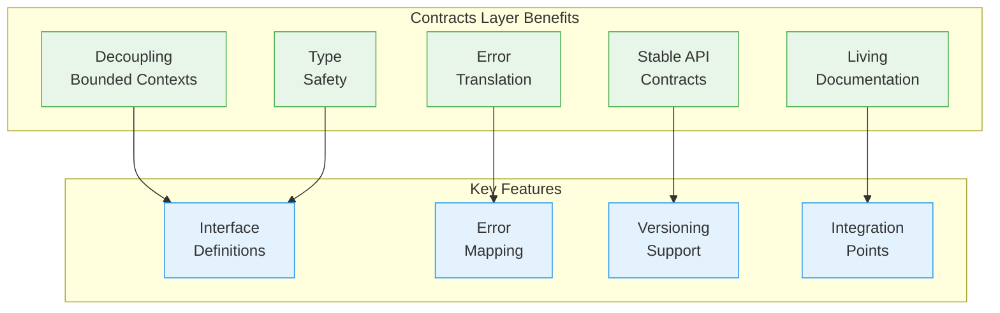
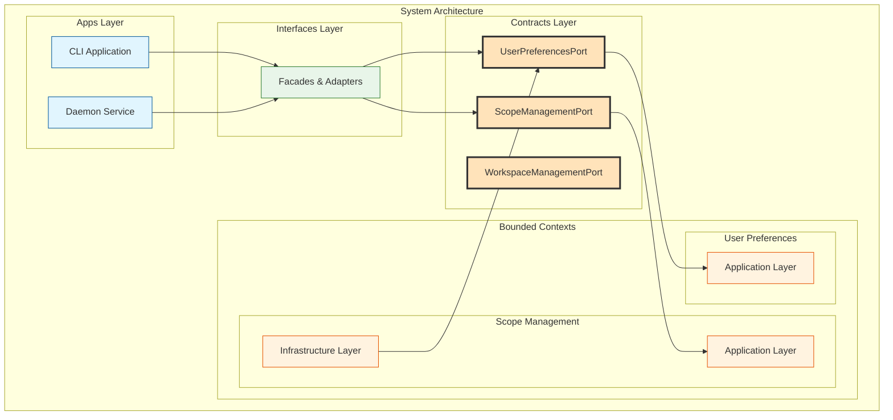
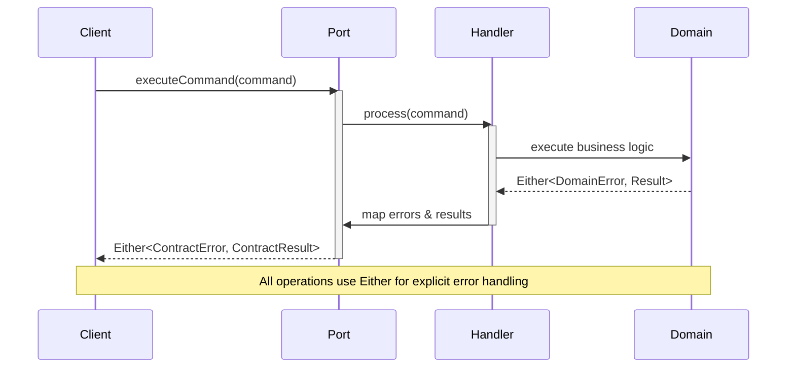
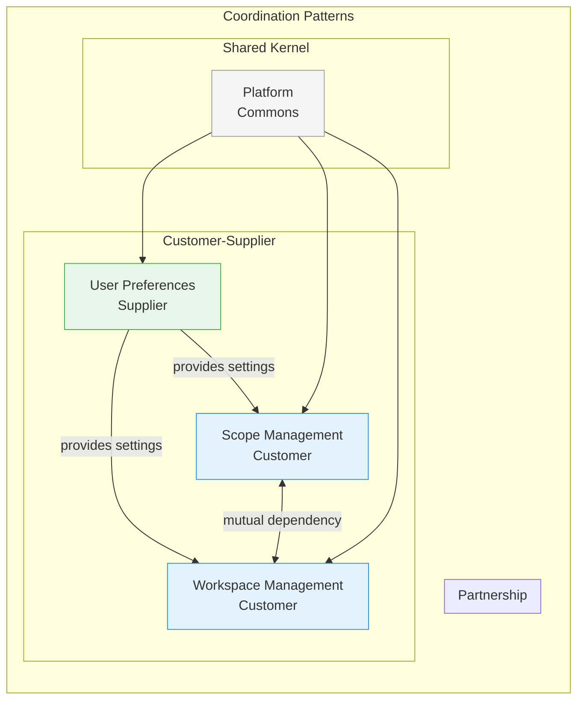
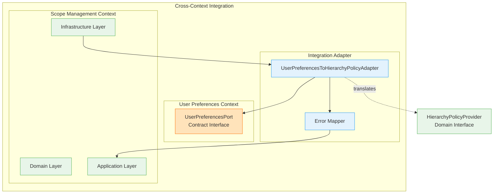
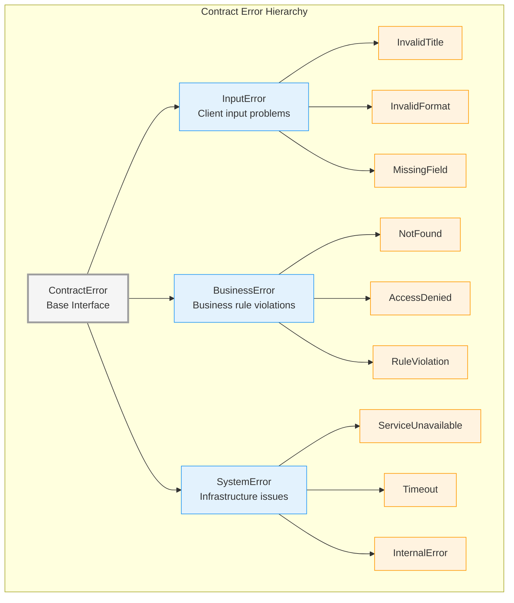
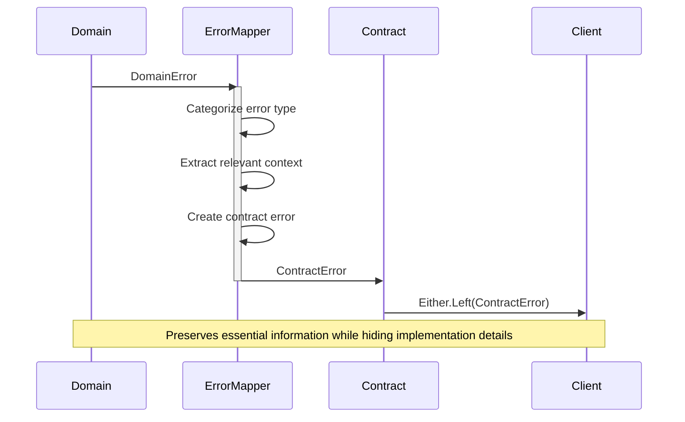
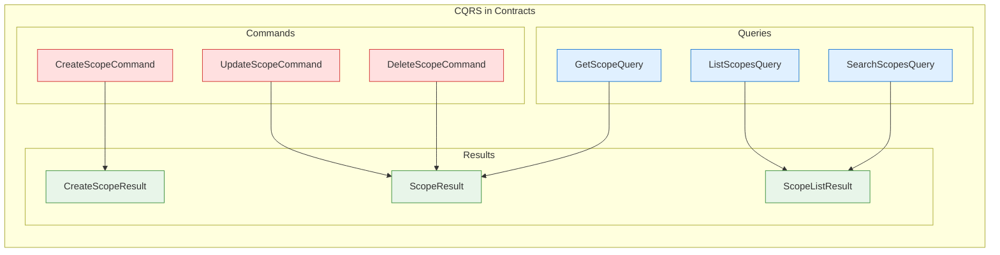
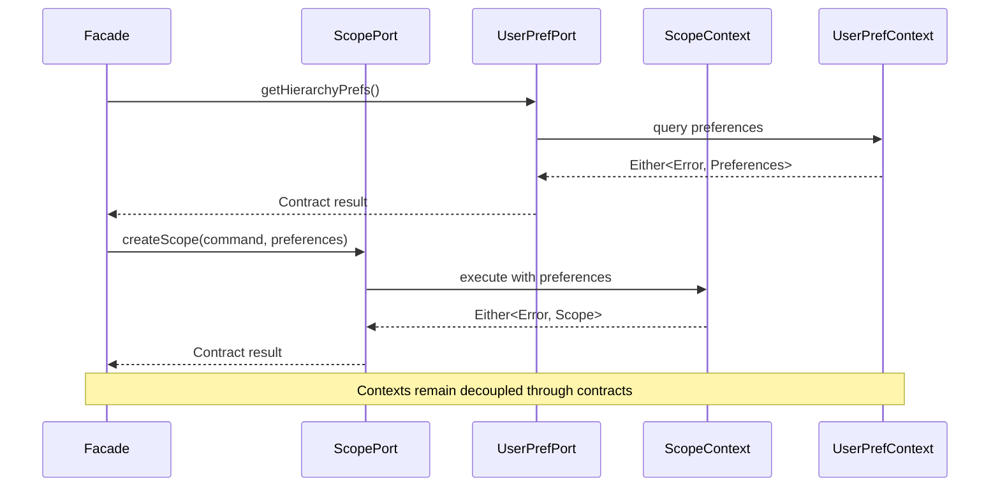
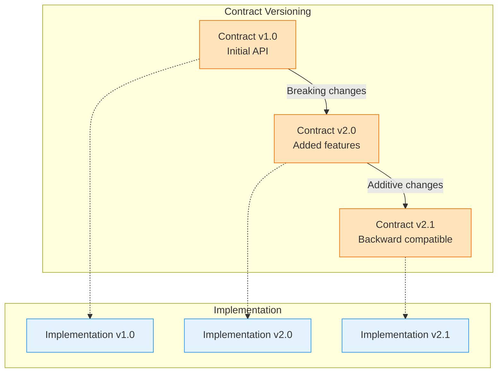

# Contracts Layer

## Overview

The Contracts layer provides stable, well-defined interfaces between bounded contexts in the Scopes system. It acts as an explicit boundary that enables contexts to evolve independently while maintaining clear integration points.

## Purpose and Role



The Contracts layer serves several critical purposes:

1. **Decoupling Bounded Contexts**: Provides explicit interfaces that prevent direct dependencies between contexts
2. **Stable API Contracts**: Defines stable interfaces that can be versioned independently
3. **Error Translation**: Maps domain-specific errors to contract-level errors that consumers can understand
4. **Type Safety**: Provides strongly-typed commands, queries, and results for inter-context communication
5. **Documentation**: Serves as living documentation of context capabilities and integration points

## Architecture Position



## Port Interface Pattern

All port interfaces follow a consistent pattern for reliability and type safety:



### Port Interface Template

```kotlin
interface SomeContextPort {
    // Commands return Either<Error, Result>
    suspend fun executeCommand(command: Command): Either<ContractError, CommandResult>

    // Queries return Either<Error, Result?>
    suspend fun executeQuery(query: Query): Either<ContractError, QueryResult?>
}
```

### Key Characteristics

1. **Suspend Functions**: All operations are suspending for async support
2. **Either Return Type**: Explicit error handling without exceptions
3. **Contract-Level Types**: No domain types exposed in interfaces
4. **Null Safety**: Queries return nullable results for "not found" cases

## Bounded Context Coordination Patterns

### Context Relationship Types



### Integration Adapter Pattern



**Adapter Responsibilities:**
- Translate between contract types and domain types
- Map contract errors to domain errors
- Handle null/missing data appropriately
- Provide fallback behavior when external context is unavailable

## Error Mapping Strategy

### Error Hierarchy Design



### Error Translation Flow



### Mapping Principles

1. **Preserve Context**: Include relevant information from domain errors
2. **Hide Implementation**: Don't expose internal types or structures
3. **Categorize Appropriately**: Map to the correct error category (Input/Business/System)
4. **Provide Clear Messages**: Ensure error messages are understandable to consumers

## Contract Definition Structure

### Commands and Queries



### Type Safety Requirements

| Component | Requirements | Examples |
|-----------|-------------|----------|
| **Commands** | Immutable data classes | `CreateScopeCommand(title, description)` |
| **Queries** | Parameter objects | `GetScopeQuery(scopeId)` |
| **Results** | Serializable DTOs | `ScopeResult(id, title, createdAt)` |
| **Errors** | Sealed hierarchies | `InputError`, `BusinessError`, `SystemError` |

## Integration Examples

### Port Implementation Pattern

```kotlin
// Contract interface
interface ScopeManagementPort {
    suspend fun createScope(command: CreateScopeCommand): Either<ScopeContractError, CreateScopeResult>
}

// Infrastructure adapter implementation
class ScopeManagementPortAdapter(
    private val createScopeHandler: CreateScopeHandler,
    private val errorMapper: ApplicationErrorMapper
) : ScopeManagementPort {

    override suspend fun createScope(command: CreateScopeCommand) =
        createScopeHandler(command.toDomainCommand())
            .mapLeft { error -> errorMapper.map(error) }
            .map { result -> result.toContractResult() }
}
```

### Cross-Context Communication



## Versioning Strategy

### Contract Evolution



### Compatibility Guidelines

1. **Additive Changes**: New optional fields, new methods with defaults
2. **Backward Compatible**: Maintain existing method signatures
3. **Breaking Changes**: Require major version increment
4. **Deprecation**: Mark old methods as deprecated before removal

## Testing Contracts

### Contract Compliance Testing

```kotlin
// Test that implementations fulfill contract requirements
class ScopeManagementPortComplianceTest {
    @Test
    fun `should handle all error cases defined in contract`() {
        // Test all contract error scenarios
    }

    @Test
    fun `should return proper types as defined in contract`() {
        // Verify return type compliance
    }
}
```

### Cross-Context Integration Testing

```kotlin
class CrossContextIntegrationTest {
    @Test
    fun `scope creation should integrate with user preferences`() {
        // Test actual cross-context communication
        // through contract interfaces
    }
}
```

## Benefits

### Development Benefits
- **Independent Evolution**: Contexts can evolve without breaking others
- **Clear Boundaries**: Explicit integration points reduce coupling
- **Type Safety**: Compile-time verification of inter-context communication
- **Testing**: Contract interfaces enable easy mocking and testing

### Operational Benefits
- **Monitoring**: Contract calls can be monitored and measured
- **Debugging**: Clear boundaries make issues easier to isolate
- **Versioning**: Independent deployment and versioning of contexts
- **Documentation**: Self-documenting integration points

## Related Documentation

- [Clean Architecture](./clean-architecture.md) - Overall architecture principles
- [Domain-Driven Design](./domain-driven-design.md) - Bounded context concepts
- [Error Handling Guidelines](../guides/development/error-handling.md) - Error handling patterns
