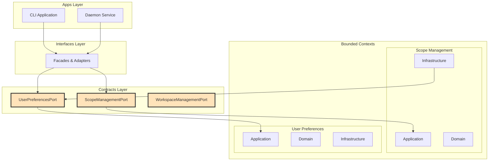

# Contracts Layer

## Overview

The Contracts layer provides stable, well-defined interfaces between bounded contexts in the Scopes system. It acts as an explicit boundary that enables contexts to evolve independently while maintaining clear integration points.

## Purpose and Role

The Contracts layer serves several critical purposes:

1. **Decoupling Bounded Contexts**: Provides explicit interfaces that prevent direct dependencies between contexts
2. **Stable API Contracts**: Defines stable interfaces that can be versioned independently
3. **Error Translation**: Maps domain-specific errors to contract-level errors that consumers can understand
4. **Type Safety**: Provides strongly-typed commands, queries, and results for inter-context communication
5. **Documentation**: Serves as living documentation of context capabilities and integration points

## Architecture Position



## Port Interface Pattern

All port interfaces follow a consistent pattern using Arrow's `Either` type for explicit error handling:

```kotlin
interface SomeContextPort {
    // Commands return Either<Error, Result>
    suspend fun executeCommand(command: Command): Either<ContractError, CommandResult>
    
    // Queries return Either<Error, Result?>
    suspend fun executeQuery(query: Query): Either<ContractError, QueryResult?>
}
```

### Key Characteristics

1. **Suspend Functions**: All operations are suspending for async support
2. **Either Return Type**: Explicit error handling without exceptions
3. **Contract-Level Types**: No domain types exposed in interfaces
4. **Null Safety**: Queries return nullable results for "not found" cases

## Bounded Context Coordination Patterns

### 1. Customer-Supplier Relationship

User Preferences acts as a supplier to other contexts:

```kotlin
// In Scope Management infrastructure layer
class UserPreferencesToHierarchyPolicyAdapter(
    private val userPreferencesPort: UserPreferencesPort
) : HierarchyPolicyProvider {
    
    override suspend fun getPolicy(): Either<ScopesError, HierarchyPolicy> = either {
        // Map contract error to domain error before binding
        val result = userPreferencesPort.getPreference(
            GetPreferenceQuery(PreferenceType.HIERARCHY)
        ).mapLeft { contractError ->
            // Map contract error to domain integration error
            ErrorMapper.mapUserPreferencesToDomainError(contractError)
        }.bind()
        
        when (result) {
            is PreferenceResult.HierarchyPreferences -> 
                HierarchyPolicy.create(
                    maxDepth = result.maxDepth,
                    maxChildrenPerScope = result.maxChildrenPerScope
                ).bind()
        }
    }
}

// Error mapping helper
object ErrorMapper {
    fun mapUserPreferencesToDomainError(
        contractError: UserPreferencesContractError
    ): UserPreferencesIntegrationError = when (contractError) {
        is UserPreferencesContractError.SystemError.ServiceUnavailable ->
            UserPreferencesIntegrationError.PreferencesServiceUnavailable(
                occurredAt = Clock.System.now()
            )
        is UserPreferencesContractError.DataError.PreferencesCorrupted ->
            UserPreferencesIntegrationError.MalformedPreferencesResponse(
                occurredAt = Clock.System.now(),
                expectedFormat = "Valid preferences",
                actualContent = contractError.details
            )
        else ->
            UserPreferencesIntegrationError.PreferencesServiceUnavailable(
                occurredAt = Clock.System.now()
            )
    }
}
```

Alternative implementation using fold:

```kotlin
override suspend fun getPolicy(): Either<ScopesError, HierarchyPolicy> = either {
    // Alternative: Use fold to handle error mapping
    val result = userPreferencesPort.getPreference(
        GetPreferenceQuery(PreferenceType.HIERARCHY)
    ).fold(
        { contractError ->
            // Map and raise domain error
            raise(ErrorMapper.mapUserPreferencesToDomainError(contractError))
        },
        { preferenceResult ->
            preferenceResult
        }
    )
    
    when (result) {
        is PreferenceResult.HierarchyPreferences -> 
            HierarchyPolicy.create(
                maxDepth = result.maxDepth,
                maxChildrenPerScope = result.maxChildrenPerScope
            ).bind()
    }
}
```

### 2. Anti-Corruption Layer

Each context maintains its own domain model and uses adapters for translation:

```kotlin
// Contract layer defines its own types
sealed interface CreateScopeCommand {
    val title: String
    val description: String?
    val parentId: String?

    data class WithAutoAlias(
        override val title: String,
        override val description: String? = null,
        override val parentId: String? = null,
    ) : CreateScopeCommand

    data class WithCustomAlias(
        override val title: String,
        override val description: String? = null,
        override val parentId: String? = null,
        val alias: String,
    ) : CreateScopeCommand
}

// Application layer mirrors the sealed structure
sealed interface CreateScope {
    val title: String
    val description: String?
    val parentId: String?

    data class WithAutoAlias(
        override val title: String,
        override val description: String? = null,
        override val parentId: String? = null,
    ) : CreateScope

    data class WithCustomAlias(
        override val title: String,
        override val description: String? = null,
        override val parentId: String? = null,
        val alias: String,
    ) : CreateScope
}

// Adapter translates between them
class ScopeManagementPortAdapter : ScopeManagementPort {
    override suspend fun createScope(
        command: CreateScopeCommand
    ): Either<ScopeContractError, CreateScopeResult> {
        val applicationCommand = when (command) {
            is CreateScopeCommand.WithAutoAlias -> CreateScope.WithAutoAlias(
                title = command.title,
                description = command.description,
                parentId = command.parentId
            )
            is CreateScopeCommand.WithCustomAlias -> CreateScope.WithCustomAlias(
                title = command.title,
                description = command.description,
                parentId = command.parentId,
                alias = command.alias
            )
        }
        
        return createScopeHandler(applicationCommand)
            .mapLeft { error ->
                ErrorMapper.mapToContractError(error)
            }
    }
}
```

## Error Mapping Strategy

### Error Hierarchy

Contract errors follow a hierarchical structure for better categorization:

```kotlin
sealed interface ScopeContractError {
    val message: String
    
    sealed interface InputError : ScopeContractError
    sealed interface BusinessError : ScopeContractError  
    sealed interface SystemError : ScopeContractError
}
```

### Mapping Principles

1. **Preserve Context**: Include relevant information from domain errors
2. **Hide Implementation**: Don't expose internal types or structures
3. **Categorize Appropriately**: Map to the correct error category
4. **Provide Clear Messages**: Ensure error messages are understandable

### Error Mapper Example

```kotlin
object ErrorMapper {
    fun mapToContractError(error: ScopesError): ScopeContractError = when (error) {
        // Input validation errors
        is ScopeInputError.TitleError.TooLong -> 
            ScopeContractError.InputError.InvalidTitle(
                title = error.attemptedValue,
                reason = "Title is too long (maximum ${error.maximumLength} characters)"
            )
            
        // Business rule violations
        is ScopeError.NotFound -> 
            ScopeContractError.BusinessError.NotFound(
                scopeId = error.scopeId.value
            )
            
        // System errors
        is PersistenceError.StorageUnavailable -> 
            ScopeContractError.SystemError.ServiceUnavailable(
                service = "storage",
                message = "Storage unavailable during ${error.operation}"
            )
            
        // Catch-all for unmapped errors
        else -> ScopeContractError.SystemError.ServiceUnavailable(
            service = "scope-management",
            message = "An internal error occurred"
        )
    }
}
```

## Implementation Examples

### ScopeManagementPort

The main interface for scope operations:

```kotlin
interface ScopeManagementPort {
    // Commands
    suspend fun createScope(command: CreateScopeCommand): Either<ScopeContractError, CreateScopeResult>
    suspend fun updateScope(command: UpdateScopeCommand): Either<ScopeContractError, UpdateScopeResult>
    suspend fun deleteScope(command: DeleteScopeCommand): Either<ScopeContractError, Unit>
    
    // Queries
    suspend fun getScope(query: GetScopeQuery): Either<ScopeContractError, ScopeResult?>
    suspend fun getChildren(query: GetChildrenQuery): Either<ScopeContractError, List<ScopeResult>>
    suspend fun getRootScopes(): Either<ScopeContractError, List<ScopeResult>>
}
```

### UserPreferencesPort

Interface for user preferences with fail-safe defaults:

```kotlin
interface UserPreferencesPort {
    /**
     * Retrieves user preferences with fail-safe defaults.
     * 
     * Returns Either<UserPreferencesContractError, PreferenceResult> where:
     * - Left(UserPreferencesContractError) only for unrecoverable errors:
     *   - Invalid query parameters (e.g., unknown preference key)
     *   - Data corruption that prevents reading preferences
     * - Right(PreferenceResult) is returned in all other cases:
     *   - When preferences exist: returns actual preference values
     *   - When preferences don't exist: returns sensible defaults
     *   - When system is temporarily unavailable: returns fail-safe defaults
     * 
     * This fail-safe approach ensures other contexts can always proceed with
     * sensible defaults, maintaining system stability even when the preferences
     * service is unavailable or preferences haven't been configured yet.
     */
    suspend fun getPreference(query: GetPreferenceQuery): Either<UserPreferencesContractError, PreferenceResult>
}
```

## Architecture Benefits

### 1. Independent Evolution
- Bounded contexts can change internal implementations without affecting consumers
- Contract interfaces provide version boundaries for API evolution

### 2. Clear Integration Points
- Explicit contracts make integration requirements obvious
- Self-documenting interfaces reduce integration errors

### 3. Error Resilience
- Explicit error handling prevents unexpected failures
- Fail-safe patterns (like UserPreferencesPort) ensure system stability

### 4. Testing Support
- Contract interfaces are easy to mock for testing
- Integration tests can verify contract compliance

### 5. Documentation
- Contracts serve as living documentation of context capabilities
- Error types document all possible failure modes

## Best Practices

### 1. Keep Contracts Minimal
```kotlin
// ❌ Bad: Exposing too much detail
data class CreateScopeCommand(
    val title: String,
    val description: String?,
    val parentId: String?,
    val aspects: Map<String, List<String>>,
    val metadata: Map<String, Any>,
    val tags: List<String>,
    // ... many more fields
)

// ✅ Good: Only essential fields
data class CreateScopeCommand(
    val title: String,
    val description: String? = null,
    val parentId: String? = null
)
```

### 2. Use Contract-Specific Types
```kotlin
// ❌ Bad: Exposing domain types
interface ScopeManagementPort {
    suspend fun createScope(scope: Scope): Either<ScopesError, Scope>
}

// ✅ Good: Contract-specific types
interface ScopeManagementPort {
    suspend fun createScope(command: CreateScopeCommand): Either<ScopeContractError, CreateScopeResult>
}
```

### 3. Implement Fail-Safe Patterns
```kotlin
// For non-critical dependencies, provide defaults for system failures only
class UserPreferencesPortAdapter : UserPreferencesPort {
    override suspend fun getPreference(query: GetPreferenceQuery): Either<UserPreferencesContractError, PreferenceResult> {
        return try {
            // Attempt to get preferences
            handler.getPreference(query)
        } catch (e: Exception) {
            when (e) {
                // Map domain/input validation errors to Left
                is InvalidPreferenceKeyError -> 
                    Either.Left(UserPreferencesContractError.InputError.InvalidPreferenceKey(e.key))
                is PreferencesCorruptedError ->
                    Either.Left(UserPreferencesContractError.DataError.PreferencesCorrupted(
                        details = e.message,
                        configPath = e.path
                    ))
                // For system-level failures, return defaults
                is IOException, is TimeoutException, is DatabaseException ->
                    Either.Right(PreferenceResult.HierarchyPreferences())
                // Propagate unexpected errors
                else -> throw e
            }
        }
    }
}
```

### 4. Version Your Contracts
```kotlin
// Future: Support multiple contract versions
interface ScopeManagementPortV2 : ScopeManagementPort {
    suspend fun archiveScope(command: ArchiveScopeCommand): Either<ScopeContractError, ArchiveScopeResult>
}
```

## Integration with Other Layers

### Apps Layer
- Apps depend on contract interfaces, not implementations
- Dependency injection wires implementations at runtime

### Interfaces Layer
- Facades coordinate multiple port calls
- Adapters implement cross-cutting concerns

### Bounded Contexts
- Each context provides port implementations
- Infrastructure layer contains adapter implementations

## Future Considerations

### 1. Contract Versioning
- Support multiple contract versions simultaneously
- Deprecation strategies for old contracts

### 2. Contract Testing
- Contract test suites that implementations must pass
- Consumer-driven contract testing

### 3. Event Contracts
- Define event contracts for asynchronous integration
- Event sourcing integration patterns

### 4. External Integration
- REST API contracts based on port interfaces
- GraphQL schema generation from contracts
- MCP protocol mapping

## Summary

The Contracts layer is a crucial architectural component that enables:
- Clean separation between bounded contexts
- Stable integration points
- Explicit error handling
- Independent context evolution
- Clear documentation of capabilities

By maintaining clear contracts, the system remains maintainable and evolvable while ensuring reliable integration between its various parts.
