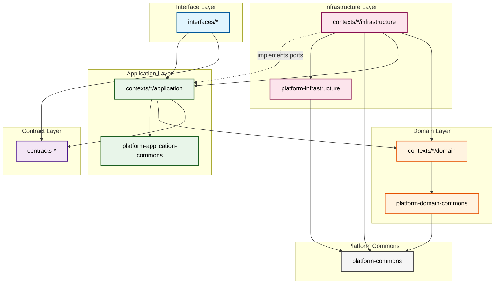

# Dependency Rules

This document defines the architectural dependency rules for the Scopes project to ensure clean architecture and maintainability.

## Module Dependency Hierarchy

The following diagram illustrates the expected dependency flow:



## Core Rules

### 1. Layer Dependencies
- **Interfaces Layer** → Can depend on: Contracts, Application layer
- **Application Layer** → Can depend on: Domain layer, Platform Application Commons
  - Application boundary components MAY depend on Contracts (ports, DTOs, errors). See “Allowed Application → Contracts imports”.
- **Domain Layer** → Can depend on: Platform Domain Commons
- **Infrastructure Layer** → Can depend on: Domain layer, Application ports/DTOs (DIP), Platform Infrastructure, Platform Commons
- **Platform Modules** → Self-contained, minimal cross-dependencies

### 2. Bounded Context Rules
- **Inter-context communication**: Only through `contracts-*` modules
- **Direct dependencies between contexts**: Forbidden (Exception: event-store value objects for event sourcing)
- **Infrastructure isolation**: `contexts/*/infrastructure` cannot depend on other contexts
- **Event Sourcing Exception**: Contexts using event sourcing may import `eventstore.domain.valueobject` types

### 3. Platform Module Rules
- **commons**: Pure abstractions and primitive types
- **domain-commons**: Domain-specific helpers and value objects
- **application-commons**: Application layer utilities
- **infrastructure**: System resource implementations (DB, Time, ID generation)

### 4. Forbidden Dependencies
- ❌ `infrastructure` → other context's `application` layer (can only import from own context)
- ❌ `application-commons` → `platform-infrastructure`
- ❌ `domain-commons` → `platform-infrastructure`
- ❌ Direct context-to-context dependencies (must use contracts, except event-store value objects)
- ❌ `interfaces` → `domain` or `infrastructure` layers

#### Allowed Application → Contracts imports
- ✅ Within `contexts/*/application/` only the following directories may import `io.github.kamiazya.scopes.contracts.*`:
  - `application/command/handler/`
  - `application/query/handler/`
  - `application/mapper/`
  - `application/error/`
  - `application/adapter/` (for context-local adapters that bridge to contracts)
  - `application/query/response/` (for query response DTOs)
- ❌ Do NOT import contracts from core coordination areas: `application/service/`, `application/services/`, `application/factory/`, `application/port/`, `application/util/`
  - **Exception**: `application/services/ResponseFormatterService.kt` is allowed to import contract types for response formatting

These rules are automatically verified by Konsist tests in `quality/konsist`.

### 5. Architectural Patterns Exceptions

#### CQRS Pattern
In this CQRS implementation, infrastructure adapters inject and wrap application components:
- ✅ Infrastructure can import Application **handlers** (for CQRS adapter pattern)
- ✅ Infrastructure can import Application **use cases** (for shared business logic)
- ✅ Infrastructure can import Application **command/query DTOs**
- The adapters act as thin wrappers implementing the contract interfaces
- Infrastructure must only import from its own context's application layer

#### Rationale
- To avoid duplicated error and result types at the boundary, Application handlers and mappers may directly use contract types, while core application services stay contract-agnostic. This retains a clean domain core and pragmatic integration surface.

#### Dependency Inversion Principle (DIP)
Infrastructure implements ports defined in the Application layer:
- ✅ Infrastructure can import Application **ports** (interfaces)
- ✅ Infrastructure can import Application **DTOs**

#### Event Sourcing Pattern
Contexts using event sourcing can share fundamental event types:
- ✅ Contexts can import `eventstore.domain.valueobject` types (e.g., EventTypeId)
- This is a shared kernel pattern for event sourcing infrastructure

## Verification

These rules are enforced through:
1. **Konsist Tests**: Automated architecture tests in `quality/konsist`
2. **Gradle Configuration**: Module dependencies in `build.gradle.kts`
3. **Code Reviews**: Manual verification during PR reviews

## Examples

### Valid Dependencies
```kotlin
// contexts/scope-management/application depends on domain
implementation(project(":scope-management-domain"))

// contexts use contracts for inter-context communication
implementation(project(":contracts-scope-management"))

// infrastructure depends on platform-infrastructure
implementation(project(":platform-infrastructure"))

// ✅ Infrastructure implementing CQRS adapters
import io.github.kamiazya.scopes.scopemanagement.application.handler.command.CreateScopeHandler
import io.github.kamiazya.scopes.scopemanagement.application.command.dto.CreateScopeCommand

// ✅ Infrastructure implementing application ports (DIP)
import io.github.kamiazya.scopes.scopemanagement.application.port.ScopeRepository
import io.github.kamiazya.scopes.scopemanagement.application.dto.ScopeDTO

// ✅ Event sourcing contexts importing event-store value objects
import io.github.kamiazya.scopes.eventstore.domain.valueobject.EventTypeId
```

### Invalid Dependencies
```kotlin
// ❌ Infrastructure importing application use cases (if they exist)
import io.github.kamiazya.scopes.scopemanagement.application.usecase.CreateScopeUseCase

// ❌ Direct context dependency (non-event-store, non-contracts)
import io.github.kamiazya.scopes.userpreferences.domain.entity.UserPreference

// ❌ Domain depending on infrastructure
import io.github.kamiazya.scopes.platform.infrastructure.database.DatabaseConfig
```
