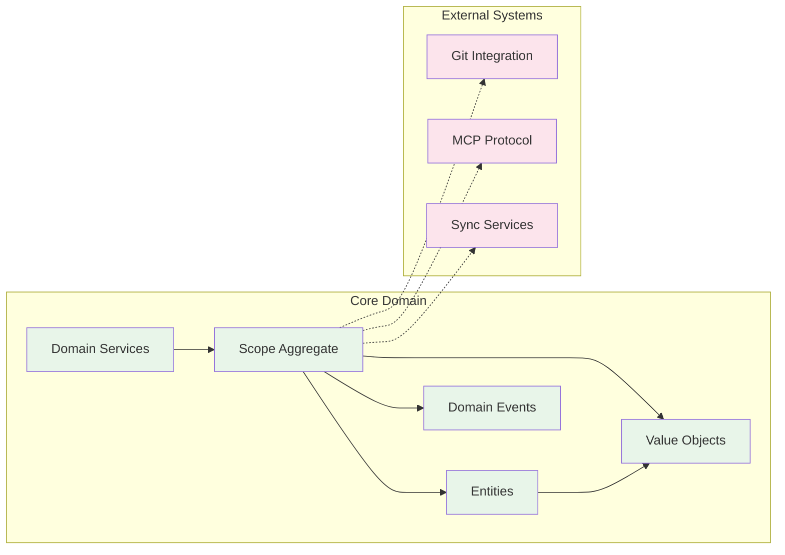

# Domain-Driven Design Implementation

## Overview

Scopes implements **Domain-Driven Design (DDD)** with a functional programming approach using Kotlin and Arrow.

## Domain Model

The domain model encapsulates all scope-related business logic.



### Domain Boundaries

- **Core Domain**: All scope management, hierarchy, aspects, and metadata
- **External Systems**: Git, MCP, synchronization, and third-party integrations
- **Anti-Corruption Layer**: DTOs and adapters protect domain from external changes

## Strategic Design

### Ubiquitous Language

Key terms used consistently throughout the codebase:

- **Scope**: Unified entity representing any work unit (project, task, etc.)
- **Aspect**: Key-value metadata for classification and querying
- **Hierarchy**: Parent-child relationships between scopes
- **Focus**: Currently selected scope for context
- **Workspace**: Directory-based project context

### Core Domain

The core domain is **recursive scope management** - the innovative concept that all work units are unified scopes with consistent operations.

### Supporting Domains

- **Aspect Management**: Flexible metadata system (currently embedded)
- **Comment System**: AI and human collaboration
- **Attachment Management**: File and resource linking

### Generic Domains

- **Authentication**: User identity (future)
- **Synchronization**: External tool integration
- **Notification**: Event broadcasting

## Tactical Design

### Aggregates

#### ScopeAggregate

The main aggregate root that ensures consistency:

```kotlin
data class ScopeAggregate(
    val id: AggregateId,
    val scope: Scope,
    val version: AggregateVersion,
    val events: List<DomainEvent> = emptyList()
) : AggregateRoot {
    
    // Command handlers ensure invariants
    fun execute(command: Command): Either<ScopesError, ScopeAggregate> = 
        when (command) {
            is CreateScope -> handleCreate(command)
            is UpdateScope -> handleUpdate(command)
            is DeleteScope -> handleDelete(command)
        }
    
    // Business rules enforced here
    private fun handleUpdate(cmd: UpdateScope): Either<ScopesError, ScopeAggregate> = 
        either {
            // Validate business rules
            ensureNotDeleted().bind()
            ensureVersionMatch(cmd.expectedVersion).bind()
            
            // Apply changes
            val updated = scope.update(cmd.updates).bind()
            
            // Record event
            val event = ScopeUpdated(scope.id, updated, Clock.System.now())
            
            copy(
                scope = updated,
                version = version.increment(),
                events = events + event
            )
        }
}
```

### Entities

#### Scope Entity

The core entity with identity and lifecycle:

```kotlin
data class Scope(
    val id: ScopeId,                    // Identity
    val title: ScopeTitle,               // Required
    val description: ScopeDescription?,  // Optional
    val parentId: ScopeId?,              // Hierarchy
    val createdAt: Instant,
    val updatedAt: Instant,
    val aspects: Map<AspectKey, NonEmptyList<AspectValue>>
) {
    // Business logic methods
    fun addChild(child: Scope): Either<ScopesError, Scope>
    fun updateAspect(key: AspectKey, value: AspectValue): Either<ScopesError, Scope>
    fun canBeDeleted(): Boolean
}
```

### Value Objects

Immutable objects without identity:

```kotlin
// Strong typing with validation
@JvmInline
value class ScopeTitle private constructor(val value: String) {
    companion object {
        fun create(value: String?): Either<ScopesError, ScopeTitle?> = either {
            when {
                value.isNullOrBlank() -> null
                value.length > 200 -> raise(TitleTooLongError(value.length))
                else -> ScopeTitle(value.trim())
            }
        }
    }
}

// Unique identifier
@JvmInline
value class ScopeId private constructor(val value: String) {
    companion object {
        fun generate(): ScopeId = ScopeId(ULID.randomULID())
        fun parse(value: String): Either<ScopesError, ScopeId> = 
            Either.catch { ScopeId(ULID.parseULID(value)) }
                .mapLeft { InvalidScopeIdError(value) }
    }
}
```

### Domain Events

Events capture important state changes:

```kotlin
sealed interface DomainEvent {
    val aggregateId: AggregateId
    val occurredAt: Instant
}

data class ScopeCreated(
    override val aggregateId: AggregateId,
    val scope: Scope,
    override val occurredAt: Instant
) : DomainEvent

data class ScopeUpdated(
    override val aggregateId: AggregateId,
    val scope: Scope,
    val changes: Set<String>,  // What changed
    override val occurredAt: Instant
) : DomainEvent

data class ScopeDeleted(
    override val aggregateId: AggregateId,
    val scopeId: ScopeId,
    override val occurredAt: Instant
) : DomainEvent
```

### Domain Services

For operations that don't belong to a single entity:

```kotlin
class HierarchyValidationService {
    fun validateHierarchy(
        scope: Scope,
        allScopes: List<Scope>
    ): Either<ScopesError, Unit> = either {
        ensureNoCircularReference(scope, allScopes).bind()
        ensureDepthLimit(scope, allScopes).bind()
        ensureParentExists(scope, allScopes).bind()
    }
}
```

### Repository Interfaces

Abstract persistence in domain layer:

```kotlin
interface ScopeRepository {
    fun save(aggregate: ScopeAggregate): Either<ScopesError, Unit>
    fun findById(id: ScopeId): Either<ScopesError, ScopeAggregate?>
    fun findByWorkspace(workspaceId: WorkspaceId): Either<ScopesError, List<ScopeAggregate>>
    fun delete(id: ScopeId): Either<ScopesError, Unit>
}
```

## Functional DDD with Arrow

### Immutability
All domain objects are immutable data classes:

```kotlin
// ❌ Wrong: Mutable state
class Scope {
    var title: String = ""
    fun setTitle(value: String) { title = value }
}

// ✅ Correct: Immutable with copy
data class Scope(val title: ScopeTitle) {
    fun updateTitle(newTitle: ScopeTitle): Scope = copy(title = newTitle)
}
```

### Pure Functions
Business logic as pure functions without side effects:

```kotlin
// Pure function - deterministic and no side effects
fun calculateCompletionPercentage(
    scope: Scope,
    children: List<Scope>
): Int {
    val completed = children.count { it.isCompleted() }
    return if (children.isEmpty()) 0 
           else (completed * 100) / children.size
}
```

### Error Handling with Either
Explicit error handling without exceptions:

```kotlin
fun createScope(
    title: String,
    parentId: String?
): Either<ScopesError, Scope> = either {
    val validTitle = ScopeTitle.create(title).bind()
    val validParentId = parentId?.let { ScopeId.parse(it).bind() }
    
    Scope.create(
        title = validTitle,
        parentId = validParentId
    ).bind()
}
```

## Testing Strategy

### Property-Based Testing
Test invariants with random data:

```kotlin
class ScopeTitleTest : FunSpec({
    test("title should be trimmed") {
        checkAll(Arb.string()) { input ->
            ScopeTitle.create(input).fold(
                { true }, // Error case is valid
                { it?.value == input.trim() }
            )
        }
    }
    
    test("title length should not exceed 200") {
        checkAll(Arb.string(201..500)) { input ->
            ScopeTitle.create(input).isLeft()
        }
    }
})
```

### Domain Event Testing
Verify correct events are produced:

```kotlin
test("updating scope should produce ScopeUpdated event") {
    val aggregate = createTestAggregate()
    val command = UpdateScope(aggregate.id, newTitle = "Updated")
    
    val result = aggregate.execute(command)
    
    result.shouldBeRight()
    result.value.events.last().shouldBeInstanceOf<ScopeUpdated>()
}
```

## Benefits of DDD in Scopes

1. **Business Alignment**: Code reflects business concepts directly
2. **Maintainability**: Clear boundaries and responsibilities
3. **Flexibility**: Easy to evolve with changing requirements
4. **Testability**: Business logic isolated from infrastructure
5. **Team Communication**: Ubiquitous language reduces misunderstandings

## Implementation Guidelines

1. Start with Event Storming to discover domain events
2. Model aggregates around consistency boundaries
3. Use value objects for type safety and validation
4. Keep aggregates small and focused
5. Use domain events for decoupling
6. Implement repositories as interfaces in domain
7. Test business invariants with property-based tests
