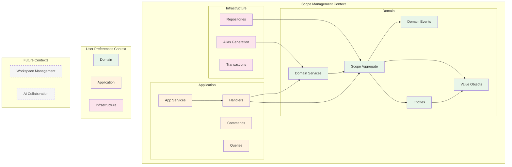

# Domain-Driven Design Implementation

## Overview

Scopes implements **Domain-Driven Design (DDD)** with a functional programming approach using Kotlin and Arrow.

## Bounded Contexts

The system is organized into bounded contexts, each representing a distinct business capability:



### Current Bounded Contexts

#### Scope Management Context
- **Responsibility**: Core scope operations, hierarchy, aspects, aliases
- **Location**: `contexts/scope-management/`
- **Status**: Implemented
- **Key Aggregates**: ScopeAggregate
- **Key Services**: ScopeHierarchyService, AliasGenerationService
- **Key Concepts**:
  - **HierarchyPolicy**: Business rules for scope hierarchy (maxDepth, maxChildrenPerScope)
  - **Policy Enforcement**: All hierarchy constraints are validated here
  - **Default Policy**: System defaults when no preferences are set
- **Ubiquitous Language**:
  - Scope: Unified recursive work unit
  - Scope ID: Unique identifier (ULID)
  - Scope Title: Identifying name
  - Parent ID: Hierarchical relationship
  - Aspects: Key-value metadata
  - Context View: Filtered view of scopes
  - Hierarchy Policy: Rules governing scope hierarchies

#### User Preferences Context
- **Responsibility**: User-specific settings and preferences management
- **Location**: `contexts/user-preferences/`
- **Status**: Implemented
- **Relationship**: Customer-Supplier to other contexts
- **Key Concepts**:
  - **HierarchyPreferences**: User's preferred hierarchy settings (optional)
  - **Preference Storage**: Persists user choices without enforcing business rules
  - **Null Semantics**: null = no preference set (use system defaults)
- **Ubiquitous Language**:
  - Preferences: User settings
  - Hierarchy Preferences: User's desired hierarchy limits
  - Theme: UI color scheme (future)
  - Editor Config: Editor settings (future)
  - Default Values: Initial values for new items (future)

### Future Bounded Contexts (Planned)

#### Workspace Management Context
- **Responsibility**: File system integration and focus management
- **Status**: Not yet implemented
- **Relationship**: Partnership with Scope Management
- **Ubiquitous Language**:
  - Workspace: Work directory associated with scope
  - Focus: Current working scope attention
  - Context Switch: Moving between workspaces

#### AI Collaboration Context
- **Responsibility**: AI assistant integration and asynchronous collaboration
- **Status**: Not yet implemented
- **Integration**: MCP protocol, comment-based interaction
- **Ubiquitous Language**:
  - AI Comment: Request to AI
  - Conversation Thread: Series of AI interactions
  - Handoff: Work transfer between AI assistants
  - Co-authorship: AI collaboration records

### Context Mapping


### Domain Boundaries

- **Core Domain**: Scope management with recursive hierarchy
- **Supporting Domains**: User preferences, aspect system, alias management
- **Generic Domains**: Workspace management, AI collaboration
- **Anti-Corruption Layer**: DTOs and facades protect domain from external changes

### Context Integration Patterns

#### Contracts Layer
The system uses a dedicated Contracts layer to define stable interfaces between bounded contexts:

```kotlin
// Contract Port Interface
interface UserPreferencesPort {
    suspend fun getPreference(query: GetPreferenceQuery): Either<UserPreferencesContractError, PreferenceResult>
}

// Port Implementation in User Preferences Context
class UserPreferencesPortAdapter(
    private val handler: GetCurrentUserPreferencesHandler
) : UserPreferencesPort {
    override suspend fun getPreference(query: GetPreferenceQuery): Either<UserPreferencesContractError, PreferenceResult> {
        // Implementation delegates to application handler
    }
}
```

#### Anti-Corruption Layer (ACL)
The system uses ACLs to translate between bounded contexts while maintaining their independence:

```kotlin
// Example: UserPreferencesToHierarchyPolicyAdapter
class UserPreferencesToHierarchyPolicyAdapter(
    private val userPreferencesPort: UserPreferencesPort  // Uses contract port
) : HierarchyPolicyProvider {
    override suspend fun getPolicy(): Either<ScopesError, HierarchyPolicy> {
        // Translate from User Preferences context to Scope Management context
        // - User Preferences: null = no preference (use defaults)
        // - Scope Management: null = unlimited (policy decision)
        val result = userPreferencesPort.getPreference(
            GetPreferenceQuery(PreferenceType.HIERARCHY)
        ).bind()
        
        // Map contract types to domain types
        when (result) {
            is PreferenceResult.HierarchyPreferences -> 
                HierarchyPolicy(
                    maxDepth = result.maxDepth,
                    maxChildrenPerScope = result.maxChildrenPerScope
                )
        }
    }
}
```

**Key Principles**:
- Contracts layer defines stable interfaces between contexts
- Each context maintains its own domain model
- Adapters handle translation between contexts
- Contexts remain loosely coupled through contract ports
- Business rules stay within their respective contexts
- Error mapping ensures proper error handling across boundaries


## Strategic Design

### Ubiquitous Language

Key terms used consistently throughout the codebase:

- **Scope**: Unified entity representing any work unit (project, task, etc.)
- **Aspect**: Key-value metadata for classification and querying
- **Hierarchy**: Parent-child relationships between scopes
- **Focus**: Currently selected scope for context
- **Workspace**: Directory-based project context

### Core Domain

The core domain is **recursive scope management** - the innovative concept that all work units are unified scopes with consistent operations.

### Supporting Domains

- **Aspect Management**: Flexible metadata system (currently embedded)
- **Comment System**: AI and human collaboration
- **Attachment Management**: File and resource linking

### Generic Domains

- **Authentication**: User identity (future)
- **Synchronization**: External tool integration
- **Notification**: Event broadcasting

## Tactical Design

### Aggregates

#### ScopeAggregate

The main aggregate root implementing event sourcing pattern:

```kotlin
data class ScopeAggregate(
    override val id: AggregateId,
    override val version: AggregateVersion,
    val createdAt: Instant,
    val updatedAt: Instant,
    val scope: Scope?,
    val isDeleted: Boolean = false,
    val isArchived: Boolean = false,
) : AggregateRoot<ScopeAggregate>() {
    
    companion object {
        // Factory method for creating new aggregates
        fun create(
            title: ScopeTitle,
            description: ScopeDescription? = null,
            parentId: ScopeId? = null,
            aspects: Aspects = Aspects.empty(),
            clock: Clock = Clock.System
        ): Either<ScopesError, Pair<ScopeAggregate, DomainEvent>>
    }
    
    // Command methods that produce events
    fun updateTitle(
        newTitle: ScopeTitle,
        clock: Clock = Clock.System
    ): Either<ScopesError, Pair<ScopeAggregate, DomainEvent>> = either {
        ensureNotDeleted().bind()
        ensureNotArchived().bind()
        val currentScope = ensureScopeExists().bind()
        
        val event = ScopeTitleUpdated(
            eventId = EventId.generate(),
            aggregateId = id,
            scopeId = currentScope.id,
            oldTitle = currentScope.title,
            newTitle = newTitle,
            occurredAt = clock.now()
        )
        
        val updated = copy(
            scope = currentScope.copy(title = newTitle),
            version = version.increment(),
            updatedAt = clock.now()
        )
        
        updated to event
    }
    
    // Apply events to reconstruct state (Event Sourcing)
    fun applyEvent(event: DomainEvent): ScopeAggregate = when (event) {
        is ScopeCreated -> copy(
            scope = event.scope,
            version = version.increment(),
            createdAt = event.occurredAt,
            updatedAt = event.occurredAt
        )
        is ScopeTitleUpdated -> copy(
            scope = scope?.copy(title = event.newTitle),
            version = version.increment(),
            updatedAt = event.occurredAt
        )
        is ScopeDeleted -> copy(
            isDeleted = true,
            version = version.increment(),
            updatedAt = event.occurredAt
        )
        // ... other events
    }
}

### Entities

#### Scope Entity

The core entity with identity and lifecycle:

```kotlin
data class Scope(
    val id: ScopeId,                    // Identity
    val title: ScopeTitle,               // Required
    val description: ScopeDescription?,  // Optional
    val parentId: ScopeId?,              // Hierarchy
    val createdAt: Instant,
    val updatedAt: Instant,
    val aspects: Map<AspectKey, NonEmptyList<AspectValue>>
) {
    // Business logic methods
    fun addChild(child: Scope): Either<ScopesError, Scope>
    fun updateAspect(key: AspectKey, value: AspectValue): Either<ScopesError, Scope>
    fun canBeDeleted(): Boolean
}
```

### Value Objects

Immutable objects without identity:

```kotlin
// Strong typing with validation
@JvmInline
value class ScopeTitle private constructor(val value: String) {
    companion object {
        fun create(value: String?): Either<ScopesError, ScopeTitle?> = either {
            when {
                value.isNullOrBlank() -> null
                value.length > 200 -> raise(TitleTooLongError(value.length))
                else -> ScopeTitle(value.trim())
            }
        }
    }
}

// Unique identifier
@JvmInline
value class ScopeId private constructor(val value: String) {
    companion object {
        fun generate(): ScopeId = ScopeId(ULID.randomULID())
        fun parse(value: String): Either<ScopesError, ScopeId> = 
            Either.catch { ScopeId(ULID.parseULID(value)) }
                .mapLeft { InvalidScopeIdError(value) }
    }
}
```

### Domain Events

Events capture important state changes:

```kotlin
sealed interface DomainEvent {
    val aggregateId: AggregateId
    val occurredAt: Instant
}

data class ScopeCreated(
    override val aggregateId: AggregateId,
    val scope: Scope,
    override val occurredAt: Instant
) : DomainEvent

data class ScopeUpdated(
    override val aggregateId: AggregateId,
    val scope: Scope,
    val changes: Set<String>,  // What changed
    override val occurredAt: Instant
) : DomainEvent

data class ScopeDeleted(
    override val aggregateId: AggregateId,
    val scopeId: ScopeId,
    override val occurredAt: Instant
) : DomainEvent
```

### Domain Services

For operations that don't belong to a single entity:

```kotlin
class HierarchyValidationService {
    fun validateHierarchy(
        scope: Scope,
        allScopes: List<Scope>
    ): Either<ScopesError, Unit> = either {
        ensureNoCircularReference(scope, allScopes).bind()
        ensureDepthLimit(scope, allScopes).bind()
        ensureParentExists(scope, allScopes).bind()
    }
}
```

### Repository Interfaces

Abstract persistence in domain layer:

```kotlin
interface ScopeRepository {
    fun save(aggregate: ScopeAggregate): Either<ScopesError, Unit>
    fun findById(id: ScopeId): Either<ScopesError, ScopeAggregate?>
    fun findByWorkspace(workspaceId: WorkspaceId): Either<ScopesError, List<ScopeAggregate>>
    fun delete(id: ScopeId): Either<ScopesError, Unit>
}
```

## Functional DDD with Arrow

### Immutability
All domain objects are immutable data classes:

```kotlin
// ❌ Wrong: Mutable state
class Scope {
    var title: String = ""
    fun setTitle(value: String) { title = value }
}

// ✅ Correct: Immutable with copy
data class Scope(val title: ScopeTitle) {
    fun updateTitle(newTitle: ScopeTitle): Scope = copy(title = newTitle)
}
```

### Pure Functions
Business logic as pure functions without side effects:

```kotlin
// Pure function - deterministic and no side effects
fun calculateCompletionPercentage(
    scope: Scope,
    children: List<Scope>
): Int {
    val completed = children.count { it.isCompleted() }
    return if (children.isEmpty()) 0 
           else (completed * 100) / children.size
}
```

### Error Handling with Either
Explicit error handling without exceptions:

```kotlin
fun createScope(
    title: String,
    parentId: String?
): Either<ScopesError, Scope> = either {
    val validTitle = ScopeTitle.create(title).bind()
    val validParentId = parentId?.let { ScopeId.parse(it).bind() }
    
    Scope.create(
        title = validTitle,
        parentId = validParentId
    ).bind()
}
```

## Testing Strategy

### Property-Based Testing
Test invariants with random data:

```kotlin
class ScopeTitleTest : FunSpec({
    test("title should be trimmed") {
        checkAll(Arb.string()) { input ->
            ScopeTitle.create(input).fold(
                { true }, // Error case is valid
                { it?.value == input.trim() }
            )
        }
    }
    
    test("title length should not exceed 200") {
        checkAll(Arb.string(201..500)) { input ->
            ScopeTitle.create(input).isLeft()
        }
    }
})
```

### Domain Event Testing
Verify correct events are produced:

```kotlin
test("updating scope should produce ScopeUpdated event") {
    val aggregate = createTestAggregate()
    val command = UpdateScope(aggregate.id, newTitle = "Updated")
    
    val result = aggregate.execute(command)
    
    result.shouldBeRight()
    result.value.events.last().shouldBeInstanceOf<ScopeUpdated>()
}
```

## Benefits of DDD in Scopes

1. **Business Alignment**: Code reflects business concepts directly
2. **Maintainability**: Clear boundaries and responsibilities
3. **Flexibility**: Easy to evolve with changing requirements
4. **Testability**: Business logic isolated from infrastructure
5. **Team Communication**: Ubiquitous language reduces misunderstandings

## Layer Responsibilities

### Application Layer (within Bounded Context)
Handles business logic within a single bounded context:

```kotlin
// contexts/scope-management/application/usecase/CreateScopeUseCase.kt
class CreateScopeUseCase(
    private val scopeRepository: ScopeRepository,
    private val eventPublisher: DomainEventPublisher
) {
    fun execute(command: CreateScopeCommand): Either<ScopesError, Scope> = either {
        // Single context business logic
        val scope = Scope.create(command.title, command.parentId).bind()
        scopeRepository.save(scope)
        eventPublisher.publish(ScopeCreatedEvent(scope))
        scope
    }
}
```

**Responsibilities**:
- Single context business logic
- Domain service coordination within context
- Transaction management
- Domain event publishing

### Infrastructure Layer (within Bounded Context)
Implements technical concerns and contract ports:

```kotlin
// contexts/scope-management/infrastructure/adapters/ScopeManagementPortAdapter.kt
class ScopeManagementPortAdapter(
    private val createScopeHandler: CreateScopeHandler,
    private val transactionManager: TransactionManager
) : ScopeManagementPort {
    override suspend fun createScope(
        command: CreateScopeCommand
    ): Either<ScopeContractError, CreateScopeResult> = 
        transactionManager.inTransaction {
            createScopeHandler(
                CreateScope(
                    title = command.title,
                    description = command.description,
                    parentId = command.parentId
                )
            ).mapLeft { error ->
                ErrorMapper.mapToContractError(error)
            }.map { result ->
                CreateScopeResult(
                    id = result.id,
                    title = result.title,
                    // ... map to contract result
                )
            }
        }
}
```

**Responsibilities**:
- Implement contract port interfaces
- Map between domain and contract types
- Handle error translation
- Manage technical concerns (persistence, messaging)

### Interface Layer (Cross-Context Integration)
Coordinates multiple bounded contexts through contract ports:

```kotlin
// interfaces/cli/adapters/ScopeCommandAdapter.kt
class ScopeCommandAdapter(
    private val scopeManagementPort: ScopeManagementPort,
    private val userPreferencesPort: UserPreferencesPort?,
    private val workspaceManagementPort: WorkspaceManagementPort?
) {
    suspend fun createScope(title: String, parentId: String?): Either<ScopeContractError, CreateScopeResult> = either {
        // Coordinate multiple contexts through contract ports
        val scope = scopeManagementPort.createScope(
            CreateScopeCommand(
                title = title,
                description = null,
                parentId = parentId
            )
        ).bind()
        
        // Optional coordination with other contexts
        workspaceManagementPort?.initializeWorkspace(
            InitializeWorkspaceCommand(scopeId = scope.id)
        )
        
        scope
    }
}
```

**Responsibilities**:
- Cross-context coordination through contract ports
- Protocol adaptation (CLI/API/MCP/SDK)
- Cross-cutting concerns (auth, logging)
- Error handling and user presentation

## Implementation Guidelines

1. Start with Event Storming to discover domain events
2. Model aggregates around consistency boundaries
3. Use value objects for type safety and validation
4. Keep aggregates small and focused
5. Use domain events for decoupling
6. Implement repositories as interfaces in domain
7. Define contract ports for cross-context integration
8. Implement port adapters in infrastructure layer
9. Test business invariants with property-based tests
10. Use Application layer for single-context orchestration
11. Use Interface layer for cross-context coordination
12. Map errors appropriately at context boundaries

## Related Documentation

- [Contracts Layer](./contracts.md) - Detailed explanation of the contracts layer
- [Clean Architecture](./clean-architecture.md) - Overall architecture implementation
