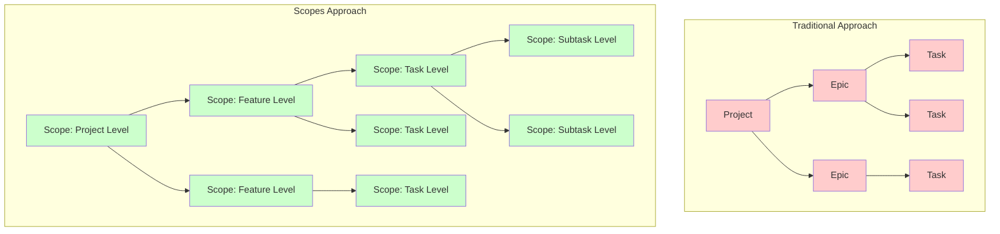
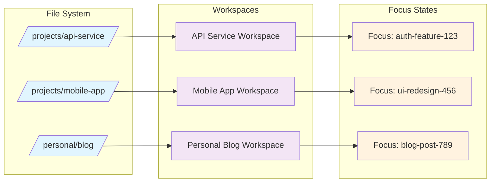

# Scopes Domain Overview

## Vision

**Scopes** enables seamless symbiotic collaboration between developers and AI assistants through a unified, recursive task management system that eliminates context loss and maximizes productivity.

## Core Innovation: Unified Scope Entity

Unlike traditional project management tools that use separate concepts (projects, epics, tasks), Scopes uses a single recursive entity called **Scope**.



**Benefits:**
- **Conceptual Simplicity**: Learn one concept, use everywhere
- **Deep Hierarchy**: Supports up to 10 levels by default (configurable)
- **Consistent Operations**: Same features available at every level
- **Natural Recursion**: Mirrors how developers actually think about work

## Key Domain Concepts

### 1. Scope (Core Entity)

A **Scope** represents any unit of work, from high-level projects to individual tasks.

**Properties:**
- **Identity**: Unique ULID identifier
- **Hierarchy**: Parent-child relationships (up to 10 levels by default, configurable)
- **Metadata**: Title, description, timestamps
- **Cross-cutting Features**: Comments, attachments, tasks, labels, relations

**Examples:**
```text
Scope: "Authentication System"
├── Scope: "User Login"
│   ├── Scope: "Login UI Design"
│   ├── Scope: "Backend Auth API"
│   └── Scope: "Integration Tests"
└── Scope: "Password Recovery"
        ├── Scope: "Email Templates"
        └── Scope: "Recovery Flow Logic"
```

### 2. Aspect System

**Aspects** are key-value metadata pairs that enable multi-dimensional classification and powerful querying.

**Built-in Aspects:**
- `priority`: high | medium | low
- `status`: pending | in_progress | completed | logged
- `type`: feature | bug | task | research | design

**Custom Aspects:**
- `assignee`: alice | bob | charlie
- `milestone`: v2.0 | v2.1
- `component`: frontend | backend | database
- `estimate`: 2h | 4h | 1d | 3d

**Advanced Queries:**
```bash
# Complex filtering
scopes list -a priority>=high -a status=in_progress
scopes list -a "assignee=alice|bob AND type=bug"
scopes list -a estimate<8h -a component=frontend
```

### 3. Workspace + Focus Management

**Workspace**: Directory-based project context that automatically switches based on current working directory.

**Focus**: Single scope within a workspace that AI and commands reference by default.



**Benefits:**
- **Automatic Context**: No manual workspace switching
- **Natural Pronouns**: "this", "that" resolve to focused scope
- **AI Context**: AI automatically knows what you're working on
- **Efficient Commands**: Omit scope IDs when focus is set

### 4. AI-Native Architecture

Designed from the ground up for human-AI collaboration:

**Comment-Based Integration:**
- Asynchronous AI requests through scope comments
- Persistent conversation history within scope context
- Multiple AI assistants can collaborate on same scope

**MCP Integration:**
- Standard Model Context Protocol server
- Real-time workspace and focus awareness
- Seamless integration with Claude, GPT, and other AI systems

**Co-authorship Tracking:**
- All AI operations record both AI agent and human instructor
- Maintains accountability and auditability
- Supports handoff between different AI assistants

## Target User Personas

### 1. AI-Driven Developer
**Profile**: Uses AI assistants as primary development partners
**Pain Points**: Context loss during long sessions, handoff between AI systems
**Scopes Solution**: Persistent context through focus + comments, seamless AI handoff

### 2. Tech Lead
**Profile**: Manages design quality before team presentation
**Pain Points**: External tool complexity, double data entry
**Scopes Solution**: Local design refinement with selective external sync

### 3. OSS Contributor
**Profile**: Contributes to multiple international projects
**Pain Points**: Language barriers, context switching between projects
**Scopes Solution**: Workspace auto-switching, AI language bridging

### 4. Multi-Device Developer
**Profile**: Works across laptop, desktop, remote servers
**Pain Points**: Context preservation across devices
**Scopes Solution**: Local-first with optional sync, offline-capable

### 5. International Engineer
**Profile**: Works in foreign companies or international OSS
**Pain Points**: Language barriers in technical communication
**Scopes Solution**: AI translation and communication assistance

## Architectural Principles

### Local-First
- **Offline Operation**: All core features work without internet
- **Data Sovereignty**: Your data stays on your devices
- **Selective Sync**: Choose what to share with external tools
- **Performance**: No network latency for common operations

### AI-Optional Design
- **Core Functionality**: Works completely without AI
- **Progressive Enhancement**: AI adds value but isn't required
- **Graceful Degradation**: System remains functional if AI unavailable
- **User Control**: AI features can be disabled entirely

### Standards-First
- **Industry Adoption**: Use established standards over custom solutions
- **MCP Protocol**: Standard AI integration
- **XDG Directories**: Platform-appropriate file locations
- **ULID Identifiers**: Distributed, sortable, collision-resistant IDs

## System Boundaries

### Core Domain (In Scope)
- Unified Scope entity management
- Workspace and focus management
- AI integration and co-authorship
- Local-first data storage
- Aspect-based querying and filtering

### Supporting Domain (In Scope)
- Comment and attachment systems
- External tool synchronization
- Multi-device data sync
- Security and encryption

### Out of Scope (Current Phase)
- Real-time collaborative editing
- Built-in communication/chat
- Advanced project analytics
- Third-party plugin ecosystem
- Web-based interface (CLI-first)

## Business Rules

### Title Uniqueness Rules

The system enforces strict title uniqueness rules at all levels of the scope hierarchy. This design ensures clear identification and prevents confusion throughout the entire project organization.

**Design Philosophy**: 
- **Consistent Uniqueness**: All scope titles must be unique within their respective context
- **Clear Identification**: No ambiguity in scope naming regardless of hierarchy level
- **Simple Rules**: One unified rule applies to all scopes

**Benefits**:
- **No Naming Conflicts**: Clear, unambiguous scope identification at all levels
- **Predictable Behavior**: Same validation rules apply consistently everywhere
- **Better Organization**: Forces thoughtful, descriptive naming throughout projects
- **AI Collaboration**: Clearer context for AI assistants without naming ambiguity

#### All Scopes (Root and Child)
- **Rule**: Duplicate titles are **FORBIDDEN** at all levels
- **Rationale**: Consistent uniqueness prevents confusion and ensures clear identification. Even at the root level, having multiple scopes with identical names can lead to ambiguity when referencing or managing projects.
- **Use Cases**: 
  - All project names must be unique for clear identification
  - All task names within any context must be distinct
  - Forces descriptive, meaningful naming conventions
- **Example**: All scopes must have unique titles within their context

```text
❌ Not Allowed at ANY level:
├── Scope: "Website"
├── Scope: "Website"  // Duplicate forbidden even at root level
└── Scope: "Personal Blog"
    ├── Scope: "Setup"
    └── Scope: "Setup"  // Duplicate forbidden at child level too
```

```text
✅ Required - All scopes must have unique, descriptive names:
├── Scope: "Personal Portfolio Website"
├── Scope: "Client Website Project"
├── Scope: "React Learning Project"
├── Scope: "Vue.js Experiment"
└── Scope: "Personal Blog"
    ├── Scope: "Initial Setup"
    ├── Scope: "Content Creation"
    └── Scope: "Deployment Configuration"
```

#### Real-World Usage Examples

**Scenario 1: Descriptive Project Naming**
```text
✅ Required - Clear, unique project identification:
├── Scope: "Personal Portfolio React"
├── Scope: "Todo App Vue Learning"
├── Scope: "E-commerce Node.js API"
└── Scope: "Mobile App Swift Tutorial"
```

**Scenario 2: Detailed Task Organization**
```text
✅ Required - Specific task naming within projects:
├── Scope: "E-commerce Website"
│   ├── Scope: "Database Schema Design"
│   ├── Scope: "User Authentication Backend" 
│   ├── Scope: "Frontend User Interface"
│   └── Scope: "Payment Integration Testing"
└── Scope: "Blog Platform"
    ├── Scope: "CMS Setup and Configuration"
    ├── Scope: "Content Management Features"
    └── Scope: "SEO Optimization Implementation"
```

**Scenario 3: Learning Project Differentiation**
```text
✅ Required - Distinguish similar learning projects:
├── Scope: "React Fundamentals Course"
├── Scope: "React Advanced Patterns Study"
├── Scope: "Machine Learning Python Basics"
└── Scope: "Machine Learning Deep Learning Project"
```

**Scenario 4: Professional vs Personal Distinction**
```text
✅ Required - Clear context identification:
├── Scope: "Personal Portfolio Website"
├── Scope: "Client ABC Website Project"
├── Scope: "Freelance E-commerce Site"
└── Scope: "Open Source Documentation Tool"
```

### Other Business Rules

#### Hierarchy Constraints
- **Maximum Depth**: 10 levels to prevent excessive nesting
- **Maximum Children**: 100 children per parent to maintain performance

#### Title Validation
- **Length**: 1-200 characters
- **Content**: No newline characters allowed
- **Required**: Cannot be empty or whitespace-only
- **Trimming**: Leading/trailing whitespace is removed before validation
- **Case-insensitivity**: Duplicate checks compare titles in lowercase
- **Unicode normalization**: No additional normalization is applied

## Success Metrics

### Developer Productivity
- **Context Preservation**: Developers maintain context across sessions
- **AI Collaboration**: Seamless handoff between AI assistants
- **Reduced Friction**: Fewer context switches between tools

### System Adoption
- **Learning Curve**: New users productive within first session
- **Migration Ease**: Simple import from existing tools
- **Ecosystem Integration**: Works with existing development workflows

### Technical Performance
- **Offline Capability**: 100% feature availability without network
- **Response Time**: Sub-100ms for common operations
- **Data Integrity**: Zero data loss across device synchronization

