# Scopes Requirements Specification

This directory contains the functional and non-functional requirements for the Scopes system. Each requirement is documented as a separate file to enable focused discussion and tracking.

## Project Overview

**Scopes** is a next-generation local-first task and project management tool designed for symbiotic collaboration between developers and AI assistants.

**Primary Goal**: Eliminate context loss and maximize productivity through a unified, recursive task management system that enables seamless human-AI collaboration.

## Requirements Categories

### Core Features (Critical Priority)

These requirements form the foundation of the Scopes system and must be implemented in the initial release.

| ID | Requirement | Status | Description |
|----|-------------|--------|-------------|
| [FR-001](./fr-001-unified-scope-management.md) | Unified Scope Management | Core | Create and manage recursive scope hierarchies |
| [FR-002](./fr-002-workspace-context-management.md) | Workspace Context Management | Core | Automatic directory-based workspace switching |
| [FR-003](./fr-003-focus-management-system.md) | Focus Management System | Core | Single-scope focus for AI context and shortcuts |
| [FR-004](./fr-004-aspect-based-classification.md) | Aspect-Based Classification | Core | Flexible key-value metadata and querying |
| [FR-005](./fr-005-ai-integration-coauthorship.md) | AI Integration & Co-authorship | Core | MCP protocol and AI collaboration tracking |
| [FR-006](./fr-006-local-first-data-storage.md) | Local-First Data Storage | Core | Offline functionality with cross-platform storage |

### Enhanced Features (High Priority)

Features that significantly improve user experience and should be included if resources permit.

| ID | Requirement | Status | Description |
|----|-------------|--------|-------------|
| [FR-007](./fr-007-external-tool-synchronization.md) | External Tool Synchronization | Enhanced | Integration with GitHub Issues, Jira, etc. |
| [FR-008](./fr-008-cross-cutting-features.md) | Cross-Cutting Features | Enhanced | Comments, attachments, tasks, labels, relations |

### Non-Functional Requirements

| ID | Requirement | Status | Description |
|----|-------------|--------|-------------|
| [NFR-001](./nfr-001-performance.md) | Performance | Critical | Sub-100ms response times |
| [NFR-002](./nfr-002-offline-capability.md) | Offline Capability | Critical | 100% functionality without network |
| [NFR-003](./nfr-003-data-integrity.md) | Data Integrity | Critical | Zero data loss guarantee |
| [NFR-004](./nfr-004-cross-platform-compatibility.md) | Cross-Platform Compatibility | Critical | Windows, macOS, Linux support |
| [NFR-005](./nfr-005-scalability.md) | Scalability | High | Support for large-scale usage |
| [NFR-006](./nfr-006-security-privacy.md) | Security & Privacy | High | Data protection and privacy by default |

## Requirement Dependencies

The following diagram shows dependencies and relationships between requirements:

```mermaid
---
title: Requirements Dependencies and Relationships
---
%%{init: {"theme": "neutral", "themeVariables": {"primaryColor": "#4caf50", "primaryTextColor": "#2e7d32", "primaryBorderColor": "#2e7d32"}}}%%
graph TB
    %% Core Infrastructure
    FR006[FR-006: Local-First Storage<br/>📁 Data Foundation] 
    FR002[FR-002: Workspace Context<br/>🏠 Directory-Based Context]
    
    %% Core Functionality
    FR001[FR-001: Unified Scope Management<br/>🎯 Core Entity Management]
    FR003[FR-003: Focus Management<br/>🔍 Single Scope Focus]
    FR004[FR-004: Aspect Classification<br/>🏷️ Metadata & Querying]
    
    %% AI Integration
    FR005[FR-005: AI Integration<br/>🤖 MCP & Co-authorship]
    
    %% Enhanced Features
    FR007[FR-007: External Sync<br/>🔗 Tool Integration]
    FR008[FR-008: Cross-Cutting Features<br/>✨ Rich Content]
    
    %% Non-Functional Requirements
    NFR001[NFR-001: Performance<br/>⚡ Response Times]
    NFR002[NFR-002: Offline Capability<br/>📶 Network Independence]
    NFR003[NFR-003: Data Integrity<br/>🔒 Zero Data Loss]
    
    %% Dependencies
    FR006 --> FR001
    FR006 --> FR002
    FR002 --> FR003
    FR001 --> FR003
    FR001 --> FR004
    FR003 --> FR005
    FR001 --> FR005
    
    FR001 --> FR007
    FR001 --> FR008
    
    %% Non-functional impacts
    FR006 -.-> NFR002
    FR006 -.-> NFR003
    FR001 -.-> NFR001
    FR004 -.-> NFR001
    
    %% Styling
    classDef core fill:#4caf50,stroke:#2e7d32,stroke-width:3px,color:#fff
    classDef enhanced fill:#ff9800,stroke:#e65100,stroke-width:2px,color:#fff
    classDef nonfunctional fill:#2196f3,stroke:#1565c0,stroke-width:2px,color:#fff
    classDef infrastructure fill:#9c27b0,stroke:#6a1b9a,stroke-width:2px,color:#fff
    
    class FR001,FR003,FR004,FR005 core
    class FR007,FR008 enhanced
    class NFR001,NFR002,NFR003 nonfunctional
    class FR002,FR006 infrastructure
```

## Implementation Priority

### Phase 1: Core Foundation
**Target**: MVP (Minimum Viable Product)

1. **FR-006**: Local-First Data Storage
2. **FR-002**: Workspace Context Management  
3. **FR-001**: Unified Scope Management
4. **NFR-002**: Offline Capability
5. **NFR-003**: Data Integrity

### Phase 2: AI Integration
**Target**: AI-Enabled Version

6. **FR-003**: Focus Management System
7. **FR-005**: AI Integration & Co-authorship
8. **NFR-001**: Performance Requirements

### Phase 3: Enhanced Experience
**Target**: Feature-Complete Version

9. **FR-004**: Aspect-Based Classification
10. **FR-008**: Cross-Cutting Features
11. **NFR-004**: Cross-Platform Compatibility
12. **NFR-005**: Scalability

### Phase 4: Ecosystem Integration
**Target**: Tool Integration

13. **FR-007**: External Tool Synchronization
14. **NFR-006**: Security & Privacy

## Success Criteria

The Scopes system meets requirements when:

### Functional Completeness
- ✅ All Phase 1 core features implemented and tested
- ✅ AI integration provides seamless human-AI collaboration
- ✅ System handles real-world usage scenarios effectively

### Quality Standards
- ✅ All non-functional requirements meet defined success criteria
- ✅ Comprehensive test coverage across all critical paths
- ✅ Performance benchmarks achieved on all target platforms

### User Experience
- ✅ New users productive within 15 minutes
- ✅ Existing tool migration is straightforward
- ✅ System integrates naturally with developer workflows

## Traceability Matrix

Each requirement includes:
- **Acceptance Criteria**: Testable conditions for completion
- **Dependencies**: Other requirements that must be satisfied first
- **Test Cases**: Specific scenarios that validate the requirement
- **Design Impact**: How the requirement influences system architecture

## Related Documentation

- [Domain Overview](../domain-overview.md) - Core concepts and entities
- [User Stories](../user-stories/) - User-centered scenarios and workflows
- [Architecture Decision Records](../adr/) - Architectural decisions impacting requirements
- [System Constraints](./system-constraints.md) - Technical and business limitations

## Contributing to Requirements

When adding or modifying requirements:

1. **Follow the template**: Use consistent format across all requirement files
2. **Update relationships**: Modify dependency diagrams and matrices
3. **Validate completeness**: Ensure acceptance criteria are testable
4. **Consider impact**: Assess effects on existing requirements and design
5. **Update this README**: Keep the index and diagrams current

For detailed contribution guidelines, see the main [CONTRIBUTING.md](../../../CONTRIBUTING.md) document.