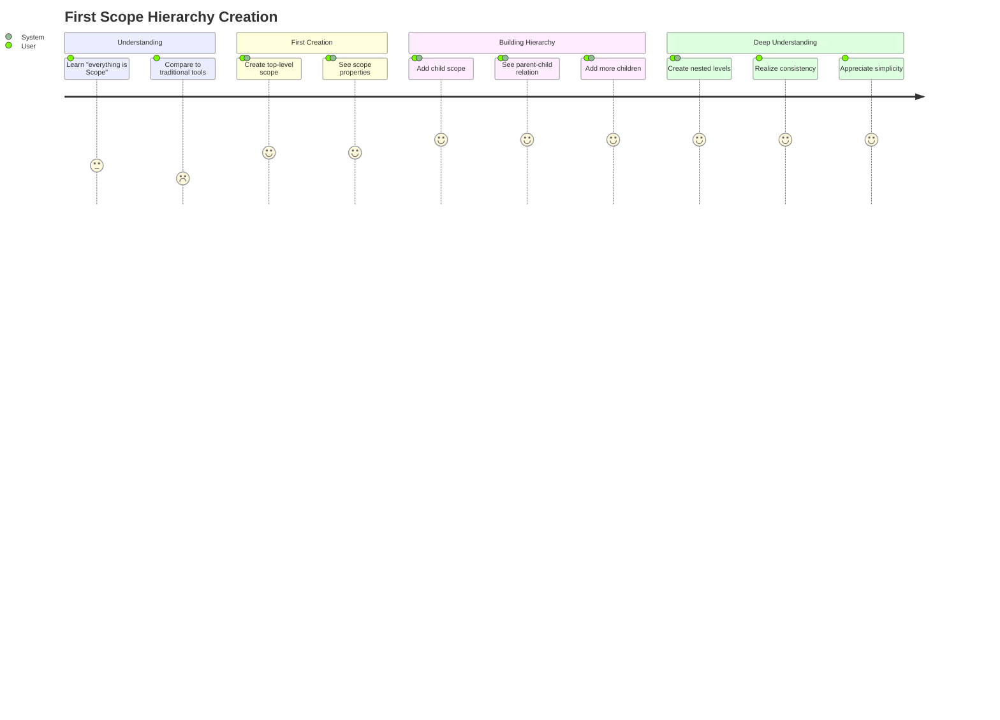

# US-002: Create First Scope Hierarchy

## User Story

- **As a** developer new to Scopes
- **I want** to understand and use the unified Scope concept
- **So that** I can organize my work hierarchically without learning multiple concepts

## Persona Context

- **User Type**: AI-Driven Developer / Tech Lead
- **Experience Level**: Beginner with Scopes (but experienced with project management)
- **Context**: Has used traditional tools (Jira, GitHub Issues) with separate project/epic/task concepts. Curious about Scopes' unified approach.

## Detailed Scenario

A developer has just installed Scopes and wants to organize their current project. In traditional tools, they would need to:
1. Create a project
2. Add epics to the project
3. Create tasks under epics
4. Learn different workflows for each level

With Scopes, they expect:
- A single, consistent concept that works at all levels
- Natural hierarchy creation without artificial boundaries
- The ability to start simple and add complexity as needed
- Clear understanding of how "everything is a Scope"

Current pain points with traditional tools:
- Multiple concepts to learn (project vs epic vs task)
- Artificial boundaries between levels
- Different features available at different levels
- Complex navigation between hierarchical levels

## Acceptance Criteria

```gherkin
Feature: Unified Scope hierarchy creation

Scenario: Create a top-level scope
  Given I have Scopes installed and running
  When I create a scope called "Authentication System"
  Then a new scope is created with a unique ID
  And I can see it in my scope list
  And it has the same properties as any other scope

Scenario: Add child scopes naturally
  Given I have a scope "Authentication System"
  When I create a child scope "User Login" under it
  Then "User Login" becomes a child of "Authentication System"
  And I can navigate from parent to child
  And both scopes have identical capabilities

Scenario: Create unlimited hierarchy depth
  Given I have "Authentication System" > "User Login"
  When I create "Login UI" under "User Login"
  And I create "Input Validation" under "Login UI"
  Then I can create arbitrarily deep hierarchies
  And all levels work exactly the same way
  And navigation works at all levels

Scenario: Understand unified concept
  Given I have created a multi-level hierarchy
  When I examine any scope at any level
  Then it has the same properties and capabilities
  And I can perform the same operations
  And the interface is consistent throughout
```

## User Journey

1. **Conceptual Understanding**: User learns that "everything is a Scope"
2. **First Creation**: User creates their first top-level scope
3. **Hierarchy Building**: User adds child scopes naturally
4. **Deep Nesting**: User creates multiple levels without thinking about boundaries
5. **Realization**: User understands the power of the unified concept
6. **Workflow Integration**: User adapts their mental model to Scopes approach



## Success Metrics

- **Concept Comprehension**: Users understand unified Scope model within 10 minutes
- **Hierarchy Creation**: Users successfully create 3+ level hierarchies
- **Mental Model Adoption**: Users stop thinking in project/epic/task terms
- **Feature Discovery**: Users realize all features work at all levels

## Dependencies

### Requires
- Basic scope creation and storage (US-001 foundation)
- Hierarchical data model implementation
- Parent-child relationship management
- Consistent UI/CLI across all levels

### Enables
- Advanced hierarchy management
- Workspace and focus features
- AI integration with hierarchical context
- Advanced querying and filtering

## Implementation Notes

### Core Concepts to Demonstrate
- **Recursive Nature**: Every scope can contain other scopes
- **Unlimited Depth**: No artificial restrictions on hierarchy levels
- **Consistent Interface**: Same commands work at every level
- **Natural Navigation**: Intuitive movement between levels

### CLI Design Considerations
```bash
# Simple, consistent commands
scopes create "Authentication System"
scopes create "User Login" --parent auth-01HBQ...

# Natural hierarchy navigation
scopes list auth-01HBQ...          # Show children
scopes tree auth-01HBQ...          # Show full tree
scopes show login-01HBR...         # Show any scope
```

### User Mental Model Transition
Help users transition from:
- **Traditional**: "I need to create a project, then add epics, then add tasks"
- **Scopes**: "I need to create a scope, then add child scopes as needed"

## Related Stories

- **US-001**: First-Time Installation (provides foundation)
- **Future**: Workspace management (builds on hierarchy)
- **Future**: AI integration (uses hierarchical context)
- **Future**: Focus management (operates on any scope level)
