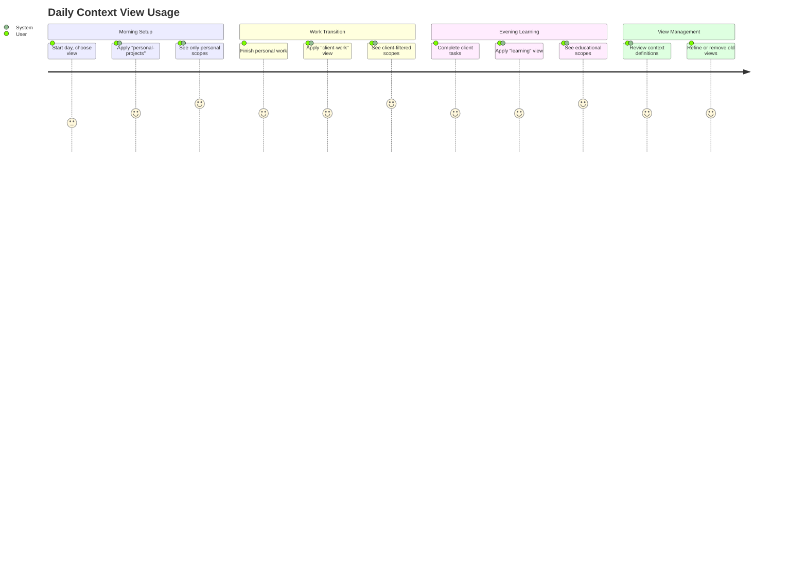

# US-004: Named Context Views

## User Story

- **As a** developer working on multiple projects and types of work
- **I want** to create and use named filter views for different work contexts
- **So that** I can see only relevant scopes without noise from unrelated work

## Persona Context

- **User Type**: Multi-Device Developer / Solo Developer
- **Experience Level**: Intermediate (familiar with aspects and scope organization)
- **Context**: Juggles personal projects, client work, learning projects, and maintenance tasks. Needs persistent filtered views to organize work without noise.

## Detailed Scenario

A developer works on several distinct contexts throughout their day:
- **Morning**: Personal open-source project (creative, exploratory work)
- **Afternoon**: Client project (focused, deadline-driven work)
- **Evening**: Learning new technology (experimental, educational work)
- **Weekend**: Home automation project (hobby, low-pressure work)

Each context has different:
- Relevant scopes and priorities
- Mental state and energy level requirements
- Tools and environments
- Success criteria and time pressures

Current pain points:
- Seeing all scopes at once creates cognitive overload
- Hard to focus when unrelated work is visible
- Manual filtering is tedious and error-prone
- Need to remember complex filter queries

The developer wants named context views that persist filter definitions, allowing quick access to different work perspectives without remembering complex queries.

## Acceptance Criteria

```gherkin
Feature: Named context views

Scenario: Create named contexts with aspect filters
    Given I have scopes with various aspects across different projects
    When I create a context called "client-work" with filter "project=acme AND type=feature"
    And I create a context called "learning" with filter "category=education"
    Then each context becomes a persistent named view
    And I can access these views repeatedly

Scenario: Use context views to filter scopes
    Given I have defined multiple contexts
    When I apply the "client-work" context view
    Then I only see scopes matching the client-work filter
    And all other scopes are hidden from view
    And the view remains until I change it

Scenario: Manage context definitions
    Given I have created several context views
    When I need to modify or remove contexts
    Then I can edit context filter definitions
    And I can delete contexts I no longer need
    And I can list all available contexts

Scenario: Work within context views persistently
    Given I am using a "learning" context view
    When I create new scopes or modify existing ones
    Then the operations work normally
    And the view continues showing only matching scopes
    And new scopes that match the filter appear automatically
```

## User Journey

1. **View Recognition**: User realizes they need organized ways to see different work types
2. **Context Definition**: User creates named context views based on aspect filters
3. **First Usage**: User applies a context view and experiences filtered view
4. **Workflow Integration**: User incorporates context views into daily routine
5. **Context Refinement**: User adjusts context definitions based on usage patterns
6. **View Management**: User creates, modifies, and removes context views as needed



## Success Metrics

- **Context Usage**: Users create and use 3+ named context views
- **View Persistence**: Users rely on saved views rather than manual filtering
- **Context Management**: Users actively modify and maintain context definitions
- **Routine Integration**: Context views become part of daily workflow

## Dependencies

### Requires
- Aspect-based classification system (US-003)
- Scope filtering and querying capabilities
- Named filter persistence and management
- Context view application interface

### Enables
- Focus management (contexts can be applied as focus)
- Workspace-specific context views
- AI context awareness (AI knows current view preferences)
- Personalized scope organization patterns

## Implementation Notes

### Context Definition
```bash
# Create named context views with aspect filters
scopes context create "client-work" --filter "project=acme AND priority>=medium"
scopes context create "learning" --filter "category=education OR type=experiment"
scopes context create "maintenance" --filter "type=bug OR type=chore"

# List available contexts (global and local)
scopes context list
scopes context list --global    # Only global contexts
scopes context list --local     # Only workspace-local contexts
```

### Context Switching
```bash
# Switch to a context (git-like pattern)
scopes context switch client-work

# Switch to global context
scopes context switch --global client-work

# Switch to workspace-local context
scopes context switch --local project-specific

# Show current context
scopes context current
scopes context current --global  # Show global context
scopes context current --local   # Show workspace context
```

### Context Management
```bash
# Create global context (available everywhere)
scopes context create --global "client-work" --filter "project=acme"

# Create workspace-local context (only in current workspace)
scopes context create --local "frontend-tasks" --filter "component=ui"

# Edit context definitions
scopes context edit client-work --filter "project=acme AND status!=completed"

# Remove context definitions
scopes context rm client-work
scopes context rm --global client-work  # Remove global context
scopes context rm --local frontend-tasks # Remove local context

# Show context details
scopes context show client-work

# Reset to default context
scopes context switch default
```

### Personal Workflow Patterns
- **Time-based contexts**: Morning creative work, afternoon focused work
- **Energy-based contexts**: High-energy complex tasks, low-energy maintenance
- **Project-based contexts**: Different clients, personal vs professional
- **Type-based contexts**: Implementation vs planning vs learning

## Future Considerations

### Default Context Behavior
- **Logged Status Exclusion**: Default context should potentially exclude `logged` category statuses
- **Archive System**: Completed scopes that have been logged for a period should be automatically archived and hidden from view
- **Context Inheritance**: Need to decide whether workspace-local contexts should inherit from global contexts or be completely independent

### Context Hierarchy Design
- **Inheritance Model**: How should local contexts relate to global contexts?
- **Override vs Extend**: Should local contexts completely override global ones or extend them?
- **Default Context Definition**: What should the system-wide default context filter be?

## Related Stories

- **US-003**: Aspect-Based Classification (provides filtering foundation)
- **Future**: Directory-Based Workspace Management (contexts can be workspace-specific)
- **Future**: AI Integration (AI understands current context for better assistance)
- **Future**: Personal Analytics (track time and productivity across contexts)

