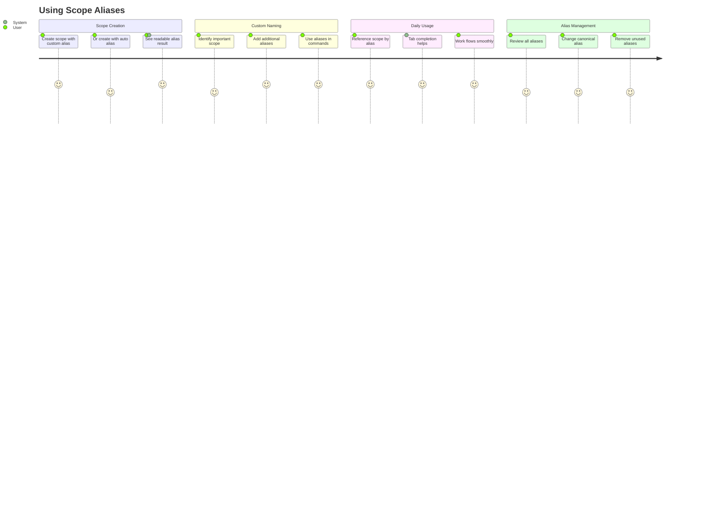

# US-006: Scope Alias System

## User Story

- **As a** developer working with many scopes in CLI
- **I want** to reference scopes using short, memorable aliases instead of long IDs
- **So that** I can work more efficiently without memorizing or typing complex identifiers

## Persona Context

- **User Type**: CLI Power User / Frequent Scope Manager
- **Experience Level**: Intermediate to Advanced (comfortable with CLI tools)
- **Context**: Creates and manages dozens to hundreds of scopes, frequently references them in commands, values typing efficiency and memorability

## Detailed Scenario

A developer manages multiple scopes throughout their workflow:

- **Problem with ULIDs**: Scopes internally use ULIDs like `01H8XGJWBWBAQ1J3T3B8A0V0A8` for guaranteed uniqueness
- **Typing friction**: Copying/pasting or typing these IDs slows down workflow
- **Memory burden**: Impossible to remember which ULID corresponds to which task
- **Context loss**: Long IDs obscure the actual work being referenced

Current pain points:
- Need to constantly look up scope IDs
- Risk of typos when manually entering IDs
- Difficulty communicating about scopes verbally
- Scripts become unreadable with hardcoded ULIDs

The developer wants a flexible alias system that provides short, memorable identifiers while maintaining the robustness of ULIDs internally.

## Acceptance Criteria

```gherkin
Feature: User-friendly scope identification

Scenario: Default canonical alias generation
    Given I create a new scope with ULID "01H8XGJWBWBAQ1J3T3B8A0V0A8"
    When the scope is created without specifying an alias
    Then a canonical alias like "quiet-river-a4f7" is automatically assigned
    And this alias uses ULID-seeded Haikunator pattern for uniqueness
    And I can reference the scope using this canonical alias

Scenario: Custom alias on creation
    Given I want to create a new scope with a specific alias
    When I create the scope with --alias "feature-auth"
    Then "feature-auth" becomes the canonical alias
    And no Haikunator alias is generated
    And the scope can be referenced by this alias

Scenario: Custom alias assignment
    Given I have a scope with canonical alias "quiet-river-a4f7"
    When I assign a custom alias "feature-auth"
    Then I can reference the scope using "feature-auth"
    And the canonical alias remains available
    And the ULID remains the internal identifier

Scenario: Canonical alias replacement
    Given I have a scope with canonical alias "quiet-river-a4f7"
    When I set a new canonical alias "authentication-module"
    Then "authentication-module" becomes the canonical alias
    And "quiet-river-a4f7" remains as a regular alias
    And both aliases resolve to the same scope

Scenario: Multiple aliases per scope
    Given I have a scope for authentication work
    When I assign aliases "auth", "login-feature", and "sprint-42-auth"
    Then I can use any of these aliases to reference the same scope
    And all aliases resolve to the same ULID internally
    And I can see which one is canonical

Scenario: Alias management
    Given I have scopes with various aliases
    When I need to organize my aliases
    Then I can list all aliases for a scope
    And I can rename or remove aliases
    And I can see which alias is canonical
```

## User Journey

1. **Friction Recognition**: User notices productivity loss from ULID management
2. **Discovery**: User sees human-readable canonical aliases on scope creation
3. **Intentional Naming**: User creates scope with custom alias for important work
4. **Workflow Integration**: User starts using aliases in daily commands
5. **Advanced Usage**: User manages multiple aliases and changes canonical ones
6. **Productivity Gain**: User works faster with memorable identifiers



## Success Metrics

- **Alias Adoption**: 95%+ of scope references use aliases instead of full ULIDs
- **Canonical Alias Usage**: Users rely on system-generated aliases for 60%+ of scopes
- **Custom Alias Creation**: Users create custom aliases for 30%+ of important scopes
- **Command Efficiency**: Reduced typing time and errors

## Dependencies

### Requires
- ULID-based scope identification system
- Alias storage and resolution system
- Command parser that resolves aliases
- Word lists for Haikunator generation

### Enables
- Readable scripts and documentation
- Verbal communication about scopes
- Faster command-line workflows
- Better user experience overall

## Implementation Notes

### ULID-Seeded Haikunator Pattern

The canonical alias combines human-readable words with ULID-derived uniqueness:

```text
Format: <adjective>-<noun>-<ulid-token>
Example: quiet-river-a4f7
```

Where:
- **Adjective & Noun**: Selected from curated word lists
- **ULID Token**: Extracted from the random portion of ULID (not timestamp)
      - Uses last 20 bits (4 Base32 characters) from ULID's random section
      - Provides 1,048,576 unique combinations
      - Combined with word variety, collision probability is negligible

### Canonical Alias Properties

```bash
# System generates canonical alias on creation
$ scopes create "Implement authentication"
Created scope 01H8XGJWBWBAQ1J3T3B8A0V0A8
Canonical alias: quiet-river-a4f7

# User specifies canonical alias on creation
$ scopes create "Fix login bug" --alias fix-login
Created scope 01H8XGJWCDEFG2K4L5M6N7P8Q9
Canonical alias: fix-login

# Canonical alias is marked specially
$ scopes alias list quiet-river-a4f7
Aliases for scope 01H8XGJWBWBAQ1J3T3B8A0V0A8:
- quiet-river-a4f7 (canonical)
- auth-feature (custom)
- sprint-42 (custom)
```

### Alias Commands

```bash
# Create with custom alias
$ scopes create "Implement OAuth" --alias oauth-impl
Created scope 01H8XGJWXYZ123456789ABCDEF
Canonical alias: oauth-impl

# Assign additional alias
$ scopes alias add quiet-river-a4f7 auth-feature
Alias 'auth-feature' assigned to scope quiet-river-a4f7

# Change canonical alias
$ scopes alias set-canonical quiet-river-a4f7 authentication
'authentication' is now the canonical alias
'quiet-river-a4f7' remains as regular alias

# Use any alias in commands
$ scopes show auth-feature
$ scopes focus quiet-river-a4f7
$ scopes update authentication --status in-progress

# List all aliases
$ scopes alias list quiet-river-a4f7
Aliases for scope 01H8XGJWBWBAQ1J3T3B8A0V0A8:
- authentication (canonical)
- quiet-river-a4f7 (system-generated)
- auth-feature (custom)

# Remove alias
$ scopes alias rm sprint-42
Removed alias 'sprint-42'
```

### Word List Design Principles

Following best practices from the document:

- **Clarity**: Avoid homophones and visually similar characters
- **Conciseness**: Short, common, memorable words
- **Safety**: Filter inappropriate or offensive terms
- **Internationality**: Widely understood English words

### Alias Resolution

```bash
# Resolution order:
# 1. Exact alias match (any type)
# 2. Prefix match if unique
# 3. Show disambiguation if multiple matches

$ scopes show quiet
# If unique, shows the scope
# If multiple matches:
Error: Prefix 'quiet' matches multiple scopes:
- quiet-river-a4f7 "Implement authentication"
- quiet-mountain-b8e2 "Fix login bug"

Please use a longer prefix or exact alias.
```

### Tab Completion

```bash
# Dynamic completion for all aliases
$ scopes show qu<TAB>
quiet-river-a4f7   quiet-mountain-b8e2

$ scopes focus auth<TAB>
auth-feature   authentication   auth-api-v2
```

## Future Considerations

### Advanced Features
- **Alias templates**: Pattern-based custom alias generation
- **Namespace support**: Project-specific alias prefixes
- **Smart suggestions**: Suggest aliases based on scope content
- **Alias validation**: Prevent confusing or reserved aliases

### Security Considerations
- Non-predictable canonical aliases prevent IDOR vulnerabilities
- ULID-seeded tokens ensure distributed uniqueness
- No sequential patterns to enumerate

## Related Stories

- **US-002**: Create First Scope Hierarchy (provides scope structure)
- **US-005**: Focus Management (aliases make focus commands easier)
- **Future**: Cross-Device Sync (alias synchronization)
- **Future**: External Tool Integration (expose aliases to other tools)
