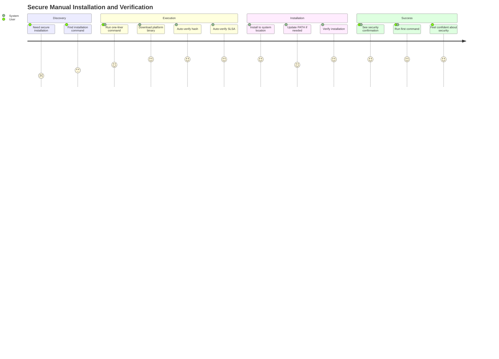

# US-007: Secure Manual Installation and Verification

## User Story

- **As a** security-conscious developer who needs to install Scopes
- **I want** to use a modern one-liner installation with automatic cryptographic verification
- **So that** I can quickly and safely install Scopes without manual verification steps while ensuring supply chain security

## Persona Context

- **User Type**: Security-aware Developer / DevOps Engineer / Enterprise User
- **Experience Level**: Intermediate to Expert
- **Context**: Needs to install software with strong security guarantees. Familiar with modern installation patterns (Docker, Rust, Node.js). Values both convenience and security.

## Detailed Scenario

A developer wants to install Scopes but requires strong security guarantees due to organizational policies or personal security practices. They expect:

- **Modern installation experience**: One-liner command similar to Docker (`curl -fsSL get.docker.com | sh`) or Rust (`curl --proto '=https' --tlsv1.2 -sSf https://sh.rustup.rs | sh`)
- **Automatic verification**: No manual hash checking or signature verification steps
- **Transparency**: Clear indication of what security checks are being performed
- **Cross-platform consistency**: Same level of security across Linux, macOS, and Windows
- **Supply chain security**: SLSA Level 3 provenance verification integrated seamlessly

Current pain points with manual installation approaches:
- Multi-step verification processes are error-prone
- Users often skip verification steps due to complexity
- Inconsistent security practices across platforms
- Manual hash verification is tedious and mistakes are common

## Acceptance Criteria

```gherkin
Feature: Secure one-liner installation

Scenario: One-liner installation with automatic verification
    Given I have curl available on my system
    When I run 'curl -sSL https://raw.githubusercontent.com/kamiazya/scopes/main/install/install.sh | sh'
    Then Scopes is downloaded from GitHub releases
    And the binary hash is automatically verified
    And the SLSA provenance is automatically verified
    And Scopes is installed to the appropriate system location
    And I can immediately use the 'scopes' command
    And I see confirmation that all security checks passed

Scenario: PowerShell one-liner installation (Windows)
    Given I have PowerShell available on Windows
    When I run 'iwr https://raw.githubusercontent.com/kamiazya/scopes/main/install/install.ps1 | iex'
    Then Scopes is downloaded and verified automatically
    And it's installed to Program Files with appropriate permissions
    And the PATH is updated to include Scopes
    And I see confirmation of successful security verification

Scenario: Installation with environment variables
    Given I want to customize the installation
    When I set environment variables like SCOPES_VERSION=v1.0.0
    And I run the installation script
    Then the script uses my specified configuration
    And all verification steps still execute properly
    And the installation respects my preferences

Scenario: Verification failure handling
    Given the downloaded binary fails hash verification
    When the installation script runs verification
    Then the installation is immediately aborted
    And I see a clear error message about the verification failure
    And no binary is installed on my system
    And I am warned not to use the compromised binary

Scenario: Network connectivity issues
    Given I have intermittent network connectivity
    When the download fails partway through
    Then I see a clear error message
    And temporary files are cleaned up
    And I can retry the installation safely

Scenario: Insufficient permissions
    Given I don't have write access to /usr/local/bin
    When I run the installation script
    Then I'm prompted about sudo requirements
    And I can choose an alternative installation directory
    And the script guides me through PATH setup

Scenario: SLSA verifier installation
    Given slsa-verifier is not installed on my system
    When the installation script needs to verify provenance
    Then it automatically installs slsa-verifier using Go
    And continues with verification seamlessly
    And informs me about the additional security tool installed

Scenario: Offline verification support
    Given I have downloaded release files manually
    When I run the verification script directly
    Then I can verify files without re-downloading
    And I get the same security guarantees
    And I can then install the verified binary

Scenario: Enterprise proxy environment
    Given I'm behind a corporate proxy
    When I run the installation script
    Then it respects system proxy settings
    And downloads work through the proxy
    And verification still functions properly

Scenario: Custom repository installation
    Given I want to install from a forked repository
    When I set SCOPES_GITHUB_REPO=myorg/scopes-fork
    And I run the installation script
    Then it downloads from my specified repository
    And verification works with the custom source
    And installation proceeds normally
```

## User Journey

1. **Discovery**: User learns about Scopes and decides to install securely
2. **Command Execution**: User runs one-liner installation command
3. **Automatic Download**: Script detects platform and downloads appropriate binary
4. **Security Verification**: Hash and SLSA provenance verified automatically
5. **Installation**: Binary installed to appropriate system location
6. **Verification**: Installation verified and PATH updated if needed
7. **Ready to Use**: User can immediately start using Scopes



## Success Metrics

- **Security Verification Rate**: 100% of installations perform both hash and SLSA verification
- **Installation Success Rate**: >98% of installations complete without manual intervention
- **Time to Installation**: Complete installation (including verification) within 2 minutes
- **Security Confidence**: Users report high confidence in installation security
- **Cross-Platform Consistency**: Same security level and user experience across all platforms

## Dependencies

### Requires
- GitHub Releases with SLSA provenance
- Cross-platform binary distribution
- Hash files for each release
- Network connectivity for downloads
- Modern shell environment (bash/PowerShell/cmd)

### Enables
- Secure software distribution at scale
- Enterprise adoption with compliance requirements
- Trust in the software supply chain
- Simplified onboarding for security-conscious users

## Security Features

### Cryptographic Verification
- **SHA256 Hash Verification**: Every binary verified against published hashes
- **SLSA Level 3 Provenance**: Supply chain integrity verified cryptographically
- **HTTPS-Only Downloads**: All network communication over encrypted channels
- **Signature Verification**: Integration with GitHub's signing infrastructure

### Supply Chain Security
- **Build Transparency**: Complete visibility into build process through SLSA
- **Source Verification**: Cryptographic proof of source repository and commit
- **Builder Verification**: Confirmation of official build environment
- **Non-Repudiation**: Tamper-evident audit trail for all releases

### Threat Protection
- **Man-in-the-Middle Protection**: HTTPS and signature verification
- **Binary Tampering Detection**: Hash verification catches any modifications
- **Compromised Repository Protection**: SLSA provenance detects unauthorized changes
- **Supply Chain Attacks**: Multi-layer verification catches sophisticated attacks

## Implementation Notes

### Platform Support
- **Linux**: bash script with platform auto-detection
- **macOS**: Same bash script with macOS-specific optimizations
- **Windows**: PowerShell script with Windows-specific features
- **Windows**: PowerShell script with Windows-specific features

### Installation Methods
```bash
# Primary Unix method
curl -sSL https://raw.githubusercontent.com/kamiazya/scopes/main/install/install.sh | sh

# Windows PowerShell
iwr https://raw.githubusercontent.com/kamiazya/scopes/main/install/install.ps1 | iex

# Windows (requires PowerShell, available on Windows 10/11)
# Use the PowerShell method shown above
```

### Environment Variables
- `SCOPES_VERSION`: Specific version to install
- `SCOPES_INSTALL_DIR`: Custom installation directory
- `SCOPES_SKIP_VERIFICATION`: Skip verification (not recommended)
- `SCOPES_FORCE_INSTALL`: Skip confirmation prompts
- `SCOPES_GITHUB_REPO`: Custom repository source

### Error Handling
- Clear error messages for common failure scenarios
- Automatic cleanup of temporary files
- Guidance for manual intervention when needed
- Fallback options for restricted environments

## Security Considerations

### Trusted Execution
- Scripts are downloaded over HTTPS from official repository
- Users should verify script source before execution
- Scripts can be downloaded and inspected before running
- All operations are transparent and logged

### Verification Integrity
- Hash verification prevents binary tampering
- SLSA provenance prevents supply chain attacks
- Multiple verification layers provide defense in depth
- Verification failures immediately abort installation

### Operational Security
- No sensitive data transmitted during installation
- Temporary files cleaned up automatically
- Installation can be performed in restricted environments
- Full audit trail of all verification steps

## Related Stories

- **US-001**: First-Time Installation and Setup - This story extends US-001 by providing the secure manual installation path for users who cannot or prefer not to use package managers
- **US-002**: Create First Scope Hierarchy - Users can proceed to creating their first scope after secure installation
- **US-003**: Aspect-Based Scope Classification - Foundation for organizing work after installation
- **US-004**: Personal Context Switching - Enables efficient workflow after setup

This story establishes the security foundation that enables trust in the Scopes ecosystem for security-conscious users and organizations.
