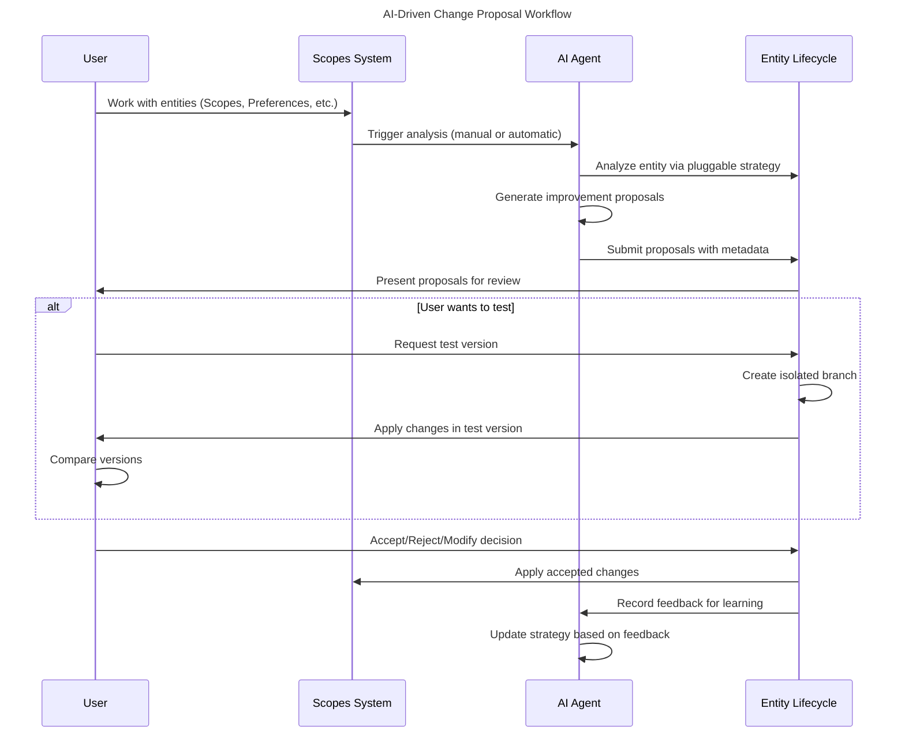

# US-008: AI-Driven Change Proposals

## User Story

- **As a** developer working with AI assistants
- **I want** AI to suggest improvements to any entity in my system
- **So that** I can review and apply AI recommendations while maintaining control

## Persona Context

- **User Type**: AI-Driven Developer
- **Experience Level**: Intermediate with Scopes, familiar with AI assistants
- **Context**: Uses AI assistants (Claude, GitHub Copilot, etc.) for development and wants AI to help optimize not just code but also project organization, preferences, and workflows.

## Detailed Scenario

A developer is working on a complex project and has:
1. Multiple Scopes with varying organization patterns
2. User preferences that haven't been optimized in months
3. Project templates that could be improved based on usage patterns
4. Task breakdowns that AI could help refine

With the Entity Lifecycle system, they expect:
- AI agents to analyze any entity type (not just Scopes)
- Clear proposals with rationale and confidence levels
- Ability to review changes before applying them
- Test proposals in isolated versions
- Full attribution of AI-suggested changes
- Learning from accepted/rejected proposals

Current pain points with traditional AI integration:
- AI suggestions are ephemeral (lost after conversation)
- No structured review process for AI recommendations
- Can't test AI suggestions safely
- No audit trail of AI contributions
- AI can't learn from user feedback on suggestions

## Acceptance Criteria

```gherkin
Feature: AI-driven change proposals for any entity type

Scenario: AI analyzes a complex Scope and suggests breakdown
    Given I have a complex Scope "Authentication System"
    And the AI analysis shows high complexity score (>0.7)
    When the AI generates a task breakdown proposal
    Then I see a proposal with:
        | Field | Value |
        | Rationale | Clear explanation of why breakdown helps |
        | Confidence | High (0.8) |
        | Changes | List of new sub-scopes to create |
        | Impact | Estimated time and risk assessment |
    And I can review the proposal before applying
    And all changes are attributed to the AI agent

Scenario: AI optimizes User Preferences based on usage
    Given I have User Preferences with suboptimal settings
    And the AI analyzes my usage patterns
    When the AI generates optimization proposals
    Then I see proposals for:
        | Entity Type | Proposed Changes |
        | UserPreferences | Theme adjustments based on time of day |
        | UserPreferences | Keyboard shortcuts based on frequency |
        | UserPreferences | View filters based on access patterns |
    And each proposal includes rationale and confidence
    And I can accept, reject, or modify each proposal

Scenario: Test AI proposal in isolated version
    Given I have an AI proposal to reorganize my Scope hierarchy
    When I choose to test the proposal
    Then a new version branch is created automatically
    And the changes are applied only to the test version
    And I can switch between versions to compare
    And I can merge or abandon the test version

Scenario: AI learns from user feedback
    Given I have reviewed 10 AI proposals
    And I accepted 6, rejected 3, and modified 1
    When the AI generates new proposals
    Then the proposals reflect my preferences:
        | Learning | Example |
        | Avoid rejected patterns | No deep nesting if previously rejected |
        | Prefer accepted styles | Similar organization to accepted proposals |
        | Incorporate modifications | Adjusted confidence for modified types |
```

## User Journey

1. **Entity State**: User has entities (Scopes, Preferences, Templates) in current state
2. **AI Analysis**: AI agents analyze entities and identify improvements
3. **Proposal Generation**: AI creates structured proposals with clear rationale
4. **User Review**: User sees proposals with confidence levels and impact assessment
5. **Testing (Optional)**: User tests proposals in isolated versions
6. **Decision**: User accepts, rejects, or modifies proposals
7. **Application**: Accepted changes are applied with full attribution
8. **Learning**: AI learns from user decisions for future proposals



## Success Metrics

- **Proposal Quality**: >70% of proposals considered useful by users
- **Adoption Rate**: >50% of proposals accepted (possibly with modifications)
- **Safety**: 100% of changes can be reverted or tested safely
- **Attribution**: Every AI change is clearly marked in history
- **Learning Effectiveness**: Proposal acceptance rate improves over time

## Dependencies

### Requires
- Generic Entity Lifecycle system (ADR-012)
- Pluggable AI Strategy Pattern (ADR-014)
- Entity versioning and branching capability
- AI agent integration (MCP or direct)

### Enables
- Continuous entity optimization
- AI-assisted workflow improvement
- Personalized system behavior
- Advanced AI learning from user patterns

## Implementation Notes

### Entity Types Supporting AI Proposals
- **Scopes**: Task breakdown, hierarchy optimization, deadline management
- **UserPreferences**: Settings optimization, shortcut recommendations
- **ProjectTemplates**: Structure improvements, default values tuning
- **WorkflowAutomations**: Process optimization, trigger refinement
- **Any future entity type** via pluggable strategies

### AI Proposal Metadata Structure
```kotlin
data class ProposalMetadata(
    val aiAgent: AgentId,
    val rationale: String,           // Why this change is suggested
    val confidence: ConfidenceLevel, // How sure the AI is
    val category: ProposalCategory,  // Type of improvement
    val impactAssessment: ImpactAssessment,
    val alternativeOptions: List<AlternativeProposal> = emptyList()
)
```

### User Control Mechanisms
- **Review Required**: All proposals require explicit user action
- **Batch Operations**: Review multiple proposals together
- **Filters**: Show only high-confidence or specific category proposals
- **Undo**: Revert any applied proposal within time window
- **Blocking**: Prevent certain types of proposals

### MCP Integration Example
```bash
# AI agent analyzes current workspace
scopes ai analyze --entity-type scope --target workspace

# List pending proposals
scopes ai proposals list
╭─────────────────────────────────────────────────────╮
│ ID    Type    Entity             Confidence  Category │
├─────────────────────────────────────────────────────┤
│ p-001 Scope   Auth System        High        BREAKDOWN│
│ p-002 Prefs   User Settings      Medium      OPTIMIZE │
│ p-003 Scope   API Integration    High        REORG    │
╰─────────────────────────────────────────────────────╯

# Review specific proposal
scopes ai proposals show p-001

# Test in isolated version
scopes ai proposals test p-001

# Apply with modifications
scopes ai proposals apply p-001 --modify
```

## Related Stories

- **US-002**: Create First Scope Hierarchy (entities to be optimized)
- **US-009**: Entity Version Management (versioning infrastructure)
- **US-010**: User Preferences AI Optimization (specific use case)
- **Future**: AI Learning and Personalization
- **Future**: Collaborative AI Reviews (team scenarios)
