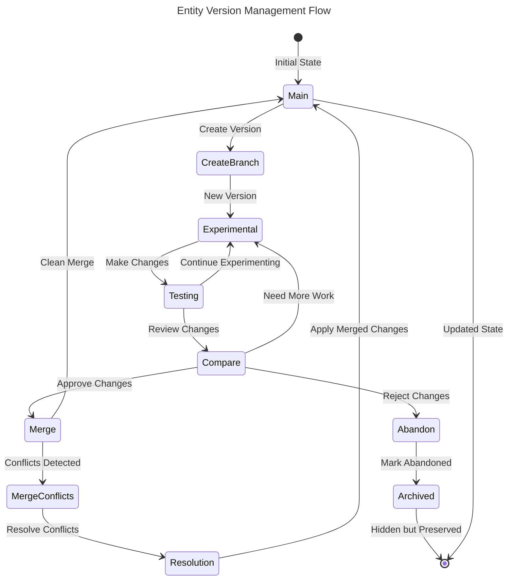

# US-009: Entity Version Management

## User Story

- **As a** developer experimenting with different configurations
- **I want** to create versions/branches of any entity type
- **So that** I can safely experiment and compare different approaches

## Persona Context

- **User Type**: Tech Lead / OSS Contributor
- **Experience Level**: Advanced with version control concepts (Git), intermediate with Scopes
- **Context**: Frequently experiments with different organizational structures, settings, and templates. Needs to test changes safely before committing to them.

## Detailed Scenario

A tech lead is preparing for a major project reorganization and needs to:
1. Try different Scope hierarchies without affecting the current structure
2. Experiment with User Preferences for the team
3. Test multiple Project Template variations
4. Compare different approaches side-by-side
5. Merge successful experiments back to main

With the Entity Lifecycle version management, they expect:
- Git-like branching for any entity type
- Safe experimentation without affecting "main" version
- Easy switching between versions
- Clear comparison of changes between versions
- Controlled merging with conflict resolution
- Complete history of all experiments

Current pain points without versioning:
- Changes are immediately live (no safe experimentation)
- Can't compare different approaches
- No way to "undo" complex reorganizations
- Team changes affect everyone immediately
- Lost context when experiments fail

## Acceptance Criteria

```gherkin
Feature: Version management for all entity types

Scenario: Create experimental version of Scope hierarchy
    Given I have a main Scope hierarchy for "E-commerce Platform"
    When I create a new version called "microservices-reorg"
    Then a new version branch is created
    And the main version remains unchanged
    And I can switch between versions instantly
    And both versions track changes independently

Scenario: Experiment with User Preferences safely
    Given I have my current User Preferences
    When I create version "dark-mode-experiment"
    And I modify theme settings in the new version
    Then the changes only affect the experimental version
    And I can preview the changes without committing
    And I can switch back to main preferences anytime

Scenario: Compare versions side-by-side
    Given I have versions "main" and "microservices-reorg"
    When I compare the two versions
    Then I see:
        | Comparison | Details |
        | Changed Entities | List of modified Scopes |
        | Structural Diff | Hierarchy changes visualization |
        | Field Changes | Specific field modifications |
        | Change Summary | Statistics and impact analysis |

Scenario: Merge successful experiment
    Given I have tested "microservices-reorg" version successfully
    When I merge it into "main"
    Then the system:
        | Action | Result |
        | Detects conflicts | Shows any conflicting changes |
        | Proposes resolution | Suggests merge strategy |
        | Preserves history | Keeps full audit trail |
        | Updates main | Applies changes atomically |
    And I can still access the version history

Scenario: Abandon failed experiment
    Given I have version "failed-experiment"
    When I decide to abandon it
    Then I can mark the version as "ABANDONED"
    And the version is hidden from normal views
    And the history is preserved for reference
    And no changes affect the main version
```

## User Journey

1. **Current State**: User has entities in their main/stable state
2. **Branch Creation**: User creates named version for experimentation
3. **Experimentation**: User makes changes in isolated version
4. **Testing**: User tests changes without affecting main
5. **Comparison**: User compares versions to understand differences
6. **Decision Point**: User decides to merge, continue, or abandon
7. **Resolution**: Changes are merged or version is abandoned
8. **History**: Complete audit trail is maintained



## Success Metrics

- **Experimentation Safety**: 100% of experiments isolated from main
- **Version Switching**: <100ms to switch between versions
- **Merge Success Rate**: >90% of merges complete without manual intervention
- **History Completeness**: Every change traceable to its version
- **User Confidence**: Increased experimentation due to safety

## Dependencies

### Requires
- Generic Entity Lifecycle system (ADR-012)
- Entity snapshot capability for fast version switching
- Change tracking for all entity types
- Conflict detection and resolution algorithms

### Enables
- Safe AI proposal testing (US-008)
- Team collaboration on experiments
- A/B testing of configurations
- Complex migration scenarios

## Implementation Notes

### Version Management Concepts
```kotlin
// Version creation
data class CreateVersionRequest(
    val entityId: EntityId,
    val entityType: EntityType,
    val parentVersion: VersionId = VersionId.MAIN,
    val name: VersionName,
    val description: String? = null,
    val purpose: VersionPurpose = VersionPurpose.EXPERIMENT
)

enum class VersionPurpose {
    EXPERIMENT,      // User experimentation
    AI_TESTING,      // AI proposal testing
    MIGRATION,       // Data migration staging
    BACKUP,          // Backup before major change
    FEATURE          // Feature development
}
```

### CLI Version Operations
```bash
# Create new version of current workspace
scopes version create "microservices-reorg" --entity-type scope

# List all versions
scopes version list
╭──────────────────────────────────────────────────────╮
│ Version               Status    Created     Changes   │
├──────────────────────────────────────────────────────┤
│ main                  ACTIVE    2024-01-01  -        │
│ microservices-reorg   ACTIVE    2024-03-15  42       │
│ dark-theme-test       MERGED    2024-03-10  3        │
│ failed-exp-1          ABANDONED 2024-03-08  17       │
╰──────────────────────────────────────────────────────╯

# Switch to different version
scopes version switch microservices-reorg

# Compare versions
scopes version compare main microservices-reorg

# Merge version
scopes version merge microservices-reorg --into main
```

### Version Storage Strategy
- **Main Version**: Always exists, represents stable state
- **Named Versions**: User-friendly names for experiments
- **Version Tree**: Supports branching from any version
- **Snapshot Optimization**: Fast switching via snapshots
- **Change Replay**: Full history reconstruction possible

### Conflict Resolution
```kotlin
sealed class MergeConflict {
    data class FieldConflict(
        val fieldPath: FieldPath,
        val mainValue: JsonValue,
        val branchValue: JsonValue
    ) : MergeConflict()
    
    data class StructuralConflict(
        val description: String,
        val affectedPaths: List<FieldPath>
    ) : MergeConflict()
}

enum class MergeStrategy {
    AUTOMATIC,        // Auto-resolve non-conflicts
    PREFER_MAIN,      // Keep main version values
    PREFER_BRANCH,    // Take branch version values
    MANUAL           // Require user resolution
}
```

### Multi-Entity Version Coordination
When multiple entity types need coordinated versioning:
- **Workspace Versions**: Version entire workspace state
- **Linked Versions**: Related entities share version
- **Independent Versions**: Each entity type managed separately

## Related Stories

- **US-008**: AI-Driven Change Proposals (uses versioning for testing)
- **US-010**: User Preferences AI Optimization (version experiments)
- **Future**: Team Version Collaboration
- **Future**: Version Templates and Presets
- **Future**: Automated Version Testing
