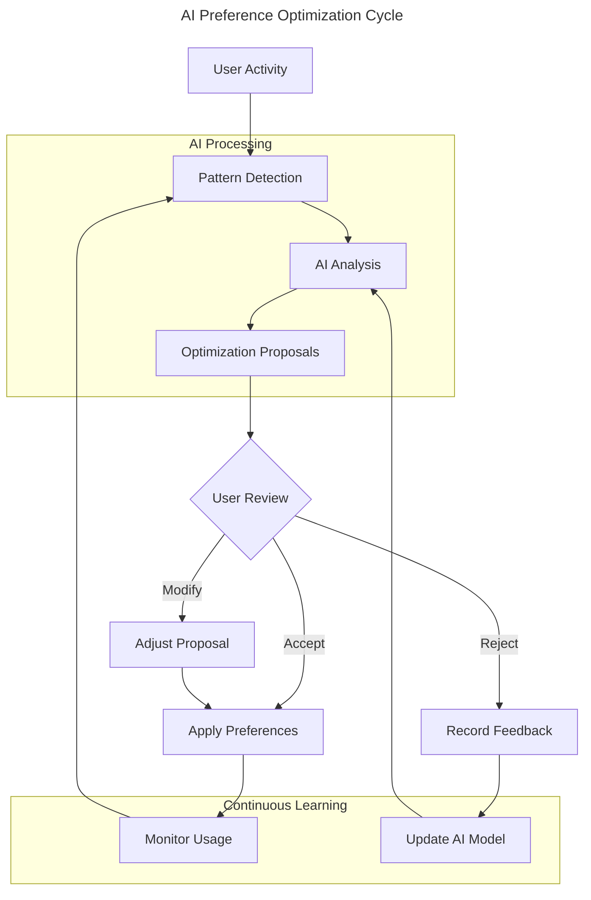

# US-010: User Preferences AI Optimization

## User Story

- **As a** developer with evolving work patterns
- **I want** AI to analyze and optimize my preferences automatically
- **So that** my tools adapt to my changing needs without manual configuration

## Persona Context

- **User Type**: Multi-Device Developer / International Engineer
- **Experience Level**: Intermediate to advanced with Scopes
- **Context**: Works across different times, devices, and contexts. Preferences that work in one situation may not be optimal in another. Manually adjusting settings is tedious and often forgotten.

## Detailed Scenario

A developer's work patterns vary significantly:
1. **Time-based**: Morning focus work vs. afternoon collaboration
2. **Device-based**: Laptop for mobility vs. desktop for deep work
3. **Project-based**: Different preferences for different project types
4. **Context-based**: Home office vs. coffee shop vs. corporate office

With AI-optimized preferences, they expect:
- Automatic analysis of usage patterns
- Contextual preference suggestions
- Time-based theme adjustments
- Keyboard shortcut optimization based on frequency
- View and filter presets based on access patterns
- Cross-device preference synchronization with context awareness

Current pain points:
- Static preferences don't adapt to changing contexts
- Manual preference tuning is time-consuming
- Forget to adjust settings for different situations
- No way to discover optimal settings
- Preferences drift from actual usage over time

## Acceptance Criteria

```gherkin
Feature: AI-driven preference optimization

Scenario: AI detects and suggests time-based theme changes
    Given I work in bright conditions during day and dim at night
    And I manually switch themes at different times
    When the AI analyzes my pattern over 2 weeks
    Then it proposes:
        | Time Range | Theme | Confidence | Rationale |
        | 06:00-18:00 | Light | High (0.85) | Consistent morning light theme usage |
        | 18:00-06:00 | Dark | High (0.85) | Evening dark theme preference |
        | 22:00-06:00 | High Contrast | Medium (0.65) | Late night eye strain reduction |
    And I can enable automatic theme switching

Scenario: AI optimizes keyboard shortcuts based on usage
    Given I have default keyboard shortcuts
    And I use certain commands frequently via menu/CLI
    When the AI analyzes my command usage patterns
    Then it suggests:
        | Command | Current Shortcut | Suggested | Usage Count | Rationale |
        | Create Scope | Ctrl+N | Ctrl+S | 847/month | Most used command |
        | Toggle Focus | None | Ctrl+F | 423/month | Frequent focus switching |
        | Quick Switch | Ctrl+P | Ctrl+Space | 651/month | Faster access pattern |
    And shows potential time savings

Scenario: AI creates contextual preference profiles
    Given I work on multiple project types
    When the AI detects different usage patterns per project
    Then it proposes preference profiles:
        | Profile | Triggers | Settings |
        | Deep Work | Scope: "Backend Development" | Minimal UI, focus mode, muted notifications |
        | Planning | Scope: "Sprint Planning" | Full hierarchy view, time aspects visible |
        | Review | Scope: "Code Review" | Diff view preferred, comments panel open |
    And automatically switches profiles based on context

Scenario: AI learns from preference rejections
    Given I rejected previous theme suggestions
    When the AI generates new preference proposals
    Then it:
        | Learning | Application |
        | Avoids rejected patterns | No more high contrast suggestions |
        | Adjusts confidence levels | Lower confidence for theme changes |
        | Proposes alternatives | Suggests font size instead of theme |
    And explains how it incorporated my feedback

Scenario: Cross-device preference optimization
    Given I use Scopes on laptop and desktop
    And each device has different screen sizes and contexts
    When the AI analyzes usage on both devices
    Then it proposes device-specific optimizations:
        | Device | Context | Optimizations |
        | Laptop | Mobile/Coffee shop | Compact view, offline-first, battery saving |
        | Desktop | Home office | Expanded view, real-time sync, multiple panes |
    And maintains core preferences across devices
```

## User Journey

1. **Initial Usage**: User works with default preferences
2. **Pattern Recognition**: AI observes usage patterns over time
3. **Analysis**: AI identifies optimization opportunities
4. **Proposal Generation**: AI creates contextual proposals
5. **Review**: User sees proposals with clear rationale
6. **Testing**: User can test preferences temporarily
7. **Adoption**: User accepts beneficial changes
8. **Continuous Learning**: AI refines based on ongoing usage



## Success Metrics

- **Pattern Detection**: AI identifies >80% of repetitive behaviors
- **Proposal Relevance**: >75% of proposals considered useful
- **Time Savings**: Measurable reduction in preference adjustment time
- **Context Accuracy**: >90% accurate context detection
- **User Satisfaction**: Improved workflow efficiency ratings

## Dependencies

### Requires
- Generic Entity Lifecycle system for UserPreferences entity
- AI Strategy implementation for preferences
- Usage analytics and pattern detection
- Secure preference storage and sync

### Enables
- Fully personalized user experience
- Context-aware tool behavior
- Reduced configuration overhead
- Better accessibility through AI-driven adjustments

## Implementation Notes

### Preference Categories for AI Optimization

```kotlin
sealed class PreferenceCategory {
    object Visual : PreferenceCategory()      // Themes, fonts, layouts
    object Interaction : PreferenceCategory()  // Shortcuts, gestures
    object Workflow : PreferenceCategory()     // Views, filters, defaults
    object Performance : PreferenceCategory()  // Sync, cache, resources
    object Accessibility : PreferenceCategory() // Contrast, size, audio
}
```

### Usage Pattern Analysis
```kotlin
data class UsagePattern(
    val action: UserAction,
    val context: UsageContext,
    val frequency: Int,
    val timeOfDay: TimeRange,
    val deviceInfo: DeviceInfo,
    val projectContext: ProjectContext?
)

data class PreferenceProposal(
    val category: PreferenceCategory,
    val currentValue: Any,
    val suggestedValue: Any,
    val confidence: ConfidenceLevel,
    val rationale: String,
    val expectedBenefit: Benefit,
    val testDuration: Duration = 7.days
)
```

### AI Learning Mechanisms
- **Usage Frequency**: Track command and feature usage
- **Time Patterns**: Detect time-of-day preferences
- **Context Switching**: Identify project/task-based patterns
- **Error Patterns**: Learn from misclicks and corrections
- **Performance Metrics**: Monitor response times and delays

### Privacy and Control
```gherkin
Feature: User control over AI preference optimization

Scenario: Opt-in to AI analysis
    Given AI preference optimization is available
    When I first use Scopes
    Then I'm asked to opt-in to usage analysis
    And I can choose:
        | Option | Description |
        | Full | All usage patterns analyzed locally |
        | Limited | Only frequency, no context |
        | None | No AI optimization |
    And I can change this anytime

Scenario: Data stays local
    Given I've opted into AI analysis
    When the AI analyzes my patterns
    Then all analysis happens locally
    And no usage data is sent to external servers
    And I can export/delete my usage data
```

### CLI Examples
```bash
# View AI preference proposals
scopes preferences ai-proposals
╭────────────────────────────────────────────────────────╮
│ Category     Proposal                    Confidence     │
├────────────────────────────────────────────────────────┤
│ Theme        Auto-switch at sunset       High (0.85)    │
│ Shortcuts    Optimize top 10 commands    High (0.92)    │
│ Layout       Compact view for laptop     Medium (0.73)  │
╰────────────────────────────────────────────────────────╯

# Test proposal temporarily
scopes preferences test-proposal theme-001 --duration 1d

# Apply with modifications
scopes preferences apply theme-001 --modify

# View learning history
scopes preferences ai-history
```

## Related Stories

- **US-008**: AI-Driven Change Proposals (infrastructure)
- **US-009**: Entity Version Management (safe testing)
- **US-004**: Personal Context Switching (context detection)
- **Future**: Team Preference Recommendations
- **Future**: Accessibility AI Assistant
