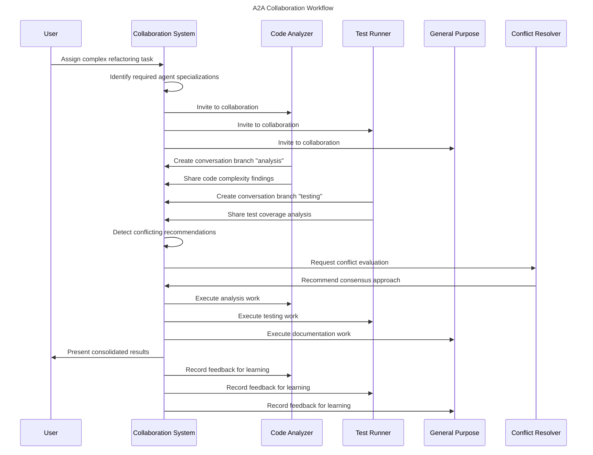

# US-011: AI-to-AI Conversation Collaboration

## User Story

- **As a** developer working with multiple AI assistants
- **I want** AI agents to collaborate with each other on complex tasks
- **So that** I can leverage specialized AI capabilities while maintaining oversight

## Persona Context

- **User Type**: AI-Driven Developer
- **Experience Level**: Advanced with AI tools, familiar with complex multi-step tasks
- **Context**: Working on sophisticated projects that benefit from multiple AI perspectives (code analysis + testing + documentation), wanting AI agents to work together efficiently without requiring constant user coordination.

## Detailed Scenario

A developer is working on a large refactoring task that involves:
1. Analyzing existing code for issues (code-analyzer agent)
2. Running comprehensive tests (test-runner agent)  
3. Updating documentation (general-purpose agent)
4. Generating progress reports for stakeholders

Currently, they must:
- Manually coordinate between different AI assistants
- Copy/paste context between conversations
- Synthesize results from multiple AI outputs
- Track which agent did what and why

With A2A collaboration, they expect:
- AI agents to discuss approaches among themselves
- Specialized agents to contribute their expertise automatically
- Conflicts between AI recommendations to be resolved systematically
- Complete transparency into AI decision-making processes
- Natural handoffs between agents based on task requirements

Pain points with current single-agent approach:
- Limited by one agent's expertise at a time
- Context loss when switching between AI assistants
- No structured collaboration between different AI strengths
- User becomes bottleneck for AI coordination
- Difficult to leverage ensemble AI intelligence

## Acceptance Criteria

```gherkin
Feature: AI agents collaborate on complex multi-step tasks

Scenario: Multiple AI agents collaborate on code refactoring
    Given I have a complex refactoring task assigned
    And multiple specialized AI agents are available
    When I initiate the A2A collaboration workflow
    Then the agents create a shared conversation branch
    And the code-analyzer agent performs initial analysis
    And the test-runner agent validates current test coverage  
    And agents discuss approach in structured conversation
    And they reach consensus on refactoring strategy
    And each agent contributes specialized work
    And I receive a consolidated report of their collaboration

Scenario: AI agents handle conflicting recommendations
    Given two AI agents propose different solutions
    And both have valid reasoning for their approaches
    When the conflict resolution system activates
    Then a third neutral agent is brought in for evaluation
    Or the agents present both options to me for decision
    And the resolution process is fully documented
    And all agents learn from the final decision

Scenario: Lazy context loading for performance
    Given a long conversation history exists between AI agents
    And a new agent joins the collaboration
    When the new agent needs context
    Then only relevant conversation history is loaded
    And context summaries are provided instead of full transcripts
    And the agent can request more specific context if needed

Scenario: Git-like conversation branching
    Given AI agents are discussing multiple solution approaches
    When they want to explore different paths in parallel
    Then they can create conversation branches
    And work on alternative solutions simultaneously
    And merge successful approaches back to main discussion
    And document why certain approaches were abandoned
```

## User Journey

1. **Task Initiation**: User assigns complex task requiring multiple AI specializations
2. **Agent Selection**: System identifies relevant agents based on task analysis
3. **Collaboration Setup**: Agents create shared workspace and establish communication
4. **Parallel Analysis**: Agents work on their specializations simultaneously
5. **Information Sharing**: Agents exchange findings and discuss implications
6. **Conflict Resolution**: System handles disagreements between agents automatically
7. **Consensus Building**: Agents reach agreement on approach or escalate to user
8. **Coordinated Execution**: Agents execute their parts with handoffs as needed
9. **Results Integration**: System consolidates outputs into coherent deliverable
10. **Learning Update**: All agents update their strategies based on collaboration outcome



## Success Metrics

- **Collaboration Efficiency**: Tasks completed 40% faster with A2A vs sequential AI usage
- **Quality Improvement**: 25% fewer issues in A2A collaborative outputs vs single agent
- **Context Preservation**: >95% of relevant context maintained across agent handoffs
- **Conflict Resolution**: >90% of AI conflicts resolved without user intervention
- **User Satisfaction**: Users prefer A2A collaboration for complex tasks (>80%)

## Dependencies

### Requires
- AI Conversation Branching system
- Dynamic Agent Configuration framework
- Conflict Resolution mechanisms
- Lazy Context Loading infrastructure
- Async Collaboration Queuing system
- Enhanced A2A Messaging Protocol

### Enables
- Advanced multi-agent task execution
- Specialized AI ensemble intelligence
- Automated complex workflow orchestration
- Self-organizing AI team dynamics
- Continuous inter-agent learning

## Implementation Notes

### Core A2A Components
```kotlin
// Conversation branching for parallel discussions
interface ConversationVersioning {
    suspend fun createBranch(from: ConversationBranchId, purpose: BranchPurpose): ConversationBranch
    suspend fun mergeBranch(branch: ConversationBranchId, target: ConversationBranchId): MergeResult
}

// Lazy loading for performance  
class LazyConversationLoader {
    suspend fun loadRelevantContext(task: AITask, maxTokens: Int): ConversationContext
}

// Conflict resolution between agents
class AIConflictResolver {
    suspend fun resolveConflict(conflict: AICollaborationConflict): ConflictResolution
}

// Async task queuing
class AICollaborationQueue {
    suspend fun processCollaborationTasks()
}
```

### Agent Communication Patterns
- **Broadcast**: Send message to all agents in collaboration
- **Direct**: Private communication between two agents
- **Escalation**: Bring human or neutral agent into discussion
- **Consensus**: Structured agreement-building process
- **Handoff**: Transfer task ownership between agents

### Collaboration Task Types
- **Peer Review**: One agent reviews another's work
- **Joint Analysis**: Multiple agents analyze same problem
- **Consensus Building**: Agents must agree on approach
- **Knowledge Sharing**: Agent shares insights with others
- **Verification**: Agent validates another's results

### User Control Mechanisms
- **Collaboration Oversight**: View real-time agent discussions
- **Intervention**: Step into agent conversations when needed
- **Approval Gates**: Require user approval for major decisions
- **Agent Selection**: Choose which agents can collaborate
- **Privacy Controls**: Limit what agents can share with each other

### CLI Integration Example
```bash
# Start A2A collaboration on complex task
scopes ai collaborate --task "refactor-auth-system" \
  --agents code-analyzer,test-runner,general-purpose

# Monitor ongoing collaboration
scopes ai collaborate status
╭──────────────────────────────────────────────────────╮
│ Active Collaborations                                │
├──────────────────────────────────────────────────────┤
│ refactor-auth-system                                 │
│   Participants: code-analyzer, test-runner          │
│   Status: Analyzing conflicts                       │
│   Branch: analysis/conflict-resolution              │
│   Progress: 65% complete                            │
╰──────────────────────────────────────────────────────╯

# View agent conversation
scopes ai collaborate show refactor-auth-system
[code-analyzer]: Analysis shows 3 security issues in current auth flow
[test-runner]: Current test coverage is 45%, recommend reaching 80% 
[code-analyzer]: I can fix security while maintaining test compatibility
[test-runner]: Agreed, but let's add integration tests for new flow
[CONSENSUS]: Proceed with security fixes + expanded test suite

# Intervene in collaboration  
scopes ai collaborate join refactor-auth-system
> Human: Please prioritize performance over test coverage for now
[code-analyzer]: Understood, focusing on performant security fixes
[test-runner]: Will create performance benchmarks instead of extensive tests
```

## Related Stories

- **US-008**: AI-Driven Change Proposals (foundation for proposals)
- **US-009**: Entity Version Management (versioning infrastructure) 
- **US-010**: User Preferences AI Optimization (entity-specific AI)
- **Future**: Advanced Multi-Agent Task Planning
- **Future**: AI Team Formation and Optimization
- **Future**: Collaborative AI Code Review
