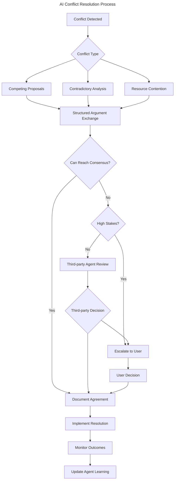

# US-012: AI Conflict Resolution and Consensus Building

## User Story

- **As a** developer relying on multiple AI agents
- **I want** AI agents to resolve their disagreements systematically
- **So that** I get coherent recommendations without manual conflict mediation

## Persona Context

- **User Type**: AI-Driven Developer, Tech Lead
- **Experience Level**: Advanced with AI collaboration, managing complex decisions
- **Context**: Working with multiple AI agents that often provide different recommendations based on their specializations, needs systematic way to handle conflicts and reach consensus without constant user intervention.

## Detailed Scenario

A developer is using multiple AI agents for a system redesign:
1. **Code-analyzer** recommends microservices architecture for scalability
2. **Test-runner** suggests monolith approach for easier testing
3. **General-purpose** proposes modular monolith as compromise

Currently, the user must:
- Manually evaluate each recommendation
- Research pros/cons of conflicting approaches
- Make decisions without structured evaluation
- Miss opportunities for AI agents to learn from each other

With systematic conflict resolution, they expect:
- AI agents to present structured arguments for their positions
- Neutral third-party evaluation when agents can't agree
- Transparent reasoning behind consensus decisions
- Learning from resolved conflicts to prevent similar issues
- Escalation to human only when truly necessary

Pain points with current conflict handling:
- User becomes bottleneck for all AI disagreements
- No structured evaluation of competing recommendations
- AI agents don't learn from conflict resolutions
- Important nuances lost when user makes quick decisions
- No documentation of why certain approaches were rejected

## Acceptance Criteria

```gherkin
Feature: Systematic AI conflict resolution and consensus building

Scenario: AI agents reach consensus through structured discussion
    Given code-analyzer and test-runner have conflicting architecture recommendations
    And both agents have valid technical reasoning
    When the consensus building process is initiated
    Then agents present structured arguments with evidence
    And they identify common ground and trade-offs
    And they negotiate a hybrid approach that addresses both concerns
    And the final consensus is documented with full reasoning
    And all agents update their models based on the resolution

Scenario: Third-party agent resolves deadlock
    Given two agents cannot reach consensus after structured discussion
    And their recommendations are fundamentally incompatible
    When a neutral third-party agent is brought in
    Then the third agent evaluates both positions objectively
    And provides independent analysis of the trade-offs
    And recommends a decision based on project context
    And explains why one approach is better for this specific case

Scenario: User escalation for high-stakes decisions
    Given agents are conflicting on a critical architectural decision
    And the impact assessment shows high risk
    When the conflict resolution system evaluates the stakes
    Then the user is automatically notified of the conflict
    And all agent positions are presented clearly
    And the system provides decision support analysis
    And the user makes the final call with full context

Scenario: Learning from resolved conflicts
    Given a conflict has been resolved successfully
    And the chosen approach has been implemented
    When the outcome is evaluated after implementation
    Then all participating agents learn from the results
    And similar conflicts are handled better in the future
    And conflict patterns are identified and documented
    And prevention strategies are updated accordingly
```

## User Journey

1. **Conflict Detection**: System identifies when agents have incompatible recommendations
2. **Structured Debate**: Agents present arguments using standardized format
3. **Common Ground**: Agents identify shared concerns and compatible elements
4. **Negotiation**: Agents explore compromise solutions and hybrid approaches
5. **Third-party Evaluation**: If needed, neutral agent provides independent analysis
6. **Decision Documentation**: Final resolution is fully documented with reasoning
7. **Implementation Monitoring**: Track outcomes to validate the decision
8. **Learning Integration**: All agents update their models based on results



## Success Metrics

- **Autonomous Resolution Rate**: >85% of conflicts resolved without user intervention
- **Resolution Quality**: >90% of resolved conflicts result in satisfactory outcomes
- **Time to Resolution**: Average conflict resolution under 5 minutes
- **Learning Effectiveness**: Repeated similar conflicts decrease by >60% over time
- **User Satisfaction**: Users report conflicts are handled appropriately >95% of time

## Dependencies

### Requires
- A2A Conversation Collaboration infrastructure
- AI Agent Strategy Pattern with conflict detection
- Voting and consensus mechanisms for AI agents
- Third-party neutral agent capability
- Outcome tracking and feedback integration

### Enables
- Autonomous AI team decision-making
- Reduced user cognitive load
- Higher quality AI collaboration
- Continuous improvement in AI conflict handling
- Sophisticated multi-agent coordination

## Implementation Notes

### Conflict Types and Resolution Strategies
```kotlin
enum class ConflictType {
    COMPETING_PROPOSALS,    // Different solutions to same problem
    CONTRADICTORY_ANALYSIS, // Different interpretations of data  
    RESOURCE_CONTENTION,    // Both want to modify same entity
    PRIORITY_DISAGREEMENT,  // Different urgency assessments
    METHODOLOGY_DISPUTE     // Different approaches to task execution
}

// Resolution strategies per conflict type
class ConflictResolutionStrategy {
    suspend fun resolveCompetingProposals(proposals: List<AIProposal>): ResolutionResult
    suspend fun resolveContradictoryAnalysis(analyses: List<AIAnalysis>): ResolutionResult
    suspend fun resolveResourceContention(requests: List<ResourceRequest>): ResolutionResult
}
```

### Structured Argument Framework
```kotlin
data class ArgumentStructure(
    val position: String,           // What the agent recommends
    val reasoning: List<String>,    // Why this is the best approach
    val evidence: List<Evidence>,   // Supporting data/examples
    val tradeOffs: List<TradeOff>,  // Acknowledged downsides
    val alternatives: List<String>, // Other options considered
    val confidence: ConfidenceLevel // How sure the agent is
)

data class Evidence(
    val type: EvidenceType,
    val description: String,
    val source: String?,
    val weight: Double
)

enum class EvidenceType {
    PERFORMANCE_DATA,
    HISTORICAL_PRECEDENT,
    BEST_PRACTICE,
    TECHNICAL_CONSTRAINT,
    USER_FEEDBACK,
    INDUSTRY_STANDARD
}
```

### Consensus Building Process
```kotlin
class ConsensusBuilder {
    suspend fun facilitateDiscussion(
        conflictingAgents: List<AgentId>,
        topic: ConflictTopic
    ): ConsensusResult {
        
        // Phase 1: Structured argument presentation
        val arguments = collectStructuredArguments(conflictingAgents, topic)
        
        // Phase 2: Find common ground
        val commonGround = identifyCommonGround(arguments)
        
        // Phase 3: Explore compromises
        val compromises = generateCompromiseSolutions(arguments, commonGround)
        
        // Phase 4: Evaluate options
        val evaluation = evaluateOptions(arguments + compromises)
        
        // Phase 5: Build consensus or escalate
        return buildConsensus(evaluation) ?: escalateDecision(arguments, topic)
    }
}
```

### Third-Party Agent Selection
```kotlin
class NeutralAgentSelector {
    fun selectNeutralAgent(
        conflict: AICollaborationConflict,
        availableAgents: List<AgentId>
    ): AgentId? {
        return availableAgents
            .filter { agent -> 
                !agent in conflict.involvedAgents &&
                hasRelevantExpertise(agent, conflict.domain) &&
                hasGoodNeutralityRecord(agent)
            }
            .maxByOrNull { agent -> 
                getNeutralityScore(agent) + getExpertiseScore(agent, conflict.domain)
            }
    }
}
```

### Learning and Improvement
```kotlin
class ConflictLearningService {
    suspend fun recordConflictResolution(
        conflict: AICollaborationConflict,
        resolution: ConflictResolution,
        outcome: ResolutionOutcome
    ) {
        // Record what worked and what didn't
        val learningRecord = ConflictLearningRecord(
            conflictType = conflict.type,
            resolutionStrategy = resolution.strategy,
            participatingAgents = conflict.involvedAgents,
            outcome = outcome,
            lessonsLearned = extractLessons(conflict, resolution, outcome)
        )
        
        // Update agent strategies
        updateAgentConflictStrategies(learningRecord)
        
        // Update conflict prevention patterns
        updateConflictPrevention(learningRecord)
        
        // Update third-party selection algorithms
        updateNeutralAgentSelection(learningRecord)
    }
}
```

### User Interface for Conflict Oversight
```bash
# Monitor active conflicts
scopes ai conflicts list
╭─────────────────────────────────────────────────────────────╮
│ Active Conflicts                                            │
├─────────────────────────────────────────────────────────────┤
│ ID    Agents                    Type         Status    Age   │
│ c-001 code-analyzer,test-runner Competing    Debate    2m    │
│ c-002 general,file-analyzer     Resource     Escalated 5m    │
╰─────────────────────────────────────────────────────────────╯

# View specific conflict details  
scopes ai conflicts show c-001
Conflict: Architecture Decision
Agents: code-analyzer vs test-runner
Type: Competing Proposals

code-analyzer position:
- Recommends: Microservices architecture
- Reasoning: Better scalability, fault isolation
- Evidence: Performance data from similar projects
- Confidence: High (0.85)

test-runner position:  
- Recommends: Monolithic architecture
- Reasoning: Simpler testing, faster development
- Evidence: Reduced test complexity, faster CI/CD
- Confidence: Medium (0.70)

Current Status: Exploring compromise solutions
Progress: Evaluating modular monolith approach

# Intervene in conflict resolution
scopes ai conflicts intervene c-001
> Human: Prioritize development speed over ultimate scalability for this MVP
[Resolution]: Adopting monolithic approach with modular design for future migration
[Status]: Resolved - test-runner recommendation accepted with migration strategy
```

## Related Stories

- **US-011**: A2A Conversation Collaboration (foundation for conflicts)
- **US-008**: AI-Driven Change Proposals (proposals that may conflict)
- **Future**: Advanced Multi-Agent Coordination
- **Future**: AI Team Performance Analytics  
- **Future**: Conflict Prevention and Pattern Recognition
