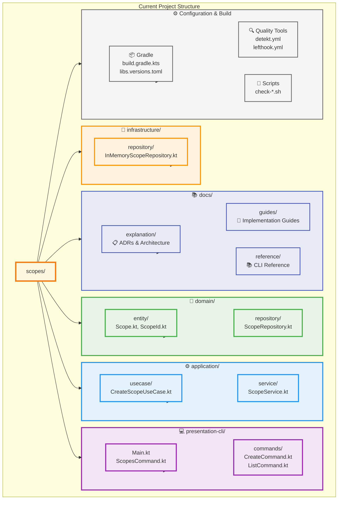
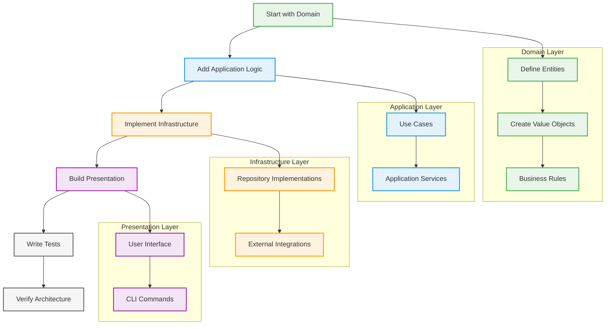
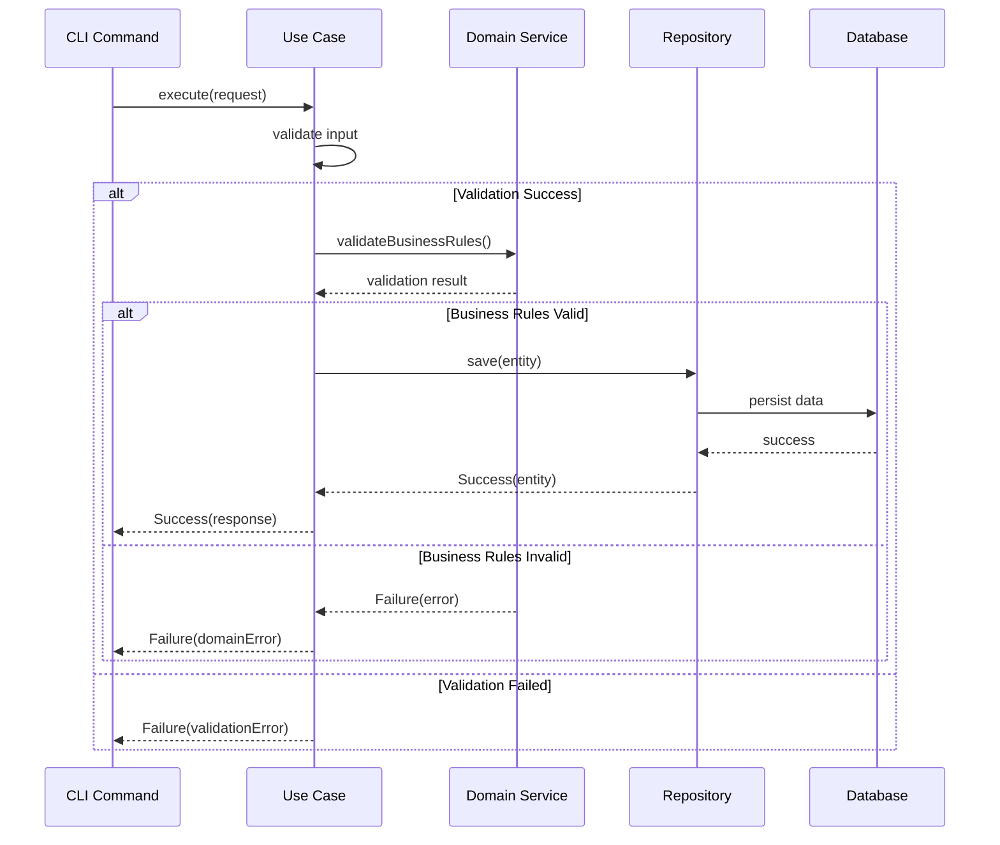
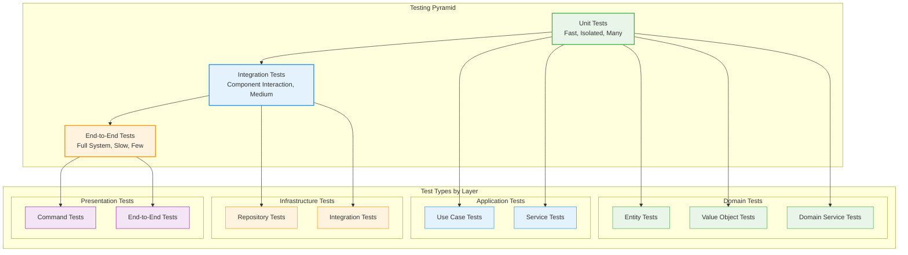
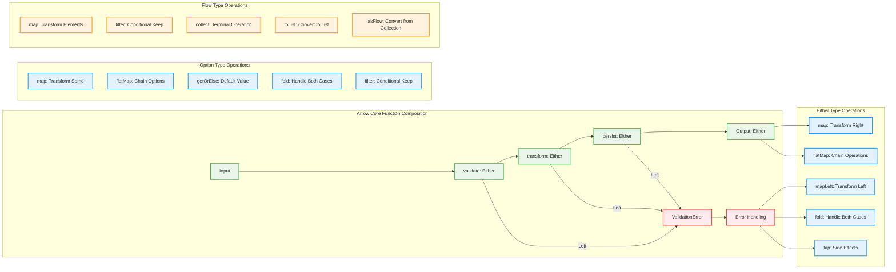
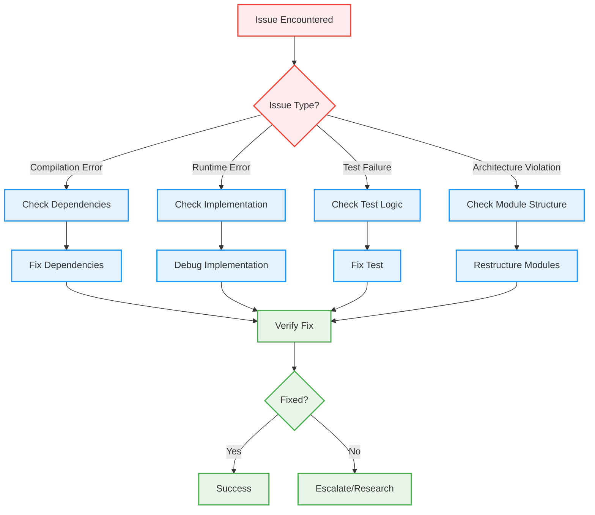

# Architecture Implementation Guide

This guide provides practical instructions for implementing features within the Scopes architecture. It demonstrates how to apply Clean Architecture and Functional DDD principles in concrete development scenarios.


## Getting Started

### Project Structure Overview



### Development Workflow



1. **Start with Domain**: Define entities, value objects, and business rules
2. **Add Application Logic**: Implement use cases and application services
3. **Implement Infrastructure**: Create repository implementations and external integrations
4. **Build Presentation**: Create user interface components
5. **Write Tests**: Comprehensive testing at each layer
6. **Verify Architecture**: Ensure dependency rules are followed

## Implementing Domain Features

### Step 1: Create Domain Entities

```kotlin
// domain/src/main/kotlin/com/kamiazya/scopes/domain/entity/Scope.kt
package io.github.kamiazya.scopes.domain.entity

import io.github.kamiazya.scopes.domain.valueobject.ScopeId
import kotlinx.datetime.Instant

/**
 * Core domain entity representing a Scope in the system.
 *
 * Scopes are hierarchical entities that can contain other scopes,
 * forming a tree structure for project organization.
 */
data class Scope(
        val id: ScopeId,
        val title: String,
        val description: String?,
        val parentId: ScopeId?,
        val createdAt: Instant,
        val updatedAt: Instant
) {
        /**
         * Business rule: Check if this scope can be a parent of another scope.
         * Prevents circular references and self-parenting.
         */
        fun canBeParentOf(childScope: Scope): Boolean =
            id != childScope.id && childScope.parentId != id

        /**
         * Update the scope title with timestamp.
         */
        fun updateTitle(newTitle: String, timestamp: Instant): Scope =
            copy(title = newTitle, updatedAt = timestamp)

        /**
         * Update the scope description with timestamp.
         */
        fun updateDescription(newDescription: String?, timestamp: Instant): Scope =
            copy(description = newDescription, updatedAt = timestamp)

        /**
         * Move scope to a new parent.
         */
        fun moveToParent(newParentId: ScopeId?, timestamp: Instant): Scope =
            copy(parentId = newParentId, updatedAt = timestamp)
}
```

### Step 2: Create Value Objects

```kotlin
// domain/src/main/kotlin/com/kamiazya/scopes/domain/valueobject/ScopeId.kt
package io.github.kamiazya.scopes.domain.valueobject

import com.github.guepardoapps.kulid.ULID

/**
 * Strongly-typed identifier for Scope entities using ULID.
 *
 * ULIDs provide lexicographically sortable, globally unique identifiers
 * suitable for distributed systems.
 */
@JvmInline
value class ScopeId private constructor(private val value: String) {
        companion object {
            /**
             * Generate a new ULID-based ScopeId.
             */
            fun generate(): ScopeId = ScopeId(ULID.random())

            /**
             * Create ScopeId from existing ULID string.
             *
             * @param value Valid ULID string
             * @throws IllegalArgumentException if value is not a valid ULID
             */
            fun from(value: String): ScopeId {
                require(isValidUlid(value)) { "Invalid ULID format: $value" }
                return ScopeId(value)
            }

            private fun isValidUlid(value: String): Boolean =
                value.length == 26 && value.all { it.isLetterOrDigit() }
        }

        override fun toString(): String = value
}
```

### Step 3: Define Domain Services

```kotlin
// domain/src/main/kotlin/com/kamiazya/scopes/domain/service/ScopeValidationService.kt
package io.github.kamiazya.scopes.domain.service

import arrow.core.Either
import arrow.core.Option
import arrow.core.some
import arrow.core.none
import arrow.core.raise.either
import arrow.core.raise.ensure
import io.github.kamiazya.scopes.domain.entity.Scope
import io.github.kamiazya.scopes.domain.valueobject.ScopeId
import io.github.kamiazya.scopes.domain.error.DomainError
import kotlinx.coroutines.flow.Flow

/**
 * Domain service for scope validation logic.
 * Contains business rules that don't naturally belong to any single entity.
 */
object ScopeValidationService {

  const val MAX_TITLE_LENGTH = 200
  const val MIN_TITLE_LENGTH = 1
  const val MAX_DESCRIPTION_LENGTH = 1000

  /**
    * Validate scope title according to business rules.
    */
  fun validateTitle(title: String): Either<DomainError.ValidationError, String> = either {
      ensure(title.isNotBlank()) { DomainError.ValidationError.EmptyTitle }
      ensure(title.length >= MIN_TITLE_LENGTH) { DomainError.ValidationError.TitleTooShort }
      ensure(title.length <= MAX_TITLE_LENGTH) {
          DomainError.ValidationError.TitleTooLong(MAX_TITLE_LENGTH, title.length)
      }
      title.trim()
  }

  /**
    * Validate scope description according to business rules.
    */
  fun validateDescription(description: String?): Either<DomainError.ValidationError, String?> = either {
      when (description) {
          null -> null
          else -> {
              ensure(description.length <= MAX_DESCRIPTION_LENGTH) {
                  DomainError.ValidationError.DescriptionTooLong(MAX_DESCRIPTION_LENGTH, description.length)
              }
              description.trim().ifBlank { null }
          }
      }
  }

  /**
    * Validate that a scope can be moved to a new parent.
    * Prevents circular references in the hierarchy.
    */
  fun validateParentRelationship(
      scope: Scope,
      newParentId: ScopeId?,
      allScopes: List<Scope>
  ): Either<ValidationError, Unit> {
    if (newParentId == null) return Either.Right(Unit)

    if (newParentId == scope.id) {
      return Either.Left(ValidationError.SelfParenting)
    }

    // Check for circular reference
    val ancestors = generateSequence(newParentId) { currentId ->
      allScopes.find { it.id == currentId }?.parentId
    }

    return if (scope.id in ancestors) {
      Either.Left(ValidationError.CircularReference)
    } else {
      Either.Right(Unit)
    }
  }
}

/**
 * Domain errors for validation failures.
 */
sealed class ValidationError {
        object EmptyTitle : ValidationError()
        object TitleTooShort : ValidationError()
        data class TitleTooLong(val maxLength: Int) : ValidationError()
        data class DescriptionTooLong(val maxLength: Int) : ValidationError()
        object SelfParenting : ValidationError()
        object CircularReference : ValidationError()
}
```

### Step 4: Create Repository Interfaces

```kotlin
// domain/src/main/kotlin/com/kamiazya/scopes/domain/repository/ScopeRepository.kt
package io.github.kamiazya.scopes.domain.repository

import io.github.kamiazya.scopes.domain.entity.Scope
import io.github.kamiazya.scopes.domain.valueobject.ScopeId

/**
 * Repository interface for Scope persistence operations.
 * Defined in domain layer following Dependency Inversion Principle.
 */
interface ScopeRepository {

        /**
         * Find scope by its identifier.
         */
        suspend fun findById(id: ScopeId): Either<RepositoryError, Option<Scope>>

        /**
         * Find all scopes that have the specified parent.
         */
        suspend fun findByParentId(parentId: ScopeId): Either<RepositoryError, Flow<Scope>>

        /**
         * Find all root scopes (no parent).
         */
        suspend fun findRootScopes(): Either<RepositoryError, Flow<Scope>>

        /**
         * Get all scopes in the system.
         */
        suspend fun findAll(): Either<RepositoryError, Flow<Scope>>

        /**
         * Save a scope (create or update).
         */
        suspend fun save(scope: Scope): Either<RepositoryError, Scope>

        /**
         * Delete a scope by ID.
         */
        suspend fun deleteById(id: ScopeId): Either<RepositoryError, Unit>

        /**
         * Check if a scope exists.
         */
        suspend fun existsById(id: ScopeId): Either<RepositoryError, Boolean>
}

/**
 * Repository-specific errors.
 */
sealed class RepositoryError {
        data class ConnectionError(val cause: Throwable) : RepositoryError()
        data class DataIntegrityError(val message: String) : RepositoryError()
        object NotFound : RepositoryError()
        data class ConflictError(val conflictingId: String) : RepositoryError()
        data class UnknownError(val cause: Throwable) : RepositoryError()
}
```

## Application Layer Implementation

### Use Case Flow Pattern



### Step 1: Create Use Cases

```kotlin
// application/src/main/kotlin/com/kamiazya/scopes/application/usecase/CreateScopeUseCase.kt
package io.github.kamiazya.scopes.application.usecase

import io.github.kamiazya.scopes.domain.entity.Scope
import io.github.kamiazya.scopes.domain.repository.ScopeRepository
import io.github.kamiazya.scopes.domain.service.ScopeValidationService
import io.github.kamiazya.scopes.domain.valueobject.ScopeId
import kotlinx.datetime.Clock

/**
 * Use case for creating new scopes.
 * Orchestrates domain objects and enforces business rules.
 */
class CreateScopeUseCase(
        private val scopeRepository: ScopeRepository
) {

        suspend fun execute(request: CreateScopeRequest): Either<ApplicationError, CreateScopeResponse> = either {
            val validRequest = validateRequest(request).bind()
            checkParentExists(validRequest.parentId).bind()
            val scope = createScopeEntity(request).bind()
            val savedScope = saveScopeEntity(scope).bind()
            CreateScopeResponse(savedScope)
        }

        private fun validateRequest(request: CreateScopeRequest): Either<ApplicationError, CreateScopeRequest> = either {
            ScopeValidationService.validateTitle(request.title)
                .mapLeft { ApplicationError.fromDomainError(it) }
                .bind()
            ScopeValidationService.validateDescription(request.description)
                .mapLeft { ApplicationError.fromDomainError(it) }
                .bind()
            request
        }

        private suspend fun checkParentExists(parentId: ScopeId?): Either<ApplicationError, Unit> = either {
            if (parentId == null) return@either

            val exists = scopeRepository.existsById(parentId)
                .mapLeft { ApplicationError.fromRepositoryError(it) }
                .bind()
            
            if (!exists) {
                raise(ApplicationError.ParentScopeNotFound(parentId))
            }
        }

        private fun createScopeEntity(request: CreateScopeRequest): Either<ApplicationError, Scope> {
            val now = Clock.System.now()
            return Either.Right(
                Scope(
                    id = ScopeId.generate(),
                    title = request.title,
                    description = request.description,
                    parentId = request.parentId,
                    createdAt = now,
                    updatedAt = now
                )
            )
        }

        private suspend fun saveScopeEntity(scope: Scope): Either<ApplicationError, Scope> =
            scopeRepository.save(scope)
                .mapLeft { ApplicationError.fromRepositoryError(it) }
}

/**
 * Request DTO for scope creation.
 */
data class CreateScopeRequest(
        val title: String,
        val description: String?,
        val parentId: ScopeId?
)

/**
 * Response DTO for scope creation.
 */
data class CreateScopeResponse(
        val scope: Scope
)

/**
 * Domain errors that can occur during scope creation.
 */
sealed class DomainError {
        data class ValidationFailed(val validationError: ValidationError) : DomainError()
        data class ParentScopeNotFound(val parentId: ScopeId) : DomainError()
        data class RepositoryError(val repositoryError: io.github.kamiazya.scopes.domain.repository.RepositoryError) : DomainError()
}

/**
 * Application-level errors with conversion from domain errors.
 */
sealed class ApplicationError {
        data class DomainError(val domainError: io.github.kamiazya.scopes.application.usecase.DomainError) : ApplicationError()
        data class InfrastructureError(val message: String, val cause: Throwable? = null) : ApplicationError()

        companion object {
            fun fromDomainError(domainError: io.github.kamiazya.scopes.application.usecase.DomainError): ApplicationError =
                DomainError(domainError)
        }
}
```

### Step 2: Create Application Services

```kotlin
// application/src/main/kotlin/com/kamiazya/scopes/application/service/ScopeService.kt
package io.github.kamiazya.scopes.application.service

import io.github.kamiazya.scopes.application.usecase.*
import io.github.kamiazya.scopes.domain.entity.Scope
import io.github.kamiazya.scopes.domain.valueobject.ScopeId

/**
 * Application service that coordinates multiple use cases.
 * Provides a simplified interface for the presentation layer.
 */
class ScopeService(
        private val createScopeUseCase: CreateScopeUseCase,
        private val updateScopeUseCase: UpdateScopeUseCase,
        private val deleteScopeUseCase: DeleteScopeUseCase,
        private val getScopesUseCase: GetScopesUseCase
) {

        suspend fun createScope(request: CreateScopeRequest): Result<CreateScopeResponse, ApplicationError> =
            createScopeUseCase.execute(request)

        suspend fun updateScope(request: UpdateScopeRequest): Result<UpdateScopeResponse, ApplicationError> =
            updateScopeUseCase.execute(request)

        suspend fun deleteScope(scopeId: ScopeId): Result<Unit, ApplicationError> =
            deleteScopeUseCase.execute(scopeId)

        suspend fun getScope(scopeId: ScopeId): Result<Scope?, ApplicationError> =
            getScopesUseCase.getById(scopeId)

        suspend fun getAllScopes(): Result<List<Scope>, ApplicationError> =
            getScopesUseCase.getAll()

        suspend fun getChildScopes(parentId: ScopeId): Result<List<Scope>, ApplicationError> =
            getScopesUseCase.getByParentId(parentId)

        suspend fun getRootScopes(): Result<List<Scope>, ApplicationError> =
            getScopesUseCase.getRoots()
}
```

## Infrastructure Layer Implementation

### Step 1: Implement Repository

```kotlin
// infrastructure/src/main/kotlin/com/kamiazya/scopes/infrastructure/repository/InMemoryScopeRepository.kt
package io.github.kamiazya.scopes.infrastructure.repository

import io.github.kamiazya.scopes.domain.entity.Scope
import io.github.kamiazya.scopes.domain.repository.RepositoryError
import io.github.kamiazya.scopes.domain.repository.ScopeRepository
import io.github.kamiazya.scopes.domain.valueobject.ScopeId
import kotlinx.coroutines.sync.Mutex
import kotlinx.coroutines.sync.withLock

/**
 * In-memory implementation of ScopeRepository for development and testing.
 * Thread-safe implementation using mutex for concurrent access.
 */
class InMemoryScopeRepository : ScopeRepository {

        private val scopes = mutableMapOf<ScopeId, Scope>()
        private val mutex = Mutex()

        override suspend fun findById(id: ScopeId): Either<RepositoryError, Option<Scope>> = either {
            mutex.withLock {
                scopes[id]?.some() ?: none()
            }
        }

        override suspend fun findByParentId(parentId: ScopeId): Either<RepositoryError, Flow<Scope>> = either {
            mutex.withLock {
                scopes.values.filter { it.parentId == parentId }.asFlow()
            }
        }

        override suspend fun findRootScopes(): Either<RepositoryError, Flow<Scope>> = either {
            mutex.withLock {
                scopes.values.filter { it.parentId == null }.asFlow()
            }
        }

        override suspend fun findAll(): Either<RepositoryError, Flow<Scope>> = either {
            mutex.withLock {
                scopes.values.toList().asFlow()
            }
        }

        override suspend fun save(scope: Scope): Either<RepositoryError, Scope> = either {
            mutex.withLock {
                scopes[scope.id] = scope
                scope
            }
        }

        override suspend fun deleteById(id: ScopeId): Either<RepositoryError, Unit> =
            mutex.withLock {
                try {
                    val removed = scopes.remove(id)
                    if (removed != null) {
                        Either.Right(Unit)
                    } else {
                        Either.Left(RepositoryError.NotFound)
                    }
                } catch (e: Exception) {
                    Either.Left(RepositoryError.UnknownError(e))
                }
            }

        override suspend fun existsById(id: ScopeId): Either<RepositoryError, Boolean> =
            mutex.withLock {
                try {
                    Either.Right(scopes.containsKey(id))
                } catch (e: Exception) {
                    Either.Left(RepositoryError.UnknownError(e))
                }
            }

        /**
         * Utility method for testing - clear all scopes.
         */
        suspend fun clear() = mutex.withLock {
            scopes.clear()
        }

        /**
         * Utility method for testing - get current scope count.
         */
        suspend fun size(): Int = mutex.withLock {
            scopes.size
        }
}
```

### Step 2: Create Configuration

```kotlin
// infrastructure/src/main/kotlin/com/kamiazya/scopes/infrastructure/config/DependencyConfiguration.kt
package io.github.kamiazya.scopes.infrastructure.config

import io.github.kamiazya.scopes.application.service.ScopeService
import io.github.kamiazya.scopes.application.usecase.*
import io.github.kamiazya.scopes.domain.repository.ScopeRepository
import io.github.kamiazya.scopes.infrastructure.repository.InMemoryScopeRepository

/**
 * Dependency injection configuration.
 * Creates and wires all application dependencies.
 */
object DependencyConfiguration {

        fun createScopeService(): ScopeService {
            val scopeRepository = createScopeRepository()

            return ScopeService(
                createScopeUseCase = CreateScopeUseCase(scopeRepository),
                updateScopeUseCase = UpdateScopeUseCase(scopeRepository),
                deleteScopeUseCase = DeleteScopeUseCase(scopeRepository),
                getScopesUseCase = GetScopesUseCase(scopeRepository)
            )
        }

        private fun createScopeRepository(): ScopeRepository =
            InMemoryScopeRepository()
}
```

## Presentation Layer Implementation

### Step 1: Create CLI Commands

```kotlin
// presentation-cli/src/main/kotlin/com/kamiazya/scopes/presentation/cli/commands/CreateCommand.kt
package io.github.kamiazya.scopes.presentation.cli.commands

import com.github.ajalt.clikt.core.CliktCommand
import com.github.ajalt.clikt.parameters.options.option
import com.github.ajalt.clikt.parameters.options.required
import io.github.kamiazya.scopes.application.service.ScopeService
import io.github.kamiazya.scopes.application.usecase.ApplicationError
import io.github.kamiazya.scopes.application.usecase.CreateScopeRequest
import io.github.kamiazya.scopes.domain.valueobject.ScopeId
import kotlinx.coroutines.runBlocking

/**
 * CLI command for creating new scopes.
 * Handles user input validation and error presentation.
 */
class CreateCommand(
        private val scopeService: ScopeService
) : CliktCommand(
        name = "create",
        help = "Create a new scope"
) {

        private val title by option(
            "-t", "--title",
            help = "Scope title (required)"
        ).required()

        private val description by option(
            "-d", "--description",
            help = "Scope description (optional)"
        )

        private val parentId by option(
            "--parent",
            help = "Parent scope ID (optional)"
        )

        override fun run() = runBlocking {
            val request = CreateScopeRequest(
                title = title,
                description = description,
                parentId = parentId?.let { ScopeId.from(it) }
            )

            when (val result = scopeService.createScope(request)) {
                is Result.Success -> {
                    val scope = result.getOrThrow().scope
                    echo("✅ Created scope successfully!")
                    echo("   ID: ${scope.id}")
                    echo("   Title: ${scope.title}")
                    scope.description?.let { echo("   Description: $it") }
                    scope.parentId?.let { echo("   Parent: $it") }
                    echo("   Created: ${scope.createdAt}")
                }

                is Result.Failure -> {
                    val error = result.exceptionOrNull() as ApplicationError
                    echo("❌ Failed to create scope:", err = true)
                    echo("   ${formatError(error)}", err = true)
                }
            }
        }

        private fun formatError(error: ApplicationError): String =
            when (error) {
                is ApplicationError.DomainError -> formatDomainError(error.domainError)
                is ApplicationError.InfrastructureError -> "Infrastructure error: ${error.message}"
            }

        private fun formatDomainError(error: io.github.kamiazya.scopes.application.usecase.DomainError): String =
            when (error) {
                is io.github.kamiazya.scopes.application.usecase.DomainError.ValidationFailed ->
                    "Validation failed: ${formatValidationError(error.validationError)}"
                is io.github.kamiazya.scopes.application.usecase.DomainError.ParentScopeNotFound ->
                    "Parent scope not found: ${error.parentId}"
                is io.github.kamiazya.scopes.application.usecase.DomainError.RepositoryError ->
                    "Repository error: ${error.repositoryError}"
            }

        private fun formatValidationError(error: ValidationError): String =
            when (error) {
                is ValidationError.EmptyTitle -> "Title cannot be empty"
                is ValidationError.TitleTooShort -> "Title is too short"
                is ValidationError.TitleTooLong -> "Title is too long (max ${error.maxLength} characters)"
                is ValidationError.DescriptionTooLong -> "Description is too long (max ${error.maxLength} characters)"
                is ValidationError.SelfParenting -> "Scope cannot be its own parent"
                is ValidationError.CircularReference -> "Circular reference detected in scope hierarchy"
            }
}
```

### Step 2: Create Application Entry Point

```kotlin
// presentation-cli/src/main/kotlin/com/kamiazya/scopes/presentation/cli/ScopesApplication.kt
package io.github.kamiazya.scopes.presentation.cli

import com.github.ajalt.clikt.core.CliktCommand
import com.github.ajalt.clikt.core.context
import com.github.ajalt.clikt.core.subcommands
import com.github.ajalt.clikt.output.MordantHelpFormatter
import io.github.kamiazya.scopes.infrastructure.config.DependencyConfiguration
import io.github.kamiazya.scopes.presentation.cli.commands.*

/**
 * Main CLI application for Scopes.
 * Configures commands and dependency injection.
 */
class ScopesApplication : CliktCommand(
        name = "scopes",
        help = "Scopes - Local-first task and project management"
) {

        init {
            context {
                helpFormatter = { MordantHelpFormatter(it, showDefaultValues = true) }
            }
        }

        override fun run() = Unit
}

/**
 * Application entry point.
 */
fun main(args: Array<String>) {
        val scopeService = DependencyConfiguration.createScopeService()

        ScopesApplication()
            .subcommands(
                CreateCommand(scopeService),
                ListCommand(scopeService),
                UpdateCommand(scopeService),
                DeleteCommand(scopeService)
            )
            .main(args)
}
```

## Testing Implementation

### Testing Strategy



### Step 1: Domain Layer Tests

```kotlin
// domain/src/test/kotlin/com/kamiazya/scopes/domain/entity/ScopeTest.kt
package io.github.kamiazya.scopes.domain.entity

import io.github.kamiazya.scopes.domain.valueobject.ScopeId
import io.kotest.core.spec.style.FunSpec
import io.kotest.matchers.shouldBe
import io.kotest.matchers.shouldNotBe
import kotlinx.datetime.Clock

class ScopeTest : FunSpec({

        context("Scope entity") {

            test("should create scope with generated ID") {
                val now = Clock.System.now()
                val scope = Scope(
                    id = ScopeId.generate(),
                    title = "Test Scope",
                    description = "Test Description",
                    parentId = null,
                    createdAt = now,
                    updatedAt = now
                )

                scope.title shouldBe "Test Scope"
                scope.description shouldBe "Test Description"
                scope.parentId shouldBe null
            }

            test("should update title with new timestamp") {
                val originalTime = Clock.System.now()
                val scope = Scope(
                    id = ScopeId.generate(),
                    title = "Original Title",
                    description = null,
                    parentId = null,
                    createdAt = originalTime,
                    updatedAt = originalTime
                )

                val newTime = Clock.System.now()
                val updatedScope = scope.updateTitle("New Title", newTime)

                updatedScope.title shouldBe "New Title"
                updatedScope.updatedAt shouldBe newTime
                updatedScope.createdAt shouldBe originalTime
            }

            test("should prevent self-parenting") {
                val scope = Scope(
                    id = ScopeId.generate(),
                    title = "Test Scope",
                    description = null,
                    parentId = null,
                    createdAt = Clock.System.now(),
                    updatedAt = Clock.System.now()
                )

                scope.canBeParentOf(scope) shouldBe false
            }

            test("should allow valid parent-child relationship") {
                val parentScope = Scope(
                    id = ScopeId.generate(),
                    title = "Parent Scope",
                    description = null,
                    parentId = null,
                    createdAt = Clock.System.now(),
                    updatedAt = Clock.System.now()
                )

                val childScope = Scope(
                    id = ScopeId.generate(),
                    title = "Child Scope",
                    description = null,
                    parentId = null,
                    createdAt = Clock.System.now(),
                    updatedAt = Clock.System.now()
                )

                parentScope.canBeParentOf(childScope) shouldBe true
            }
        }
})
```

### Step 2: Application Layer Tests

```kotlin
// application/src/test/kotlin/com/kamiazya/scopes/application/usecase/CreateScopeUseCaseTest.kt
package io.github.kamiazya.scopes.application.usecase

import io.github.kamiazya.scopes.domain.entity.Scope
import io.github.kamiazya.scopes.domain.repository.RepositoryError
import io.github.kamiazya.scopes.domain.repository.ScopeRepository
import io.github.kamiazya.scopes.domain.valueobject.ScopeId
import io.kotest.core.spec.style.FunSpec
import io.kotest.matchers.shouldBe
import io.kotest.matchers.types.shouldBeInstanceOf
import io.mockk.coEvery
import io.mockk.coVerify
import io.mockk.mockk
import kotlinx.coroutines.runBlocking

class CreateScopeUseCaseTest : FunSpec({

        context("CreateScopeUseCase") {

            test("should create scope successfully with valid request") {
                // Given
                val mockRepository = mockk<ScopeRepository>()
                val useCase = CreateScopeUseCase(mockRepository)

                val request = CreateScopeRequest(
                    title = "Valid Title",
                    description = "Valid description",
                    parentId = null
                )

                coEvery { mockRepository.save(any()) } answers {
                    val scope = firstArg<Scope>()
                    Result.success(scope)
                }

                // When
                val result = runBlocking { useCase.execute(request) }

                // Then
                result.shouldBeInstanceOf<Result.Success<CreateScopeResponse>>()
                result.getOrThrow().scope.title shouldBe "Valid Title"
                result.getOrThrow().scope.description shouldBe "Valid description"

                coVerify(exactly = 1) { mockRepository.save(any()) }
            }

            test("should fail when title is empty") {
                // Given
                val mockRepository = mockk<ScopeRepository>()
                val useCase = CreateScopeUseCase(mockRepository)

                val request = CreateScopeRequest(
                    title = "",
                    description = null,
                    parentId = null
                )

                // When
                val result = runBlocking { useCase.execute(request) }

                // Then
                result.shouldBeInstanceOf<Result.Failure<ApplicationError>>()
                coVerify(exactly = 0) { mockRepository.save(any()) }
            }

            test("should fail when parent scope does not exist") {
                // Given
                val mockRepository = mockk<ScopeRepository>()
                val useCase = CreateScopeUseCase(mockRepository)

                val parentId = ScopeId.generate()
                val request = CreateScopeRequest(
                    title = "Valid Title",
                    description = null,
                    parentId = parentId
                )

                coEvery { mockRepository.existsById(parentId) } returns Result.success(false)

                // When
                val result = runBlocking { useCase.execute(request) }

                // Then
                result.shouldBeInstanceOf<Result.Failure<ApplicationError>>()
                coVerify(exactly = 1) { mockRepository.existsById(parentId) }
                coVerify(exactly = 0) { mockRepository.save(any()) }
            }

            test("should handle repository errors gracefully") {
                // Given
                val mockRepository = mockk<ScopeRepository>()
                val useCase = CreateScopeUseCase(mockRepository)

                val request = CreateScopeRequest(
                    title = "Valid Title",
                    description = null,
                    parentId = null
                )

                coEvery { mockRepository.save(any()) } returns Result.failure(
                    RepositoryError.ConnectionError(Exception("Database unavailable"))
                )

                // When
                val result = runBlocking { useCase.execute(request) }

                // Then
                result.shouldBeInstanceOf<Result.Failure<ApplicationError>>()
                val error = result.exceptionOrNull() as ApplicationError.DomainError
                error.domainError.shouldBeInstanceOf<DomainError.RepositoryError>()
            }
        }
})
```

### Step 3: Integration Tests

```kotlin
// integration-test/src/test/kotlin/com/kamiazya/scopes/integration/ScopeManagementIntegrationTest.kt
package io.github.kamiazya.scopes.integration

import io.github.kamiazya.scopes.application.service.ScopeService
import io.github.kamiazya.scopes.application.usecase.CreateScopeRequest
import io.github.kamiazya.scopes.infrastructure.config.DependencyConfiguration
import io.kotest.core.spec.style.FunSpec
import io.kotest.matchers.shouldBe
import io.kotest.matchers.shouldNotBe
import io.kotest.matchers.types.shouldBeInstanceOf
import kotlinx.coroutines.runBlocking

class ScopeManagementIntegrationTest : FunSpec({

        context("Scope Management Integration") {

            test("should create and retrieve scope end-to-end") {
                // Given
                val scopeService = DependencyConfiguration.createScopeService()

                val createRequest = CreateScopeRequest(
                    title = "Integration Test Scope",
                    description = "Created during integration testing",
                    parentId = null
                )

                // When - Create scope
                val createResult = runBlocking { scopeService.createScope(createRequest) }

                // Then - Verify creation
                createResult.shouldBeInstanceOf<Result.Success<*>>()
                val createdScope = createResult.getOrThrow().scope
                createdScope.title shouldBe "Integration Test Scope"
                createdScope.id shouldNotBe null

                // When - Retrieve scope
                val retrieveResult = runBlocking { scopeService.getScope(createdScope.id) }

                // Then - Verify retrieval
                retrieveResult.shouldBeInstanceOf<Result.Success<*>>()
                val retrievedScope = retrieveResult.getOrThrow()!!
                retrievedScope shouldBe createdScope
            }

            test("should handle parent-child relationships correctly") {
                // Given
                val scopeService = DependencyConfiguration.createScopeService()

                // Create parent scope
                val parentRequest = CreateScopeRequest("Parent Scope", null, null)
                val parentResult = runBlocking { scopeService.createScope(parentRequest) }
                val parentScope = parentResult.getOrThrow().scope

                // Create child scope
                val childRequest = CreateScopeRequest("Child Scope", null, parentScope.id)

                // When
                val childResult = runBlocking { scopeService.createScope(childRequest) }

                // Then
                childResult.shouldBeInstanceOf<Result.Success<*>>()
                val childScope = childResult.getOrThrow().scope
                childScope.parentId shouldBe parentScope.id

                // Verify parent-child relationship
                val childrenResult = runBlocking { scopeService.getChildScopes(parentScope.id) }
                childrenResult.shouldBeInstanceOf<Result.Success<*>>()
                val children = childrenResult.getOrThrow()
                children.size shouldBe 1
                children.first() shouldBe childScope
            }
        }
})
```

## Common Patterns

### Functional Programming Patterns



### Arrow Core Type Extensions

```kotlin
// Either type usage examples
suspend fun findScopeById(id: ScopeId): Either<RepositoryError, Option<Scope>> = either {
    val scope = scopeRepository.findById(id).bind()
    scope
}

// Option type usage examples
fun processScope(scopeOption: Option<Scope>): String =
    scopeOption.fold(
        ifEmpty = { "No scope found" },
        ifSome = { scope -> "Found scope: ${scope.title}" }
    )

// Flow type usage examples
suspend fun getAllScopeTitles(): Either<RepositoryError, Flow<String>> = either {
    val scopesFlow = scopeRepository.findAll().bind()
    scopesFlow.map { it.title }
}

// Combining Either and Flow
suspend fun processAllScopes(): Either<ApplicationError, List<String>> = either {
    val scopesFlow = scopeRepository.findAll()
        .mapLeft { ApplicationError.fromRepositoryError(it) }
        .bind()
    
    scopesFlow.map { it.title }.toList()
}

// Option with null safety
fun getScopeTitle(scope: Option<Scope>): Option<String> =
    scope.map { it.title }

// Flow with filtering
suspend fun getActiveScopeTitles(): Either<RepositoryError, Flow<String>> = either {
    val scopesFlow = scopeRepository.findAll().bind()
    scopesFlow
        .filter { it.metadata["status"] != "archived" }
        .map { it.title }
}
```

### Validation Composition with Either

```kotlin
// Compose multiple validations using Either
fun validateCreateScopeRequest(request: CreateScopeRequest): Either<NonEmptyList<DomainError.ValidationError>, CreateScopeRequest> = either {
    val validatedTitle = ScopeValidationService.validateTitle(request.title).bind()
    val validatedDescription = ScopeValidationService.validateDescription(request.description).bind()
    
    request.copy(
        title = validatedTitle,
        description = validatedDescription
    )
}

// Alternative: Accumulate all validation errors
suspend fun validateCreateScopeRequestWithAccumulation(
    request: CreateScopeRequest,
    repository: ScopeRepository
): Either<NonEmptyList<DomainError>, CreateScopeRequest> {
    val validations = listOf(
        ScopeValidationService.validateTitle(request.title).mapLeft { DomainError.ValidationError(it) },
        ScopeValidationService.validateDescription(request.description).mapLeft { DomainError.ValidationError(it) },
        validateParentExists(request.parentId, repository)
    )
    
    return validations.traverse { it }.map { request }
}

// Helper function for parent validation
suspend fun validateParentExists(
    parentId: ScopeId?,
    repository: ScopeRepository
): Either<DomainError, Unit> = either {
    if (parentId == null) return@either
    
    val exists = repository.existsById(parentId)
        .mapLeft { DomainError.RepositoryError(it) }
        .bind()
    
    ensure(exists) {
        DomainError.ScopeError.ScopeNotFound
    }
}
```

## Troubleshooting

### Problem Resolution Flow



### Common Issues

#### 1. Circular Dependencies
**Problem**: Module A depends on Module B which depends on Module A.

**Solution**:
- Move shared interfaces to domain layer
- Use dependency inversion principle
- Create separate interface modules if needed

#### 2. Result Type Compilation Errors
**Problem**: Kotlin can't infer Result type parameters.

**Solution**:
```kotlin
// Be explicit with type parameters
fun createScope(): Result<Scope, DomainError> = // ...

// Use type aliases for complex Result types
typealias ScopeResult = Result<Scope, DomainError>
```

#### 3. Test MockK Issues
**Problem**: MockK not working with suspending functions.

**Solution**:
```kotlin
// Use coEvery for suspending functions
coEvery { repository.save(any()) } returns Result.success(scope)

// Use coVerify for verification
coVerify { repository.save(any()) }
```

#### 4. ULID Generation Errors
**Problem**: Invalid ULID format errors.

**Solution**:
```kotlin
// Always validate ULID format
fun from(value: String): ScopeId {
        require(isValidUlid(value)) { "Invalid ULID format: $value" }
        return ScopeId(value)
}

private fun isValidUlid(value: String): Boolean =
        value.length == 26 && value.all { it.isLetterOrDigit() }
```

### Performance Considerations

1. **Repository Implementation**: Use connection pooling for database repositories
2. **Concurrency**: Use appropriate coroutine dispatchers
3. **Memory Usage**: Consider using sequences for large data sets
4. **Caching**: Implement caching at appropriate layers

### Architecture Validation

Use ArchUnit or similar tools to validate architectural constraints:

```kotlin
class ArchitectureTest : FunSpec({
        test("domain layer should not depend on other layers") {
            // Validate dependency rules
        }

        test("use cases should only depend on domain and repository interfaces") {
            // Validate Clean Architecture constraints
        }
})
```

This guide provides a comprehensive foundation for implementing features within the Scopes architecture. Follow these patterns consistently to maintain code quality and architectural integrity.
