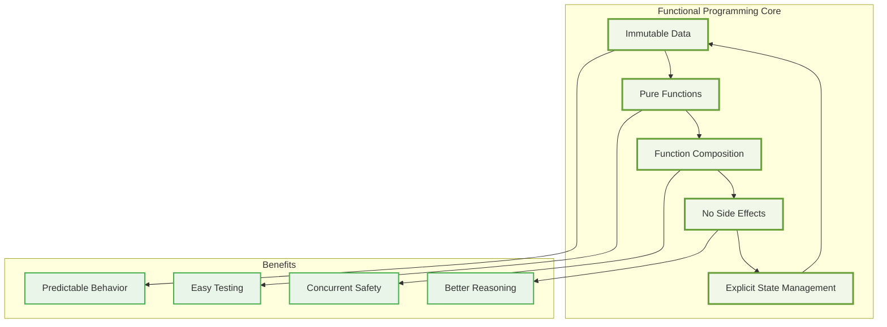
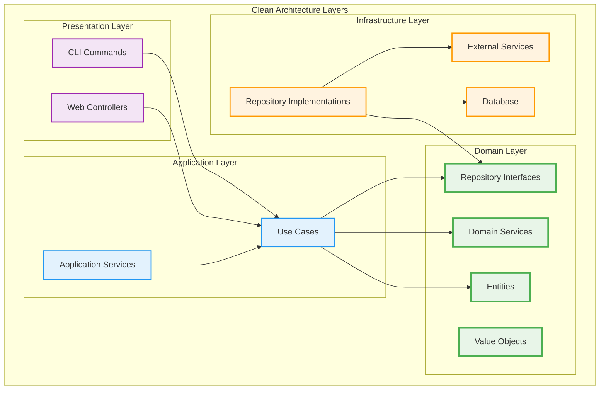
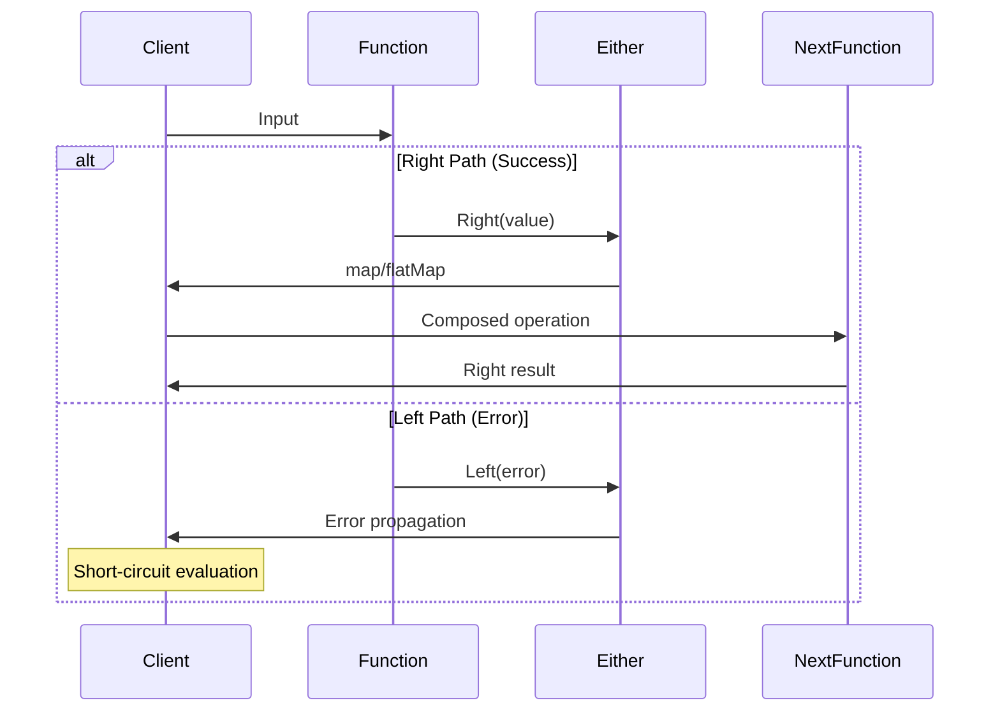
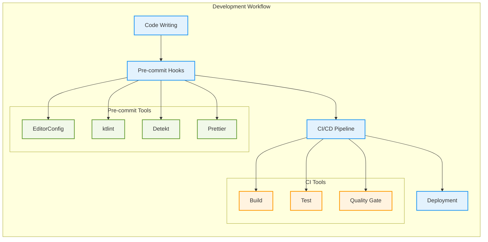
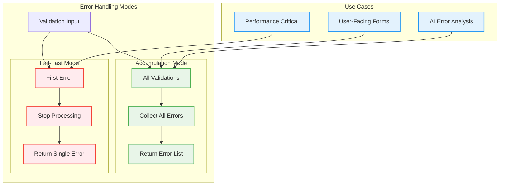

# Coding Standards

This document defines the coding standards and conventions for the Scopes project. These standards are enforced through automated tools and should be followed by all contributors.


## General Principles

### Code Quality Philosophy

1. **Readability First**: Code is read more often than it's written
2. **Functional Purity**: Prefer pure functions and immutable data
3. **Explicit Over Implicit**: Make intentions clear through code
4. **Fail Fast**: Detect errors as early as possible
5. **Single Responsibility**: Each component should have one reason to change

### Language and Communication

- **Code and Comments**: Always in English
- **Documentation**: Follow [Diátaxis framework](../explanation/adr/0006-adopt-diataxis-documentation-framework.md)
- **Commit Messages**: Use conventional commit format

## Kotlin Coding Conventions

### Naming Conventions

#### Classes and Interfaces

```kotlin
// ✅ Good: PascalCase with descriptive names
class ScopeRepository
interface DomainEventHandler
data class CreateScopeRequest
sealed class ValidationError

// ❌ Bad: Abbreviations and unclear names
class ScopeRepo
interface Handler
data class CSReq
sealed class ValErr
```

#### Functions and Variables

```kotlin
// ✅ Good: camelCase with verb-noun pattern
fun createScope(request: CreateScopeRequest): Result<Scope, DomainError>
fun validateScopeTitle(title: String): Result<String, ValidationError>
val currentTimestamp: Instant = Clock.System.now()

// ❌ Bad: Unclear or abbreviated names
fun create(req: Any): Any
fun validate(s: String): Boolean
val ts: Long = System.currentTimeMillis()
```

#### Constants and Enums

```kotlin
// ✅ Good: SCREAMING_SNAKE_CASE for constants
object ScopeConstants {
        const val MAX_TITLE_LENGTH = 200
        const val MIN_TITLE_LENGTH = 1
}

// ✅ Good: PascalCase for enum values
enum class ScopeStatus {
        Active,
        Archived,
        Deleted
}

// ❌ Bad: camelCase for constants
object ScopeConstants {
        const val maxTitleLength = 200
}
```

### File Organization

#### Package Structure

```kotlin
// ✅ Good: Clear package hierarchy
package io.github.kamiazya.scopes.domain.entity
package io.github.kamiazya.scopes.application.usecase
package io.github.kamiazya.scopes.infrastructure.repository.impl

// ❌ Bad: Flat or unclear structure
package io.github.kamiazya.scopes
package io.github.kamiazya.scopes.stuff
```

#### Import Organization

```kotlin
// ✅ Good: Organized imports
import java.time.Instant
import kotlin.collections.List

import kotlinx.coroutines.flow.Flow
import kotlinx.datetime.Clock

import io.github.kamiazya.scopes.domain.entity.Scope
import io.github.kamiazya.scopes.domain.valueobject.ScopeId

// ❌ Bad: Wildcard imports in production code
import kotlin.collections.*
import io.github.kamiazya.scopes.domain.*
```

### Code Formatting

#### Line Length and Wrapping

```kotlin
// ✅ Good: Respect 120 character limit
fun createScopeWithValidation(
        title: String,
        description: String?,
        parentId: ScopeId?
): Result<Scope, ValidationError> = validateInput(title, description)
        .flatMap { createScope(it, parentId) }
        .map { scope -> scope.copy(createdAt = Clock.System.now()) }

// ❌ Bad: Long lines without proper wrapping
fun createScopeWithValidation(title: String, description: String?, parentId: ScopeId?): Result<Scope, ValidationError> = validateInput(title, description).flatMap { createScope(it, parentId) }.map { scope -> scope.copy(createdAt = Clock.System.now()) }
```

#### Function Declarations

```kotlin
// ✅ Good: Expression body for simple functions
fun isValidTitle(title: String): Boolean =
        title.isNotBlank() && title.length <= MAX_TITLE_LENGTH

// ✅ Good: Block body for complex functions
fun createScope(request: CreateScopeRequest): Result<Scope, DomainError> {
        return validateTitle(request.title)
            .flatMap { title ->
                validateParent(request.parentId)
                    .map { _ -> title }
            }
            .map { title ->
                Scope(
                    id = ScopeId.generate(),
                    title = title,
                    description = request.description,
                    parentId = request.parentId,
                    createdAt = Clock.System.now(),
                    updatedAt = Clock.System.now()
                )
            }
}
```

## Functional Programming Standards

### Functional Programming Principles



### Immutability

#### Data Classes

```kotlin
// ✅ Good: Immutable data class
data class Scope(
        val id: ScopeId,
        val title: String,
        val description: String?,
        val parentId: ScopeId?,
        val createdAt: Instant,
        val updatedAt: Instant
) {
        fun updateTitle(newTitle: String): Scope =
            copy(title = newTitle, updatedAt = Clock.System.now())
}

// ❌ Bad: Mutable data class
data class Scope(
        val id: ScopeId,
        var title: String,
        var description: String?
) {
        fun updateTitle(newTitle: String) {
            title = newTitle
        }
}
```

#### Value Objects

```kotlin
// ✅ Good: Immutable value object with inline class
@JvmInline
value class ScopeId private constructor(private val value: String) {
        companion object {
            fun generate(): ScopeId = ScopeId(Ulid.fast().toString())
            fun from(value: String): ScopeId {
                require(Ulid.isValid(value)) { "Invalid ULID format: $value" }
                return ScopeId(value)
            }
        }

        override fun toString(): String = value
}

// ❌ Bad: Mutable value object
class ScopeId {
        var value: String = ""

        fun setValue(newValue: String) {
            value = newValue
        }
}
```

### Pure Functions

#### Function Purity

```kotlin
// ✅ BEST: Pure function with Either for error handling
fun calculateScopeDepth(
        scopeId: ScopeId,
        allScopes: List<Scope>
): Either<ScopeError, Int> = either {
        val scope = allScopes.find { it.id == scopeId }
            ?: raise(ScopeError.NotFound(scopeId))

        tailrec fun calculateDepth(currentScope: Scope?, depth: Int): Int =
            when (currentScope?.parentId) {
                null -> depth
                else -> {
                    val parent = allScopes.find { it.id == currentScope.parentId }
                    calculateDepth(parent, depth + 1)
                }
            }

        ensure(calculateDepth(scope, 0) <= MAX_DEPTH) {
            ScopeError.DepthExceeded
        }

        calculateDepth(scope, 0)
}

// ✅ Good: Pure function - no side effects
fun isValidHierarchy(child: ScopeId, parent: ScopeId): Boolean =
        child != parent

// ❌ Bad: Impure function - has side effects
class ScopeService {
        private val logger = LoggerFactory.getLogger(this::class.java)

        fun calculateScopeDepth(scope: Scope): Int {
            logger.info("Calculating depth for scope: ${scope.id}") // Side effect
            var depth = 0
            var current = scope
            // ... calculation with mutable state
            return depth
        }
}
```

#### Function Composition with Arrow Either

```kotlin
// ✅ BEST: Using either DSL for clean, sequential code
fun createValidatedScope(request: CreateScopeRequest): Either<DomainError, Scope> = either {
        val title = validateTitle(request.title).bind()
        validateDescription(request.description).bind()
        validateParentExists(request.parentId).bind()
        buildScope(title, request.description, request.parentId)
}

// ✅ BEST: Simple functions with either DSL
fun validateInput(input: String): Either<ValidationError, ValidatedInput> = either {
        ensure(input.isNotBlank()) { ValidationError.EmptyInput }
        ensure(input.length <= MAX_LENGTH) { ValidationError.TooLong }
        ValidatedInput(input.trim())
}

// ✅ OK: Using Arrow's combinators for specific cases
fun processScope(id: ScopeId): Either<DomainError, ProcessedScope> =
        findScope(id)
            .flatMap { scope -> validateScope(scope) }
            .map { validScope -> transform(validScope) }
            .mapLeft { error -> enrichError(error) }

// 📌 GUIDELINE: Prefer either DSL for most cases
// - Use `either { ... }` for sequential operations
// - Use `ensure` for validations within either blocks
// - Use `bind()` to unwrap Either values
// - Avoid nested flatMap chains when either DSL is clearer
```

### Sealed Classes for Domain Modeling

```kotlin
// ✅ Good: Sealed classes for domain states
sealed class ScopeCommand {
        data class CreateScope(
            val title: String,
            val description: String?,
            val parentId: ScopeId?
        ) : ScopeCommand()

        data class UpdateScope(
            val id: ScopeId,
            val title: String?,
            val description: String?
        ) : ScopeCommand()

        data class ArchiveScope(val id: ScopeId) : ScopeCommand()
}

sealed class ScopeEvent {
        data class ScopeCreated(val scope: Scope) : ScopeEvent()
        data class ScopeUpdated(val scope: Scope) : ScopeEvent()
        data class ScopeArchived(val scopeId: ScopeId) : ScopeEvent()
}

// Pattern matching with when expressions
fun handleCommand(command: ScopeCommand): Result<ScopeEvent, DomainError> =
        when (command) {
            is ScopeCommand.CreateScope -> createScope(command)
            is ScopeCommand.UpdateScope -> updateScope(command)
            is ScopeCommand.ArchiveScope -> archiveScope(command)
        }
```

## Architecture Patterns

### Clean Architecture Overview



### Clean Architecture Layer Separation

#### Domain Layer

```kotlin
// ✅ Good: Domain entity with business logic
data class Scope(
        val id: ScopeId,
        val title: String,
        val description: String?,
        val parentId: ScopeId?,
        val createdAt: Instant,
        val updatedAt: Instant
) {
        fun isChildOf(potentialParent: Scope): Boolean =
            parentId == potentialParent.id

        fun canBeParentOf(potentialChild: Scope): Boolean =
            potentialChild.parentId != id && id != potentialChild.id
}

// ✅ Good: Repository interface with Arrow Either, Option, and Flow
interface ScopeRepository {
        suspend fun findById(id: ScopeId): Either<RepositoryError, Option<Scope>>
        suspend fun findByParentId(parentId: ScopeId): Either<RepositoryError, Flow<Scope>>
        suspend fun findAll(): Either<RepositoryError, Flow<Scope>>
        suspend fun save(scope: Scope): Either<RepositoryError, Scope>
        suspend fun delete(id: ScopeId): Either<RepositoryError, Unit>
}
```

#### Application Layer

```kotlin
// ✅ Good: Use case with single responsibility and Arrow Either
class CreateScopeUseCase(
        private val scopeRepository: ScopeRepository,
        private val eventPublisher: DomainEventPublisher
) {
        suspend fun execute(request: CreateScopeRequest): Either<ApplicationError, CreateScopeResponse> = either {
            val validRequest = validateRequest(request)
                .mapLeft { ApplicationError.DomainError(it) }
                .bind()

            val scope = createScope(validRequest).bind()
            val savedScope = saveScope(scope).bind()

            publishEvent(ScopeCreated(savedScope))
            CreateScopeResponse(savedScope)
        }

        private fun validateRequest(request: CreateScopeRequest): Either<DomainError, CreateScopeRequest> = either {
            ensure(request.title.isNotBlank()) {
                DomainError.InvalidTitle("Title cannot be blank")
            }
            ensure(request.title.length <= MAX_TITLE_LENGTH) {
                DomainError.InvalidTitle("Title too long")
            }
            request
        }
}
```

### Dependency Injection Patterns

```kotlin
// ✅ Good: Constructor injection with interfaces
class ScopeService(
        private val scopeRepository: ScopeRepository,
        private val validationService: ScopeValidationService,
        private val eventPublisher: DomainEventPublisher
) {
        suspend fun createScope(request: CreateScopeRequest): Either<ApplicationError, Scope> = either {
            // Implementation using Either DSL
            val validRequest = validationService.validate(request).bind()
            val scope = Scope.create(validRequest).bind()
            scopeRepository.save(scope).bind()
        }
}

// ✅ Good: Factory pattern for complex construction
object ScopeServiceFactory {
        fun create(
            repository: ScopeRepository,
            publisher: DomainEventPublisher
        ): ScopeService = ScopeService(
            scopeRepository = repository,
            validationService = ScopeValidationService,
            eventPublisher = publisher
        )
}
```

## Error Handling

### Arrow Either Pattern



### Arrow Either Implementation

```kotlin
// ✅ BEST: Arrow Either with DSL for explicit error handling
import arrow.core.Either
import arrow.core.raise.either
import arrow.core.raise.ensure

// Simple validation with either DSL
fun validateAge(age: Int): Either<ValidationError, Age> = either {
        ensure(age >= 0) { ValidationError.NegativeAge }
        ensure(age <= 150) { ValidationError.UnrealisticAge }
        Age(age)
}

// Composing multiple operations
fun registerUser(request: RegistrationRequest): Either<RegistrationError, User> = either {
        val email = validateEmail(request.email).bind()
        val age = validateAge(request.age).bind()
        val username = checkUsernameAvailable(request.username).bind()

        createUser(email, age, username)
}

// Handling results with fold
fun handleRegistration(request: RegistrationRequest) {
        registerUser(request).fold(
            ifLeft = { error -> showError(error) },
            ifRight = { user -> showSuccess(user) }
        )
}

// 📌 PATTERNS TO FOLLOW:
// 1. Use `= either { ... }` for function bodies
// 2. Use `ensure` for simple validations
// 3. Use `.bind()` to unwrap Either values
// 4. Keep either blocks focused and readable
```

### Error Hierarchy

```kotlin
// ✅ Good: Structured error hierarchy
sealed class DomainError {
        data class ValidationError(val field: String, val message: String) : DomainError()
        data class BusinessRuleViolation(val rule: String, val context: String) : DomainError()
        object ScopeNotFound : DomainError()
        data class InvalidParentScope(val parentId: ScopeId, val reason: String) : DomainError()
}

sealed class ApplicationError {
        data class DomainError(val error: io.github.kamiazya.scopes.domain.DomainError) : ApplicationError()
        data class InfrastructureError(val message: String, val cause: Throwable? = null) : ApplicationError()
        data class AuthorizationError(val operation: String) : ApplicationError()
}

sealed class RepositoryError {
        data class ConnectionError(val cause: Throwable) : RepositoryError()
        data class DataIntegrityError(val message: String) : RepositoryError()
        object NotFound : RepositoryError()
        data class ConflictError(val conflictingId: String) : RepositoryError()
}
```

### Error Handling Patterns

```kotlin
// ✅ Good: Railway-oriented programming with Arrow Either
suspend fun processScopeCreation(request: CreateScopeRequest): Either<ApplicationError, ScopeCreated> = either {
        val validRequest = validateRequest(request)
            .mapLeft { ApplicationError.DomainError(it) }
            .bind()

        checkParentExists(validRequest.parentId).bind()

        val scope = createScopeEntity(request).bind()
        val savedScope = saveScope(scope).bind()

        ScopeCreated(savedScope)
}

// ✅ Good: Alternative with explicit steps
suspend fun processScopeCreation(request: CreateScopeRequest): Either<ApplicationError, ScopeCreated> =
        validateRequest(request)
            .flatMap { validRequest -> checkParentExists(validRequest.parentId) }
            .flatMap { createScopeEntity(request) }
            .flatMap { scope -> saveScope(scope) }
            .map { savedScope -> ScopeCreated(savedScope) }
            .mapLeft { domainError -> ApplicationError.DomainError(domainError) }

// ❌ Bad: Exception-based error handling
suspend fun processScopeCreation(request: CreateScopeRequest): ScopeCreated {
        if (request.title.isBlank()) {
            throw ValidationException("Title cannot be blank")
        }

        val scope = createScopeEntity(request)
        return try {
            val savedScope = saveScope(scope)
            ScopeCreated(savedScope)
        } catch (e: RepositoryException) {
            throw ApplicationException("Failed to save scope", e)
        }
}
```

## Testing Standards

### Test Structure with Kotest

```kotlin
// ✅ Good: Kotest FunSpec with descriptive test names
class CreateScopeUseCaseTest : FunSpec({
        context("CreateScopeUseCase") {
            test("should create scope successfully with valid request") {
                // Given
                val request = CreateScopeRequest(
                    title = "Valid Scope Title",
                    description = "Valid description",
                    parentId = null
                )

                val mockRepository = mockk<ScopeRepository>()
                val mockPublisher = mockk<DomainEventPublisher>()

                every { mockRepository.save(any()) } returns Either.Right(
                    Scope(
                        id = ScopeId.generate(),
                        title = request.title,
                        description = request.description,
                        parentId = null,
                        createdAt = Clock.System.now(),
                        updatedAt = Clock.System.now()
                    )
                )

                val useCase = CreateScopeUseCase(mockRepository, mockPublisher)

                // When
                val result = runBlocking { useCase.execute(request) }

                // Then
                result.isRight() shouldBe true
                verify { mockRepository.save(any()) }
            }

            test("should fail when title is blank") {
                // Given
                val request = CreateScopeRequest(title = "", description = null, parentId = null)
                val useCase = CreateScopeUseCase(mockk(), mockk())

                // When
                val result = runBlocking { useCase.execute(request) }

                // Then
                result.isLeft() shouldBe true
                result.fold(
                    ifLeft = { error ->
                        error shouldBe instanceOf<ApplicationError.DomainError>()
                    },
                    ifRight = { fail("Expected Left but got Right") }
                )
            }
        }
})
```

### Property-Based Testing

```kotlin
// ✅ Good: Property-based testing with Kotest
class ScopeIdTest : FunSpec({
        test("generated ScopeIds should always be unique") {
            checkAll(iterations = 1000) {
                val id1 = ScopeId.generate()
                val id2 = ScopeId.generate()
                id1 shouldNotBe id2
            }
        }

        test("ScopeId.from should round-trip correctly") {
            checkAll<String> { validUlid ->
                assume(Ulid.isValid(validUlid))

                val scopeId = ScopeId.from(validUlid)
                val stringRepresentation = scopeId.toString()
                val reconstructed = ScopeId.from(stringRepresentation)

                reconstructed shouldBe scopeId
            }
        }
})
```

### Mock Usage Guidelines

```kotlin
// ✅ Good: Focused mocking with clear behavior
class ScopeServiceTest : FunSpec({
        test("should handle repository failure gracefully") {
            val mockRepository = mockk<ScopeRepository>()
            val service = ScopeService(mockRepository)

            // Mock specific behavior
            every { mockRepository.save(any()) } returns Either.Left(
                RepositoryError.ConnectionError(Exception("Database unavailable"))
            )

            val result = runBlocking {
                service.createScope(CreateScopeRequest("Test", null, null))
            }

            result.isLeft() shouldBe true
            verify(exactly = 1) { mockRepository.save(any()) }
        }
})

// ❌ Bad: Over-mocking and unclear test intentions
class ScopeServiceTest : FunSpec({
        test("should work") {
            val mockRepo = mockk<ScopeRepository>()
            val mockValidator = mockk<ScopeValidator>()
            val mockPublisher = mockk<EventPublisher>()
            val mockLogger = mockk<Logger>()

            every { mockRepo.save(any()) } returns mockk()
            every { mockValidator.validate(any()) } returns true
            every { mockPublisher.publish(any()) } just Runs
            every { mockLogger.info(any()) } just Runs

            // Test becomes unclear due to excessive mocking
        }
})
```

## Documentation Standards

### KDoc Comments

~~~kotlin
// ✅ Good: Comprehensive KDoc with examples
/**
 * Creates a scope with the provided information.
 *
 * This function validates the input, creates a scope entity with a generated ULID,
 * and returns a Result indicating success or failure.
 *
 * @param title The scope title, must be non-blank and <= 200 characters
 * @param description Optional description for the scope
 * @param parentId Optional parent scope identifier for hierarchical organization
 * @return Result containing the created Scope on success, or DomainError on failure
 *
 * @throws IllegalArgumentException if title is blank (in validation layer)
 *
 * @sample
 * ```kotlin
 * val result = createScope(
 *     title = "Project Planning",
 *     description = "Planning phase for project",
 *     parentId = ScopeId.from("01ARZ3NDEKTSV4RRFFQ69G5FAV")
 * )
 *
 * when (result) {
 *     is Result.Success -> println("Created scope: ${result.value.id}")
 *     is Result.Failure -> println("Error: ${result.error}")
 * }
 * ```
 */
fun createScope(
        title: String,
        description: String?,
        parentId: ScopeId?
): Result<Scope, DomainError>
~~~

### Code Comments

~~~kotlin
// ✅ Good: Comments explain "why", not "what"
fun calculateScopeDepth(scope: Scope, allScopes: List<Scope>): Int {
        // Use tail recursion to prevent stack overflow for deeply nested hierarchies
        tailrec fun calculateDepthRecursive(currentId: ScopeId?, depth: Int): Int =
            when (currentId) {
                null -> depth
                else -> {
                    val parent = allScopes.find { it.id == currentId }?.parentId
                    calculateDepthRecursive(parent, depth + 1)
                }
            }

        return calculateDepthRecursive(scope.parentId, 0)
}

// ❌ Bad: Comments that restate the code
fun calculateScopeDepth(scope: Scope, allScopes: List<Scope>): Int {
        // Declare a recursive function
        tailrec fun calculateDepthRecursive(currentId: ScopeId?, depth: Int): Int =
            // Check if currentId is null
            when (currentId) {
                // If null, return depth
                null -> depth
                // Otherwise, find parent and recurse
                else -> {
                    val parent = allScopes.find { it.id == currentId }?.parentId
                    calculateDepthRecursive(parent, depth + 1)
                }
            }

        // Call the recursive function with scope's parent ID and depth 0
        return calculateDepthRecursive(scope.parentId, 0)
}
~~~

## Tool Configuration

### Quality Tools Integration



### EditorConfig

Our `.editorconfig` enforces:

```ini
root = true

[*]
charset = utf-8
end_of_line = lf
indent_style = space
indent_size = 4
insert_final_newline = true
trim_trailing_whitespace = true

[*.md]
trim_trailing_whitespace = false

[*.yml,*.yaml]
indent_size = 2
```

### Detekt Rules

Key enforced rules from `detekt.yml`:

- **MaxLineLength**: 120 characters
- **FunctionMaxLength**: 60 lines
- **ComplexInterface**: Max 10 members
- **CyclomaticComplexMethod**: Max complexity 15
- **ReturnCount**: Max 2 returns per function
- **TooManyFunctions**: Max 11 functions per class

### Ktlint Configuration

In `build.gradle.kts`:

```kotlin
ktlint {
        version.set("1.5.0")
        outputToConsole.set(true)
        coloredOutput.set(true)
        verbose.set(true)
        android.set(false)
        ignoreFailures.set(false)

        filter {
            exclude("**/generated/**")
            include("**/src/**/*.kt")
        }
}
```

## Enforcement

### Pre-commit Hooks

All standards are enforced through lefthook:

```yaml
# lefthook.yml
pre-commit:
    commands:
        format-markdown:
          glob: "*.md"
          run: docker run --rm -v "${PWD}:/work" tmknom/prettier --write {staged_files}

        check-editorconfig:
          run: docker run --rm -v "${PWD}:/check" mstruebing/editorconfig-checker

        ktlint:
          glob: "*.kt"
          run: ./gradlew ktlintCheck

        detekt:
          run: ./gradlew detekt

        test:
          run: ./gradlew test
```

### CI/CD Integration

GitHub Actions verify all standards:

```yaml
- name: Run code quality checks
    run: |
        ./gradlew ktlintCheck
        ./gradlew detekt
        ./gradlew test
```

### IDE Integration

Recommended IntelliJ IDEA plugins:
- **Detekt**: Real-time static analysis
- **EditorConfig**: Automatic formatting
- **Kotest**: Enhanced test support

## Functional DDD

### Overview

Functional Domain-Driven Design combines DDD principles with functional programming patterns. In the Scopes project, we use Arrow for comprehensive error handling, with rich domain models, value objects, and suggestion-based error recovery.

### Core Functional DDD Principles

1. **Rich Domain Models**: Entities contain business logic and use value objects for validation
2. **Value Objects for Validation**: Encapsulate validation logic within value objects
3. **Pure Domain Logic**: Domain services contain only pure functions without repository dependencies  
4. **Explicit Error Handling**: Use Arrow's typed errors with suggestion-based recovery
5. **Clean Architecture Compliance**: Maintain proper dependency directions
6. **Functional Composition**: Build complex operations from simple, composable functions

### Error Accumulation Architecture



### Rich Domain Model with Value Objects

#### Value Objects for Validation

```kotlin
// ✅ Good: Value objects with embedded validation
@JvmInline
value class ScopeTitle private constructor(private val value: String) {
    companion object {
        fun create(title: String): Either<DomainError.ValidationError, ScopeTitle> = either {
            ensure(title.isNotBlank()) { DomainError.ValidationError.EmptyTitle }
            ensure(title.length <= 200) { DomainError.ValidationError.TitleTooLong(200, title.length) }
            ensure(!title.contains('\n')) { DomainError.ValidationError.TitleContainsNewline }
            ScopeTitle(title.trim())
        }
    }
    
    override fun toString(): String = value
}

@JvmInline
value class ScopeDescription private constructor(private val value: String) {
    companion object {
        fun create(description: String?): Either<DomainError.ValidationError, ScopeDescription?> = either {
            when {
                description.isNullOrBlank() -> null
                description.length > 1000 -> raise(DomainError.ValidationError.DescriptionTooLong(1000, description.length))
                else -> ScopeDescription(description.trim())
            }
        }
    }
    
    override fun toString(): String = value
}
```

#### Rich Domain Entity

```kotlin
// ✅ Good: Rich domain entity using value objects
@Serializable
data class Scope(
    val id: ScopeId,
    val title: ScopeTitle,
    val description: ScopeDescription? = null,
    val parentId: ScopeId? = null,
    val createdAt: Instant,
    val updatedAt: Instant,
    val metadata: Map<String, String> = emptyMap(),
) {
    companion object {
        /**
         * Create a new scope with generated timestamps.
         * This is the safe factory method that validates input.
         * Note: Only performs value object validation (title, description).
         * Repository-dependent validations (hierarchy, uniqueness) are done in the application layer.
         */
        fun create(
            title: String,
            description: String? = null,
            parentId: ScopeId? = null,
            metadata: Map<String, String> = emptyMap()
        ): Either<DomainError.ValidationError, Scope> = either {
            val validatedTitle = ScopeTitle.create(title).bind()
            val validatedDescription = ScopeDescription.create(description).bind()

            val now = Clock.System.now()
            Scope(
                id = ScopeId.generate(),
                title = validatedTitle,
                description = validatedDescription,
                parentId = parentId,
                createdAt = now,
                updatedAt = now,
                metadata = metadata
            )
        }
    }
    
    /**
     * Update the scope title with new timestamp.
     * Pure function that returns a new instance.
     */
    fun updateTitle(newTitle: String): Either<DomainError.ValidationError, Scope> = either {
        val validatedTitle = ScopeTitle.create(newTitle).bind()
        copy(title = validatedTitle, updatedAt = Clock.System.now())
    }
    
    /**
     * Update the scope description with new timestamp.
     * Pure function that returns a new instance.
     */
    fun updateDescription(newDescription: String?): Either<DomainError.ValidationError, Scope> = either {
        val validatedDescription = ScopeDescription.create(newDescription).bind()
        copy(description = validatedDescription, updatedAt = Clock.System.now())
    }
    
    /**
     * Business rule: Check if this scope can be a parent of another scope.
     * Prevents circular references and self-parenting.
     */
    fun canBeParentOf(childScope: Scope): Boolean =
        id != childScope.id && childScope.parentId != id
    
    /**
     * Check if this scope is a child of the specified parent.
     */
    fun isChildOf(potentialParent: Scope): Boolean =
        parentId == potentialParent.id
    
    /**
     * Check if this scope is a root scope (no parent).
     */
    fun isRoot(): Boolean = parentId == null
}
```

### Clean Architecture with Domain Services

Maintain proper dependency directions by separating repository-dependent validations:

```kotlin
// 1. Pure Domain Validation - Value Objects with Self-Validation

/**
 * Value object representing a scope title with embedded validation.
 * Encapsulates the business rules for scope titles following DDD principles.
 * No repository dependencies - pure domain logic.
 */
@JvmInline
value class ScopeTitle private constructor(val value: String) {
    companion object {
        const val MAX_LENGTH = 200
        const val MIN_LENGTH = 1

        /**
         * Create a validated ScopeTitle from a string.
         * Returns Either with domain error or valid ScopeTitle.
         */
        fun create(title: String): Either<DomainError.ScopeValidationError, ScopeTitle> = either {
            val trimmedTitle = title.trim()

            ensure(trimmedTitle.isNotBlank()) { DomainError.ScopeValidationError.EmptyScopeTitle }
            ensure(trimmedTitle.length >= MIN_LENGTH) { DomainError.ScopeValidationError.ScopeTitleTooShort }
            ensure(trimmedTitle.length <= MAX_LENGTH) {
                DomainError.ScopeValidationError.ScopeTitleTooLong(MAX_LENGTH, trimmedTitle.length)
            }
            ensure(!trimmedTitle.contains('\n') && !trimmedTitle.contains('\r')) {
                DomainError.ScopeValidationError.ScopeTitleContainsNewline
            }

            ScopeTitle(trimmedTitle)
        }
    }
}

/**
 * Value object for scope descriptions with length validation.
 * Nullable to represent optional descriptions.
 */
@JvmInline
value class ScopeDescription private constructor(val value: String) {
    companion object {
        const val MAX_LENGTH = 1000

        fun create(description: String?): Either<DomainError.ScopeValidationError, ScopeDescription?> = either {
            when (description) {
                null -> null
                else -> {
                    val trimmed = description.trim()
                    if (trimmed.isEmpty()) {
                        null
                    } else {
                        ensure(trimmed.length <= MAX_LENGTH) {
                            DomainError.ScopeValidationError.ScopeDescriptionTooLong(MAX_LENGTH, trimmed.length)
                        }
                        ScopeDescription(trimmed)
                    }
                }
            }
        }
    }
}

// 2. Application Layer Validation - Repository-Dependent Business Rules

/**
 * Application service for repository-dependent scope validation logic.
 * Contains validation methods that require repository access,
 * maintaining proper domain layer isolation.
 */
class ApplicationScopeValidationService(
    private val repository: ScopeRepository
) {
    companion object {
        const val MAX_HIERARCHY_DEPTH = 10
        const val MAX_CHILDREN_PER_PARENT = 100
    }

    /**
     * Convert Either results to ValidationResult for error accumulation.
     */
    private fun <E : DomainError, T> Either<E, T>.toValidationResult(): ValidationResult<T> =
        fold({ it.validationFailure() }, { it.validationSuccess() })

    /**
     * Comprehensive validation for scope creation using accumulating ValidationResult.
     * Combines both domain validation (value objects) and application validation (repository).
     */
    suspend fun validateScopeCreation(
        title: String,
        description: String?,
        parentId: ScopeId?
    ): ValidationResult<Unit> {
        val validations = listOf(
            // Domain validation - no repository access
            ScopeTitle.create(title).toValidationResult().map { },
            ScopeDescription.create(description).toValidationResult().map { },
            
            // Application validation - requires repository
            validateHierarchyDepth(parentId).toValidationResult(),
            validateChildrenLimit(parentId).toValidationResult(),
            validateTitleUniqueness(title, parentId).toValidationResult()
        )

        return validations.sequence().map { }
    }

    /**
     * Validate hierarchy depth using repository query.
     * Returns Either for composition with other validations.
     */
    suspend fun validateHierarchyDepth(parentId: ScopeId?): Either<DomainError, Unit> = either {
        if (parentId == null) return@either

        val depth = repository.findHierarchyDepth(parentId)
            .mapLeft { DomainError.InfrastructureError(it) }
            .bind()

        ensure(depth < MAX_HIERARCHY_DEPTH) {
            DomainError.ScopeBusinessRuleViolation.ScopeMaxDepthExceeded(MAX_HIERARCHY_DEPTH, depth + 1)
        }
    }

    /**
     * Validate children limit using repository query.
     */
    suspend fun validateChildrenLimit(parentId: ScopeId?): Either<DomainError, Unit> = either {
        if (parentId == null) return@either

        val childrenCount = repository.countByParentId(parentId)
            .mapLeft { DomainError.InfrastructureError(it) }
            .bind()

        ensure(childrenCount < MAX_CHILDREN_PER_PARENT) {
            DomainError.ScopeBusinessRuleViolation.ScopeMaxChildrenExceeded(MAX_CHILDREN_PER_PARENT, childrenCount + 1)
        }
    }

    /**
     * Validate title uniqueness using repository query.
     */
    suspend fun validateTitleUniqueness(title: String, parentId: ScopeId?): Either<DomainError, Unit> = either {
        val normalizedTitle = TitleNormalizer.normalize(title)
        val duplicateExists = repository.existsByParentIdAndTitle(parentId, normalizedTitle)
            .mapLeft { DomainError.InfrastructureError(it) }
            .bind()

        ensure(!duplicateExists) {
            DomainError.ScopeBusinessRuleViolation.ScopeDuplicateTitle(title, parentId)
        }
    }
}
```

**Key Architecture Principles:**

1. **Domain Layer Isolation**: Value objects handle their own validation without repository dependencies
2. **Application Layer Coordination**: Repository-dependent validations live in application services
3. **Error Accumulation**: ValidationResult accumulates multiple errors, Either provides single error for composition
4. **Clean Separation**: Domain validation (pure) vs. application validation (repository-dependent)

### Suggestion-Based Error Recovery

Provide helpful suggestions without automatic modifications:

```kotlin
/**
 * Service for suggesting fixes to validation errors.
 */
object ErrorSuggestionService {
    
    /**
     * Get suggestion for fixing validation error.
     */
    fun suggestFix(error: DomainError.ValidationError): ErrorSuggestion? = when (error) {
        is DomainError.ValidationError.EmptyTitle -> 
            ErrorSuggestion.ReplaceValue("Untitled Scope", "Set a default title?")
            
        is DomainError.ValidationError.TitleTooLong -> 
            ErrorSuggestion.TruncateValue(
                error.actual.take(197) + "...", 
                "Truncate to 200 characters?"
            )
            
        is DomainError.ValidationError.DescriptionTooLong -> 
            ErrorSuggestion.TruncateValue(
                error.actual.take(997) + "...",
                "Truncate to 1000 characters?"
            )
            
        is DomainError.ValidationError.TitleContainsNewline -> 
            ErrorSuggestion.ReplaceValue(
                error.actual.replace('\n', ' '),
                "Replace newlines with spaces?"
            )
            
        else -> null
    }
    
    /**
     * Get suggestions for duplicate title errors.
     */
    fun suggestUniqueTitle(originalTitle: String, existingTitles: Set<String>): List<String> {
        val suggestions = mutableListOf<String>()
        
        // Try numbered variants
        for (i in 1..5) {
            val candidate = "$originalTitle ($i)"
            if (candidate !in existingTitles) {
                suggestions.add(candidate)
            }
        }
        
        // Try prefixed variants
        listOf("New ", "Draft ", "Copy of ").forEach { prefix ->
            val candidate = "$prefix$originalTitle"
            if (candidate !in existingTitles && candidate.length <= 200) {
                suggestions.add(candidate)
            }
        }
        
        return suggestions.take(3)
    }
}

sealed class ErrorSuggestion {
    abstract val description: String
    abstract val userConsent: Boolean
    
    data class ReplaceValue(
        val suggestedValue: String,
        override val description: String,
        override val userConsent: Boolean = false
    ) : ErrorSuggestion()
    
    data class TruncateValue(
        val truncatedValue: String,
        override val description: String,
        override val userConsent: Boolean = false  
    ) : ErrorSuggestion()
}
```

### Application Layer Integration

Integrate rich domain models with clean architecture:

```kotlin
/**
 * Create scope use case with rich domain model integration.
 */
class CreateScopeUseCase(
    private val scopeRepository: ScopeRepository
) {
    
    /**
     * Execute create scope request with error accumulation by default.
     */
    suspend fun execute(request: CreateScopeRequest): Either<ApplicationError, CreateScopeResponse> = either {
        // Check parent exists (this is a prerequisite for other validations)
        checkParentExists(request.parentId).bind()

        // Perform repository-dependent validations (hierarchy depth, children limit, title uniqueness)
        // These validations require repository access and cannot be done in Scope.create
        validateScopeCreationConsolidated(request).bind()

        // Create and save the scope entity
        val scope = createScopeEntity(request).bind()
        val savedScope = saveScopeEntity(scope).bind()
        CreateScopeResponse(savedScope)
    }
    
    /**
     * Validates repository-dependent business rules that cannot be checked in Scope.create.
     * These include hierarchy depth, children limit, and title uniqueness within parent scope.
     */
    private suspend fun validateScopeCreationConsolidated(
        request: CreateScopeRequest
    ): Either<ApplicationError, Unit> {
        // Use ScopeValidationService for repository-dependent validations
        val validationResult = applicationScopeValidationService.validateScopeCreation(
    request.title,
    request.description,
    request.parentId
            scopeRepository
        )

        return ApplicationError.fromValidationResult(validationResult)
    }
    
    private fun createScopeEntity(request: CreateScopeRequest): Either<ApplicationError, Scope> = either {
        // Use the public factory method which includes validation
        val scope = Scope.create(
            title = request.title,
            description = request.description,
            parentId = request.parentId,
            metadata = request.metadata
        ).mapLeft { ApplicationError.Domain(it) }
            .bind()
        scope
    }
}

/**
 * Enhanced application error types supporting error accumulation.
 */
sealed class ApplicationError {
    data class Domain(val cause: DomainError) : ApplicationError()
    data class ValidationFailure(val errors: NonEmptyList<DomainError>) : ApplicationError()
    data class Repository(val cause: RepositoryError) : ApplicationError()
    data class Infrastructure(val message: String, val cause: Throwable? = null) : ApplicationError()
}
```

### Testing Rich Domain Models

Focus on behavior rather than implementation details:

```kotlin
/**
 * Behavior-focused tests for rich domain models.
 */
class ScopeTest : StringSpec({
    
    "users can create new projects to organize their work and track progress" {
        // Given a user wants to start organizing a new project
        val hierarchyContext = HierarchyContext.empty()
        
        // When they create a scope with valid information
        val result = Scope.create(
            title = "Website Redesign Project",
            description = "Complete overhaul of company website with modern UX",
            parentId = null,
            hierarchyContext = hierarchyContext
        )
        
        // Then they can successfully start organizing their work
        result.shouldBeRight { scope ->
            scope.title.toString() shouldBe "Website Redesign Project"
            scope.description?.toString() shouldBe "Complete overhaul of company website with modern UX"
            scope.parentId shouldBe null
        }
    }
    
    "system prevents creating projects without proper titles to maintain organization clarity" {
        // Given a user tries to create a project without specifying what it's for
        val hierarchyContext = HierarchyContext.empty()
        
        // When they attempt to create a scope with an empty title
        val result = Scope.create("", null, null, hierarchyContext)
        
        // Then the system guides them to provide meaningful project identification
        result.shouldBeLeft { errors ->
            errors shouldContain DomainError.ValidationError.EmptyTitle
        }
    }
    
    "system collects all issues when users provide invalid project information" {
        // Given a user provides multiple invalid inputs while setting up their project
        val hierarchyContext = HierarchyContext.empty()
        
        // When they submit information that violates multiple business rules
        val result = Scope.create(
            title = "", // No clear project identification
            description = "x".repeat(1001), // Excessive description affecting readability
            parentId = null,
            hierarchyContext = hierarchyContext
        )
        
        // Then the system provides comprehensive feedback about all issues
        result.shouldBeLeft { errors ->
            errors.size shouldBeGreaterThan 1
            errors shouldContain DomainError.ValidationError.EmptyTitle
            errors.any { it is DomainError.ValidationError.DescriptionTooLong } shouldBe true
        }
    }
})
```

### Documentation Structure Guidelines

Following the Diátaxis framework, organize functional DDD documentation as:

#### 1. Tutorials (Learning-Oriented)
- **Getting Started with Error Accumulation**: Basic concepts and simple examples
- **Building Dual-Mode Validators**: Step-by-step validator creation
- **Error Recovery Fundamentals**: Basic recovery strategies
- **Migrating to Functional DDD**: Converting existing code

#### 2. How-to Guides (Task-Oriented)
- **How to Implement Validation Accumulation**: Concrete implementation steps
- **How to Handle Async Validation**: Parallel validation patterns
- **How to Customize Error Messages**: Localization and formatting
- **How to Optimize Validation Performance**: Performance strategies
- **How to Test Error Accumulation**: Testing patterns and utilities

#### 3. Reference (Information-Oriented)
- **Validation API Reference**: Complete API documentation
- **Error Types Reference**: All error types and structures
- **ValidationContext Reference**: Configuration options
- **Recovery Utilities Reference**: Recovery functions and patterns

#### 4. Explanation (Understanding-Oriented)
- **Functional DDD Principles**: Core concepts and philosophy
- **Error Accumulation Patterns**: Design patterns and trade-offs
- **Performance Considerations**: When to use each mode
- **Testing Philosophy**: Testing strategies for functional code

## Arrow Core Best Practices

### Arrow Either Quick Reference with Error Accumulation

```kotlin
// 1. ALWAYS prefer either DSL for functions
fun doSomething(input: String): Either<Error, Result> = either {
        // validations, operations, transformations
}

// 2. Use ensure for validations
ensure(condition) { Error.Reason }

// 3. Use bind() to unwrap Either values
val result = someOperation().bind()

// 4. Use raise() for early returns with errors
if (badCondition) raise(Error.BadCondition)

// 5. Keep either blocks simple and readable
fun process(data: Data): Either<Error, ProcessedData> = either {
        val validated = validate(data).bind()
        val transformed = transform(validated).bind()
        save(transformed).bind()
}

// 6. Use zipOrAccumulate for error accumulation
fun validateMultipleFields(request: Request): Either<NonEmptyList<ValidationError>, ValidatedRequest> = either {
    zipOrAccumulate(
        { validateField1(request.field1) },
        { validateField2(request.field2) },
        { validateField3(request.field3) }
    ) { field1, field2, field3 ->
        ValidatedRequest(field1, field2, field3)
    }.bind()
}

// 7. Bridge pattern for compatibility
fun ValidationResult<E, A>.toEither(): Either<E, A> = when (this) {
    is ValidationResult.Success -> value.right()
    is ValidationResult.Failure -> when {
        errors.size == 1 -> errors.head.left()
        else -> DomainError.aggregate(errors, context?.operation).left()
    }
}
```

### Arrow Option Quick Reference

```kotlin
// 1. Use Option instead of nullable types for better composition
fun findUser(id: UserId): Either<RepositoryError, Option<User>> = either {
        userDb.find(id)?.some() ?: none()
}

// 2. Use fold for handling both cases
fun processUser(userOption: Option<User>): String =
    userOption.fold(
        ifEmpty = { "No user found" },
        ifSome = { user -> "Processing ${user.name}" }
    )

// 3. Use map for transformations
fun getUserName(userOption: Option<User>): Option<String> =
    userOption.map { it.name }

// 4. Use getOrElse for default values
fun getUserDisplayName(userOption: Option<User>): String =
    userOption.map { it.name }.getOrElse { "Anonymous" }

// 5. Chain operations with flatMap
fun getUserEmail(userOption: Option<User>): Option<Email> =
    userOption.flatMap { it.email }
```

### Kotlin Flow Quick Reference

```kotlin
// 1. Return Flow from repository methods for collections
suspend fun findAllScopes(): Either<RepositoryError, Flow<Scope>> = either {
    database.getAllScopes().asFlow()
}

// 2. Use Flow for streaming operations
suspend fun processAllScopes(): Either<ApplicationError, Unit> = either {
    val scopesFlow = scopeRepository.findAll().bind()
    scopesFlow
        .filter { it.isActive }
        .map { process(it) }
        .collect { result -> handleResult(result) }
}

// 3. Convert to List when needed
suspend fun getScopeList(): Either<RepositoryError, List<Scope>> = either {
    val scopesFlow = scopeRepository.findAll().bind()
    scopesFlow.toList()
}

// 4. Use Flow for reactive UI updates
fun observeScopes(): Flow<List<Scope>> =
    scopeRepository.findAll()
        .fold(
            ifLeft = { emptyFlow() },
            ifRight = { flow -> flow.map { listOf(it) } }
        )
```

### Common Functional DDD Patterns

```kotlin
// Repository pattern with Option
suspend fun findById(id: EntityId): Either<RepositoryError, Option<Entity>> = either {
        try {
            database.find(id)?.some() ?: none()
        } catch (e: Exception) {
            raise(RepositoryError.FindFailed(e))
        }
}

// Repository pattern with Flow
suspend fun findAll(): Either<RepositoryError, Flow<Entity>> = either {
        try {
            database.findAll().asFlow()
        } catch (e: Exception) {
            raise(RepositoryError.QueryFailed(e))
        }
}

// Enhanced validation pattern with accumulation support
fun validate(input: Input, context: ValidationContext = ValidationContext.DEFAULT): ValidationResult<ValidationError, ValidInput> = 
    when (context.mode) {
        ValidationMode.FAIL_FAST -> either {
            ensure(input.name.isNotBlank()) { ValidationError.EmptyName }
            ensure(input.age > 0) { ValidationError.InvalidAge }
            ValidInput(input.name.trim(), input.age)
        }.fold(
            { ValidationResult.failure(it, context) },
            { ValidationResult.success(it) }
        )
        ValidationMode.ACCUMULATE -> {
            val errors = mutableListOf<ValidationError>()
            
            if (input.name.isBlank()) errors.add(ValidationError.EmptyName)
            if (input.age <= 0) errors.add(ValidationError.InvalidAge)
            
            if (errors.isNotEmpty()) {
                ValidationResult.failures(NonEmptyList.fromListUnsafe(errors), context)
            } else {
                ValidationResult.success(ValidInput(input.name.trim(), input.age))
            }
        }
    }

// Use case pattern with dual-mode validation support
suspend fun execute(
    request: Request, 
    context: ValidationContext = ValidationContext.DEFAULT
): Either<UseCaseError, Response> = either {
    val validationResult = validate(request, context)
    val validated = validationResult
        .toCompatibleEither()
        .mapLeft { UseCaseError.ValidationError(it) }
        .bind()
    
    // Handle optional parent lookup
    val parent = if (validated.parentId != null) {
        repository.findById(validated.parentId)
            .mapLeft { UseCaseError.RepositoryError(it) }
            .bind()
    } else {
        none()
    }
    
    val entity = createEntity(validated, parent).bind()
    val saved = repository.save(entity)
        .mapLeft { UseCaseError.RepositoryError(it) }
        .bind()
        
    Response(saved)
}

// Service pattern with batch validation and error recovery
suspend fun processAllEntities(
    entities: List<Entity>,
    context: ValidationContext = ValidationContext.ACCUMULATING
): Either<ServiceError, ProcessingResult> = either {
    val validationResults = entities.map { entity ->
        async { validate(entity, context) }
    }.awaitAll()
    
    val (valid, invalid) = validationResults.partition { it is ValidationResult.Success }
    
    // Process valid entities
    val processed = valid.map { (it as ValidationResult.Success).value }
        .map { processEntity(it) }
    
    // Attempt recovery for invalid entities if enabled
    val recovered = if (context.mode == ValidationMode.ACCUMULATE) {
        invalid.mapNotNull { result ->
            when (result) {
                is ValidationResult.Failure -> attemptRecovery(result.errors)
                else -> null
            }
        }
    } else emptyList()
    
    ProcessingResult(
        successful = processed.size,
        failed = invalid.size - recovered.size,
        recovered = recovered.size,
        errors = invalid.filterIsInstance<ValidationResult.Failure<ValidationError>>()
            .flatMap { it.errors.toList() }
    )
}

// Testing pattern with validation modes
test("should validate in both fail-fast and accumulate modes") {
    val invalidInput = Input(name = "", age = -1) // Multiple errors
    
    // Test fail-fast mode
    val failFastResult = validate(invalidInput, ValidationContext(ValidationMode.FAIL_FAST))
    failFastResult shouldBe instanceOf<ValidationResult.Failure<ValidationError>>()
    val failFastErrors = (failFastResult as ValidationResult.Failure).errors
    failFastErrors.size shouldBe 1 // Only first error
    
    // Test accumulate mode  
    val accumulateResult = validate(invalidInput, ValidationContext(ValidationMode.ACCUMULATE))
    accumulateResult shouldBe instanceOf<ValidationResult.Failure<ValidationError>>()
    val accumulateErrors = (accumulateResult as ValidationResult.Failure).errors
    accumulateErrors.size shouldBe 2 // All errors collected
    
    accumulateErrors should containExactlyInAnyOrder(
        ValidationError.EmptyName,
        ValidationError.InvalidAge
    )
}

// Bridge pattern for migrating existing Either-based code
suspend fun legacyFunction(request: Request): Either<DomainError, Result> = either {
    // Existing Either-based logic
    val validated = validateLegacy(request).bind()
    processLegacy(validated).bind()
}

// Enhanced version with error accumulation
suspend fun enhancedFunction(
    request: Request,
    context: ValidationContext = ValidationContext.ACCUMULATING
): Either<DomainError, Result> = either {
    val validationResult = enhancedValidate(request, context)
    val validated = validationResult
        .toCompatibleEither() // Converts ValidationResult to Either
        .bind()
    
    processEnhanced(validated).bind()
}

// Repository pattern with batch operations and validation
suspend fun saveAll(
    entities: List<Entity>,
    context: ValidationContext = ValidationContext.ACCUMULATING
): Either<RepositoryError, BatchResult> = either {
    // Validate all entities first
    val validationResults = entities.map { entity ->
        validate(entity, context)
    }
    
    val errors = validationResults
        .filterIsInstance<ValidationResult.Failure<ValidationError>>()
        .flatMap { it.errors.toList() }
    
    if (errors.isNotEmpty() && context.mode == ValidationMode.FAIL_FAST) {
        raise(RepositoryError.ValidationFailed(errors.first()))
    }
    
    // Proceed with valid entities
    val validEntities = validationResults
        .filterIsInstance<ValidationResult.Success<Entity>>()
        .map { it.value }
    
    val savedEntities = database.saveAll(validEntities)
    
    BatchResult(
        saved = savedEntities,
        validationErrors = errors,
        totalProcessed = entities.size
    )
}
```

## Summary

These coding standards ensure:

- **Functional DDD Excellence**: Comprehensive functional domain-driven design patterns
- **Error Accumulation Mastery**: Support for both fail-fast and accumulating validation modes  
- **Consistency**: Uniform code style across the project
- **Simplicity**: Prefer `either { ... }` DSL for cleaner code
- **Quality**: High-quality, maintainable code with comprehensive error handling
- **Functional Purity**: Embrace functional programming benefits with immutable domain models
- **Architecture Compliance**: Adherence to Clean Architecture principles with functional enhancements
- **Error Safety**: Explicit error handling with Arrow Either and ValidationResult patterns
- **Recovery Capabilities**: Automatic error recovery and user-friendly error suggestions
- **Testability**: Comprehensive testing with dual-mode validation support
- **Migration Support**: Bridge patterns for smooth migration from Either-based code
- **Documentation Structure**: Organized following Diátaxis framework for better maintainability

### Key Functional DDD Features

1. **Rich Domain Models**: Entities contain business logic and use value objects for validation
2. **Value Object Validation**: Validation logic encapsulated within value objects themselves
3. **Clean Architecture Compliance**: Pure domain services with no repository dependencies
4. **Suggestion-Based Recovery**: Helpful error suggestions without automatic modifications
5. **Error Accumulation**: Comprehensive validation feedback using zipOrAccumulate patterns
6. **HierarchyContext Pattern**: Clean separation of concerns for complex validations
7. **Behavior-Focused Testing**: Tests describe what users want to accomplish, not implementation details

All standards are automatically enforced through tools and should never be bypassed without explicit justification documented in code reviews. The functional DDD patterns provide a solid foundation for building maintainable, error-resilient domain logic with proper separation of concerns and user-centric error handling.
