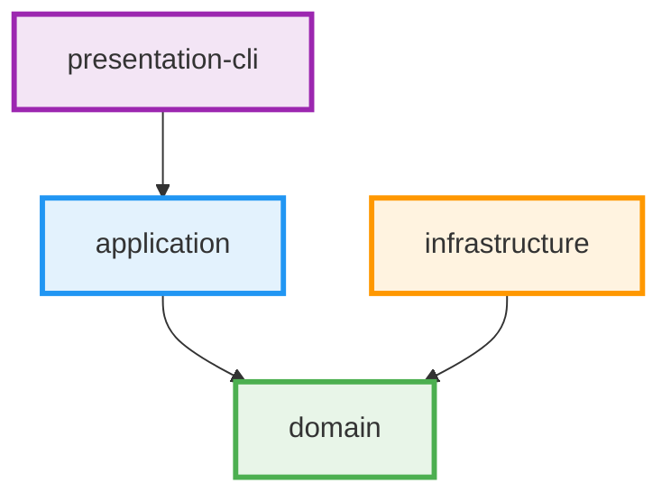

# Development Guidelines

This document provides comprehensive guidelines for developing the Scopes project based on the current architecture implementation and coding patterns, focusing on maintainability and consistency.

## Architecture Overview

Scopes follows **Clean Architecture** principles with **Domain-Driven Design (DDD)** and **Functional Programming** paradigms. The current implementation emphasizes strongly-typed domain identifiers, service-specific error contexts, and comprehensive validation pipelines.

### Current Architectural Implementation

1. **Strongly-Typed Domain Identifiers** - ScopeId value objects replace raw strings
2. **Service-Specific Error Hierarchies** - TitleValidationError, ScopeBusinessRuleViolation, UniquenessValidationError, ApplicationValidationError
3. **Clean Architecture with Functional DDD** - Domain layer isolation with repository-dependent validation in application layer
4. **Error Translation Patterns** - Service errors mapped to use case errors with rich context
5. **ValidationResult for Error Accumulation** - Comprehensive validation feedback with extension functions

## Clean Architecture Implementation

### Current Module Dependencies



### Layer Responsibilities (Current Implementation)

#### Domain Layer (`:domain`)
- **Entities with Value Objects**: Scope entity with ScopeTitle, ScopeDescription validation
- **Strongly-Typed Identifiers**: ScopeId using ULID generation
- **Repository Interfaces**: Detailed error types (FindScopeError, SaveScopeError, ExistsScopeError)
- **Domain Error Hierarchies**: Service-specific error types with rich context
- **Pure Domain Services**: Title normalization, validation utilities

#### Application Layer (`:application`)
- **Use Case Handlers**: CreateScopeHandler with transaction boundaries
- **Application Services**: ApplicationScopeValidationService for repository-dependent validation
- **Error Translation**: Service errors mapped to use case-specific errors
- **Comprehensive Validation**: ValidationResult for error accumulation
- **DTO Mapping**: Domain entities mapped to application DTOs before reaching presentation layer

#### Infrastructure Layer (`:infrastructure`)
- **Repository Implementations**: Detailed error mapping from infrastructure concerns
- **External Service Integrations**: Database connections, file systems
- **Technical Error Handling**: Connection errors, data integrity violations

#### Presentation Layer (`:presentation-cli`)
- **CLI Commands**: User interface for scope operations
- **Application DTO Consumption**: Consumes pre-mapped DTOs from application layer only
- **Error Presentation**: User-friendly error messages from use case errors

**Note**: Domain entities never leak to the presentation layer. All entity-to-DTO mapping must occur in the application layer or dedicated mappers before reaching presentation.

## Current Error Handling Architecture

### Service-Specific Error Hierarchies

The current implementation uses detailed error hierarchies that provide rich context for different validation scenarios:

```kotlin
// Title validation with specific error context
sealed class TitleValidationError : DomainError() {
    object EmptyTitle : TitleValidationError()
    data class TitleTooShort(val minLength: Int, val actualLength: Int, val title: String) : TitleValidationError()
    data class TitleTooLong(val maxLength: Int, val actualLength: Int, val title: String) : TitleValidationError()
    data class InvalidCharacters(val title: String, val invalidCharacters: Set<Char>, val position: Int) : TitleValidationError()
}

// Business rule validation with hierarchy context  
sealed class ScopeBusinessRuleError : DomainError() {
    data class MaxDepthExceeded(val maxDepth: Int, val actualDepth: Int, val scopeId: ScopeId, val parentPath: List<ScopeId>) : ScopeBusinessRuleError()
    data class MaxChildrenExceeded(val maxChildren: Int, val currentChildren: Int, val parentId: ScopeId, val attemptedOperation: String) : ScopeBusinessRuleError()
    data class DuplicateScope(val duplicateTitle: String, val parentId: ScopeId, val existingScopeId: ScopeId, val normalizedTitle: String) : ScopeBusinessRuleError()
}

// Uniqueness validation with detailed context
sealed class UniquenessValidationError : DomainError() {
    data class DuplicateTitle(val title: String, val normalizedTitle: String, val parentId: String?, val existingScopeId: String) : UniquenessValidationError()
}
```

### ValidationResult Pattern Implementation

The current codebase implements a comprehensive ValidationResult pattern for error accumulation:

```kotlin
sealed class ValidationResult<out T> {
    data class Success<T>(val value: T) : ValidationResult<T>()
    data class Failure<T>(val errors: NonEmptyList<DomainError>) : ValidationResult<T>()
    
    // Comprehensive validation with error accumulation
    fun <U, V> combine(other: ValidationResult<U>, f: (T, U) -> V): ValidationResult<V>
}

// Extension functions for ergonomic usage
fun <T> T.validationSuccess(): ValidationResult<T> = ValidationResult.Success(this)
fun <T> DomainError.validationFailure(): ValidationResult<T> = ValidationResult.Failure(nonEmptyListOf(this))
fun <T> List<ValidationResult<T>>.sequence(): ValidationResult<List<T>>

// For fail-fast behavior, use fold() to inspect the first error:
// validationResult.fold(
//     ifLeft = { errors -> handleFirstError(errors.first()) },
//     ifRight = { value -> handleSuccess(value) }
// )
```

### Use Case Error Translation Implementation

The current architecture implements systematic error translation from service-specific errors to use case errors:

```kotlin
sealed class CreateScopeError {
    data class TitleValidationFailed(val titleError: TitleValidationError) : CreateScopeError()
    data class BusinessRuleViolationFailed(val businessRuleError: ScopeBusinessRuleError) : CreateScopeError()
    data class DuplicateTitleFailed(val uniquenessError: UniquenessValidationError) : CreateScopeError()
    object ParentNotFound : CreateScopeError()
    data class SaveFailure(val repositoryError: SaveScopeError) : CreateScopeError()
    data class ExistenceCheckFailure(val repositoryError: ExistsScopeError) : CreateScopeError()
}

// Translation methods in use case handlers
private fun validateTitleWithServiceErrors(title: String): Either<CreateScopeError, Unit> =
    applicationScopeValidationService.validateTitleFormat(title)
        .mapLeft { titleError -> CreateScopeError.TitleValidationFailed(titleError) }

private suspend fun validateHierarchyWithServiceErrors(parentId: ScopeId?): Either<CreateScopeError, Unit> =
    applicationScopeValidationService.validateHierarchyConstraints(parentId)
        .mapLeft { businessRuleError -> CreateScopeError.BusinessRuleViolationFailed(businessRuleError) }
```

## Strongly-Typed Domain Implementation

### ScopeId Value Object Pattern

```kotlin
@JvmInline
value class ScopeId private constructor(private val value: String) {
    companion object {
        fun generate(): ScopeId = ScopeId(Ulid.fast().toString())
        fun from(value: String): ScopeId = ScopeId(value)
    }
    
    override fun toString(): String = value
}

// ✅ Current Implementation: All domain identifiers use ScopeId
data class MaxDepthExceeded(
    val maxDepth: Int, 
    val actualDepth: Int, 
    val scopeId: ScopeId,          // Not String
    val parentPath: List<ScopeId>  // Not List<String>
)
```

## Validation Service Architecture

### Repository-Dependent Validation Services

The current implementation separates pure domain validation from repository-dependent validation:

```kotlin
class ApplicationScopeValidationService(
    private val repository: ScopeRepository
) {
    companion object {
        const val MAX_HIERARCHY_DEPTH = 10
        const val MAX_CHILDREN_PER_PARENT = 100
    }

    // Service-specific validation methods returning detailed error context
    fun validateTitleFormat(title: String): Either<TitleValidationError, Unit> {
        val trimmedTitle = title.trim()
        
        if (trimmedTitle.isBlank()) {
            return TitleValidationError.EmptyTitle.left()
        }
        
        if (trimmedTitle.length < ScopeTitle.MIN_LENGTH) {
            return TitleValidationError.TitleTooShort(
                minLength = ScopeTitle.MIN_LENGTH,
                actualLength = trimmedTitle.length,
                title = trimmedTitle
            ).left()
        }
        
        return Unit.right()
    }
    
    /**
     * Validates hierarchy constraints with business rule-specific error context.
     * Checks both depth constraints and children limit constraints.
     * Returns specific BusinessRuleServiceError types including repository errors.
     */
    suspend fun validateHierarchyConstraints(parentId: ScopeId?): Either<BusinessRuleServiceError, Unit> = either {
        if (parentId == null) return@either
        
        // Check depth constraint
        val depth = repository.findHierarchyDepth(parentId)
            .mapLeft { repositoryError ->
                // Create a data integrity error that preserves repository context
                DataIntegrityBusinessRuleError.ConsistencyCheckFailure(
                    scopeId = parentId,
                    checkType = "hierarchy_depth_retrieval",
                    expectedState = "accessible_hierarchy_data",
                    actualState = "repository_error: ${repositoryError.message}",
                    affectedFields = listOf("hierarchy_depth")
                )
            }
            .bind()
        
        if (depth >= MAX_HIERARCHY_DEPTH) {
            raise(ScopeBusinessRuleError.MaxDepthExceeded(
                maxDepth = MAX_HIERARCHY_DEPTH,
                actualDepth = depth + 1,
                scopeId = parentId,
                parentPath = emptyList()
            ))
        }
        
        // Check children limit constraint
        val childrenCount = repository.countByParentId(parentId)
            .mapLeft { repositoryError ->
                // Create a data integrity error that preserves repository context
                DataIntegrityBusinessRuleError.ConsistencyCheckFailure(
                    scopeId = parentId,
                    checkType = "children_count_retrieval",
                    expectedState = "accessible_children_data",
                    actualState = "repository_error: ${repositoryError.message}",
                    affectedFields = listOf("children_count")
                )
            }
            .bind()
        
        if (childrenCount >= MAX_CHILDREN_PER_PARENT) {
            raise(ScopeBusinessRuleError.MaxChildrenExceeded(
                maxChildren = MAX_CHILDREN_PER_PARENT,
                currentChildren = childrenCount,
                parentId = parentId,
                attemptedOperation = "create_child_scope"
            ))
        }
    }
    
    // Comprehensive validation using ValidationResult for error accumulation
    suspend fun validateScopeCreation(
        title: String,
        description: String?,
        parentId: ScopeId?
    ): ValidationResult<Unit> {
        val validations = listOf(
            ScopeTitle.create(title).toValidationResult().map { },
            ScopeDescription.create(description).toValidationResult().map { },
            validateHierarchyDepth(parentId).toValidationResult(),
            validateChildrenLimit(parentId).toValidationResult(),
            validateTitleUniqueness(title, parentId).toValidationResult()
        )

        return validations.sequence().map { }
    }
}
```

### Error Mapping Implementation

The current codebase implements systematic error mapping between layers:

```kotlin
// Centralized error mapping functions
private fun mapBusinessRuleErrorToScopeError(error: ScopeBusinessRuleError, parentId: ScopeId?): ScopeError =
    when (error) {
        is ScopeBusinessRuleError.MaxDepthExceeded ->
            ScopeError.InvalidParent(
                parentId ?: ScopeId.generate(),
                "Maximum hierarchy depth (${error.maxDepth}) would be exceeded"
            )
        is ScopeBusinessRuleError.MaxChildrenExceeded ->
            ScopeError.InvalidParent(
                parentId ?: ScopeId.generate(),
                "Maximum children limit (${error.maxChildren}) would be exceeded"
            )
        is ScopeBusinessRuleError.DuplicateScope ->
            ScopeError.InvalidParent(
                parentId ?: ScopeId.generate(),
                "Duplicate scope detected: ${error.existingScopeId}"
            )
    }

// Comprehensive repository error mapping
private fun mapExistsScopeError(existsError: ExistsScopeError, parentId: ScopeId?): DomainError =
    when (existsError) {
        is ExistsScopeError.IndexCorruption -> {
            if (parentId != null) {
                ScopeError.InvalidParent(
                    parentId,
                    "Index corruption detected: ${existsError.message}. ScopeId: ${existsError.scopeId}"
                )
            } else {
                DomainInfrastructureError(
                    RepositoryError.DataIntegrityError(
                        "Index corruption in root-level check: ${existsError.message}",
                        cause = RuntimeException("Index corruption")
                    )
                )
            }
        }
        is ExistsScopeError.QueryTimeout -> 
            DomainInfrastructureError(
                RepositoryError.DatabaseError(
                    "Query timeout: operation='${existsError.operation}', timeout=${existsError.timeoutMs}ms",
                    RuntimeException("Query timeout: ${existsError.operation}")
                )
            )
        // ... comprehensive coverage of all error cases
    }
```

## Use Case Handler Implementation

### Transaction Boundary Pattern

The current implementation establishes clear transaction boundaries in use case handlers:

```kotlin
class CreateScopeHandler(
    private val scopeRepository: ScopeRepository,
    private val applicationScopeValidationService: ApplicationScopeValidationService
) : UseCase<CreateScope, CreateScopeError, CreateScopeResult> {

    @Suppress("ReturnCount") // Early returns improve readability in result handling
    override suspend operator fun invoke(input: CreateScope): Either<CreateScopeError, CreateScopeResult> = either {
        // Transaction boundary starts here (simulated with comment)
        // In real implementation, this would be wrapped in @Transactional

        // Step 1: Parse and validate parent exists (returns parsed ScopeId)
        val parentId = validateParentExists(input.parentId).bind()

        // Step 2: Perform service-specific validations with type-safe error translation
        validateTitleWithServiceErrors(input.title).bind()
        validateHierarchyWithServiceErrors(parentId).bind()
        validateUniquenessWithServiceErrors(input.title, parentId).bind()

        // Step 3: Create domain entity (enforces domain invariants)
        val scope = createScopeEntity(input.title, input.description, parentId, input.metadata).bind()

        // Step 4: Persist the entity
        val savedScope = saveScopeEntity(scope).bind()

        // Step 5: Map to DTO (no domain entities leak out)
        ScopeMapper.toCreateScopeResult(savedScope)
    }
}
```

## Repository Interface Design

### Current Repository Pattern

The current implementation uses detailed error types for comprehensive error handling:

```kotlin
interface ScopeRepository {
    suspend fun findById(id: ScopeId): Either<FindScopeError, Scope?>
    suspend fun save(scope: Scope): Either<SaveScopeError, Scope>
    suspend fun existsById(id: ScopeId): Either<ExistsScopeError, Boolean>
    suspend fun countByParentId(parentId: ScopeId): Either<CountScopeError, Int>
    suspend fun findHierarchyDepth(id: ScopeId): Either<FindScopeError, Int>
    suspend fun existsByParentIdAndTitle(parentId: ScopeId?, normalizedTitle: String): Either<ExistsScopeError, Boolean>
}

// Repository error types with detailed context
sealed class FindScopeError {
    data class TraversalTimeout(val scopeId: ScopeId, val timeoutMs: Long) : FindScopeError()
    data class ConnectionFailure(val cause: Throwable) : FindScopeError()
    data class PersistenceError(val message: String, val cause: Throwable) : FindScopeError()
    // ... other specific error cases
}

sealed class ExistsScopeError {
    data class IndexCorruption(val message: String, val scopeId: ScopeId) : ExistsScopeError()
    data class QueryTimeout(val operation: String, val timeoutMs: Long, val context: String) : ExistsScopeError()
    data class LockTimeout(val operation: String, val timeoutMs: Long, val retryable: Boolean) : ExistsScopeError()
    // ... comprehensive error coverage
}
```

## Testing Patterns

### Service-Specific Error Testing

The current testing approach focuses on verifying error translation and context preservation:

```kotlin
class CreateScopeHandlerServiceErrorIntegrationTest : DescribeSpec({
    describe("title validation error translation") {
        it("should translate TitleValidationError.TitleTooShort to ValidationFailed") {
            val command = CreateScope(
                title = "ab",
                description = "Test description", 
                parentId = null,
                metadata = emptyMap()
            )

            coEvery { mockValidationService.validateTitleFormat("ab") } returns 
                TitleValidationError.TitleTooShort(3, 2, "ab").left()
            
            val result = handler.invoke(command)
            
            result.isLeft() shouldBe true
            val error = result.leftOrNull().shouldBeInstanceOf<CreateScopeError.TitleValidationFailed>()
            val titleError = error.titleError.shouldBeInstanceOf<TitleValidationError.TitleTooShort>()
            titleError.minLength shouldBe 3
            titleError.actualLength shouldBe 2
        }
    }
    
    describe("business rule error translation") {
        it("should translate ScopeBusinessRuleError.MaxDepthExceeded to BusinessRuleViolationFailed") {
            val parentId = ScopeId.generate()
            val command = CreateScope(
                title = "Valid Title",
                description = "Test description",
                parentId = parentId.value,
                metadata = emptyMap()
            )

            coEvery { mockValidationService.validateHierarchyConstraints(parentId) } returns 
                ScopeBusinessRuleError.MaxDepthExceeded(10, 11, parentId, listOf(parentId)).left()
            
            val result = handler.invoke(command)
            
            result.isLeft() shouldBe true
            val error = result.leftOrNull().shouldBeInstanceOf<CreateScopeError.BusinessRuleViolationFailed>()
            val businessError = error.businessRuleError.shouldBeInstanceOf<ScopeBusinessRuleError.MaxDepthExceeded>()
            businessError.maxDepth shouldBe 10
            businessError.actualDepth shouldBe 11
            businessError.scopeId shouldBe parentId
        }
    }
})
```

### Architecture Testing with Konsist

Current architecture validation ensures compliance with Clean Architecture and DDD principles:

```kotlin
class UseCaseArchitectureTest : StringSpec({
    "use case handlers should have proper naming convention" {
        Konsist
            .scopeFromModule("application")
            .classes()
            .withNameEndingWith("Handler")
            .assert { it.name.endsWith("Handler") }
    }
    
    "use case errors should be sealed classes for exhaustive handling" {
        Konsist
            .scopeFromModule("application")
            .classes()
            .withNameEndingWith("Error")
            .assert { it.isSealed }
    }
    
    "domain errors should use strongly-typed identifiers" {
        Konsist
            .scopeFromModule("domain")
            .classes()
            .withNameEndingWith("Error")
            .functions()
            .parameters
            .assert { parameter ->
                if (parameter.name.contains("scopeId") || parameter.name.contains("parentId")) {
                    parameter.type.name == "ScopeId"
                } else {
                    true
                }
            }
    }
})
```

## Development Workflow

### Current Quality Assurance Process

```bash
# 1. Architecture validation (enforced by Konsist)
./gradlew konsistTest

# 2. Comprehensive test suite
./gradlew test

# 3. Code formatting and style
./gradlew ktlintFormat
./gradlew detekt

# 4. Full build verification  
./gradlew build
```

### Git Hook Integration (lefthook.yml)

The current setup enforces quality standards through automated hooks:

```yaml
pre-commit:
  commands:
    format-markdown:
      glob: "*.md"
      run: ./scripts/format-markdown.sh {staged_files}
    
    check-editorconfig:
      run: docker run --rm -v "${PWD}:/check" mstruebing/editorconfig-checker
    
    ktlint:
      glob: "*.kt"
      run: ./gradlew ktlintFormat && git add -u
    
    detekt:
      run: ./gradlew detekt
    
    test:
      run: ./gradlew test konsistTest
```

## Package Structure (Current Implementation)

```
scopes/
├── domain/
│   ├── entity/
│   │   └── Scope.kt                    # Domain entity with value object validation
│   ├── valueobject/
│   │   ├── ScopeId.kt                 # Strongly-typed identifier with ULID
│   │   ├── ScopeTitle.kt              # Title validation value object
│   │   └── ScopeDescription.kt        # Description validation value object
│   ├── repository/
│   │   └── ScopeRepository.kt         # Repository interface with detailed error types
│   ├── error/
│   │   ├── DomainError.kt             # Base domain error
│   │   ├── DomainInfrastructureError.kt # Infrastructure-related domain errors
│   │   ├── DomainServiceError.kt      # Domain service errors
│   │   ├── RepositoryError.kt         # Repository operation errors
│   │   ├── BusinessRuleServiceError.kt # Business rule service errors
│   │   ├── ScopeError.kt              # Basic scope errors (NotFound, AlreadyExists)
│   │   ├── ScopeValidationError.kt    # Scope validation errors
│   │   ├── ScopeBusinessRuleError.kt  # Business rule validation errors
│   │   ├── ScopeBusinessRuleViolation.kt # Business rule violations
│   │   ├── TitleValidationError.kt    # Service-specific title errors
│   │   ├── UniquenessValidationError.kt # Uniqueness validation errors
│   │   ├── ScopeValidationServiceError.kt # Validation service errors
│   │   ├── ValidationResult.kt        # Error accumulation pattern (with Failure<Nothing>)
│   │   ├── ValidationResultExtensions.kt # Extension functions
│   │   ├── ErrorFormatter.kt          # Error formatting interface
│   │   ├── ErrorRecoveryTypes.kt      # Error recovery type definitions
│   │   ├── ScopeRecoveryTypes.kt      # Scope-specific recovery types
│   │   ├── CountScopeError.kt         # Count operation errors
│   │   ├── ExistsScopeError.kt        # Exists check errors
│   │   ├── FindScopeError.kt          # Find operation errors
│   │   └── SaveScopeError.kt          # Save operation errors
│   ├── service/
│   │   ├── ErrorRecoveryDomainService.kt # Error categorization and recovery
│   │   ├── ErrorRecoverySuggestionService.kt # Recovery suggestion generation
│   │   └── RecoveryStrategyDomainService.kt # Recovery strategy selection
│   └── util/
│       └── TitleNormalizer.kt         # Domain utility functions
├── application/
│   ├── usecase/
│   │   ├── UseCase.kt                 # Base use case interface
│   │   ├── command/
│   │   │   ├── Command.kt             # Base command interface
│   │   │   └── CreateScope.kt         # Use case command
│   │   ├── query/
│   │   │   └── Query.kt               # Base query interface
│   │   ├── handler/
│   │   │   └── CreateScopeHandler.kt  # Use case handler with transaction boundary
│   │   └── error/
│   │       └── CreateScopeError.kt    # Use case-specific errors
│   ├── dto/
│   │   ├── DTO.kt                     # Base DTO interface
│   │   └── CreateScopeResult.kt       # Output DTOs consumed by presentation
│   ├── mapper/
│   │   └── ScopeMapper.kt             # Domain-to-DTO mapping (no domain leakage)
│   ├── port/
│   │   └── TransactionManager.kt      # Transaction management port
│   ├── service/
│   │   ├── ApplicationScopeValidationService.kt # Repository-dependent validation
│   │   ├── CrossAggregateValidationService.kt   # Cross-aggregate validation
│   │   └── error/
│   │       ├── ApplicationServiceErrorTranslator.kt # Service error translator
│   │       ├── ApplicationValidationError.kt    # Application validation errors (InputValidationError, CrossAggregateValidationError, BusinessRuleValidationError, AsyncValidationError)
│   │       ├── AuditServiceError.kt            # Audit service errors
│   │       ├── AuthorizationServiceError.kt    # Authorization service errors
│   │       ├── NotificationServiceError.kt     # Notification base errors
│   │       ├── EventDistributionError.kt       # Event distribution errors
│   │       ├── MessageDeliveryError.kt         # Message delivery errors
│   │       ├── NotificationConfigurationError.kt # Notification config errors
│   │       └── TemplateError.kt                # Template processing errors
│   └── error/
│       ├── CreateScopeErrorMessageTranslator.kt # Use-case error translator
│       └── ErrorRecoveryApplicationService.kt   # Error recovery orchestration
├── infrastructure/
│   ├── repository/
│   │   └── InMemoryScopeRepository.kt  # In-memory repository implementation
│   ├── transaction/
│   │   └── NoopTransactionManager.kt   # No-op transaction manager
│   └── error/
│       ├── InfrastructureAdapterError.kt # Base infrastructure error
│       ├── DatabaseAdapterError.kt      # Database-specific errors
│       ├── TransactionAdapterError.kt   # Transaction-specific errors
│       ├── FileSystemAdapterError.kt    # File system errors
│       ├── MessagingAdapterError.kt     # Messaging system errors
│       ├── ExternalApiAdapterError.kt   # External API errors
│       └── ConfigurationAdapterError.kt # Configuration errors
└── presentation-cli/
    ├── Main.kt                         # Application entry point
    ├── CompositionRoot.kt              # Dependency injection setup
    ├── ScopesCommand.kt                # Main CLI command
    └── commands/
        └── CreateScopeCommand.kt       # Create scope CLI command
```

## Best Practices Summary

### Current Implementation Standards ✅

- **Strongly-typed domain identifiers**: Use `ScopeId` everywhere instead of `String`
- **Service-specific error hierarchies**: Rich error context with detailed information
- **Comprehensive error translation**: Service errors mapped to use case errors
- **ValidationResult for error accumulation**: Multiple validation errors collected
- **Repository-dependent validation separation**: Clean domain layer isolation
- **Functional error handling**: Arrow Either for explicit error propagation
- **Architecture testing**: Konsist validation of Clean Architecture principles
- **Transaction boundary clarity**: Clear separation of concerns in use case handlers
- **Detailed error mapping**: Infrastructure errors mapped to domain errors

### Implementation Patterns to Follow

1. **Error Translation Pattern**: Always map service errors to use case errors
2. **ValidationResult Usage**: Use for comprehensive validation feedback
3. **Strongly-Typed Identifiers**: Never use raw strings for domain identifiers
4. **Service-Specific Errors**: Provide rich context for different validation scenarios
5. **Repository Error Handling**: Comprehensive mapping of infrastructure concerns
6. **Architecture Testing**: Validate patterns with Konsist rules
7. **Transaction Boundaries**: Clear separation in use case handlers
8. **Extension Functions**: Ergonomic APIs for ValidationResult operations

### Maintenance Guidelines

- **Keep error hierarchies specific**: Each service should have its own error types
- **Maintain error translation consistency**: Always map between layers
- **Update Konsist tests**: Validate new architectural patterns
- **Comprehensive test coverage**: Test error translation and context preservation
- **Document error mapping rationale**: Explain complex error translation logic
- **Regular architecture review**: Ensure compliance with Clean Architecture principles

This development approach ensures maintainability through clear separation of concerns, comprehensive error handling, and automated validation of architectural constraints.

## Build and Development Tools

### Gradle Build Scans

The project uses Gradle Build Scans to improve build observability and troubleshooting. Build Scans provide detailed insights into build performance, test results, and dependency resolution.

#### Configuration

Build Scans are configured in `settings.gradle.kts` using the Develocity plugin:
- **Automatic publishing**: CI builds automatically publish scans to [scans.gradle.com](https://scans.gradle.com)
- **Terms of Service**: Automatically accepted for CI builds
- **Metadata**: Includes git branch, CI/build environment tags, and GitHub Actions links

#### Usage

**For CI builds:**
- Build Scans are automatically generated and published
- Scan URLs appear in the CI output
- Background uploading is disabled for reliability

**For local development:**
- Add `--scan` flag to any Gradle command: `./gradlew build --scan`
- You'll be prompted to accept the Terms of Service on first use
- Scans are uploaded in background by default for local builds

**Example commands:**
```bash
# Run tests with Build Scan
./gradlew test --scan

# Build project with Build Scan
./gradlew build --scan

# Run specific task with Build Scan
./gradlew ktlintCheck --scan
```

#### Privacy and Security

- Build Scans can capture environment variables and local metadata (configurable with masking/obfuscation)
- Scans on scans.gradle.com are **unlisted** - anyone with the URL can view them
- Review scan contents before sharing URLs externally
- Consider sensitive data exposure when sharing scan links

##### Obfuscation and Data Capture

Build Scans may capture the following information (commonly redacted items):
- **Usernames and hostnames**: Local machine identifiers
- **IP addresses**: Network configuration details
- **Environment variables**: Selected system properties (can be masked)
- **File paths**: Project structure and locations
- **Build cache keys**: Internal build optimization data

**Best practices:**
- Review scan data before sharing with external parties
- Use obfuscation features for sensitive values when needed
- Be aware that unlisted does not mean private - URLs are accessible to anyone who has them
- For sensitive projects, consider using a private Develocity instance instead of public scans.gradle.com

#### Troubleshooting Builds

Build Scans help diagnose:
- Test failures with full stack traces
- Build performance bottlenecks
- Dependency resolution issues
- Task execution order problems
- Configuration cache issues

Access your Build Scan URL from the console output to view detailed build insights.
