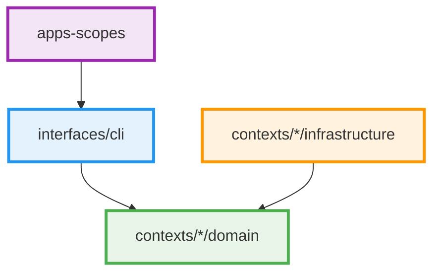
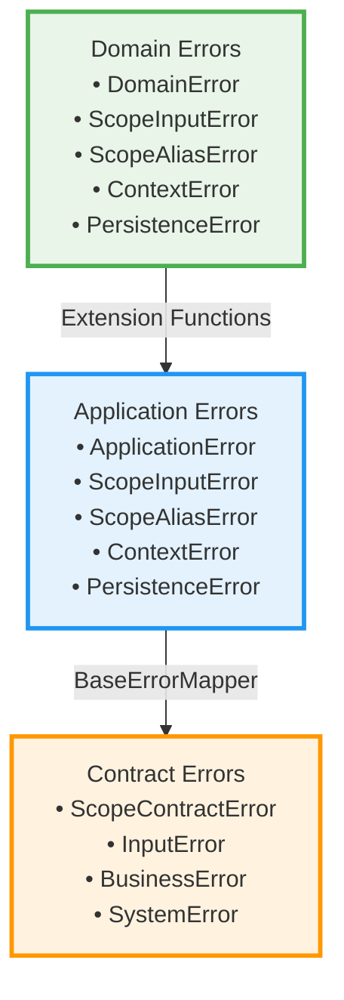

# Development Guidelines

This document provides comprehensive guidelines for developing the Scopes project based on the current architecture implementation and coding patterns, focusing on maintainability and consistency.

## Architecture Overview

Scopes follows **Clean Architecture** principles with **Domain-Driven Design (DDD)** and **Functional Programming** paradigms. The current implementation emphasizes strongly-typed domain identifiers, service-specific error contexts, and comprehensive validation pipelines.

### Current Architectural Implementation

1. **Strongly-Typed Domain Identifiers** - ScopeId value objects replace raw strings
2. **Service-Specific Error Hierarchies** - TitleValidationError, ScopeBusinessRuleViolation, UniquenessValidationError, ApplicationValidationError
3. **Clean Architecture with Functional DDD** - Domain layer isolation with repository-dependent validation in application layer
4. **Error Translation Patterns** - Service errors mapped to use case errors with rich context
5. **ValidationResult for Error Accumulation** - Comprehensive validation feedback with extension functions

## Clean Architecture Implementation

### Current Module Dependencies



### Layer Responsibilities (Current Implementation)

#### Domain Layer (`:contexts/*/domain`)
- **Entities with Value Objects**: Scope entity with ScopeTitle, ScopeDescription validation
- **Strongly-Typed Identifiers**: ScopeId using ULID generation
- **Repository Interfaces**: Detailed error types (FindScopeError, SaveScopeError, ExistsScopeError)
- **Domain Error Hierarchies**: Service-specific error types with rich context
- **Pure Domain Services**: Title normalization, validation utilities

#### Application Layer (`:contexts/*/application`)
- **Use Case Handlers**: CreateScopeHandler with transaction boundaries
- **Application Services**: ApplicationScopeValidationService for repository-dependent validation
- **Error Translation**: Service errors mapped to use case-specific errors
- **Comprehensive Validation**: ValidationResult for error accumulation
- **DTO Mapping**: Domain entities mapped to application DTOs before reaching presentation layer

#### Infrastructure Layer (`:contexts/*/infrastructure`)
- **Repository Implementations**: Detailed error mapping from infrastructure concerns
- **External Service Integrations**: Database connections, file systems
- **Technical Error Handling**: Connection errors, data integrity violations

#### Apps Layer (`:apps-scopes`)
- **CLI Commands**: User interface for scope operations
- **Application DTO Consumption**: Consumes pre-mapped DTOs from application layer only
- **Error Presentation**: User-friendly error messages from use case errors

**Note**: Domain entities never leak to the presentation layer. All entity-to-DTO mapping must occur in the application layer or dedicated mappers before reaching presentation.

## Current Error Handling Architecture

### Service-Specific Error Hierarchies

The current implementation uses detailed error hierarchies that provide rich context for different validation scenarios:

```kotlin
// Title validation with specific error context
sealed class TitleValidationError : DomainError() {
    object EmptyTitle : TitleValidationError()
    data class TitleTooShort(val minLength: Int, val actualLength: Int, val title: String) : TitleValidationError()
    data class TitleTooLong(val maxLength: Int, val actualLength: Int, val title: String) : TitleValidationError()
    data class InvalidCharacters(val title: String, val invalidCharacters: Set<Char>, val position: Int) : TitleValidationError()
}

// Hierarchy validation errors (matching actual implementation)
sealed class ScopeHierarchyError : ConceptualModelError() {
    data class MaxDepthExceeded(val occurredAt: Instant, val scopeId: ScopeId, val attemptedDepth: Int, val maximumDepth: Int) : ScopeHierarchyError()
    data class MaxChildrenExceeded(val occurredAt: Instant, val parentScopeId: ScopeId, val currentChildrenCount: Int, val maximumChildren: Int) : ScopeHierarchyError()
    data class CircularReference(val occurredAt: Instant, val scopeId: ScopeId, val cyclePath: List<ScopeId>) : ScopeHierarchyError()
    data class SelfParenting(val occurredAt: Instant, val scopeId: ScopeId) : ScopeHierarchyError()
}

// Uniqueness validation with detailed context (matching actual implementation)
sealed class ScopeUniquenessError : ConceptualModelError() {
    // Title uniqueness is enforced at ALL levels including root level
    data class DuplicateTitle(val occurredAt: Instant, val title: String, val parentScopeId: ScopeId?, val existingScopeId: ScopeId) : ScopeUniquenessError()
}
```

### ValidationResult Pattern Implementation

The current codebase implements a comprehensive ValidationResult pattern for error accumulation:

```kotlin
sealed class ValidationResult<out T> {
    data class Success<T>(val value: T) : ValidationResult<T>()
    data class Failure<T>(val errors: NonEmptyList<DomainError>) : ValidationResult<T>()
    
    // Comprehensive validation with error accumulation
    fun <U, V> combine(other: ValidationResult<U>, f: (T, U) -> V): ValidationResult<V>
}

// Extension functions for ergonomic usage
fun <T> T.validationSuccess(): ValidationResult<T> = ValidationResult.Success(this)
fun <T> DomainError.validationFailure(): ValidationResult<T> = ValidationResult.Failure(nonEmptyListOf(this))
fun <T> List<ValidationResult<T>>.sequence(): ValidationResult<List<T>>

// For fail-fast behavior, use fold() to inspect the first error:
// validationResult.fold(
//     ifLeft = { errors -> handleFirstError(errors.first()) },
//     ifRight = { value -> handleSuccess(value) }
// )
```

### Use Case Error Translation Implementation

The current architecture implements systematic error translation from service-specific errors to use case errors:

```kotlin
sealed class CreateScopeError {
    data class TitleValidationFailed(val titleError: ScopeInputError.TitleError) : CreateScopeError()
    data class HierarchyViolationFailed(val hierarchyError: ScopeHierarchyError) : CreateScopeError()
    data class DuplicateTitleFailed(val uniquenessError: ScopeUniquenessError) : CreateScopeError()
    object ParentNotFound : CreateScopeError()
    data class SaveFailure(val repositoryError: SaveScopeError) : CreateScopeError()
    data class ExistenceCheckFailure(val repositoryError: ExistsScopeError) : CreateScopeError()
}

// Translation methods in use case handlers
private fun validateTitleWithServiceErrors(title: String): Either<CreateScopeError, Unit> =
    applicationScopeValidationService.validateTitleFormat(title)
        .mapLeft { titleError -> CreateScopeError.TitleValidationFailed(titleError) }

private suspend fun validateHierarchyWithServiceErrors(parentId: ScopeId?): Either<CreateScopeError, Unit> =
    applicationScopeValidationService.validateHierarchyConstraints(parentId)
        .mapLeft { hierarchyError -> CreateScopeError.HierarchyViolationFailed(hierarchyError) }
```

## Strongly-Typed Domain Implementation

### ScopeId Value Object Pattern

```kotlin
@JvmInline
value class ScopeId private constructor(private val value: String) {
    companion object {
        fun generate(): ScopeId = ScopeId(Ulid.fast().toString())
        fun from(value: String): ScopeId = ScopeId(value)
    }
    
    override fun toString(): String = value
}

// ✅ Current Implementation: All domain identifiers use ScopeId
data class MaxDepthExceeded(
    val maxDepth: Int, 
    val actualDepth: Int, 
    val scopeId: ScopeId,          // Not String
    val parentPath: List<ScopeId>  // Not List<String>
)
```

## Validation Service Architecture

### Repository-Dependent Validation Services

The current implementation separates pure domain validation from repository-dependent validation:

```kotlin
class ApplicationScopeValidationService(
    private val repository: ScopeRepository
) {
    companion object {
        const val MAX_HIERARCHY_DEPTH = 10
        const val MAX_CHILDREN_PER_PARENT = 100
    }

    // Service-specific validation methods returning detailed error context
    fun validateTitleFormat(title: String): Either<TitleValidationError, Unit> {
        val trimmedTitle = title.trim()
        
        if (trimmedTitle.isBlank()) {
            return TitleValidationError.EmptyTitle.left()
        }
        
        if (trimmedTitle.length < ScopeTitle.MIN_LENGTH) {
            return TitleValidationError.TitleTooShort(
                minLength = ScopeTitle.MIN_LENGTH,
                actualLength = trimmedTitle.length,
                title = trimmedTitle
            ).left()
        }
        
        return Unit.right()
    }
    
    /**
     * Validates hierarchy constraints with business rule-specific error context.
     * Checks both depth constraints and children limit constraints.
     * Returns specific BusinessRuleServiceError types including repository errors.
     */
    suspend fun validateHierarchyConstraints(parentId: ScopeId?): Either<BusinessRuleServiceError, Unit> = either {
        if (parentId == null) return@either
        
        // Check depth constraint
        val depth = repository.findHierarchyDepth(parentId)
            .mapLeft { repositoryError ->
                // Create a data integrity error that preserves repository context
                DataIntegrityBusinessRuleError.ConsistencyCheckFailure(
                    scopeId = parentId,
                    checkType = "hierarchy_depth_retrieval",
                    expectedState = "accessible_hierarchy_data",
                    actualState = "repository_error: ${repositoryError.message}",
                    affectedFields = listOf("hierarchy_depth")
                )
            }
            .bind()
        
        val policy = hierarchyPolicyProvider.getPolicy().getOrElse { HierarchyPolicy.default() }
        if (policy.maxDepth != null && depth >= policy.maxDepth) {
            raise(ScopeBusinessRuleError.MaxDepthExceeded(
                maxDepth = policy.maxDepth,
                actualDepth = depth + 1,
                scopeId = parentId,
                parentPath = emptyList()
            ))
        }
        
        // Check children limit constraint
        val childrenCount = repository.countByParentId(parentId)
            .mapLeft { repositoryError ->
                // Create a data integrity error that preserves repository context
                DataIntegrityBusinessRuleError.ConsistencyCheckFailure(
                    scopeId = parentId,
                    checkType = "children_count_retrieval",
                    expectedState = "accessible_children_data",
                    actualState = "repository_error: ${repositoryError.message}",
                    affectedFields = listOf("children_count")
                )
            }
            .bind()
        
        if (childrenCount >= MAX_CHILDREN_PER_PARENT) {
            raise(ScopeBusinessRuleError.MaxChildrenExceeded(
                maxChildren = MAX_CHILDREN_PER_PARENT,
                currentChildren = childrenCount,
                parentId = parentId,
                attemptedOperation = "create_child_scope"
            ))
        }
    }
    
    // Comprehensive validation using ValidationResult for error accumulation
    suspend fun validateScopeCreation(
        title: String,
        description: String?,
        parentId: ScopeId?
    ): ValidationResult<Unit> {
        val validations = listOf(
            ScopeTitle.create(title).toValidationResult().map { },
            ScopeDescription.create(description).toValidationResult().map { },
            validateHierarchyDepth(parentId).toValidationResult(),
            validateChildrenLimit(parentId).toValidationResult(),
            validateTitleUniqueness(title, parentId).toValidationResult()
        )

        return validations.sequence().map { }
    }
}
```

### Error Mapping Implementation

The current codebase uses a context-aware error mapping approach:

#### Context-Specific Mapping in Handlers

```kotlin
// Map errors based on the specific operation context
class CreateScopeHandler {
    override suspend fun invoke(input: CreateScope) = either {
        // Context-specific error for parent validation
        val parent = repository.findById(input.parentId)
            .mapLeft { error ->
                ApplicationError.ScopeHierarchyError.ParentNotFound(
                    scopeId = "new",
                    parentId = input.parentId
                )
            }.bind()
        
        // Context-specific error for duplicate title
        val exists = repository.existsByTitle(input.title)
            .mapLeft { error ->
                ApplicationError.ScopeUniquenessError.DuplicateTitle(
                    title = input.title,
                    parentScopeId = input.parentId,
                    existingScopeId = "unknown"
                )
            }.bind()
    }
}
```

#### Extension Functions for Common Patterns

```kotlin
// ErrorMappingExtensions.kt provides reusable mappings
fun PersistenceError.toApplicationError(): ApplicationError = when (this) {
    is StorageUnavailable -> ApplicationError.PersistenceError.StorageUnavailable(
        operation = this.operation,
        cause = this.cause?.message
    )
    is DataCorruption -> ApplicationError.PersistenceError.DataCorruption(
        entityType = this.entityType,
        entityId = this.entityId,
        reason = this.reason
    )
    // Other common persistence errors...
}

// Usage in handlers - combine context-specific and extension functions
class UpdateScopeHandler {
    override suspend fun invoke(input: UpdateScope) = either {
        // Use extension function for common persistence errors
        val scope = repository.findById(input.id)
            .mapLeft { it.toApplicationError() }
            .bind()
        
        // Context-specific error when needed
        val updated = repository.save(scope)
            .mapLeft { error ->
                when (error) {
                    is ConcurrencyConflict -> 
                        ApplicationError.UpdateConflict(
                            scopeId = input.id,
                            message = "Scope was modified by another user"
                        )
                    else -> error.toApplicationError()
                }
            }.bind()
    }
}
```

## Use Case Handler Implementation

### Transaction Boundary Pattern

The current implementation establishes clear transaction boundaries in use case handlers:

```kotlin
class CreateScopeHandler(
    private val scopeRepository: ScopeRepository,
    private val applicationScopeValidationService: ApplicationScopeValidationService
) : UseCase<CreateScope, CreateScopeError, CreateScopeResult> {

    @Suppress("ReturnCount") // Early returns improve readability in result handling
    override suspend operator fun invoke(input: CreateScope): Either<CreateScopeError, CreateScopeResult> = either {
        // Transaction boundary starts here (simulated with comment)
        // In real implementation, this would be wrapped in @Transactional

        // Step 1: Parse and validate parent exists (returns parsed ScopeId)
        val parentId = validateParentExists(input.parentId).bind()

        // Step 2: Perform service-specific validations with type-safe error translation
        validateTitleWithServiceErrors(input.title).bind()
        validateHierarchyWithServiceErrors(parentId).bind()
        validateUniquenessWithServiceErrors(input.title, parentId).bind()

        // Step 3: Create domain entity (enforces domain invariants)
        val scope = createScopeEntity(input.title, input.description, parentId, input.metadata).bind()

        // Step 4: Persist the entity
        val savedScope = saveScopeEntity(scope).bind()

        // Step 5: Map to DTO (no domain entities leak out)
        ScopeMapper.toCreateScopeResult(savedScope)
    }
}
```

## Repository Interface Design

### Current Repository Pattern

The current implementation uses detailed error types for comprehensive error handling:

```kotlin
interface ScopeRepository {
    suspend fun findById(id: ScopeId): Either<FindScopeError, Scope?>
    suspend fun save(scope: Scope): Either<SaveScopeError, Scope>
    suspend fun existsById(id: ScopeId): Either<ExistsScopeError, Boolean>
    suspend fun countByParentId(parentId: ScopeId): Either<CountScopeError, Int>
    suspend fun findHierarchyDepth(id: ScopeId): Either<FindScopeError, Int>
    suspend fun existsByParentIdAndTitle(parentId: ScopeId?, normalizedTitle: String): Either<ExistsScopeError, Boolean>
}

// Repository error types with detailed context
sealed class FindScopeError {
    data class TraversalTimeout(val scopeId: ScopeId, val timeoutMs: Long) : FindScopeError()
    data class ConnectionFailure(val cause: Throwable) : FindScopeError()
    data class PersistenceError(val message: String, val cause: Throwable) : FindScopeError()
    // ... other specific error cases
}

sealed class ExistsScopeError {
    data class IndexCorruption(val message: String, val scopeId: ScopeId) : ExistsScopeError()
    data class QueryTimeout(val operation: String, val timeoutMs: Long, val context: String) : ExistsScopeError()
    data class LockTimeout(val operation: String, val timeoutMs: Long, val retryable: Boolean) : ExistsScopeError()
    // ... comprehensive error coverage
}
```

## Testing Patterns

### Service-Specific Error Testing

The current testing approach focuses on verifying error translation and context preservation:

```kotlin
class CreateScopeHandlerServiceErrorIntegrationTest : DescribeSpec({
    describe("title validation error translation") {
        it("should translate TitleValidationError.TitleTooShort to ValidationFailed") {
            val command = CreateScope(
                title = "ab",
                description = "Test description", 
                parentId = null,
                metadata = emptyMap()
            )

            coEvery { mockValidationService.validateTitleFormat("ab") } returns 
                TitleValidationError.TitleTooShort(3, 2, "ab").left()
            
            val result = handler.invoke(command)
            
            result.isLeft() shouldBe true
            val error = result.leftOrNull().shouldBeInstanceOf<CreateScopeError.TitleValidationFailed>()
            val titleError = error.titleError.shouldBeInstanceOf<TitleValidationError.TitleTooShort>()
            titleError.minLength shouldBe 3
            titleError.actualLength shouldBe 2
        }
    }
    
    describe("business rule error translation") {
        it("should translate ScopeBusinessRuleError.MaxDepthExceeded to BusinessRuleViolationFailed") {
            val parentId = ScopeId.generate()
            val command = CreateScope(
                title = "Valid Title",
                description = "Test description",
                parentId = parentId.value,
                metadata = emptyMap()
            )

            coEvery { mockValidationService.validateHierarchyConstraints(parentId) } returns 
                ScopeBusinessRuleError.MaxDepthExceeded(10, 11, parentId, listOf(parentId)).left()
            
            val result = handler.invoke(command)
            
            result.isLeft() shouldBe true
            val error = result.leftOrNull().shouldBeInstanceOf<CreateScopeError.BusinessRuleViolationFailed>()
            val businessError = error.businessRuleError.shouldBeInstanceOf<ScopeBusinessRuleError.MaxDepthExceeded>()
            businessError.maxDepth shouldBe 10
            businessError.actualDepth shouldBe 11
            businessError.scopeId shouldBe parentId
        }
    }
})
```

### Architecture Testing with Konsist

Current architecture validation ensures compliance with Clean Architecture and DDD principles:

```kotlin
class UseCaseArchitectureTest : StringSpec({
    "use case handlers should have proper naming convention" {
        Konsist
            .scopeFromModule("application")
            .classes()
            .withNameEndingWith("Handler")
            .assert { it.name.endsWith("Handler") }
    }
    
    "use case errors should be sealed classes for exhaustive handling" {
        Konsist
            .scopeFromModule("application")
            .classes()
            .withNameEndingWith("Error")
            .assert { it.isSealed }
    }
    
    "domain errors should use strongly-typed identifiers" {
        Konsist
            .scopeFromModule("domain")
            .classes()
            .withNameEndingWith("Error")
            .functions()
            .parameters
            .assert { parameter ->
                if (parameter.name.contains("scopeId") || parameter.name.contains("parentId")) {
                    parameter.type.name == "ScopeId"
                } else {
                    true
                }
            }
    }
})
```

## Development Workflow

### Current Quality Assurance Process

```bash
# 1. Architecture validation (enforced by Konsist)
./gradlew konsistTest

# 2. Comprehensive test suite
./gradlew test

# 3. Code formatting and style
./gradlew ktlintFormat
./gradlew detekt

# 4. Full build verification  
./gradlew build
```

### Git Hook Integration (lefthook.yml)

The current setup enforces quality standards through automated hooks:

```yaml
pre-commit:
  commands:
    format-markdown:
      glob: "*.md"
      run: ./scripts/format-markdown.sh {staged_files}
    
    check-editorconfig:
      run: docker run --rm -v "${PWD}:/check" mstruebing/editorconfig-checker
    
    ktlint:
      glob: "*.kt"
      run: ./gradlew ktlintFormat && git add -u
    
    detekt:
      run: ./gradlew detekt
    
    test:
      run: ./gradlew test konsistTest
```

## Package Structure (Current Implementation)

```
scopes/
├── domain/
│   ├── entity/
│   │   └── Scope.kt                    # Domain entity with value object validation
│   ├── valueobject/
│   │   ├── ScopeId.kt                 # Strongly-typed identifier with ULID
│   │   ├── ScopeTitle.kt              # Title validation value object
│   │   └── ScopeDescription.kt        # Description validation value object
│   ├── repository/
│   │   └── ScopeRepository.kt         # Repository interface with detailed error types
│   ├── error/
│   │   ├── DomainError.kt             # Base domain error
│   │   ├── DomainInfrastructureError.kt # Infrastructure-related domain errors
│   │   ├── DomainServiceError.kt      # Domain service errors
│   │   ├── RepositoryError.kt         # Repository operation errors
│   │   ├── BusinessRuleServiceError.kt # Business rule service errors
│   │   ├── ScopeError.kt              # Basic scope errors (NotFound, AlreadyExists)
│   │   ├── ScopeValidationError.kt    # Scope validation errors
│   │   ├── ScopeBusinessRuleError.kt  # Business rule validation errors
│   │   ├── ScopeBusinessRuleViolation.kt # Business rule violations
│   │   ├── TitleValidationError.kt    # Service-specific title errors
│   │   ├── UniquenessValidationError.kt # Uniqueness validation errors
│   │   ├── ScopeValidationServiceError.kt # Validation service errors
│   │   ├── ValidationResult.kt        # Error accumulation pattern (with Failure<Nothing>)
│   │   ├── ValidationResultExtensions.kt # Extension functions
│   │   ├── ErrorFormatter.kt          # Error formatting interface
│   │   ├── ErrorRecoveryTypes.kt      # Error recovery type definitions
│   │   ├── ScopeRecoveryTypes.kt      # Scope-specific recovery types
│   │   ├── CountScopeError.kt         # Count operation errors
│   │   ├── ExistsScopeError.kt        # Exists check errors
│   │   ├── FindScopeError.kt          # Find operation errors
│   │   └── SaveScopeError.kt          # Save operation errors
│   ├── service/
│   │   ├── ErrorRecoveryDomainService.kt # Error categorization and recovery
│   │   ├── ErrorRecoverySuggestionService.kt # Recovery suggestion generation
│   │   └── RecoveryStrategyDomainService.kt # Recovery strategy selection
│   └── util/
│       └── TitleNormalizer.kt         # Domain utility functions
├── application/
│   ├── usecase/
│   │   ├── UseCase.kt                 # Base use case interface
│   │   ├── command/
│   │   │   ├── Command.kt             # Base command interface
│   │   │   └── CreateScope.kt         # Use case command
│   │   ├── query/
│   │   │   └── Query.kt               # Base query interface
│   │   ├── handler/
│   │   │   └── CreateScopeHandler.kt  # Use case handler with transaction boundary
│   │   └── error/
│   │       └── CreateScopeError.kt    # Use case-specific errors
│   ├── dto/
│   │   ├── DTO.kt                     # Base DTO interface
│   │   └── CreateScopeResult.kt       # Output DTOs consumed by presentation
│   ├── mapper/
│   │   └── ScopeMapper.kt             # Domain-to-DTO mapping (no domain leakage)
│   ├── port/
│   │   └── TransactionManager.kt      # Transaction management port
│   ├── service/
│   │   ├── ApplicationScopeValidationService.kt # Repository-dependent validation
│   │   ├── CrossAggregateValidationService.kt   # Cross-aggregate validation
│   │   └── error/
│   │       ├── ApplicationServiceErrorTranslator.kt # Service error translator
│   │       ├── ApplicationValidationError.kt    # Application validation errors (InputValidationError, CrossAggregateValidationError, BusinessRuleValidationError, AsyncValidationError)
│   │       ├── AuditServiceError.kt            # Audit service errors
│   │       ├── AuthorizationServiceError.kt    # Authorization service errors
│   │       ├── NotificationServiceError.kt     # Notification base errors
│   │       ├── EventDistributionError.kt       # Event distribution errors
│   │       ├── MessageDeliveryError.kt         # Message delivery errors
│   │       ├── NotificationConfigurationError.kt # Notification config errors
│   │       └── TemplateError.kt                # Template processing errors
│   └── error/
│       ├── CreateScopeErrorMessageTranslator.kt # Use-case error translator
│       └── ErrorRecoveryApplicationService.kt   # Error recovery orchestration
├── infrastructure/
│   ├── repository/
│   │   └── InMemoryScopeRepository.kt  # In-memory repository implementation
│   ├── transaction/
│   │   └── NoopTransactionManager.kt   # No-op transaction manager
│   └── error/
│       ├── InfrastructureAdapterError.kt # Base infrastructure error
│       ├── DatabaseAdapterError.kt      # Database-specific errors
│       ├── TransactionAdapterError.kt   # Transaction-specific errors
│       ├── FileSystemAdapterError.kt    # File system errors
│       ├── MessagingAdapterError.kt     # Messaging system errors
│       ├── ExternalApiAdapterError.kt   # External API errors
│       └── ConfigurationAdapterError.kt # Configuration errors
└── presentation-cli/
    ├── Main.kt                         # Application entry point
    ├── CompositionRoot.kt              # Dependency injection setup
    ├── ScopesCommand.kt                # Main CLI command
    └── commands/
        └── CreateScopeCommand.kt       # Create scope CLI command
```

## Best Practices Summary

### Current Implementation Standards ✅

- **Strongly-typed domain identifiers**: Use `ScopeId` everywhere instead of `String`
- **Service-specific error hierarchies**: Rich error context with detailed information
- **Comprehensive error translation**: Service errors mapped to use case errors
- **ValidationResult for error accumulation**: Multiple validation errors collected
- **Repository-dependent validation separation**: Clean domain layer isolation
- **Functional error handling**: Arrow Either for explicit error propagation
- **Architecture testing**: Konsist validation of Clean Architecture principles
- **Transaction boundary clarity**: Clear separation of concerns in use case handlers
- **Context-aware error mapping**: Errors mapped based on specific operation context

### Implementation Patterns to Follow

1. **Error Translation Pattern**: Always map service errors to use case errors
2. **ValidationResult Usage**: Use for comprehensive validation feedback
3. **Strongly-Typed Identifiers**: Never use raw strings for domain identifiers
4. **Service-Specific Errors**: Provide rich context for different validation scenarios
5. **Repository Error Handling**: Comprehensive mapping of infrastructure concerns
6. **Architecture Testing**: Validate patterns with Konsist rules
7. **Transaction Boundaries**: Clear separation in use case handlers
8. **Extension Functions**: Ergonomic APIs for ValidationResult operations

### Maintenance Guidelines

- **Keep error hierarchies specific**: Each service should have its own error types
- **Maintain error translation consistency**: Always map between layers
- **Update Konsist tests**: Validate new architectural patterns
- **Comprehensive test coverage**: Test error translation and context preservation
- **Document context-specific error mappings**: Explain why certain errors are mapped differently in different contexts
- **Regular architecture review**: Ensure compliance with Clean Architecture principles

This development approach ensures maintainability through clear separation of concerns, comprehensive error handling, and automated validation of architectural constraints.

## Build and Development Tools

### Gradle Build Scans

The project uses Gradle Build Scans to improve build observability and troubleshooting. Build Scans provide detailed insights into build performance, test results, and dependency resolution.

#### Configuration

Build Scans are configured in `settings.gradle.kts` using the Develocity plugin:
- **Automatic publishing**: CI builds automatically publish scans to [scans.gradle.com](https://scans.gradle.com)
- **Terms of Service**: Automatically accepted for CI builds
- **Metadata**: Includes git branch, CI/build environment tags, and GitHub Actions links

#### Usage

**For CI builds:**
- Build Scans are automatically generated and published
- Scan URLs appear in the CI output
- Background uploading is disabled for reliability

**For local development:**
- Add `--scan` flag to any Gradle command: `./gradlew build --scan`
- You'll be prompted to accept the Terms of Service on first use
- Scans are uploaded in background by default for local builds

**Example commands:**
```bash
# Run tests with Build Scan
./gradlew test --scan

# Build project with Build Scan
./gradlew build --scan

# Run specific task with Build Scan
./gradlew ktlintCheck --scan
```

#### Privacy and Security

- Build Scans can capture environment variables and local metadata (configurable with masking/obfuscation)
- Scans on scans.gradle.com are **unlisted** - anyone with the URL can view them
- Review scan contents before sharing URLs externally
- Consider sensitive data exposure when sharing scan links

##### Obfuscation and Data Capture

Build Scans may capture the following information (commonly redacted items):
- **Usernames and hostnames**: Local machine identifiers
- **IP addresses**: Network configuration details
- **Environment variables**: Selected system properties (can be masked)
- **File paths**: Project structure and locations
- **Build cache keys**: Internal build optimization data

**Best practices:**
- Review scan data before sharing with external parties
- Use obfuscation features for sensitive values when needed
- Be aware that unlisted does not mean private - URLs are accessible to anyone who has them
- For sensitive projects, consider using a private Develocity instance instead of public scans.gradle.com

#### Troubleshooting Builds

Build Scans help diagnose:
- Test failures with full stack traces
- Build performance bottlenecks
- Dependency resolution issues
- Task execution order problems
- Configuration cache issues

Access your Build Scan URL from the console output to view detailed build insights.

## DTO Naming and Placement Guidelines

### DTO Naming Conventions

The project uses distinct naming conventions for DTOs across different layers to maintain clear separation of concerns:

#### Application Layer DTOs

**Naming Convention**: Use `Dto` suffix
- **Query Results**: `ScopeDto`, `AliasDto`, `ContextViewDto`
- **Command Inputs**: `CreateScopeInput`, `UpdateScopeInput`
- **Operation Results**: `CreateScopeResult`, `FilteredScopesResult`

```kotlin
// ✅ Application Layer DTO examples
data class ScopeDto(
    val id: String,
    val title: String,
    val description: String?,
    val parentId: String?,
    val canonicalAlias: String?,
    val customAliases: List<String> = emptyList(),
    val createdAt: Instant,
    val updatedAt: Instant,
    val aspects: Map<String, List<String>> = emptyMap(),
)

data class CreateScopeResult(
    val scope: ScopeDto,
    val generatedAlias: String?
)
```

#### Contract Layer DTOs

**Naming Convention**: Use `Result` suffix for query results, `Command` suffix for commands

- **Query Results**: `ScopeResult`, `AliasListResult`, `ScopeListResult`
- **Commands**: `CreateScopeCommand`, `UpdateScopeCommand`, `AddAliasCommand`
- **Queries**: `GetScopeQuery`, `ListAliasesQuery`

```kotlin
// ✅ Contract Layer DTO examples
data class ScopeResult(
    val id: String,
    val title: String,
    val description: String?,
    val parentId: String?,
    val canonicalAlias: String,
    val createdAt: Instant,
    val updatedAt: Instant,
    val isArchived: Boolean = false,
    val aspects: Map<String, List<String>> = emptyMap(),
)

data class CreateScopeCommand(
    val title: String,
    val description: String? = null,
    val parentId: String? = null,
    val generateAlias: Boolean = true,
    val customAlias: String? = null,
)
```

### DTO Placement Structure

#### Application Layer Structure

DTOs in the application layer should be organized by domain concept in subdirectories:

```
contexts/{context}/application/src/main/kotlin/.../application/dto/
├── common/
│   ├── DTO.kt                    # Base DTO marker interface
│   └── PagedResult.kt            # Common pagination wrapper
├── scope/
│   ├── ScopeDto.kt              # Main scope data transfer object
│   ├── CreateScopeResult.kt     # Scope creation response
│   ├── FilteredScopesResult.kt  # Scope filtering response
│   └── UpdateScopeInput.kt      # Scope update input
├── alias/
│   ├── AliasDto.kt              # Alias information
│   ├── AliasListDto.kt          # Alias collection wrapper  
│   └── AliasInfoDto.kt          # Detailed alias metadata
├── context/
│   └── ContextViewDto.kt        # Context view information
└── aspect/
    ├── AspectDefinitionDto.kt   # Aspect definition data
    └── ValidateAspectValueRequest.kt # Aspect validation input
```

#### Contract Layer Structure  

Contract DTOs should be organized by operation type:

```
contracts/{context}/src/main/kotlin/.../contracts/{context}/
├── commands/
│   ├── CreateScopeCommand.kt
│   ├── UpdateScopeCommand.kt
│   ├── AddAliasCommand.kt
│   └── RemoveAliasCommand.kt
├── queries/
│   ├── GetScopeQuery.kt
│   ├── ListScopesWithQueryQuery.kt
│   └── GetChildrenQuery.kt
├── results/
│   ├── ScopeResult.kt
│   ├── ScopeListResult.kt
│   ├── AliasInfo.kt
│   └── CreateScopeResult.kt
└── errors/
    └── ScopeContractError.kt
```

### DTO Design Principles

#### 1. Layer-Appropriate Design

**Application DTOs** should contain rich information for internal use:
- Include all necessary fields for application logic
- May contain computed/derived fields
- Can include debug information in development
- Use domain-friendly names

**Contract DTOs** should be minimal and stable:
- Only include fields required by external consumers  
- Avoid breaking changes to existing fields
- Use external-friendly naming conventions
- Focus on API stability

```kotlin
// ✅ Application DTO - Rich internal representation
data class ScopeDto(
    val id: String,
    val title: String,
    val description: String?,
    val parentId: String?,
    val canonicalAlias: String? = null,          // Optional for internal use
    val customAliases: List<String> = emptyList(), // Rich alias information
    val createdAt: Instant,
    val updatedAt: Instant,
    val aspects: Map<String, List<String>> = emptyMap() // Complex nested data
)

// ✅ Contract DTO - Minimal stable external representation  
data class ScopeResult(
    val id: String,
    val title: String,
    val description: String?,
    val parentId: String?,
    val canonicalAlias: String,                  // Required for external consumers
    val createdAt: Instant,
    val updatedAt: Instant,
    val isArchived: Boolean = false,             // Simple boolean flag
    val aspects: Map<String, List<String>> = emptyMap()
)
```

#### 2. Immutability and Data Classes

- Always use `data class` for DTOs
- All properties should be `val` (immutable)
- Use default values where appropriate
- Implement proper visibility modifiers (`public` for contracts, package-private for application)

```kotlin
// ✅ Proper DTO structure
data class ScopeDto(
    val id: String,
    val title: String,
    val description: String? = null,      // Default for optional fields
    val customAliases: List<String> = emptyList(), // Default collections
    val createdAt: Instant,
    val updatedAt: Instant,
) : DTO // Implement marker interface for application DTOs

// ✅ Contract DTO with public visibility
public data class ScopeResult(
    public val id: String,
    public val title: String, 
    public val canonicalAlias: String,
    public val createdAt: Instant,
    public val updatedAt: Instant,
)
```

#### 3. Primitive Types Only

DTOs should contain only primitive types and collections to maintain layer separation:

```kotlin
// ✅ Good - primitive types only
data class ScopeDto(
    val id: String,                              // Not ScopeId
    val title: String,                           // Not ScopeTitle  
    val parentId: String?,                       // Not ScopeId?
    val createdAt: Instant,                      // Instant is acceptable
    val aspects: Map<String, List<String>>       // Collections of primitives
)

// ❌ Bad - domain types leak
data class BadScopeDto(
    val id: ScopeId,                             // Domain value object
    val title: ScopeTitle,                       // Domain value object
    val parent: Scope?                           // Domain entity
)
```

### Mapping Between Layers

#### Application to Contract Mapping

Create dedicated mappers to translate between application and contract DTOs:

```kotlin
object ScopeContractMapper {
    fun toScopeResult(scopeDto: ScopeDto): ScopeResult = ScopeResult(
        id = scopeDto.id,
        title = scopeDto.title,
        description = scopeDto.description,
        parentId = scopeDto.parentId,
        canonicalAlias = scopeDto.canonicalAlias ?: "", // Handle optionals
        createdAt = scopeDto.createdAt,
        updatedAt = scopeDto.updatedAt,
        isArchived = false, // Set contract-specific defaults
        aspects = scopeDto.aspects
    )
    
    fun fromCreateScopeCommand(command: CreateScopeCommand): CreateScopeInput =
        CreateScopeInput(
            title = command.title,
            description = command.description,
            parentId = command.parentId,
            generateAlias = command.generateAlias,
            customAlias = command.customAlias
        )
}
```

#### Domain to Application Mapping

```kotlin
object ScopeMapper {
    fun toScopeDto(scope: Scope): ScopeDto = ScopeDto(
        id = scope.id.value,                     // Extract primitive from value object
        title = scope.title.value,               // Extract primitive from value object  
        description = scope.description?.value,  // Handle optional value objects
        parentId = scope.parentId?.value,        // Extract primitive from optional ID
        canonicalAlias = scope.canonicalAlias?.value,
        customAliases = scope.customAliases.map { it.value },
        createdAt = scope.createdAt,
        updatedAt = scope.updatedAt,
        aspects = scope.aspects.mapValues { (_, values) -> 
            values.map { it.toString() }        // Convert complex types to strings
        }
    )
}
```

### Validation and Documentation

#### DTO Documentation

Document the purpose and usage context of each DTO:

```kotlin
/**
 * Data Transfer Object for Scope entity.
 * Contains only primitive types to maintain layer separation.
 *
 * Used internally within the application layer for:
 * - Query result mapping from domain entities
 * - Input validation before domain entity creation
 * - Response formatting for use case handlers
 *
 * Includes both canonical and custom aliases to provide complete scope information
 * without exposing internal ULID implementation details.
 */
data class ScopeDto(
    /** Unique identifier as string representation of ScopeId ULID */
    val id: String,
    /** Human-readable scope title (validated in domain layer) */
    val title: String,
    /** Optional scope description */
    val description: String?,
    /** Parent scope ID if this is a child scope */
    val parentId: String?,
    /** System-generated canonical alias for this scope */
    val canonicalAlias: String? = null,
    /** User-defined custom aliases for this scope */
    val customAliases: List<String> = emptyList(),
    /** Timestamp when scope was created */
    val createdAt: Instant,
    /** Timestamp when scope was last updated */
    val updatedAt: Instant,
    /** Aspect values as string map for serialization compatibility */
    val aspects: Map<String, List<String>> = emptyMap(),
)
```

### Architecture Testing

Add Konsist rules to enforce DTO naming conventions:

```kotlin
"application DTOs should use Dto suffix" {
    Konsist
        .scopeFromDirectory("contexts/*/application")
        .classes()
        .withPackage("..dto..")
        .assert { 
            it.name.endsWith("Dto") || 
            it.name.endsWith("Result") || 
            it.name.endsWith("Input") ||
            it.name == "DTO"
        }
}

"contract DTOs should use appropriate suffixes" {
    Konsist
        .scopeFromDirectory("contracts")
        .classes()
        .assert {
            when {
                it.resideInPackage("..commands..") -> it.name.endsWith("Command")
                it.resideInPackage("..queries..") -> it.name.endsWith("Query")  
                it.resideInPackage("..results..") -> it.name.endsWith("Result") || it.name.endsWith("Info")
                else -> true
            }
        }
}

"DTOs should only contain primitive types" {
    Konsist
        .scopeFromDirectory("contexts/*/application", "contracts")
        .classes()
        .withNameEndingWith("Dto", "Result", "Command", "Query")
        .properties()
        .assert { property ->
            val allowedTypes = setOf(
                "String", "Int", "Long", "Boolean", "Double", "Float",
                "Instant", "LocalDate", "LocalDateTime", "LocalTime",
                "List", "Set", "Map", "Array"
            )
            property.type.sourceType in allowedTypes || 
            property.type.isGeneric || // Allow generic collections
            property.hasNullableType // Allow nullable primitives
        }
}
```

### Migration Strategy

When updating DTO naming conventions:

1. **Add new DTOs** with proper naming alongside existing ones
2. **Update mappers** to support both old and new formats
3. **Gradually migrate usage** from old to new DTOs
4. **Deprecate old DTOs** with clear migration guidance
5. **Remove deprecated DTOs** after grace period

```kotlin
// Phase 1: Add new DTO alongside existing
@Deprecated("Use ScopeResult instead", ReplaceWith("ScopeResult"))
data class ScopeDto(/* existing fields */)

data class ScopeResult(/* new contract-appropriate fields */)

// Phase 2: Update mappers to support both
object ScopeMapper {
    @Deprecated("Use toScopeResult instead")
    fun toScopeDto(scope: Scope): ScopeDto = /* existing mapping */
    
    fun toScopeResult(scope: Scope): ScopeResult = /* new mapping */
}
```

This approach ensures:
- **Clear separation** between application and contract DTOs
- **Consistent naming** conventions across the codebase  
- **Maintainable structure** with domain-based organization
- **Type safety** with primitive-only constraints
- **Documentation** for proper usage and context
- **Architecture enforcement** through automated testing

## Error Mapping Boundaries

### Error Mapping Architecture

The Scopes project implements a multi-layer error mapping architecture that maintains clear separation between domain concerns, application logic, and contract requirements. Each layer has distinct error types and responsibilities for error handling.

#### Layer-Specific Error Types



### Mapping Boundary Principles

#### 1. Fail-Fast Error Handling

The system implements fail-fast error handling to prevent data corruption and ensure system reliability:

```kotlin
// ✅ Fail-fast implementation for unmapped errors
fun DomainScopeAliasError.toApplicationError(): ApplicationError = when (this) {
    is DomainScopeAliasError.DataInconsistencyError.AliasExistsButScopeNotFound ->
        AppScopeAliasError.DataInconsistencyError.AliasExistsButScopeNotFound(
            aliasName = this.aliasName,
            scopeId = this.scopeId.toString(),
        )
    
    // Fail fast for any unmapped DataInconsistencyError subtypes
    is DomainScopeAliasError.DataInconsistencyError ->
        error(
            "Unmapped DataInconsistencyError subtype: ${this::class.simpleName}. " +
                "Please add proper error mapping for this error type.",
        )
}
```

**Rationale for Fail-Fast Approach:**
- **Data Integrity**: Using "unknown" fallbacks masks real problems
- **Early Detection**: Issues are caught in development/testing phases  
- **No Silent Failures**: Better to fail loudly than corrupt data silently
- **Actionable Errors**: Error messages provide clear guidance for developers

#### 2. Domain to Application Mapping

Domain errors are mapped to application errors using extension functions that preserve semantic meaning:

```kotlin
// Domain → Application error mapping
package io.github.kamiazya.scopes.scopemanagement.application.error

/**
 * Maps PersistenceError to ApplicationError.PersistenceError
 */
fun DomainPersistenceError.toApplicationError(): ApplicationError = when (this) {
    is DomainPersistenceError.StorageUnavailable ->
        AppPersistenceError.StorageUnavailable(
            operation = this.operation,
            cause = this.cause?.toString(),
        )
    
    is DomainPersistenceError.DataCorruption ->
        AppPersistenceError.DataCorruption(
            entityType = this.entityType,
            entityId = this.entityId,
            reason = this.reason,
        )
    
    // ... other mappings
}
```

**Key Principles:**
- **Preserve Context**: Important error information is never lost
- **Type Safety**: Exhaustive when expressions prevent missed cases
- **Semantic Consistency**: Error categories remain consistent across layers
- **String Conversion**: Complex types converted to strings at application boundary

#### 3. Application to Contract Mapping  

Application errors are mapped to contract errors using the `BaseErrorMapper` pattern:

```kotlin
// Application → Contract error mapping
class ApplicationErrorMapper(logger: Logger) : BaseErrorMapper<ApplicationError, ScopeContractError>(logger) {
    override fun mapToContractError(domainError: ApplicationError): ScopeContractError = when (domainError) {
        is AppScopeInputError.TitleEmpty -> ScopeContractError.InputError.InvalidTitle(
            title = domainError.attemptedValue,
            validationFailure = ScopeContractError.TitleValidationFailure.Empty,
        )
        
        is AppScopeInputError.TitleTooShort -> ScopeContractError.InputError.InvalidTitle(
            title = domainError.attemptedValue,
            validationFailure = ScopeContractError.TitleValidationFailure.TooShort(
                minimumLength = domainError.minimumLength,
                actualLength = domainError.attemptedValue.length,
            ),
        )
        
        else -> handleUnmappedError(
            domainError,
            ScopeContractError.SystemError.ServiceUnavailable(service = "scope-management"),
        )
    }
}
```

**Key Features:**
- **Logging Integration**: Unmapped errors are logged with full context
- **Fallback Handling**: Graceful degradation with meaningful fallback errors
- **Contract Stability**: External API maintains stability while internal errors evolve

### Cross-Context Error Mapping

For handling errors across bounded contexts, use the `CrossContextErrorMapper` interface:

```kotlin
// Cross-context error mapping example
class EventStoreToScopeErrorMapper(logger: Logger) : 
    BaseCrossContextErrorMapper<EventStoreError, ScopesError>(logger) {
    
    override fun mapCrossContext(sourceError: EventStoreError): ScopesError = when (sourceError) {
        is EventStoreError.ConnectionError -> PersistenceError.StorageUnavailable(
            operation = "event-store-access",
            cause = sourceError.cause?.message
        )
        
        is EventStoreError.SerializationError -> PersistenceError.DataCorruption(
            entityType = "event",
            entityId = sourceError.eventId,
            reason = "Event serialization failed: ${sourceError.details}"
        )
        
        else -> handleUnmappedCrossContextError(
            sourceError,
            PersistenceError.StorageUnavailable(
                operation = "cross-context-mapping",
                cause = "Unmapped EventStore error: ${sourceError::class.simpleName}"
            )
        )
    }
}
```

### Error Boundary Implementation Patterns

#### 1. Use Case Handler Pattern

Error mapping typically occurs in use case handlers at transaction boundaries:

```kotlin
class CreateScopeHandler(
    private val scopeRepository: ScopeRepository,
    private val errorMapper: ApplicationErrorMapper
) {
    suspend operator fun invoke(command: CreateScopeCommand): Either<ScopeContractError, CreateScopeResult> {
        return either {
            // Domain operations that may fail
            val scope = createScopeEntity(command).bind()
            val savedScope = scopeRepository.save(scope)
                .mapLeft { domainError -> domainError.toApplicationError() }
                .bind()
            
            // Return success result  
            CreateScopeResult(savedScope.toDto())
        }.mapLeft { applicationError -> 
            // Map to contract error at the boundary
            errorMapper.mapToContractError(applicationError)
        }
    }
}
```

#### 2. Infrastructure Adapter Pattern

Infrastructure adapters map external system errors to domain errors:

```kotlin
class SqlDelightScopeRepository : ScopeRepository {
    override suspend fun save(scope: Scope): Either<DomainPersistenceError, Scope> {
        return try {
            // Database operation
            val result = database.scopeQueries.insertScope(/* ... */)
            Either.Right(scope)
        } catch (ex: SQLiteException) {
            // Map infrastructure error to domain error
            Either.Left(when (ex.errorCode) {
                SQLITE_CONSTRAINT_UNIQUE -> DomainPersistenceError.ConcurrencyConflict(
                    entityType = "Scope",
                    entityId = scope.id.toString(),
                    expectedVersion = "new",
                    actualVersion = "existing"
                )
                else -> DomainPersistenceError.StorageUnavailable(
                    operation = "save-scope",
                    cause = ex
                )
            })
        }
    }
}
```

### Error Mapping Testing

#### 1. Specification Testing

Test error mappings to ensure they preserve important information and fail appropriately:

```kotlin
class ErrorMappingSpecificationTest : DescribeSpec({
    describe("Error mapping specifications") {
        it("should preserve error context during mapping") {
            val domainError = DomainScopeInputError.TitleError.TooShort(
                occurredAt = Clock.System.now(),
                attemptedValue = "ab",
                minimumLength = 3
            )
            
            val applicationError = domainError.toApplicationError() as AppScopeInputError.TitleTooShort
            
            applicationError.attemptedValue shouldBe "ab"
            applicationError.minimumLength shouldBe 3
        }
        
        it("should fail fast for unmapped error types") {
            // Test that unmapped errors throw meaningful exceptions
            // rather than returning fallback errors
        }
    }
})
```

#### 2. Architecture Testing

Use Konsist rules to enforce error mapping patterns:

```kotlin
"error mappers should extend BaseErrorMapper" {
    Konsist
        .scopeFromDirectory("contexts/*/infrastructure")
        .classes()
        .withNameEndingWith("ErrorMapper")
        .assert { 
            it.hasParent("BaseErrorMapper") || 
            it.hasParent("BaseCrossContextErrorMapper")
        }
}

"error mapping extensions should be in application layer" {
    Konsist
        .scopeFromDirectory("contexts/*/application")
        .files()
        .withNameEndingWith("ErrorMappingExtensions.kt")
        .assert { it.resideInPackage("..error..") }
}
```

### Best Practices

#### 1. Error Information Preservation

- **Never lose context**: Important error details must be preserved across mappings
- **Convert complex types**: Domain value objects → strings at application boundary  
- **Maintain error categories**: Validation errors remain validation errors across layers
- **Include actionable information**: Error messages should guide resolution

#### 2. Mapping Strategy Selection

**Use Extension Functions when:**
- Mapping domain → application errors
- No additional context is required
- Mappings are reusable across handlers

**Use ErrorMapper Classes when:**
- Mapping application → contract errors
- Logging and fallback handling is needed
- Cross-context error translation is required

**Use Context-Specific Mapping when:**
- Error requires additional context from the operation
- Multiple domain errors map to the same application error
- Business logic affects error interpretation

#### 3. Evolution and Maintenance  

**Adding New Error Types:**
1. Add new error type to domain layer
2. Compilation will fail at mapping points (fail-fast design)
3. Add explicit mapping in extension functions/mappers
4. Update tests to verify mapping behavior
5. Never use catch-all fallbacks that mask new error types

**Modifying Existing Mappings:**
1. Ensure backward compatibility at contract boundaries
2. Update tests to reflect new mapping behavior
3. Consider deprecation strategy for contract changes
4. Log mapping changes for observability

### Error Mapping Checklist

When implementing error mapping:

- [ ] **Domain Errors**: Sealed class hierarchies with rich context
- [ ] **Extension Functions**: Domain → Application mapping preserves context  
- [ ] **Error Mappers**: Application → Contract mapping with fallback handling
- [ ] **Fail-Fast**: Unmapped errors throw exceptions rather than fallback silently
- [ ] **Testing**: Specification tests verify mapping correctness
- [ ] **Logging**: Unmapped errors are logged with full context
- [ ] **Documentation**: Error handling rationale is documented
- [ ] **Architecture**: Konsist rules enforce mapping patterns

This error mapping architecture ensures:
- **Reliability**: Fail-fast prevents silent data corruption
- **Maintainability**: Clear patterns for adding new error types
- **Observability**: Comprehensive logging of error mapping decisions
- **Type Safety**: Exhaustive pattern matching prevents missed cases
- **Separation of Concerns**: Each layer handles its own error semantics

## Contracts Slim Policy

The contract layer serves as the public API boundary between bounded contexts and external consumers. To maintain stability, evolvability, and clear separation of concerns, contracts must remain **slim** - containing only essential structure without behavior.

### Core Principles

#### 1. Structure Only, No Behavior

Contracts should contain only data structures and function signatures, never implementation logic:

```kotlin
// ✅ Correct: Pure data structure
public data class CreateScopeCommand(
    public val title: String,
    public val description: String? = null,
    public val parentId: String? = null,
    public val generateAlias: Boolean = true,
    public val customAlias: String? = null,
)

// ❌ Incorrect: Contains validation logic
public data class CreateScopeCommand(
    public val title: String,
    public val description: String? = null,
    public val parentId: String? = null,
    public val generateAlias: Boolean = true,
    public val customAlias: String? = null,
) {
    init {
        require(title.isNotBlank()) { "Title cannot be blank" }
        require(parentId?.matches(ULID_PATTERN) != false) { "Invalid parent ID format" }
    }
}
```

#### 2. Immutable Data Transfer Objects

All contract DTOs must be immutable data classes with sensible defaults:

```kotlin
// ✅ Correct: Immutable with defaults
public data class ScopeResult(
    public val id: String,
    public val title: String,
    public val description: String?,
    public val parentId: String?,
    public val canonicalAlias: String,
    public val createdAt: Instant,
    public val updatedAt: Instant,
    public val isArchived: Boolean = false,
    public val aspects: Map<String, List<String>> = emptyMap(),
)

// ❌ Incorrect: Mutable properties
public data class ScopeResult(
    public var id: String,
    public var title: String,
    // ...
)
```

#### 3. Rich Error Types Without Logic

Error types should provide rich structure for clients while avoiding validation logic:

```kotlin
// ✅ Correct: Rich structure, no behavior
public sealed interface ScopeContractError {
    public sealed interface TitleValidationFailure {
        public data object Empty : TitleValidationFailure
        public data class TooShort(
            public val minimumLength: Int, 
            public val actualLength: Int
        ) : TitleValidationFailure
        public data class InvalidCharacters(
            public val prohibitedCharacters: List<Char>
        ) : TitleValidationFailure
    }
    
    public sealed interface InputError : ScopeContractError {
        public data class InvalidTitle(
            public val title: String, 
            public val validationFailure: TitleValidationFailure
        ) : InputError
    }
}

// ❌ Incorrect: Contains validation logic
public data class TitleValidationFailure(val title: String) {
    fun validate(): List<String> {
        val errors = mutableListOf<String>()
        if (title.isBlank()) errors.add("Title cannot be blank")
        if (title.length < 3) errors.add("Title too short")
        return errors
    }
}
```

### Contract Layer Organization

#### Directory Structure

Each contract module should follow a consistent organization:

```
contracts/
├── scope-management/
│   └── src/main/kotlin/../contracts/scopemanagement/
│       ├── commands/           # Command DTOs
│       ├── queries/            # Query DTOs  
│       ├── results/            # Result DTOs
│       ├── errors/             # Error types
│       ├── *Port.kt           # Port interfaces
│       └── *Contract.kt       # Grouped contracts (optional)
├── device-synchronization/
├── user-preferences/
└── event-store/
```

#### Naming Conventions

**Command DTOs**: End with `Command`
```kotlin
public data class CreateScopeCommand(...)
public data class UpdateScopeCommand(...)
public data class DeleteScopeCommand(...)
```

**Query DTOs**: End with `Query`  
```kotlin
public data class GetScopeQuery(...)
public data class ListScopesQuery(...)
public data class GetChildrenQuery(...)
```

**Result DTOs**: End with `Result`
```kotlin
public data class ScopeResult(...)
public data class ScopeListResult(...)
public data class CreateScopeResult(...)
```

**Error Types**: End with `ContractError`
```kotlin
public sealed interface ScopeContractError
public sealed interface DeviceSynchronizationContractError
```

**Port Interfaces**: End with `Port`
```kotlin
public interface ScopeManagementCommandPort
public interface ScopeManagementQueryPort
```

### Slim Policy Rules

#### ✅ Allowed in Contracts

1. **Data Classes**: Pure data transfer objects
2. **Sealed Interfaces/Classes**: For error hierarchies and result types
3. **Enums**: For well-defined value sets
4. **Interface Definitions**: Port contracts with function signatures
5. **Type Aliases**: For primitive type clarity
6. **Default Parameters**: Sensible defaults for optional fields
7. **Documentation**: Comprehensive KDoc for public APIs

#### ❌ Prohibited in Contracts  

1. **Validation Logic**: `require()`, `check()`, custom validation
2. **Business Logic**: Any domain rules or calculations
3. **Mutable State**: `var` properties, mutable collections
4. **Implementation**: Function bodies (interfaces only)
5. **External Dependencies**: Beyond kotlinx and Arrow basics
6. **Database Annotations**: JPA, serialization frameworks
7. **Platform-Specific Code**: Android, JVM-only dependencies
8. **Constructor Logic**: `init` blocks with behavior
9. **Extension Functions**: Business logic extensions
10. **Companion Objects**: With behavior (constants are OK)

### Error Design Patterns

#### Hierarchical Error Structure

```kotlin
public sealed interface ContractError {
    // Input validation errors
    public sealed interface InputError : ContractError
    
    // Business rule violations  
    public sealed interface BusinessError : ContractError
    
    // System/infrastructure issues
    public sealed interface SystemError : ContractError
}
```

#### Rich Error Information

Provide structured data instead of plain strings:

```kotlin
// ✅ Correct: Structured error data
public data class InvalidTitle(
    public val title: String,
    public val validationFailure: TitleValidationFailure
) : InputError

public sealed interface TitleValidationFailure {
    public data class TooShort(
        public val minimumLength: Int,
        public val actualLength: Int
    ) : TitleValidationFailure
}

// ❌ Incorrect: Plain string errors
public data class ValidationError(
    public val message: String
) : InputError
```

### Port Interface Patterns

#### CQRS Separation

Separate command and query ports for clear responsibility:

```kotlin
// Command operations (write side)
public interface ScopeManagementCommandPort {
    public suspend fun createScope(command: CreateScopeCommand): Either<ScopeContractError, CreateScopeResult>
    public suspend fun updateScope(command: UpdateScopeCommand): Either<ScopeContractError, UpdateScopeResult>
    public suspend fun deleteScope(command: DeleteScopeCommand): Either<ScopeContractError, Unit>
}

// Query operations (read side)  
public interface ScopeManagementQueryPort {
    public suspend fun getScope(query: GetScopeQuery): Either<ScopeContractError, ScopeResult?>
    public suspend fun getRootScopes(query: GetRootScopesQuery): Either<ScopeContractError, ScopeListResult>
}
```

#### Explicit Error Handling

All port methods must return `Either<Error, Result>` for explicit error handling:

```kotlin
// ✅ Correct: Explicit error handling
public suspend fun getScope(query: GetScopeQuery): Either<ScopeContractError, ScopeResult?>

// ❌ Incorrect: Exception-based error handling  
public suspend fun getScope(query: GetScopeQuery): ScopeResult?
```

### Contract Evolution Strategy

#### Backward Compatibility

When evolving contracts:

1. **Additive Changes**: Add optional fields with defaults
2. **New Error Types**: Extend sealed hierarchies
3. **New Methods**: Add to port interfaces
4. **Deprecation**: Mark obsolete elements, provide migration path

```kotlin
// ✅ Correct: Backward compatible evolution
public data class ScopeResult(
    public val id: String,
    public val title: String,
    public val description: String?,
    // New optional field with default
    public val tags: List<String> = emptyList(),
)

// ❌ Incorrect: Breaking change
public data class ScopeResult(
    public val id: String,
    public val title: String,
    // Removed description field - breaking change!
    public val tags: List<String>,
)
```

#### Versioning Strategy

For major breaking changes:
1. Create new contract module version (e.g., `v2`)
2. Maintain old version during transition period
3. Provide clear migration documentation
4. Remove old version after deprecation period

### Architecture Testing

Use Konsist rules to enforce slim policy:

```kotlin
"contracts should not contain business logic" {
    Konsist
        .scopeFromDirectory("contracts/*/src/main")
        .classes()
        .assertFalse { it.hasInitBlock() }
}

"contract data classes should be immutable" {
    Konsist
        .scopeFromDirectory("contracts/*/src/main")
        .classes()
        .withModifier(KoModifier.DATA)
        .assertFalse { 
            it.properties().any { prop -> prop.hasModifier(KoModifier.VAR) }
        }
}

"contracts should not have validation logic" {
    Konsist
        .scopeFromDirectory("contracts/*/src/main")
        .files
        .assertFalse { file ->
            file.text.contains("require(") || 
            file.text.contains("check(") ||
            file.text.contains("error(")
        }
}
```

### Benefits of Slim Contracts

#### 1. **API Stability**
- Contracts change only when business requirements change
- No implementation details leak through API boundaries
- Clear separation between what and how

#### 2. **Client Simplicity** 
- Consumers get only essential data structures
- No accidental coupling to implementation details
- Easy to mock and test client code

#### 3. **Evolution Flexibility**
- Internal implementation can evolve independently
- Contract changes are explicit and intentional
- Multiple implementations can satisfy same contract

#### 4. **Clear Boundaries**
- Enforces separation between contexts
- Prevents business logic leakage across boundaries  
- Makes dependencies explicit and minimal

#### 5. **Multi-Platform Readiness**
- Pure Kotlin data structures work across platforms
- No JVM-specific dependencies in contracts
- Easy to generate clients for other languages

### Contract Slim Policy Checklist

When creating or reviewing contracts:

- [ ] **No Business Logic**: No validation, calculations, or domain rules
- [ ] **Immutable DTOs**: All properties are `val`, collections are immutable
- [ ] **Rich Error Types**: Structured error hierarchies with useful data
- [ ] **Port Interfaces Only**: No implementation, only function signatures  
- [ ] **Either Return Types**: Explicit error handling for all operations
- [ ] **Consistent Naming**: Commands, Queries, Results, Errors follow conventions
- [ ] **Backward Compatibility**: Changes are additive with defaults
- [ ] **Minimal Dependencies**: Only kotlinx and Arrow basics
- [ ] **Clear Documentation**: KDoc for all public APIs
- [ ] **Architecture Tests**: Konsist rules enforce slim policy

This slim policy ensures contracts remain stable, evolvable, and focused on their core purpose: defining the structure of data and operations between bounded contexts.

## Platform Minimize Concrete Types

The platform layer should provide abstractions rather than concrete implementations to support Clean Architecture principles and testability.

### Core Principle

**Domain layers should depend on abstractions, not concrete implementations**

Direct dependencies on concrete types like `Clock.System.now()` or `ULID.generate()` violate the Dependency Inversion Principle and make testing difficult.

### Time Provider Abstraction

#### Interface Definition

```kotlin
// Platform Commons
interface TimeProvider {
    fun now(): Instant
}
```

#### Production Implementation

```kotlin  
// Platform Infrastructure
class SystemTimeProvider : TimeProvider {
    override fun now(): Instant = Clock.System.now()
}
```

#### Test Implementation

```kotlin
// Platform Domain Commons (for testing)
class TestTimeProvider(private var currentTime: Instant = Instant.fromEpochMilliseconds(0)) : TimeProvider {
    override fun now(): Instant = currentTime
    
    fun setTime(time: Instant) {
        currentTime = time
    }
    
    fun advanceBy(milliseconds: Long) {
        currentTime = Instant.fromEpochMilliseconds(currentTime.toEpochMilliseconds() + milliseconds)
    }
}
```

### ULID Generator Abstraction

#### Interface Definition

```kotlin
// Platform Commons
interface ULIDGenerator {
    fun generate(): ULID
}
```

#### Production Implementation

```kotlin
// Platform Infrastructure  
class SystemULIDGenerator : ULIDGenerator {
    override fun generate(): ULID = ULID(KULID.random())
}
```

#### Test Implementation

```kotlin
// Platform Domain Commons (for testing)
class TestULIDGenerator(private val predefinedIds: Iterator<String>) : ULIDGenerator {
    override fun generate(): ULID = ULID.fromString(predefinedIds.next())
    
    companion object {
        fun withSequence(vararg ids: String): TestULIDGenerator = TestULIDGenerator(ids.iterator())
        fun withPattern(pattern: String, count: Int): TestULIDGenerator = TestULIDGenerator(
            (1..count).map { "${pattern}${it.toString().padStart(22, '0')}" }.iterator()
        )
    }
}
```

### Migration Strategy

#### 1. Backward Compatibility

Keep deprecated concrete implementations during transition:

```kotlin
@JvmInline
value class ULID(val value: String) {
    companion object {
        // Keep for backward compatibility
        @Deprecated("Use ULIDGenerator interface instead for better testability", 
                    ReplaceWith("ULIDGenerator.generate()"))
        fun generate(): ULID = ULID(KULID.random())
    }
}
```

#### 2. Domain Layer Injection

Inject abstractions into domain services:

```kotlin
// Before: Direct concrete dependency
class ScopeAggregate {
    fun createScope(): ScopeCreated {
        return ScopeCreated(
            scopeId = ScopeId.generate(), // Direct call to ULID.generate()
            occurredAt = Clock.System.now() // Direct call to Clock
        )
    }
}

// After: Abstraction dependency
class ScopeAggregate(
    private val ulidGenerator: ULIDGenerator,
    private val timeProvider: TimeProvider
) {
    fun createScope(): ScopeCreated {
        return ScopeCreated(
            scopeId = ScopeId(ulidGenerator.generate().value),
            occurredAt = timeProvider.now()
        )
    }
}
```

### Platform Layer Organization

#### Commons Layer
- **Purpose**: Common abstractions and interfaces
- **Examples**: `TimeProvider`, `ULIDGenerator`, `ULID` value class
- **Dependencies**: Minimal (kotlinx-datetime, basic types)

#### Infrastructure Layer  
- **Purpose**: Production implementations of platform abstractions
- **Examples**: `SystemTimeProvider`, `SystemULIDGenerator`
- **Dependencies**: External libraries (Clock, KULID)

#### Domain Commons Layer
- **Purpose**: Test implementations and domain-specific utilities
- **Examples**: `TestTimeProvider`, `TestULIDGenerator`
- **Dependencies**: Platform commons only

### Benefits of Platform Abstraction

#### 1. **Testability**
- Deterministic testing with controlled time and IDs
- No flaky tests due to timing issues
- Predictable test data generation

#### 2. **Clean Architecture Compliance**
- Domain layer depends only on abstractions
- Infrastructure provides concrete implementations
- Clear separation of concerns

#### 3. **Flexibility**
- Easy to swap implementations
- Support for different environments (dev, test, prod)
- Future-proof for different ID generation strategies

#### 4. **Performance Testing**
- Benchmarking with controlled inputs
- Consistent test execution times
- Reliable performance regression detection

### Architecture Validation

Konsist rules enforce platform abstraction usage:

```kotlin
"domain layer should not use concrete time providers" {
    domains.assertFalse { file ->
        file.text.contains("Clock.System.now()")
    }
}

"domain layer should not use concrete ID generators" {
    domains.assertFalse { file ->
        file.text.contains("ULID.generate()")
    }
}
```

This platform minimization strategy ensures domain layers remain pure and testable while providing the concrete implementations needed for production systems.

## Suspend Either Guidelines

### Principles

Combine `suspend` functions with `Either` for robust asynchronous error handling in the application layer. This pattern provides non-blocking I/O operations with explicit error modeling.

### Pattern Consistency

**Application Layer Pattern:**
```kotlin
suspend fun processData(input: String): Either<ScopesError, Result> = either {
    val validated = validateInput(input).bind()
    val processed = processAsync(validated).bind()
    Result(processed)
}
```

**Repository Pattern:**
```kotlin
suspend fun findById(id: ScopeId): Either<ScopesError, Scope?> = either {
    database.find(id.value)
        .mapLeft { error -> 
            ScopesError.RepositoryError(
                repositoryName = "ScopeRepository",
                operation = ScopesError.RepositoryError.RepositoryOperation.FIND,
                entityType = "Scope",
                cause = error,
            )
        }
        .bind()
}
```

### Error Handling Strategies

**1. Early Return with bind():**
```kotlin
suspend fun complexOperation(): Either<ScopesError, Unit> = either {
    val step1 = performStep1().bind()
    val step2 = performStep2(step1).bind()
    val step3 = performStep3(step2).bind()
}
```

**2. Error Mapping with mapLeft:**
```kotlin
suspend fun serviceOperation(): Either<ApplicationError, Result> = either {
    domainService.process()
        .mapLeft { domainError ->
            domainError.toApplicationError()
        }
        .bind()
}
```

**3. Conditional Logic with ensure/ensureNotNull:**
```kotlin
suspend fun validateAndProcess(id: String): Either<ScopesError, Unit> = either {
    val entity = repository.findById(id).bind()
    
    ensureNotNull(entity) {
        ScopesError.NotFound(
            entityType = "Entity",
            identifier = id,
            identifierType = "id"
        )
    }
    
    ensure(entity.isValid()) {
        ScopesError.ValidationFailed(
            field = "entity",
            value = id,
            constraint = ScopesError.ValidationConstraintType.InvalidValue("Invalid entity state")
        )
    }
}
```

**4. Exception Handling:**
```kotlin
suspend fun externalServiceCall(): Either<ScopesError, Data> = either {
    try {
        val result = externalService.call()
        result
    } catch (e: Exception) {
        raise(ScopesError.SystemError(
            errorType = ScopesError.SystemError.SystemErrorType.EXTERNAL_SERVICE_ERROR,
            service = "external-service",
            cause = e
        ))
    }
}
```

### Retry Patterns

**Retry with Loop:**
```kotlin
suspend fun generateUniqueAlias(maxRetries: Int = 10): Either<ScopesError, Alias> = either {
    repeat(maxRetries) { attempt ->
        val candidate = generateCandidate()
        
        when (val result = validateUniqueness(candidate)) {
            is Either.Right -> return@either result.value
            is Either.Left -> if (attempt == maxRetries - 1) {
                raise(ScopeAliasError.AliasGenerationFailed(
                    scopeId = scopeId,
                    retryCount = maxRetries
                ))
            }
        }
    }
}
```

### Testing Patterns

**Test Success Case:**
```kotlin
@Test
fun `should return success when operation completes`() = runTest {
    val result = service.performOperation(validInput)
    
    result shouldBeRight { value ->
        value.data shouldBe expectedData
    }
}
```

**Test Error Case:**
```kotlin
@Test
fun `should return error when validation fails`() = runTest {
    val result = service.performOperation(invalidInput)
    
    result shouldBeLeft { error ->
        error shouldBeInstanceOf<ScopesError.ValidationFailed>()
    }
}
```

### Avoid Anti-patterns

❌ **Don't mix blocking and non-blocking:**
```kotlin
// Wrong: mixing suspend with blocking operations
suspend fun badPattern(): Either<Error, Result> = either {
    val blocking = blockingCall() // Blocks the thread
    val async = suspendCall().bind()
    Result(blocking, async)
}
```

❌ **Don't ignore errors:**
```kotlin
// Wrong: silently ignoring errors
suspend fun ignoreErrors(): Result? {
    return suspendOperation().fold(
        { null }, // Error ignored
        { it }
    )
}
```

❌ **Don't use exceptions for control flow:**
```kotlin
// Wrong: using exceptions instead of Either
suspend fun controlFlowExceptions(): Result {
    return try {
        val result = suspendCall()
        if (result.isInvalid()) throw InvalidException()
        result
    } catch (e: InvalidException) {
        DefaultResult()
    }
}
```

### Benefits

1. **Explicit Error Handling**: All error cases are visible in the type system
2. **Composable**: Operations can be chained with `bind()`
3. **Non-blocking**: Maintains coroutine efficiency
4. **Railway-oriented**: Clear success/failure paths
5. **Testable**: Both success and error cases are easy to test

### Implementation Guidelines

1. Use `either { }` block for suspend functions returning Either
2. Use `bind()` for early return on error
3. Use `mapLeft` for error type transformation
4. Use `ensure`/`ensureNotNull` for validation
5. Handle exceptions explicitly with try-catch
6. Prefer domain-specific error types over generic exceptions
