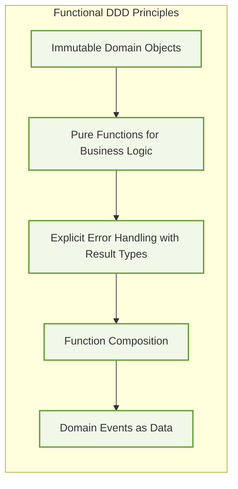
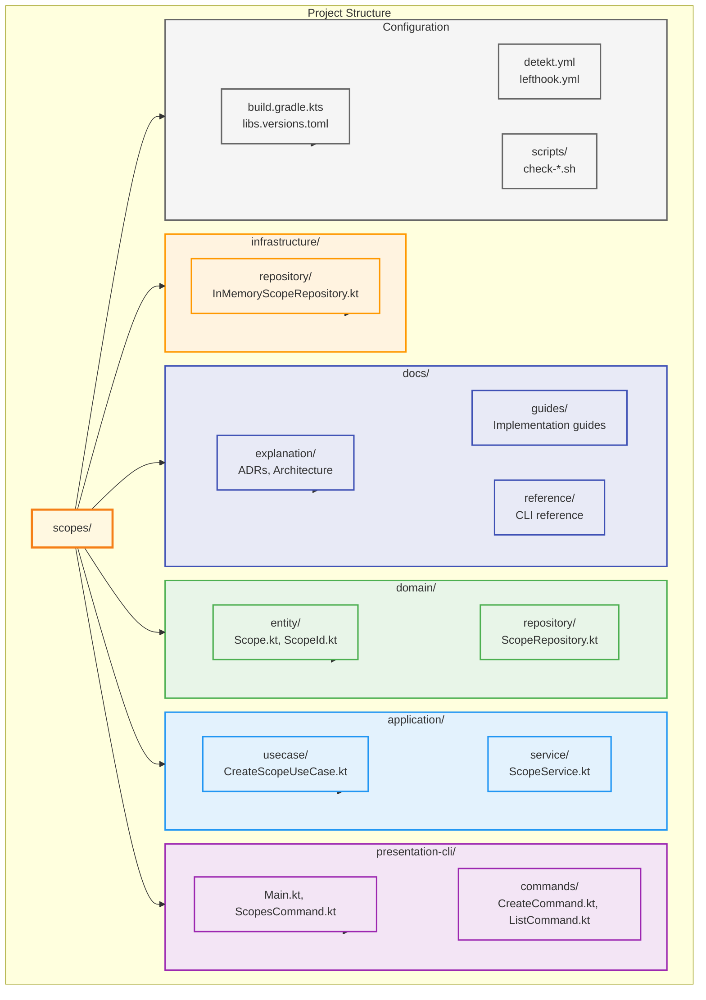
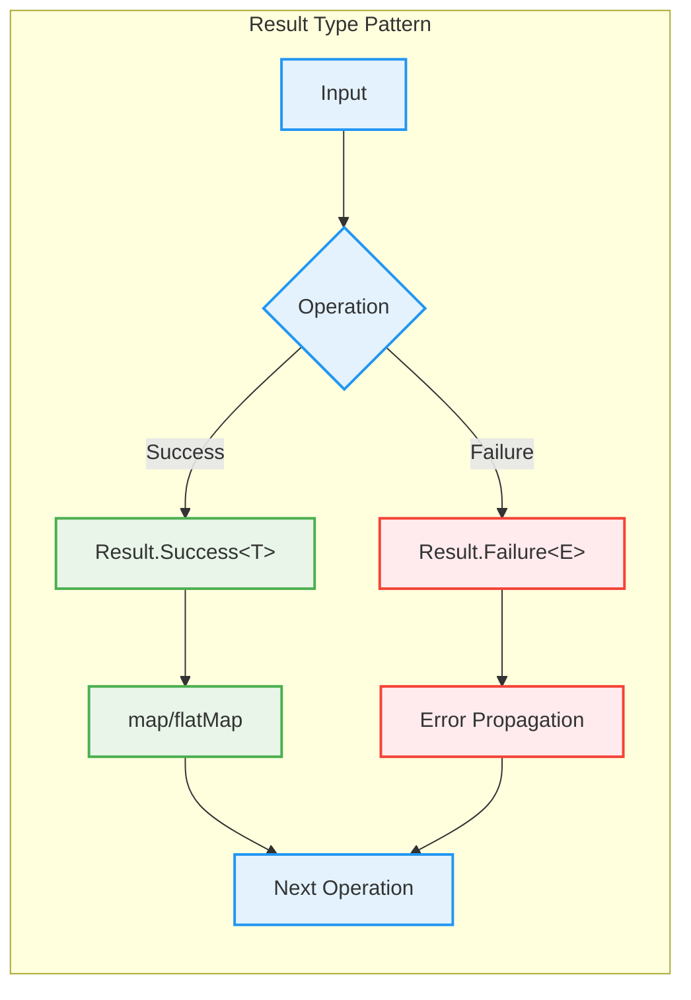
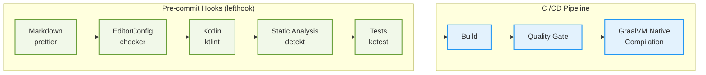

# Development Guidelines

This guide provides comprehensive guidelines for developing the Scopes project, based on our architectural decisions and coding standards.


## Architecture Overview

Scopes follows **Clean Architecture** principles with **Domain-Driven Design (DDD)** and **Functional Programming** paradigms. Key architectural decisions are documented in our [ADRs](../explanation/adr/).

### Core Architectural Principles

1. **Local-First Architecture** ([ADR-0001](../explanation/adr/0001-local-first-architecture.md))
2. **AI-Driven Development** ([ADR-0002](../explanation/adr/0002-ai-driven-development-architecture.md))
3. **Clean Architecture** ([ADR-0008](../explanation/adr/0008-clean-architecture-adoption.md))
4. **Domain-Driven Design** ([ADR-0007](../explanation/adr/0007-domain-driven-design-adoption.md))
5. **Functional DDD** ([ADR-0011](../explanation/adr/0011-functional-ddd-adoption.md))

## Clean Architecture Guidelines

### Module Dependencies


### Dependency Rules

- **Domain Layer**: No dependencies on other layers
- **Application Layer**: Depends only on Domain
- **Infrastructure Layer**: Depends only on Domain
- **Presentation Layer**: Depends only on Application

### Layer Responsibilities

#### Domain Layer (`:domain`)
- Entities, Value Objects, Domain Services
- Repository interfaces
- Domain events and aggregates
- Business rules and invariants

#### Application Layer (`:application`)
- Use cases and application services
- Command/Query handlers
- Application-specific business logic
- Orchestration of domain objects

#### Infrastructure Layer (`:infrastructure`)
- Repository implementations
- External service integrations
- Data persistence
- Technical concerns

#### Presentation Layer (`:presentation-cli`)
- User interface (CLI commands)
- Input validation and formatting
- Response mapping
- Error presentation

## Functional DDD Implementation

Following [ADR-0011](../explanation/adr/0011-functional-ddd-adoption.md), we implement Domain-Driven Design using functional programming principles.

### Core Principles



1. **Immutable Domain Objects**
2. **Pure Functions for Business Logic**
3. **Explicit Error Handling with Result Types**
4. **Function Composition**
5. **Domain Events as Data**

### Implementation Patterns

#### 1. Immutable Entities

```kotlin
// ✅ Good: Immutable data class
data class Scope(
        val id: ScopeId,
        val title: String,
        val description: String?,
        val parentId: ScopeId?,
        val createdAt: Instant,
        val updatedAt: Instant
) {
        // Pure functions for business logic
        fun updateTitle(newTitle: String): Scope =
            copy(title = newTitle, updatedAt = Clock.System.now())

        fun addChild(childId: ScopeId): ScopeCreated =
            ScopeCreated(parentId = id, childId = childId)
}

// ❌ Bad: Mutable entity
class Scope {
        var title: String = ""
        fun setTitle(newTitle: String) {
            this.title = newTitle
        }
}
```

#### 2. Value Objects with ULID

```kotlin
// ✅ Good: Immutable value object with ULID
@JvmInline
value class ScopeId private constructor(private val value: String) {
        companion object {
            fun generate(): ScopeId = ScopeId(Ulid.fast().toString())
            fun from(value: String): ScopeId = ScopeId(value)
        }

        override fun toString(): String = value
}
```

#### 3. Arrow Either for Error Handling

```kotlin
// Import Arrow Either
import arrow.core.Either
import arrow.core.raise.either

// ✅ Good: Use Either types from Arrow
interface ScopeRepository {
        suspend fun findById(id: ScopeId): Either<RepositoryError, Scope?>
        suspend fun save(scope: Scope): Either<RepositoryError, Scope>
}

// ❌ Bad: Exception-based approach
interface ScopeRepository {
        @Throws(RepositoryException::class)
        suspend fun findById(id: ScopeId): Scope?
}
```

#### 4. Pure Domain Services

```kotlin
// ✅ Good: Pure function domain service with Arrow Either
object ScopeValidationService {
        fun validateTitle(title: String): Either<ValidationError, String> = either {
            ensure(title.isNotBlank()) { ValidationError.EmptyTitle }
            ensure(title.length <= 200) { ValidationError.TitleTooLong }
            title.trim()
        }
}

// ❌ Bad: Service with side effects
class ScopeValidationService {
        private val logger = LoggerFactory.getLogger(this::class.java)

        fun validateTitle(title: String): Boolean {
            logger.info("Validating title: $title") // Side effect
            return title.isNotBlank()
        }
}
```

## Coding Standards

### Kotlin Style Guidelines

#### 1. Naming Conventions

```kotlin
// ✅ Good: Clear, descriptive names
class CreateScopeUseCase
data class ScopeCreationRequest
sealed class DomainError

// ❌ Bad: Abbreviations and unclear names
class CSUseCase
data class ScopeReq
sealed class Err
```

#### 2. Function Composition

```kotlin
// ✅ Good: Function composition with Arrow Either
fun createScope(request: CreateScopeRequest): Either<DomainError, Scope> =
        validateTitle(request.title)
            .flatMap { title -> validateParent(request.parentId) }
            .map { _ ->
                Scope(
                    id = ScopeId.generate(),
                    title = request.title,
                    description = request.description,
                    parentId = request.parentId,
                    createdAt = Clock.System.now(),
                    updatedAt = Clock.System.now()
                )
            }
```

#### 3. Sealed Classes for Domain Modeling

```kotlin
// ✅ Good: Sealed classes for domain states
sealed class ScopeCommand {
        data class Create(val title: String, val description: String?) : ScopeCommand()
        data class Update(val id: ScopeId, val title: String) : ScopeCommand()
        data class Delete(val id: ScopeId) : ScopeCommand()
}

sealed class DomainError {
        object ScopeNotFound : DomainError()
        data class ValidationFailed(val message: String) : DomainError()
        data class RepositoryError(val cause: Throwable) : DomainError()
}
```

### Code Organization

#### 1. Package Structure



#### 2. File Naming

- Use PascalCase for classes: `CreateScopeUseCase.kt`
- One public class per file
- File name matches primary class name

## Module Structure

### Dependencies in `build.gradle.kts`

#### Domain Module
```kotlin
// domain/build.gradle.kts
dependencies {
        implementation(libs.kotlin.stdlib)
        implementation(libs.kotlinx.datetime)
        implementation(libs.ulid.creator)

        testImplementation(libs.bundles.kotest)
}
```

#### Application Module
```kotlin
// application/build.gradle.kts
dependencies {
        implementation(project(":domain"))
        implementation(libs.kotlinx.coroutines.core)

        testImplementation(libs.bundles.kotest)
        testImplementation(libs.mockk)
}
```

### Version Management

Use `gradle/libs.versions.toml` for centralized version management:

```toml
[versions]
kotlin = "2.2.0"
kotlinx-coroutines = "1.10.2"

[libraries]
kotlin-stdlib = { module = "org.jetbrains.kotlin:kotlin-stdlib" }
kotlinx-coroutines-core = { module = "org.jetbrains.kotlinx:kotlinx-coroutines-core", version.ref = "kotlinx-coroutines" }

[bundles]
kotest = ["kotest-runner-junit5", "kotest-assertions-core", "kotest-property"]
```

## Error Handling

### Result Type Implementation



```kotlin
// Result type extensions for composition
inline fun <T, E, R> Result<T, E>.map(transform: (T) -> R): Result<R, E> =
        when (this) {
            is Result.Success -> Result.Success(transform(value))
            is Result.Failure -> this
        }

inline fun <T, E, R> Result<T, E>.flatMap(transform: (T) -> Result<R, E>): Result<R, E> =
        when (this) {
            is Result.Success -> transform(value)
            is Result.Failure -> this
        }
```

### Error Hierarchy

```mermaid
classDiagram
        class DomainError {
            <<sealed>>
        }
        class ApplicationError {
            <<sealed>>
        }
        class RepositoryError {
            <<sealed>>
        }

        class ScopeNotFound {
            object
        }
        class ValidationFailed {
            +field: String
            +message: String
        }
        class BusinessRuleViolation {
            +rule: String
        }

        class DomainErrorWrapper {
            +error: DomainError
        }
        class InfrastructureError {
            +message: String
        }

        class ConnectionError {
            +cause: Throwable
        }
        class DataIntegrityError {
            +message: String
        }
        class NotFound {
            object
        }

        DomainError <|-- ScopeNotFound
        DomainError <|-- ValidationFailed
        DomainError <|-- BusinessRuleViolation

        ApplicationError <|-- DomainErrorWrapper
        ApplicationError <|-- InfrastructureError

        RepositoryError <|-- ConnectionError
        RepositoryError <|-- DataIntegrityError
        RepositoryError <|-- NotFound

        DomainErrorWrapper --> DomainError : contains

        classDef domain fill:#e8f5e8,stroke:#4caf50,stroke-width:2px
        classDef application fill:#e3f2fd,stroke:#2196f3,stroke-width:2px
        classDef infrastructure fill:#fff3e0,stroke:#ff9800,stroke-width:2px

        class DomainError domain
        class ScopeNotFound domain
        class ValidationFailed domain
        class BusinessRuleViolation domain

        class ApplicationError application
        class DomainErrorWrapper application
        class InfrastructureError application

        class RepositoryError infrastructure
        class ConnectionError infrastructure
        class DataIntegrityError infrastructure
        class NotFound infrastructure
```



```kotlin
sealed class DomainError {
        object ScopeNotFound : DomainError()
        data class ValidationFailed(val field: String, val message: String) : DomainError()
        data class BusinessRuleViolation(val rule: String) : DomainError()
}

sealed class ApplicationError {
        data class DomainError(val error: io.github.kamiazya.scopes.domain.DomainError) : ApplicationError()
        data class InfrastructureError(val message: String) : ApplicationError()
}
```

## Testing Guidelines

### Test Structure

Use **Kotest** framework following our architectural decisions:

```kotlin
class CreateScopeUseCaseTest : FunSpec({
        test("should create scope with valid data") {
            // Given
            val request = CreateScopeRequest(
                title = "Test Scope",
                description = "Test Description"
            )
            val mockRepository = mockk<ScopeRepository>()

            every { mockRepository.save(any()) } returns Result.Success(
                // ... scope object
            )

            val useCase = CreateScopeUseCase(mockRepository)

            // When
            val result = useCase.execute(request)

            // Then
            result shouldBe instanceOf<Result.Success<*>>()
        }
})
```

### Test Categories

1. **Unit Tests**: Test individual functions and classes
2. **Integration Tests**: Test module interactions
3. **Architecture Tests**: Verify architectural constraints with Konsist

### Architecture Testing with Konsist

Konsist automatically validates Clean Architecture and DDD principles:

```bash
# Run architecture tests
./gradlew konsistTest
```

Our architecture tests verify:

- **Layer Dependencies**: Domain layer isolation from outer layers
- **Clean Architecture**: Application layer restrictions  
- **DDD Patterns**: Repository, UseCase, Entity naming conventions
- **Code Quality**: PascalCase classes, immutable data classes
- **Functional Programming**: No mutable collections in domain

Example architecture test:

```kotlin
class BasicArchitectureTest : StringSpec({
    "domain module should not import application layer" {
        Konsist
            .scopeFromModule("domain")
            .files
            .assertFalse { file ->
                file.imports.any { import ->
                    import.name.contains("application")
                }
            }
    }
})
```

### Property-Based Testing

```kotlin
class ScopeIdTest : FunSpec({
        test("ULID generation should be unique") {
            checkAll<String> { _ ->
                val id1 = ScopeId.generate()
                val id2 = ScopeId.generate()
                id1 shouldNotBe id2
            }
        }
})
```

## Code Quality Tools

### Quality Pipeline



### Detekt Configuration

Our `detekt.yml` enforces:
- Maximum line length: 120 characters
- Complexity thresholds
- Naming conventions
- Function length limits

### Pre-commit Hooks

Lefthook runs automatically:
- **Markdown formatting**: `prettier`
- **EditorConfig compliance**: `editorconfig-checker`
- **Kotlin linting**: `ktlint`
- **Static analysis**: `detekt`
- **Tests**: `./gradlew test`
- **Architecture Tests**: `./gradlew konsistTest`

### Running Quality Checks

```bash
# Run all quality checks
./gradlew check

# Individual tools
./gradlew ktlint
./gradlew detekt
./gradlew test

# Pre-commit hook simulation
lefthook run pre-commit
```

## Development Workflow

### Daily Development

1. **Setup Local Environment**
  ```bash
  git clone <repository>
  cd scopes
  ./gradlew build  # Verify everything works
  ```

2. **Create Feature Branch**
  ```bash
  git checkout -b feature/your-feature-name
  ```

3. **Make Changes**
  - Follow coding standards
  - Write tests for new functionality
  - Update documentation as needed

4. **Auto-format Code** (recommended before commit)
  ```bash
  # Format all files at once
  ./scripts/format-all.sh

  # Or format individually:
  ./gradlew ktlintFormat    # Kotlin files
  ```

5. **Test Your Changes**
  ```bash
  ./gradlew test           # Run all tests
  ./gradlew konsistTest    # Run architecture tests
  ./gradlew detekt         # Static analysis
  ./gradlew ktlintCheck    # Code formatting check
  ```

6. **Commit Changes**
  ```bash
  git add .
  git commit -m "feat: your descriptive message"
  # Note: Pre-commit hooks will auto-format and stage fixes
  ```

7. **Push and Create PR**
  ```bash
  git push origin feature/your-feature-name
  ```

### Automated Git Hooks

Pre-commit hooks are configured via `lefthook.yml` and will automatically:
- **Auto-format** Kotlin code with `ktlintFormat`
- **Auto-fix** Markdown issues with `markdownlint --fix`
- **Stage fixed files** automatically
- Run tests and static analysis

To install hooks:
```bash
lefthook install
```

### Manual Formatting Commands

```bash
# Format specific file types
./gradlew ktlintFormat          # Kotlin files
./scripts/format-all.sh         # All supported files

# Check formatting without fixes
./gradlew ktlintCheck           # Kotlin formatting check
./gradlew detekt                # Static analysis

# Run tests
./gradlew test                  # Unit tests
./gradlew build                 # Full build with tests
```

## Best Practices Summary

### Do ✅

- Use immutable data classes for domain objects
- Implement pure functions for business logic
- Use Result types for error handling
- Follow Clean Architecture dependency rules
- Write comprehensive tests with Kotest
- Use ULID for distributed identifiers
- Document architectural decisions in ADRs

### Don't ❌

- Create mutable domain objects
- Use exceptions for business logic errors
- Violate module dependency rules
- Skip tests for critical business logic
- Use UUID instead of ULID
- Implement side effects in domain layer
- Create circular dependencies between modules

## Resources

- [Architecture Decision Records](../explanation/adr/)
- [GraalVM Setup Guide](./graalvm-setup.md)
- [Project Architecture Overview](../explanation/architecture-overview.md)
- [Contributing Guidelines](../../CONTRIBUTING.md)
