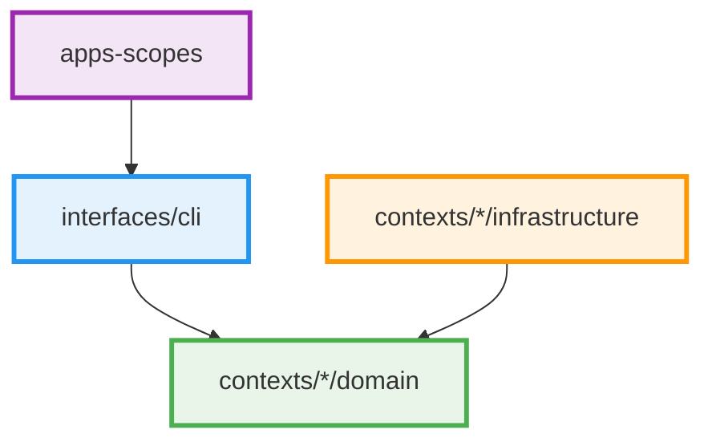

# Development Guidelines Index

This directory contains modular development guidelines for the Scopes project. Each guide focuses on a specific aspect of development to keep documentation manageable and context-efficient.

## Quick Links

### Core Architecture
- [Error Handling](./error-handling.md) - Comprehensive error handling strategies
- [Arrow Style Guide](./arrow-style-guide.md) - Functional programming patterns with Arrow

### Implementation Guidelines
- [DTO Guidelines](./dto-guidelines.md) - Data Transfer Object naming and placement
- [Testing Patterns](./testing.md) - Testing strategies and patterns
- [Changeset Workflow](./changeset-workflow.md) - Version management and automated releases
<!-- Coming soon: Additional implementation guides -->
<!-- - [Validation Patterns](./validation-patterns.md) - Validation service architecture -->

### Advanced Topics
<!-- Coming soon: Advanced development topics -->
<!-- - [Contracts Slim Policy](./contracts-slim-policy.md) - Contract layer design principles -->
<!-- - [Platform Abstractions](./platform-abstractions.md) - Platform layer minimization -->
<!-- - [Suspend Either Guidelines](./suspend-either-patterns.md) - Async error handling -->

## Overview

Scopes follows **Clean Architecture** principles with **Domain-Driven Design (DDD)** and **Functional Programming** paradigms. The current implementation emphasizes:

1. **Strongly-Typed Domain Identifiers** - ScopeId value objects replace raw strings
2. **Service-Specific Error Hierarchies** - Rich error context for different validation scenarios
3. **Clean Architecture with Functional DDD** - Domain layer isolation with repository-dependent validation
4. **Error Translation Patterns** - Service errors mapped to use case errors with rich context
5. **ValidationResult for Error Accumulation** - Comprehensive validation feedback

## Quick Start

For new developers, read these guides in order:

1. [Error Handling](./error-handling.md) - Learn error handling approach
2. [Arrow Style Guide](./arrow-style-guide.md) - Functional programming patterns
3. Review the main architecture documentation for broader context

## Architecture Summary



## Best Practices Summary

### Current Implementation Standards ✅

- **Strongly-typed domain identifiers**: Use `ScopeId` everywhere instead of `String`
- **Service-specific error hierarchies**: Rich error context with detailed information
- **Comprehensive error translation**: Service errors mapped to use case errors
- **ValidationResult for error accumulation**: Multiple validation errors collected
- **Repository-dependent validation separation**: Clean domain layer isolation
- **Functional error handling**: Arrow Either for explicit error propagation
- **Architecture testing**: Konsist validation of Clean Architecture principles
- **Transaction boundary clarity**: Clear separation of concerns in use case handlers
- **Context-aware error mapping**: Errors mapped based on specific operation context

## Development Workflow

### Using Wrapper Scripts (Recommended)

For daily development, use the wrapper scripts for enhanced debugging:

```bash
# 1. Start daemon in debug mode
./scopesd --debug --log-level DEBUG

# 2. Run CLI with debug support
./scopes --debug --transport grpc create "Development Task"

# 3. Architecture validation (enforced by Konsist)
./scopes --gradle-task konsistTest

# 4. Comprehensive test suite
./scopes --gradle-task test

# 5. Code formatting and style
./scopes --gradle-task ktlintFormat
./scopes --gradle-task detekt

# 6. Full build verification  
./scopes --gradle-task build
```

### Traditional Gradle Commands

For CI/CD and advanced scenarios:

```bash
# 1. Architecture validation (enforced by Konsist)
./gradlew konsistTest

# 2. Comprehensive test suite
./gradlew test

# 3. Code formatting and style
./gradlew ktlintFormat
./gradlew detekt

# 4. Full build verification  
./gradlew build
```

## Related Documentation

- [Development Wrapper Scripts](../development-wrapper-scripts.md) - Enhanced development experience
- [Clean Architecture](../../explanation/clean-architecture.md) - Architecture principles
- [Domain-Driven Design](../../explanation/domain-driven-design.md) - DDD patterns
- [Architecture Testing Guide](../architecture-testing-guide.md) - Konsist usage
- [Use Case Style Guide](../use-case-style-guide.md) - UseCase pattern implementation
