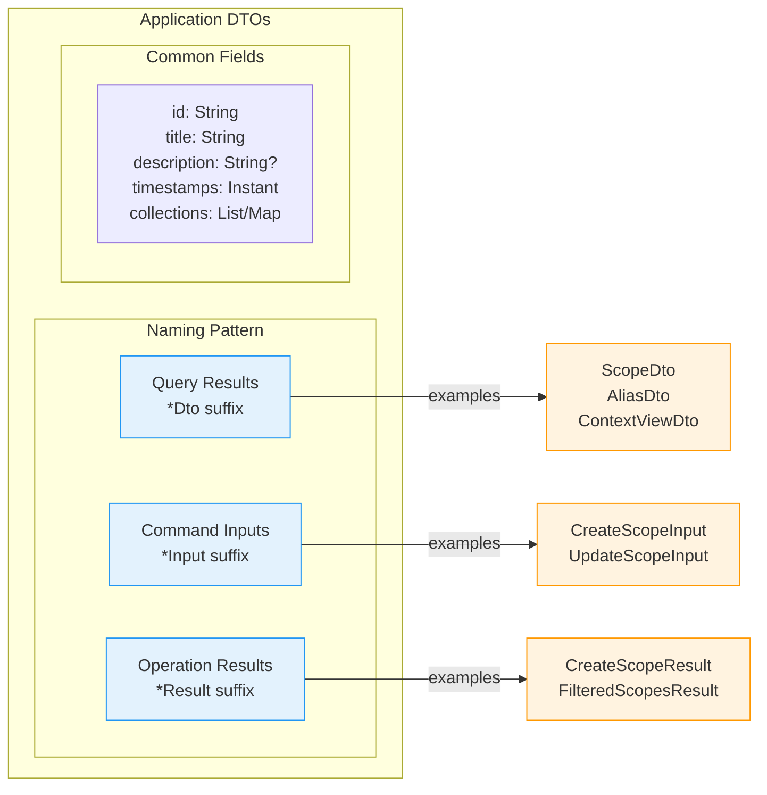
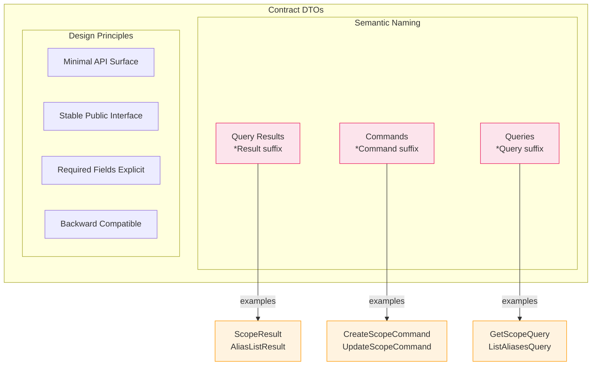
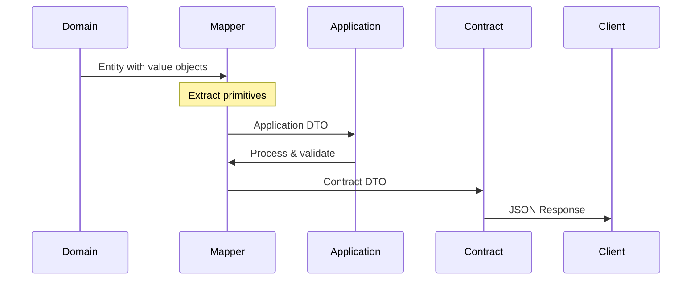

# DTO Naming and Placement Guidelines

This guide covers Data Transfer Object (DTO) conventions, naming patterns, and architectural placement within the Scopes project.

## Table of Contents
- [Overview](#overview)
- [Naming Conventions](#naming-conventions)
- [DTO Placement Structure](#dto-placement-structure)
- [Design Principles](#design-principles)
- [Mapping Between Layers](#mapping-between-layers)
- [Migration Strategy](#migration-strategy)
- [Architecture Testing](#architecture-testing)

## Overview

DTOs serve as data structures for transferring information between architectural layers. The project uses distinct naming conventions to maintain clear separation of concerns.

## Naming Conventions

### Application Layer DTOs

**Convention**: Use `Dto` suffix for data structures within application boundaries



**Key Characteristics**:
- Rich internal representation with optional fields
- Primitive types only (no domain objects)
- Default values for collections
- Implement DTO marker interface

### Contract Layer DTOs

**Convention**: Use semantic suffixes based on purpose



**Key Characteristics**:
- Minimal stable external representation
- Public visibility modifiers
- Required fields without defaults where appropriate
- Focus on API stability over internal flexibility

## DTO Placement Structure

### Application Layer Structure

```
contexts/{context}/application/src/main/kotlin/.../application/dto/
├── common/
│   ├── DTO.kt                    # Base DTO marker interface
│   └── PagedResult.kt            # Common pagination wrapper
├── scope/
│   ├── ScopeDto.kt              # Main scope data transfer object
│   ├── CreateScopeResult.kt     # Scope creation response
│   ├── FilteredScopesResult.kt  # Scope filtering response
│   └── UpdateScopeInput.kt      # Scope update input
├── alias/
│   ├── AliasDto.kt              # Alias information
│   ├── AliasListDto.kt          # Alias collection wrapper  
│   └── AliasInfoDto.kt          # Detailed alias metadata
├── context/
│   └── ContextViewDto.kt        # Context view information
└── aspect/
    ├── AspectDefinitionDto.kt   # Aspect definition data
    └── ValidateAspectValueRequest.kt # Aspect validation input
```

### Contract Layer Structure

```
contracts/{context}/src/main/kotlin/.../contracts/{context}/
├── commands/
│   ├── CreateScopeCommand.kt
│   ├── UpdateScopeCommand.kt
│   ├── AddAliasCommand.kt
│   └── RemoveAliasCommand.kt
├── queries/
│   ├── GetScopeQuery.kt
│   ├── ListScopesWithQueryQuery.kt
│   └── GetChildrenQuery.kt
├── results/
│   ├── ScopeResult.kt
│   ├── ScopeListResult.kt
│   ├── AliasInfo.kt
│   └── CreateScopeResult.kt
└── errors/
    └── ScopeContractError.kt
```

## Design Principles

### 1. Layer-Appropriate Design

**Application DTOs** - Rich internal representation:
```kotlin
// ✅ Application DTO - Rich internal representation
data class ScopeDto(
    val id: String,
    val title: String,
    val description: String?,
    val parentId: String?,
    val canonicalAlias: String? = null,          // Optional for internal use
    val customAliases: List<String> = emptyList(), // Rich alias information
    val createdAt: Instant,
    val updatedAt: Instant,
    val aspects: Map<String, List<String>> = emptyMap() // Complex nested data
)
```

**Contract DTOs** - Minimal stable external representation:
```kotlin
// ✅ Contract DTO - Minimal stable external representation  
data class ScopeResult(
    val id: String,
    val title: String,
    val description: String?,
    val parentId: String?,
    val canonicalAlias: String,                  // Required for external consumers
    val createdAt: Instant,
    val updatedAt: Instant,
    val isArchived: Boolean = false,             // Simple boolean flag
    val aspects: Map<String, List<String>> = emptyMap()
)
```

### 2. Immutability and Data Classes

```kotlin
// ✅ Proper DTO structure
data class ScopeDto(
    val id: String,
    val title: String,
    val description: String? = null,      // Default for optional fields
    val customAliases: List<String> = emptyList(), // Default collections
    val createdAt: Instant,
    val updatedAt: Instant,
) : DTO // Implement marker interface for application DTOs

// ✅ Contract DTO with public visibility
public data class ScopeResult(
    public val id: String,
    public val title: String, 
    public val canonicalAlias: String,
    public val createdAt: Instant,
    public val updatedAt: Instant,
)
```

### 3. Primitive Types Only

DTOs should contain only primitive types to maintain layer separation:

```kotlin
// ✅ Good - primitive types only
data class ScopeDto(
    val id: String,                              // Not ScopeId
    val title: String,                           // Not ScopeTitle  
    val parentId: String?,                       // Not ScopeId?
    val createdAt: Instant,                      // Instant is acceptable
    val aspects: Map<String, List<String>>       // Collections of primitives
)

// ❌ Bad - domain types leak
data class BadScopeDto(
    val id: ScopeId,                             // Domain value object
    val title: ScopeTitle,                       // Domain value object
    val parent: Scope?                           // Domain entity
)
```

## Mapping Between Layers

### Data Transformation Flow

```mermaid
flowchart LR
    subgraph "Domain Layer"
        DE[Domain Entity<br/>• ScopeId value object<br/>• ScopeTitle value object<br/>• Rich types]
    end

    subgraph "Mappers"
        M1[ScopeMapper<br/>.toScopeDto()]
        M2[ContractMapper<br/>.toScopeResult()]
    end

    subgraph "Application Layer"
        AD[Application DTO<br/>• id: String<br/>• title: String<br/>• Primitives only]
    end

    subgraph "Contract Layer"
        CD[Contract DTO<br/>• Stable API<br/>• Public fields<br/>• External format]
    end

    subgraph "External"
        JSON[JSON/XML Response]
    end

    DE -->|Extract primitives| M1
    M1 --> AD
    AD -->|Add defaults| M2
    M2 --> CD
    CD -->|Serialize| JSON

    classDef domain fill:#e8f5e9,stroke:#4caf50
    classDef application fill:#e3f2fd,stroke:#2196f3
    classDef contract fill:#fce4ec,stroke:#e91e63
    classDef external fill:#f5f5f5,stroke:#9e9e9e

    class DE domain
    class AD application
    class CD contract
    class JSON external
```

### Mapping Patterns

#### Key Transformation Rules

| From (Domain) | Operation | To (DTO) | Example |
|--------------|-----------|----------|----------|
| Value Object | `.value` extraction | Primitive | `ScopeId` → `String` |
| Optional Value Object | `?.value` | Nullable Primitive | `ScopeDescription?` → `String?` |
| Collection of Value Objects | `.map { it.value }` | Collection of Primitives | `List<Alias>` → `List<String>` |
| Complex Types | `.toString()` | String representation | `AspectValue` → `String` |
| Missing in source | Default value | Contract requirement | N/A → `isArchived = false` |

#### Mapper Responsibilities

**Domain to Application Mapper:**
- Extract primitives from value objects
- Handle nullable types safely
- Transform collections
- No business logic

**Application to Contract Mapper:**
- Add contract-specific defaults
- Handle optional to required field conversions
- Ensure backward compatibility
- Format for external consumption

### Complete Data Flow



## Validation and Documentation

### DTO Documentation

```kotlin
/**
 * Data Transfer Object for Scope entity.
 * Contains only primitive types to maintain layer separation.
 *
 * Used internally within the application layer for:
 * - Query result mapping from domain entities
 * - Input validation before domain entity creation
 * - Response formatting for use case handlers
 *
 * Includes both canonical and custom aliases to provide complete scope information
 * without exposing internal ULID implementation details.
 */
data class ScopeDto(
    /** Unique identifier as string representation of ScopeId ULID */
    val id: String,
    /** Human-readable scope title (validated in domain layer) */
    val title: String,
    /** Optional scope description */
    val description: String?,
    /** Parent scope ID if this is a child scope */
    val parentId: String?,
    /** System-generated canonical alias for this scope */
    val canonicalAlias: String? = null,
    /** User-defined custom aliases for this scope */
    val customAliases: List<String> = emptyList(),
    /** Timestamp when scope was created */
    val createdAt: Instant,
    /** Timestamp when scope was last updated */
    val updatedAt: Instant,
    /** Aspect values as string map for serialization compatibility */
    val aspects: Map<String, List<String>> = emptyMap(),
)
```

## Architecture Testing

Konsist rules to enforce DTO conventions:

```kotlin
"application DTOs should use Dto suffix" {
    Konsist
        .scopeFromDirectory("contexts/*/application")
        .classes()
        .withPackage("..dto..")
        .assert { 
            it.name.endsWith("Dto") || 
            it.name.endsWith("Result") || 
            it.name.endsWith("Input") ||
            it.name == "DTO"
        }
}

"contract DTOs should use appropriate suffixes" {
    Konsist
        .scopeFromDirectory("contracts")
        .classes()
        .assert {
            when {
                it.resideInPackage("..commands..") -> it.name.endsWith("Command")
                it.resideInPackage("..queries..") -> it.name.endsWith("Query")  
                it.resideInPackage("..results..") -> it.name.endsWith("Result") || it.name.endsWith("Info")
                else -> true
            }
        }
}

"DTOs should only contain primitive types" {
    Konsist
        .scopeFromDirectory("contexts/*/application", "contracts")
        .classes()
        .withNameEndingWith("Dto", "Result", "Command", "Query")
        .properties()
        .assert { property ->
            val allowedTypes = setOf(
                "String", "Int", "Long", "Boolean", "Double", "Float",
                "Instant", "LocalDate", "LocalDateTime", "LocalTime",
                "List", "Set", "Map", "Array"
            )
            property.type.sourceType in allowedTypes || 
            property.type.isGeneric || // Allow generic collections
            property.hasNullableType // Allow nullable primitives
        }
}
```

## Migration Strategy

When updating DTO naming conventions:

1. **Add new DTOs** with proper naming alongside existing ones
2. **Update mappers** to support both old and new formats
3. **Gradually migrate usage** from old to new DTOs
4. **Deprecate old DTOs** with clear migration guidance
5. **Remove deprecated DTOs** after grace period

```kotlin
// Phase 1: Add new DTO alongside existing
@Deprecated("Use ScopeResult instead", ReplaceWith("ScopeResult"))
data class ScopeDto(/* existing fields */)

data class ScopeResult(/* new contract-appropriate fields */)

// Phase 2: Update mappers to support both
object ScopeMapper {
    @Deprecated("Use toScopeResult instead")
    fun toScopeDto(scope: Scope): ScopeDto = /* existing mapping */
    
    fun toScopeResult(scope: Scope): ScopeResult = /* new mapping */
}
```

## Key Benefits

- **Clear separation** between application and contract DTOs
- **Consistent naming** conventions across the codebase  
- **Maintainable structure** with domain-based organization
- **Type safety** with primitive-only constraints
- **Documentation** for proper usage and context
- **Architecture enforcement** through automated testing

## Related Documentation

- [Clean Architecture](../../explanation/clean-architecture.md) - Architecture principles
- [Error Handling](./error-handling.md) - Error DTO patterns
- [Domain-Driven Design](../../explanation/domain-driven-design.md) - DDD patterns
