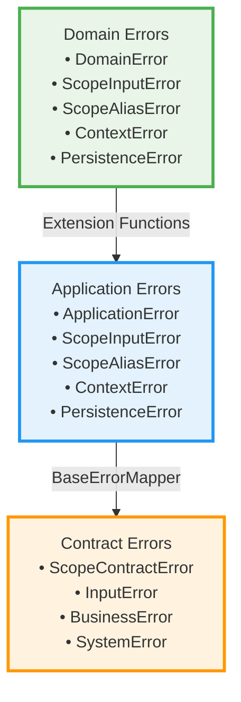

# Error Handling Guidelines

This guide covers the comprehensive error handling architecture used in the Scopes project, including error hierarchies, translation patterns, and best practices.

## Table of Contents
- [Core Principles](#core-principles)
- [Error Hierarchy Architecture](#error-hierarchy-architecture)
- [Error Translation Patterns](#error-translation-patterns)
- [ValidationResult Pattern](#validationresult-pattern)
- [Error Mapping Boundaries](#error-mapping-boundaries)
- [Testing Error Handling](#testing-error-handling)
- [Best Practices](#best-practices)

## Core Principles

### Fail-Fast Philosophy

The system implements fail-fast error handling to prevent data corruption and ensure system reliability:

```kotlin
// ✅ Fail-fast implementation for unmapped errors
fun DomainScopeAliasError.toApplicationError(): ApplicationError = when (this) {
    is DomainScopeAliasError.DataInconsistencyError.AliasExistsButScopeNotFound ->
        AppScopeAliasError.DataInconsistencyError.AliasExistsButScopeNotFound(
            aliasName = this.aliasName,
            scopeId = this.scopeId.toString(),
        )
    
    // Fail fast for any unmapped DataInconsistencyError subtypes
    is DomainScopeAliasError.DataInconsistencyError ->
        error(
            "Unmapped DataInconsistencyError subtype: ${this::class.simpleName}. " +
                "Please add proper error mapping for this error type.",
        )
}
```

**Rationale for Fail-Fast Approach:**
- **Data Integrity**: Using "unknown" fallbacks masks real problems
- **Early Detection**: Issues are caught in development/testing phases  
- **No Silent Failures**: Better to fail loudly than corrupt data silently
- **Actionable Errors**: Error messages provide clear guidance for developers

### Functional Error Handling with Either

All error handling uses Arrow's Either type for explicit error propagation:

```kotlin
suspend fun processData(input: String): Either<ScopesError, Result> = either {
    val validated = validateInput(input).bind()
    val processed = processAsync(validated).bind()
    Result(processed)
}
```

## Error Hierarchy Architecture

### Service-Specific Error Hierarchies

Each service defines its own detailed error hierarchy:

```kotlin
// Title validation with specific error context
sealed class TitleValidationError : DomainError() {
    object EmptyTitle : TitleValidationError()
    data class TitleTooShort(
        val minLength: Int, 
        val actualLength: Int, 
        val title: String
    ) : TitleValidationError()
    data class TitleTooLong(
        val maxLength: Int, 
        val actualLength: Int, 
        val title: String
    ) : TitleValidationError()
    data class InvalidCharacters(
        val title: String, 
        val invalidCharacters: Set<Char>, 
        val position: Int
    ) : TitleValidationError()
}

// Business rule validation errors
sealed class ScopeBusinessRuleError : ScopesError() {
    data class MaxDepthExceeded(
        val scopeId: ScopeId,
        val currentDepth: Int,
        val maxDepth: Int
    ) : ScopeBusinessRuleError()
    
    data class MaxChildrenExceeded(
        val parentId: ScopeId,
        val currentCount: Int,
        val maxChildren: Int
    ) : ScopeBusinessRuleError()
}
```

### Layer-Specific Error Types



## Error Translation Patterns

### Use Case Error Translation

Systematic error translation from service-specific errors to use case errors:

```kotlin
sealed class CreateScopeError {
    data class TitleValidationFailed(
        val titleError: ScopeInputError.TitleError
    ) : CreateScopeError()
    
    data class HierarchyViolationFailed(
        val hierarchyError: ScopeHierarchyError
    ) : CreateScopeError()
    
    data class DuplicateTitleFailed(
        val uniquenessError: ScopeUniquenessError
    ) : CreateScopeError()
    
    object ParentNotFound : CreateScopeError()
    
    data class SaveFailure(
        val repositoryError: SaveScopeError
    ) : CreateScopeError()
}

// Translation in use case handlers
private fun validateTitleWithServiceErrors(
    title: String
): Either<CreateScopeError, Unit> =
    applicationScopeValidationService.validateTitleFormat(title)
        .mapLeft { titleError -> 
            CreateScopeError.TitleValidationFailed(titleError) 
        }
```

### Domain to Application Mapping

Extension functions for error mapping between layers:

```kotlin
fun DomainPersistenceError.toApplicationError(): ApplicationError = 
    when (this) {
        is DomainPersistenceError.StorageUnavailable ->
            AppPersistenceError.StorageUnavailable(
                operation = this.operation,
                cause = this.cause?.toString(),
            )
        
        is DomainPersistenceError.DataCorruption ->
            AppPersistenceError.DataCorruption(
                entityType = this.entityType,
                entityId = this.entityId,
                reason = this.reason,
            )
        
        // ... other mappings
    }
```

### Application to Contract Mapping

BaseErrorMapper pattern for contract boundaries:

```kotlin
class ApplicationErrorMapper(
    logger: Logger
) : BaseErrorMapper<ApplicationError, ScopeContractError>(logger) {
    
    override fun mapToContractError(
        domainError: ApplicationError
    ): ScopeContractError = when (domainError) {
        is AppScopeInputError.TitleEmpty -> 
            ScopeContractError.InputError.InvalidTitle(
                title = domainError.attemptedValue,
                validationFailure = ScopeContractError.TitleValidationFailure.Empty,
            )
        
        is AppScopeInputError.TitleTooShort -> 
            ScopeContractError.InputError.InvalidTitle(
                title = domainError.attemptedValue,
                validationFailure = ScopeContractError.TitleValidationFailure.TooShort(
                    minimumLength = domainError.minimumLength,
                    actualLength = domainError.attemptedValue.length,
                ),
            )
        
        else -> handleUnmappedError(
            domainError,
            ScopeContractError.SystemError.ServiceUnavailable(
                service = "scope-management"
            ),
        )
    }
}
```

## ValidationResult Pattern

Comprehensive validation with error accumulation:

```kotlin
sealed class ValidationResult<out T> {
    data class Success<T>(val value: T) : ValidationResult<T>()
    data class Failure<T>(
        val errors: NonEmptyList<DomainError>
    ) : ValidationResult<T>()
    
    // Comprehensive validation with error accumulation
    fun <U, V> combine(
        other: ValidationResult<U>, 
        f: (T, U) -> V
    ): ValidationResult<V>
}

// Extension functions for ergonomic usage
fun <T> T.validationSuccess(): ValidationResult<T> = 
    ValidationResult.Success(this)

fun <T> DomainError.validationFailure(): ValidationResult<T> = 
    ValidationResult.Failure(nonEmptyListOf(this))

fun <T> List<ValidationResult<T>>.sequence(): ValidationResult<List<T>>
```

### Usage Example

```kotlin
suspend fun validateScopeCreation(
    title: String,
    description: String?,
    parentId: ScopeId?
): ValidationResult<Unit> {
    val validations = listOf(
        ScopeTitle.create(title).toValidationResult().map { },
        ScopeDescription.create(description).toValidationResult().map { },
        validateHierarchyDepth(parentId).toValidationResult(),
        validateChildrenLimit(parentId).toValidationResult(),
        validateTitleUniqueness(title, parentId).toValidationResult()
    )

    return validations.sequence().map { }
}
```

## Error Mapping Boundaries

### Context-Specific Mapping

Map errors based on the specific operation context:

```kotlin
class CreateScopeHandler {
    override suspend fun invoke(input: CreateScope) = either {
        // Context-specific error for parent validation
        val parent = repository.findById(input.parentId)
            .mapLeft { error ->
                ApplicationError.ScopeHierarchyError.ParentNotFound(
                    scopeId = "new",
                    parentId = input.parentId
                )
            }.bind()
        
        // Context-specific error for duplicate title
        val exists = repository.existsByTitle(input.title)
            .mapLeft { error ->
                ApplicationError.ScopeUniquenessError.DuplicateTitle(
                    title = input.title,
                    parentScopeId = input.parentId,
                    existingScopeId = "unknown"
                )
            }.bind()
    }
}
```

### Cross-Context Error Mapping

Handle errors across bounded contexts:

```kotlin
class EventStoreToScopeErrorMapper(
    logger: Logger
) : BaseCrossContextErrorMapper<EventStoreError, ScopesError>(logger) {
    
    override fun mapCrossContext(
        sourceError: EventStoreError
    ): ScopesError = when (sourceError) {
        is EventStoreError.ConnectionError -> 
            PersistenceError.StorageUnavailable(
                operation = "event-store-access",
                cause = sourceError.cause?.message
            )
        
        is EventStoreError.SerializationError -> 
            PersistenceError.DataCorruption(
                entityType = "event",
                entityId = sourceError.eventId,
                reason = "Event serialization failed: ${sourceError.details}"
            )
        
        else -> handleUnmappedCrossContextError(
            sourceError,
            PersistenceError.StorageUnavailable(
                operation = "cross-context-mapping",
                cause = "Unmapped EventStore error: ${sourceError::class.simpleName}"
            )
        )
    }
}
```

## Testing Error Handling

### Specification Testing

Test that error mappings preserve important information:

```kotlin
class ErrorMappingSpecificationTest : DescribeSpec({
    describe("Error mapping specifications") {
        it("should preserve error context during mapping") {
            val domainError = DomainScopeInputError.TitleError.TooShort(
                occurredAt = Clock.System.now(),
                attemptedValue = "ab",
                minimumLength = 3
            )
            
            val applicationError = domainError.toApplicationError() 
                as AppScopeInputError.TitleTooShort
            
            applicationError.attemptedValue shouldBe "ab"
            applicationError.minimumLength shouldBe 3
        }
        
        it("should fail fast for unmapped error types") {
            // Test that unmapped errors throw meaningful exceptions
            // rather than returning fallback errors
        }
    }
})
```

### Service-Specific Error Testing

Verify error translation and context preservation:

```kotlin
describe("title validation error translation") {
    it("should translate TitleTooShort to ValidationFailed") {
        val command = CreateScope(
            title = "ab",
            description = "Test description", 
            parentId = null,
            metadata = emptyMap()
        )

        coEvery { 
            mockValidationService.validateTitleFormat("ab") 
        } returns TitleValidationError.TitleTooShort(3, 2, "ab").left()
        
        val result = handler.invoke(command)
        
        result.isLeft() shouldBe true
        val error = result.leftOrNull()
            .shouldBeInstanceOf<CreateScopeError.TitleValidationFailed>()
        val titleError = error.titleError
            .shouldBeInstanceOf<TitleValidationError.TitleTooShort>()
        titleError.minLength shouldBe 3
        titleError.actualLength shouldBe 2
    }
}
```

## Best Practices

### 1. Error Information Preservation

- **Never lose context**: Important error details must be preserved across mappings
- **Convert complex types**: Domain value objects → strings at application boundary  
- **Maintain error categories**: Validation errors remain validation errors across layers
- **Include actionable information**: Error messages should guide resolution

### 2. Mapping Strategy Selection

**Use Extension Functions when:**
- Mapping domain → application errors
- No additional context is required
- Mappings are reusable across handlers

**Use ErrorMapper Classes when:**
- Mapping application → contract errors
- Logging and fallback handling is needed
- Cross-context error translation is required

**Use Context-Specific Mapping when:**
- Error requires additional context from the operation
- Multiple domain errors map to the same application error
- Business logic affects error interpretation

### 3. Evolution and Maintenance  

**Adding New Error Types:**
1. Add new error type to domain layer
2. Compilation will fail at mapping points (fail-fast design)
3. Add explicit mapping in extension functions/mappers
4. Update tests to verify mapping behavior
5. Never use catch-all fallbacks that mask new error types

**Modifying Existing Mappings:**
1. Ensure backward compatibility at contract boundaries
2. Update tests to reflect new mapping behavior
3. Consider deprecation strategy for contract changes
4. Log mapping changes for observability

### Error Handling Checklist

When implementing error handling:

- [ ] **Domain Errors**: Sealed class hierarchies with rich context
- [ ] **Extension Functions**: Domain → Application mapping preserves context  
- [ ] **Error Mappers**: Application → Contract mapping with fallback handling
- [ ] **Fail-Fast**: Unmapped errors throw exceptions rather than fallback silently
- [ ] **Testing**: Specification tests verify mapping correctness
- [ ] **Logging**: Unmapped errors are logged with full context
- [ ] **Documentation**: Error handling rationale is documented
- [ ] **Architecture**: Konsist rules enforce mapping patterns

## Related Documentation

- [Clean Architecture Patterns](./clean-architecture-patterns.md) - Layer responsibilities
- [Repository Patterns](./repository-patterns.md) - Repository error handling
- [Testing Patterns](./testing.md) - Error testing strategies
