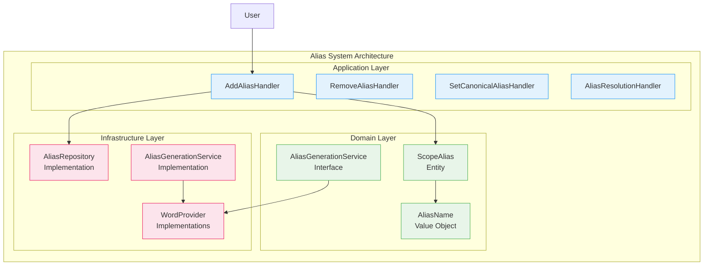
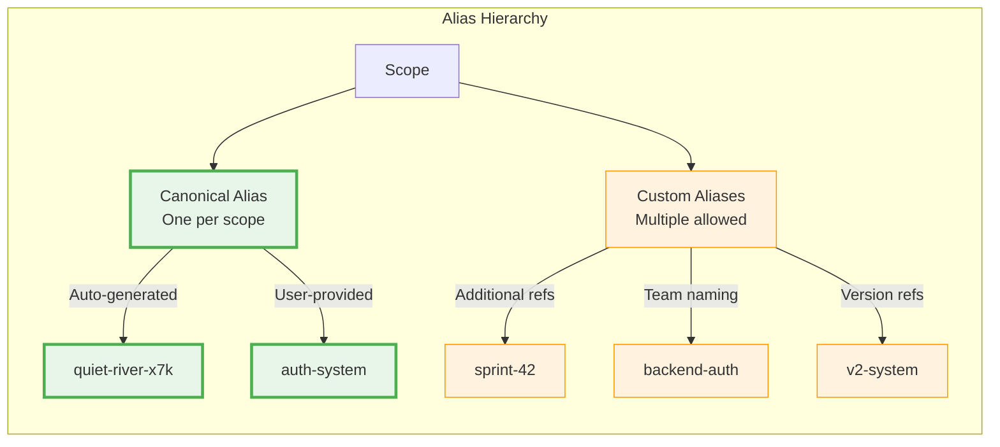
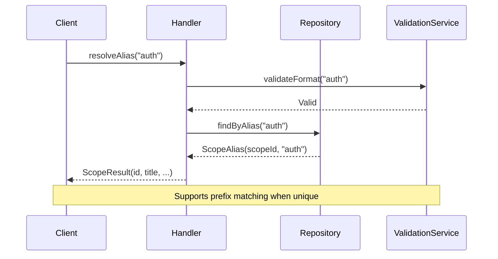
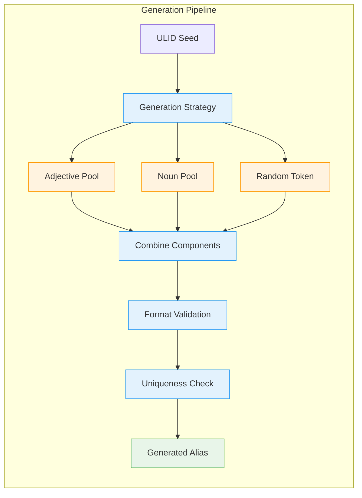
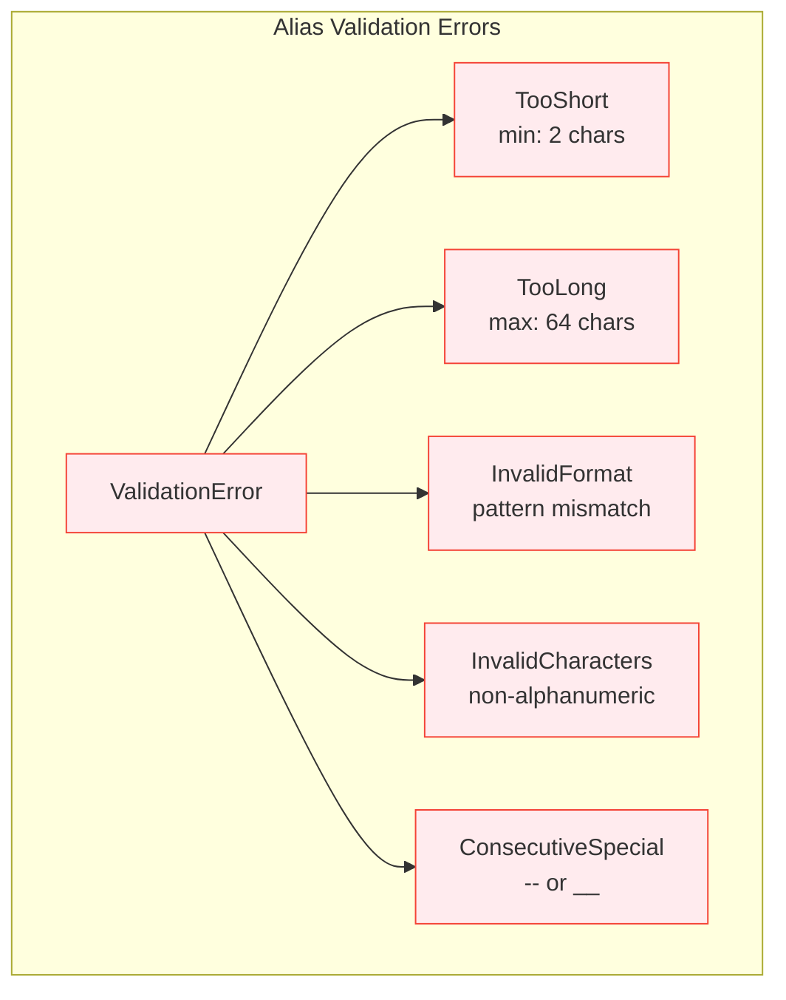

# Alias System API Reference

This document provides a conceptual overview and interface reference for the alias system in Scopes, focusing on core concepts and usage patterns.

## Overview

The alias system provides human-readable identifiers for scopes, enabling intuitive access and management without exposing internal ULIDs.



## Core Concepts

### Alias Types



### Validation Rules

| Component | Rule | Example |
|-----------|------|---------|
| **Length** | 2-64 characters | `auth` ✅, `a` ❌ |
| **Pattern** | `^[a-z][a-z0-9-_]{1,63}$` | `auth-v2` ✅, `2auth` ❌ |
| **Normalization** | Lowercase | `AUTH` → `auth` |
| **Uniqueness** | Across all scopes | Each alias maps to one scope |

## Command Operations

### Add Alias
```kotlin
// Command pattern
data class AddAliasCommand(
    val scopeAlias: String,
    val newAlias: String
)

// Result
sealed class AddAliasResult {
    data class Success(val aliasAdded: String) : AddAliasResult()
    sealed class Error : AddAliasResult() {
        object AliasAlreadyExists : Error()
        object InvalidAliasFormat : Error()
        object ScopeNotFound : Error()
    }
}
```

### Set Canonical Alias
```kotlin
data class SetCanonicalAliasCommand(
    val currentAlias: String,
    val newCanonicalAlias: String
)
```

### Remove Alias
```kotlin
data class RemoveAliasCommand(
    val alias: String
)
```

## Query Operations

### Alias Resolution Flow



### List Operations
```kotlin
// List all aliases for scope
data class ListAliasesQuery(val scopeAlias: String)

// Search aliases by prefix
data class SearchAliasesQuery(val prefix: String)
```

## Generation Strategies

### Canonical Alias Generation



**Generation Pattern**: `{adjective}-{noun}-{token}`
- **Adjectives**: quiet, brave, swift, gentle, wise...
- **Nouns**: river, mountain, ocean, star, cloud...
- **Tokens**: 3-character alphanumeric (x7k, b2m, c9p...)

### Strategy Implementations

| Strategy | Pattern | Use Case |
|----------|---------|----------|
| **Haikunator** | adjective-noun-token | Default canonical aliases |
| **Custom** | User-defined | Manual alias creation |
| **Incremental** | base-name-{number} | Conflict resolution |

## Error Handling

### Validation Errors


### Business Rule Errors
- **AliasAlreadyExists**: Alias is already assigned to another scope
- **CanonicalAliasRequired**: Cannot remove the last alias from a scope
- **ScopeNotFound**: Referenced scope does not exist

## Integration Points

### Repository Interface
```kotlin
interface AliasRepository {
    suspend fun save(alias: ScopeAlias): Either<Error, Unit>
    suspend fun findByName(name: AliasName): Either<Error, ScopeAlias?>
    suspend fun findByScopeId(scopeId: ScopeId): Either<Error, List<ScopeAlias>>
    suspend fun delete(aliasId: AliasId): Either<Error, Unit>
    suspend fun existsByName(name: AliasName): Either<Error, Boolean>
}
```

### Event Publishing
```kotlin
// Domain events for alias operations
sealed class AliasEvent : DomainEvent {
    data class AliasAdded(val scopeId: ScopeId, val aliasName: AliasName) : AliasEvent()
    data class AliasRemoved(val scopeId: ScopeId, val aliasName: AliasName) : AliasEvent()
    data class CanonicalAliasChanged(val scopeId: ScopeId, val oldAlias: AliasName, val newAlias: AliasName) : AliasEvent()
}
```

## Usage Examples

### CLI Integration
```bash
# Add custom alias
scopes alias add quiet-river-x7k auth-system

# Set canonical alias
scopes alias set-canonical quiet-river-x7k authentication

# Remove alias
scopes alias rm auth-system

# List aliases for scope
scopes alias list authentication

# Search by prefix
scopes alias search auth
```

### MCP Tool Integration
The alias system is exposed through MCP tools:
- `aliases.add` - Add new alias
- `aliases.remove` - Remove alias
- `aliases.setCanonical` - Change canonical alias
- `aliases.list` - List scope aliases
- `aliases.resolve` - Resolve alias to scope

## Performance Considerations

### Indexing Strategy
- **Primary Index**: `alias_name` (unique)
- **Secondary Index**: `scope_id` (for listing scope aliases)
- **Search Optimization**: Prefix matching with LIKE queries

### Caching
- **Alias Resolution**: In-memory cache for frequently accessed aliases
- **Generation**: Cache word pools to avoid repeated file reads
- **Validation**: Cache regex patterns for format validation

## Related Documentation

- [Alias System Architecture](../../explanation/alias-system-architecture.md) - Design concepts
- [CLI Quick Reference](../cli-quick-reference.md) - Command examples
- [MCP Implementation Guide](../mcp-implementation-guide.md) - AI integration
