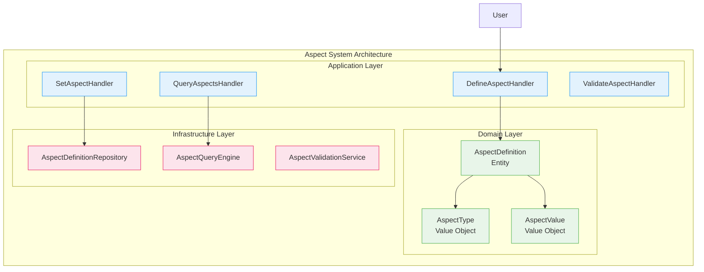
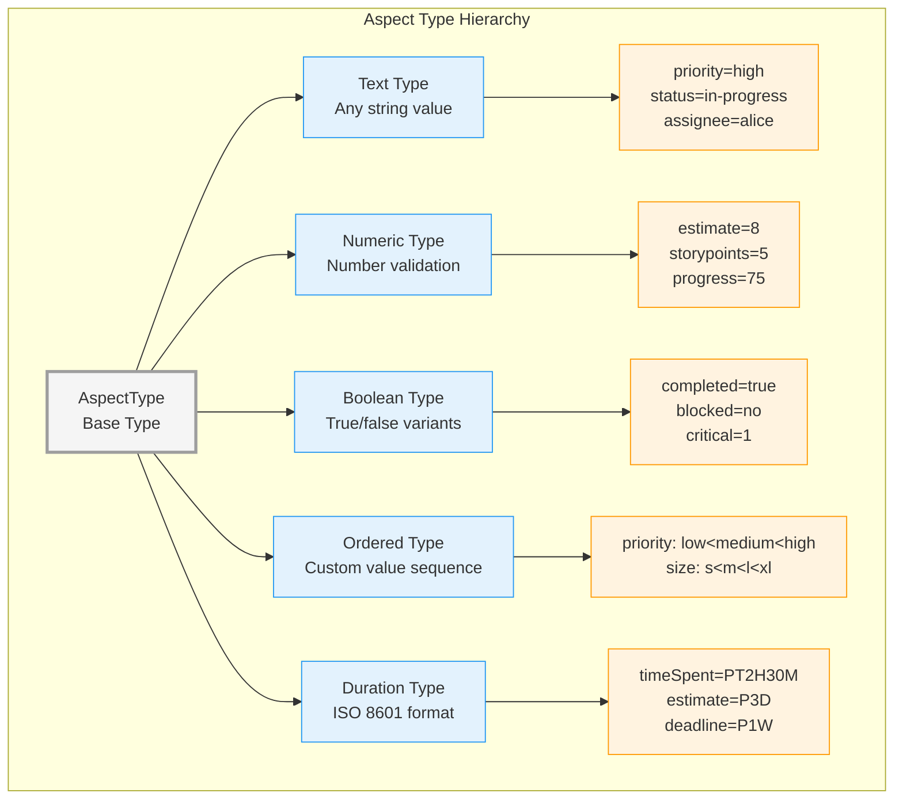
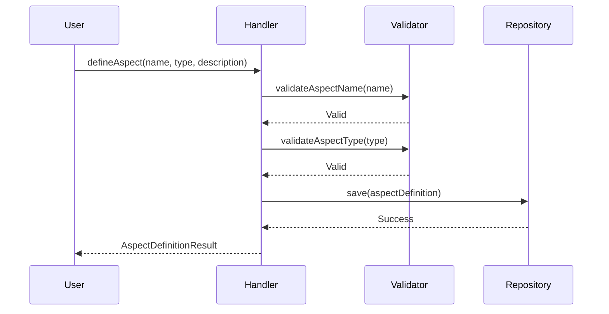
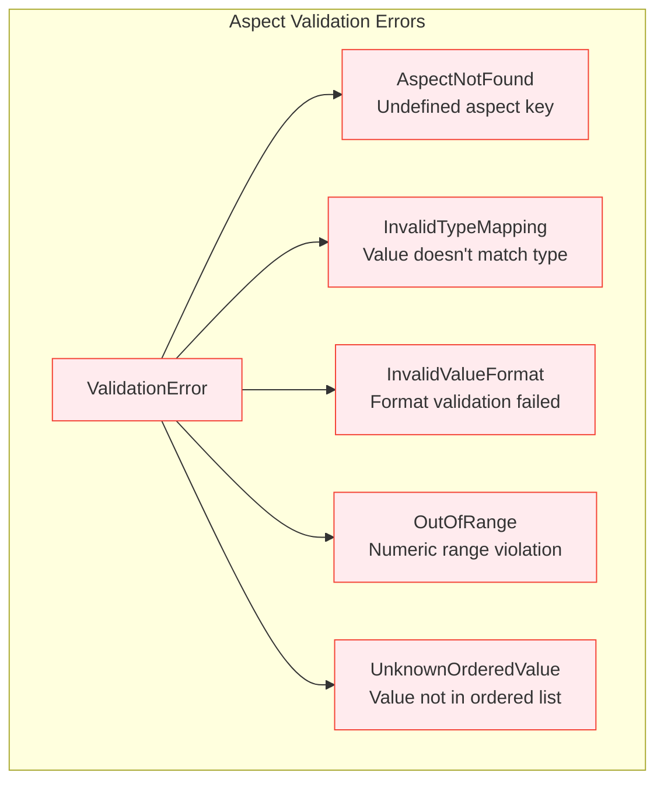
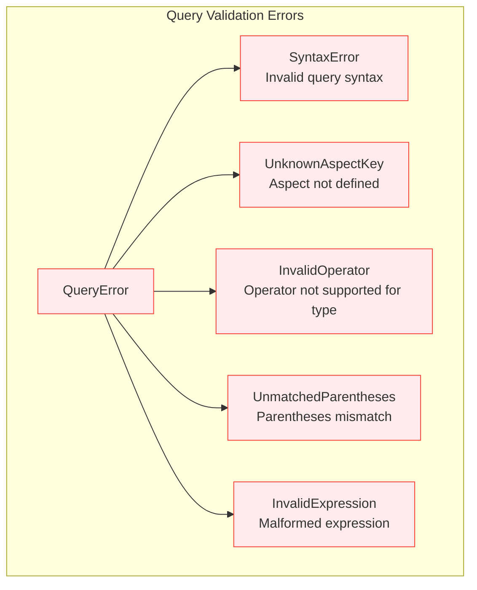

# Aspect System API Reference

This document provides a conceptual overview and current interface reference for Aspect Management.

> **Note**: The query DSL (parser/AST/grammar) shown in some diagrams represents conceptual/future work. The current implementation uses simpler key-value filtering without a full query engine.

## Overview

The aspect system enables flexible metadata classification for scopes through typed key-value pairs, supporting complex querying and filtering operations.



## Aspect Types System



## Type Validation Rules

| Type | Validation | Valid Examples | Invalid Examples |
|------|------------|----------------|------------------|
| **Text** | Non-empty string | `"in-progress"`, `"John Doe"` | `""`, `null` |
| **Numeric** | Parse as number | `"42"`, `"3.14"`, `"-10"` | `"abc"`, `"12.34.56"` |
| **Boolean** | Boolean-like values | `"true"`, `"yes"`, `"1"`, `"false"`, `"no"`, `"0"` | `"maybe"`, `"2"` |
| **Ordered** | Defined value list | `"high"` (if in allowed values) | `"urgent"` (if not defined) |
| **Duration** | ISO 8601 duration | `"P1D"`, `"PT2H30M"`, `"P1W"` | `"2 hours"`, `"1d"` |

## Core Operations

### Define Aspect Types



### Set Aspect Values

```kotlin
// Command pattern for setting aspects
data class SetAspectCommand(
    val scopeAlias: String,
    val aspectKey: String,
    val aspectValue: String
)

// Result with validation
sealed class SetAspectResult {
    data class Success(val key: String, val value: String) : SetAspectResult()
    sealed class Error : SetAspectResult() {
        object ScopeNotFound : Error()
        object AspectNotDefined : Error()
        data class ValidationFailed(val reason: String) : Error()
    }
}
```

### Query Operations

```mermaid
graph LR
    subgraph "Query Types"
        Simple[Simple Query<br/>key=value]
        Comparison[Comparison Query<br/>key&gt;=value]
        Logical[Logical Query<br/>AND/OR/NOT]
        Complex[Complex Query<br/>(a=1 AND b&gt;2) OR c=3]
    end

    subgraph "Query Engine"
        Parser[Query Parser]
        Validator[Query Validator]
        Optimizer[Query Optimizer]
        Executor[Query Executor]
    end

    Simple --> Parser
    Comparison --> Parser
    Logical --> Parser
    Complex --> Parser

    Parser --> Validator
    Validator --> Optimizer
    Optimizer --> Executor

    classDef query fill:#e8f5e9,stroke:#4caf50
    classDef engine fill:#e3f2fd,stroke:#2196f3

    class Simple,Comparison,Logical,Complex query
    class Parser,Validator,Optimizer,Executor engine
```

## Query Syntax

### Basic Queries
```bash
# Simple equality
priority=high

# Comparison operators
estimate>=5
storypoints<8
progress!=100

# Boolean queries
completed=true
blocked=no
```

### Complex Queries
```bash
# Logical AND
priority=high AND status=in-progress

# Logical OR
assignee=alice OR assignee=bob

# Grouping with parentheses
(priority=high OR priority=critical) AND NOT completed=true

# Mixed operators
estimate<=8 AND (type=feature OR type=bug) AND NOT blocked=yes
```

### Ordered Type Queries
```bash
# Assumes priority definition: low < medium < high < critical
priority>=medium    # Returns: medium, high, critical
priority<high       # Returns: low, medium
```

## Aspect Definitions

### Definition Management

```kotlin
// Define new aspect type
data class DefineAspectCommand(
    val key: String,
    val type: AspectType,
    val description: String,
    val allowMultiple: Boolean = false
)

// Update existing definition
data class UpdateAspectDefinitionCommand(
    val key: String,
    val description: String? = null,
    val allowMultiple: Boolean? = null
)
```

### Built-in Aspect Types

| Aspect | Type | Values | Description |
|--------|------|--------|-------------|
| `priority` | Ordered | `low < medium < high < critical` | Task priority level |
| `status` | Text | Any string | Current status |
| `type` | Text | Any string | Classification type |
| `completed` | Boolean | `true/false`, `yes/no`, `1/0` | Completion status |
| `estimate` | Numeric | Hours/points | Effort estimate |
| `timeSpent` | Duration | ISO 8601 | Actual time spent |

## Advanced Features

### Multi-Value Aspects

```mermaid
graph TB
    subgraph "Multi-Value Support"
        Scope[Scope: "Frontend Task"]
        Scope --> A1[tags=frontend]
        Scope --> A2[tags=javascript]
        Scope --> A3[tags=react]

        Query[Query: tags=react]
        Query --> Result[Returns: "Frontend Task"]
    end

    classDef scope fill:#e8f5e9,stroke:#4caf50
    classDef aspect fill:#fff3e0,stroke:#ff9800
    classDef query fill:#e3f2fd,stroke:#2196f3

    class Scope scope
    class A1,A2,A3 aspect
    class Query,Result query
```

### Dynamic Validation

```kotlin
// Validation based on aspect definition
interface AspectValidationService {
    suspend fun validateValue(
        aspectKey: String,
        value: String
    ): Either<ValidationError, AspectValue>

    suspend fun validateQuery(
        query: String
    ): Either<QueryValidationError, ParsedQuery>
}
```

## Error Handling

### Validation Errors



### Query Errors



## Integration Points

### Repository Interfaces

```kotlin
interface AspectDefinitionRepository {
    suspend fun save(definition: AspectDefinition): Either<Error, Unit>
    suspend fun findByKey(key: String): Either<Error, AspectDefinition?>
    suspend fun findAll(): Either<Error, List<AspectDefinition>>
    suspend fun delete(key: String): Either<Error, Unit>
}

// Note: This interface represents future functionality
// Current implementation uses simpler filtering without ParsedQuery
interface AspectQueryRepository {
    suspend fun findScopesWithAspects(
        query: ParsedQuery  // Future: Will use parsed query objects
    ): Either<Error, List<ScopeId>>
}
```

### Event Publishing

```kotlin
sealed class AspectEvent : DomainEvent {
    data class AspectDefined(val key: String, val type: AspectType) : AspectEvent()
    data class AspectSet(val scopeId: ScopeId, val key: String, val value: String) : AspectEvent()
    data class AspectRemoved(val scopeId: ScopeId, val key: String) : AspectEvent()
}
```

## CLI Integration

```bash
# Define new aspect
scopes aspect define priority --type ordered --values "low,medium,high,critical"

# Set aspect values
scopes aspect set my-scope priority=high
scopes aspect set my-scope estimate=8

# Query scopes by aspects
scopes list -a priority=high
scopes list -a "priority>=medium AND estimate<=8"

# List aspect definitions
scopes aspect definitions

# Show specific aspect definition
scopes aspect show priority
```

## Performance Optimization

### Indexing Strategy
- **Aspect Keys**: Index on frequently queried aspects
- **Value Types**: Optimize storage based on type (numeric vs text)
- **Query Patterns**: Cache common query results

### Query Optimization
- **Parse Once**: Cache parsed queries for repeated use
- **Early Filtering**: Apply most selective filters first
- **Index Usage**: Leverage database indexes for range queries

## Related Documentation

- [Aspect System Architecture](../../explanation/aspect-system-architecture.md) - Design concepts
- [CLI Quick Reference](../cli-quick-reference.md) - Command examples
- [Query Language Guide](../../guides/aspect-query-language.md) - Advanced querying
