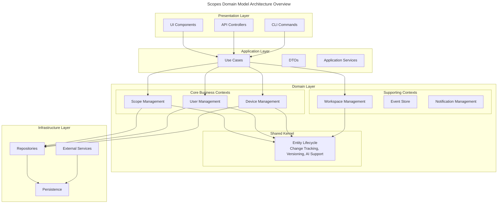

# Domain Model Reference

## Overview

This section documents the domain model of the Scopes system, organized by bounded contexts following Domain-Driven Design (DDD) principles. The system uses Clean Architecture to maintain clear separation between domain logic and infrastructure concerns.

## Architecture Overview

The Scopes domain model consists of multiple bounded contexts that collaborate through well-defined interfaces:



## Bounded Contexts

### Core Business Contexts

- **[Scope Management](./scope-management/)** - The heart of the system, managing hierarchical tasks and projects
- **[User Management](./user-management/)** - User accounts, authentication, and preferences
- **[Device Management](./device-management/)** - Multi-device support and synchronization
- **[Workspace Management](./workspace-management/)** - AI-aware workspace and focus management

### Supporting Contexts

- **[Event Store](./event-store/)** - Domain event storage and distribution
- **[Notification Management](./notification-management/)** - User notifications and alerts
- **[MCP Integration](./mcp-integration/)** - Model Context Protocol for external AI agents

### Shared Kernel

- **[Entity Lifecycle](./entity-lifecycle/)** - Universal change tracking and versioning
  - Change detection and recording
  - Version management with branching
  - Snapshot optimization
  
- **[AI Agent System](./ai-agent/)** - AI collaboration infrastructure
  - Pluggable strategy pattern
  - Proposal lifecycle management
  - Learning from feedback

- **[A2A Collaboration System](./a2a-collaboration/)** - AI-to-AI collaboration infrastructure
  - Git-like conversation branching
  - Multi-agent task coordination  
  - Systematic conflict resolution
  - Performance optimization for multi-agent scenarios

### Integration Patterns

- **[Shared Kernel Usage](./integration-patterns/shared-kernel-usage.md)** - How contexts integrate with Entity Lifecycle
- **[Context Mapping](./integration-patterns/context-mapping.md)** - Relationships between bounded contexts
- **[Anti-Corruption Layer](./integration-patterns/anti-corruption-layer.md)** - Protecting domain integrity

## Key Concepts

### Domain-Driven Design

The system follows DDD principles:

1. **Ubiquitous Language**: Each context has its own language that matches business terms
2. **Bounded Contexts**: Clear boundaries between different parts of the domain
3. **Aggregates**: Consistency boundaries within each context
4. **Value Objects**: Immutable objects representing concepts
5. **Domain Events**: Communication between contexts

### Clean Architecture

The implementation follows Clean Architecture:

1. **Dependency Rule**: Dependencies point inward toward the domain
2. **Use Cases**: Application-specific business rules
3. **Interface Adapters**: Convert data between layers
4. **Frameworks & Drivers**: External tools and frameworks

### Entity Lifecycle Integration

Most entities in the system can leverage the Entity Lifecycle shared kernel for:

- **Change Tracking**: Automatic detection of field-level changes
- **Version Management**: Git-like branching and merging
- **AI Proposals**: Structured suggestions with review workflows
- **Audit Trail**: Complete history with attribution

## Common Patterns

### Repository Pattern

All contexts use repositories for persistence:

```kotlin
interface Repository<T, ID> {
    suspend fun findById(id: ID): Result<T?, QueryError>
    suspend fun findAll(): Result<List<T>, QueryError>
    suspend fun save(entity: T): Result<T, PersistenceError>
    suspend fun delete(id: ID): Result<Unit, PersistenceError>
}
```

### Result Type

Error handling through Result types:

```kotlin
sealed class DomainError
data class ValidationError(val message: String) : DomainError()
data class NotFoundError(val id: String) : DomainError()
// ... other error types
```

### Domain Events

Communication through events:

```kotlin
interface DomainEvent {
    val occurredAt: Instant
    val eventId: EventId
}
```

## Implementation Guidelines

### Adding New Contexts

1. Define the bounded context's purpose and boundaries
2. Identify aggregates and entities
3. Design value objects for concepts
4. Define repository interfaces
5. Create use cases for operations
6. Integrate with Entity Lifecycle if needed

### Integrating with Entity Lifecycle

1. Register your entity type
2. Implement change detection
3. Create AI strategies (optional)
4. Test thoroughly

## Quality Attributes

The domain model prioritizes:

1. **Modularity**: Clear boundaries between contexts
2. **Testability**: Easy to test domain logic in isolation
3. **Extensibility**: New features without modifying core
4. **Performance**: Efficient operations with caching
5. **Security**: Authorization at domain boundaries

## Testing Strategy

Each bounded context should have:

1. **Unit Tests**: Test domain logic
2. **Integration Tests**: Test repository implementations
3. **Contract Tests**: Verify context boundaries
4. **Architecture Tests**: Ensure clean architecture rules

## References

- [Architecture Decision Records](../../explanation/adr/) - Key architectural decisions
- [User Stories](../../explanation/user-stories/) - Business requirements
- [Implementation Guides](../../guides/) - How-to documentation
- [API Reference](../apis/) - Technical API documentation
