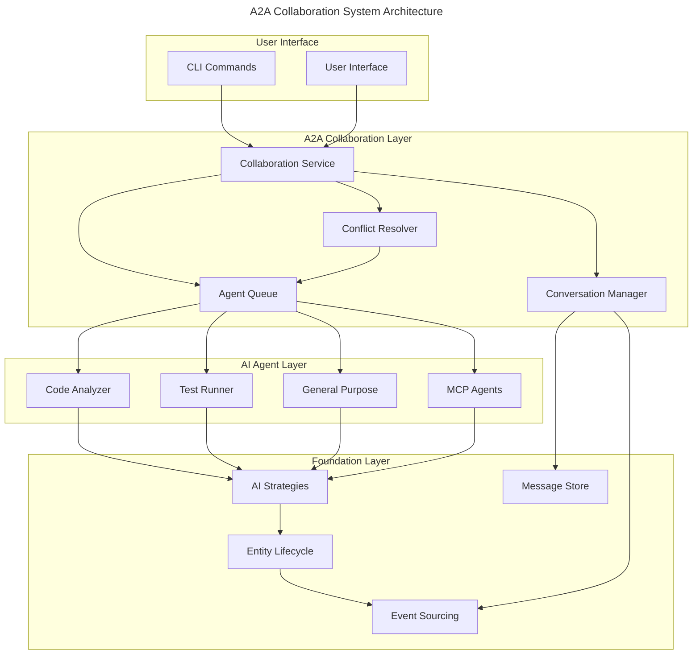

# A2A Collaboration System

## Overview

The A2A (AI-to-AI) Collaboration System enables multiple AI agents to work together systematically on complex tasks while maintaining human oversight and control. This system builds on the Entity Lifecycle and AI Agent foundations to provide sophisticated multi-agent coordination.

## Architecture



## Core Concepts

### Conversation Branching
Git-like versioning for AI discussions:
- **Main Branch**: Primary conversation thread
- **Feature Branches**: Parallel exploration of ideas
- **Merge Operations**: Integrate successful insights
- **Conflict Resolution**: Handle competing approaches

### Agent Coordination
Structured collaboration between AI agents:
- **Task Distribution**: Automatic assignment based on specializations
- **Context Sharing**: Efficient information exchange between agents
- **Consensus Building**: Systematic agreement processes
- **Handoff Management**: Smooth transition between agent responsibilities

### Performance Optimization  
- **Lazy Loading**: Load conversation context on demand
- **Caching**: Store frequently accessed collaboration patterns
- **Async Processing**: Non-blocking agent coordination
- **Token Efficiency**: Minimize context usage through summarization

## Key Features

### 1. Multi-Agent Task Execution
```kotlin
// Example: Complex refactoring task with multiple agents
val collaborationTask = CollaborationTask(
    id = TaskId.generate(),
    type = CollaborationTaskType.JOINT_ANALYSIS,
    requester = AgentId("user"),
    targetAgents = setOf(
        AgentId("code-analyzer"),
        AgentId("test-runner"),
        AgentId("general-purpose")
    ),
    entityContext = EntityId("auth-system"),
    priority = TaskPriority.HIGH
)
```

### 2. Structured Conflict Resolution
```kotlin
// Agents present structured arguments
data class ArgumentStructure(
    val position: String,
    val reasoning: List<String>,
    val evidence: List<Evidence>,
    val tradeOffs: List<TradeOff>,
    val confidence: ConfidenceLevel
)
```

### 3. Conversation Management
```kotlin
// Git-like conversation operations
interface ConversationVersioning {
    suspend fun createBranch(from: ConversationBranchId, purpose: BranchPurpose): ConversationBranch
    suspend fun mergeBranch(source: ConversationBranchId, target: ConversationBranchId): MergeResult
}
```

## Component Details

### [Conversation System](./conversation-system.md)
- Branching and merging for AI discussions
- Context preservation across conversation threads
- Message routing and filtering
- Performance optimizations

### [Conflict Resolution](./conflict-resolution.md)
- Systematic handling of agent disagreements
- Third-party neutral agent evaluation
- User escalation for high-stakes decisions
- Learning from conflict outcomes

### [Agent Coordination](./agent-coordination.md)
- Dynamic agent selection for tasks
- Workload balancing and queue management
- Inter-agent communication protocols
- Collaboration pattern recognition

### [Performance Architecture](./performance-architecture.md)
- Lazy context loading strategies
- Caching and summarization techniques
- Async processing and queue management
- Resource usage optimization

## Integration Points

### With Entity Lifecycle
- A2A conversations are versioned entities
- Agent actions create trackable changes
- Full audit trail of AI collaboration
- Rollback and branch management

### With AI Strategies
- Leverages existing pluggable AI pattern
- Extends single-agent strategies to multi-agent
- Maintains entity-specific AI logic
- Enables cross-strategy collaboration

### With Event Sourcing
- All A2A interactions generate events
- Complete history of agent collaboration
- Learning data for future improvements
- Integration with existing event streams

## Usage Patterns

### 1. Peer Review
One agent reviews another's work:
```bash
scopes ai collaborate --type peer-review \
  --requester code-analyzer \
  --reviewer test-runner \
  --entity scope-123
```

### 2. Joint Problem Solving
Multiple agents work together:
```bash
scopes ai collaborate --type joint-analysis \
  --agents code-analyzer,test-runner,general-purpose \
  --task "refactor authentication system"
```

### 3. Consensus Building
Agents must agree on approach:
```bash
scopes ai collaborate --type consensus \
  --agents code-analyzer,test-runner \
  --decision "architecture choice"
```

## Benefits

### For Users
- **Enhanced AI Capabilities**: Access to multiple AI specializations simultaneously
- **Reduced Coordination Burden**: AI agents handle routine collaboration autonomously
- **Better Decision Quality**: Multiple perspectives with systematic conflict resolution
- **Transparent Process**: Full visibility into AI decision-making

### For AI Agents
- **Specialized Expertise**: Agents contribute their unique strengths
- **Collaborative Learning**: Agents learn from each other's successes and failures
- **Conflict Resolution**: Systematic handling of disagreements
- **Context Preservation**: Maintain context across agent handoffs

### For System
- **Scalable Architecture**: Async processing supports growth
- **Performance Optimization**: Lazy loading and caching minimize resource usage
- **Extensible Design**: Easy to add new collaboration patterns
- **Integration Friendly**: Works with existing Entity Lifecycle and AI systems

## Related Documentation

- [Entity Lifecycle](../entity-lifecycle/) - Foundation for A2A system
- [AI Agent System](../ai-agent/) - Single-agent foundation
- [User Stories](../../explanation/user-stories/) - US-011, US-012 for detailed scenarios  
- [ADR-016](../../explanation/adr/0016-a2a-collaboration-architecture.md) - Architectural decisions
- [Implementation Guide](../../../../tmp/a2a-collaboration-implementation.md) - Step-by-step implementation

## Next Steps

1. **Review Foundation**: Understand [Entity Lifecycle](../entity-lifecycle/) and [AI Strategies](../ai-agent/)
2. **Study Components**: Examine detailed component documentation
3. **Check User Stories**: Review US-011 and US-012 for user scenarios
4. **Implement**: Follow the implementation guide for hands-on development
