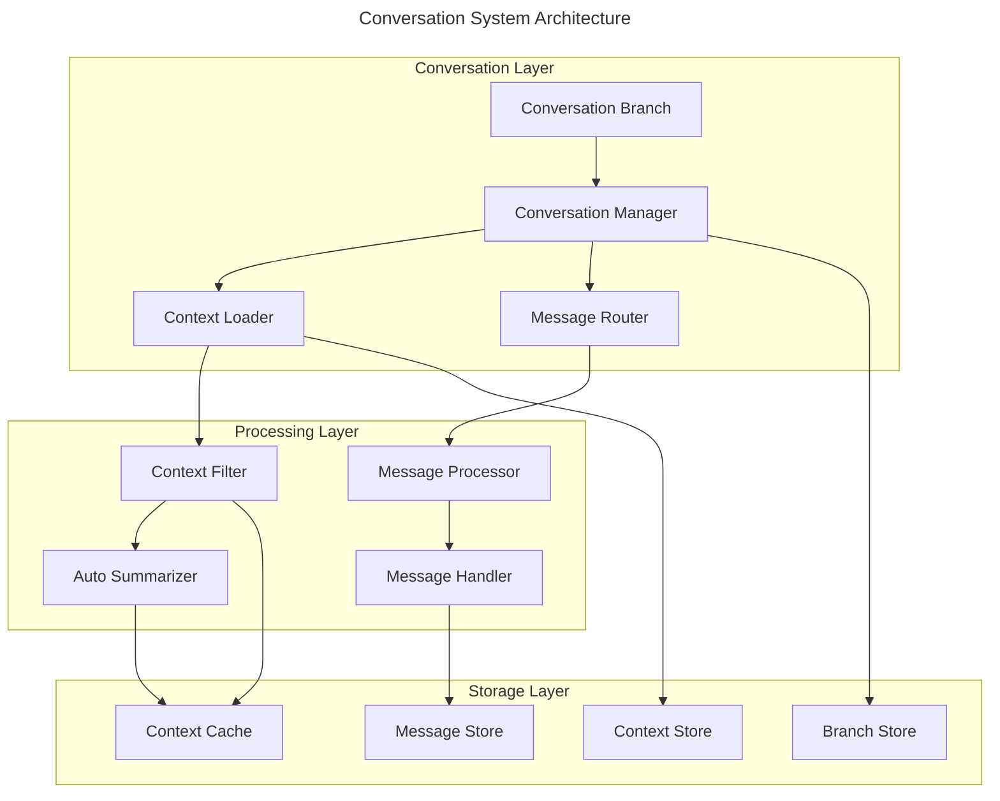

# A2A Conversation System

## Overview

The Conversation System provides git-like versioning for AI agent discussions, enabling parallel exploration of ideas, systematic conflict resolution, and efficient context management for multi-agent collaboration.

## Core Architecture



## Conversation Branching

### Branch Types
```kotlin
enum class BranchPurpose {
    ANALYSIS,              // Deep dive into specific aspect
    ALTERNATIVE_SOLUTION,  // Explore different approach  
    VERIFICATION,          // Validate another agent's work
    COLLABORATION,         // Multi-agent discussion
    CONFLICT_RESOLUTION    // Resolve disagreements
}
```

### Branch Management
```kotlin
data class ConversationBranch(
    val id: ConversationBranchId,
    val parentBranch: ConversationBranchId?,
    val agentId: AgentId,
    val purpose: BranchPurpose,
    val messages: List<AIMessage>,
    val mergeRequest: MergeRequest? = null,
    val createdAt: Instant = Clock.System.now(),
    val lastActivity: Instant = Clock.System.now()
)

interface ConversationVersioning {
    suspend fun createBranch(
        from: ConversationBranchId,
        purpose: BranchPurpose,
        agentId: AgentId
    ): ConversationBranch
    
    suspend fun mergeBranch(
        source: ConversationBranchId,
        target: ConversationBranchId
    ): MergeResult
    
    suspend fun rebaseBranch(
        branch: ConversationBranchId,
        onto: ConversationBranchId
    ): RebaseResult
    
    suspend fun deleteBranch(branch: ConversationBranchId): Result<Unit>
}
```

### Merge Operations
```kotlin
sealed class MergeResult {
    data class Success(
        val resultBranch: ConversationBranchId,
        val mergedMessages: List<AIMessage>
    ) : MergeResult()
    
    data class Conflict(
        val conflictingMessages: List<MessageConflict>,
        val resolutionRequired: Boolean
    ) : MergeResult()
    
    data class Failure(val error: MergeError) : MergeResult()
}

data class MessageConflict(
    val sourceMessage: AIMessage,
    val targetMessage: AIMessage,
    val conflictType: ConflictType,
    val automaticResolution: AIMessage? = null
)
```

## Message System

### Message Types
```kotlin
sealed class AIMessage {
    abstract val id: MessageId
    abstract val from: AgentId
    abstract val to: Set<AgentId>
    abstract val conversationId: ConversationId
    abstract val branchId: ConversationBranchId
    abstract val timestamp: Instant
    
    data class ProposalMessage(
        override val id: MessageId,
        override val from: AgentId,
        override val to: Set<AgentId>,
        override val conversationId: ConversationId,
        override val branchId: ConversationBranchId,
        override val timestamp: Instant,
        val proposal: EntityChangeProposal,
        val requestType: ProposalRequestType
    ) : AIMessage()
    
    data class AnalysisMessage(
        override val id: MessageId,
        override val from: AgentId,
        override val to: Set<AgentId>,
        override val conversationId: ConversationId,
        override val branchId: ConversationBranchId,
        override val timestamp: Instant,
        val analysis: EntityAnalysis,
        val confidence: ConfidenceLevel,
        val requestsFeedback: Boolean = false
    ) : AIMessage()
    
    data class CollaborationRequest(
        override val id: MessageId,
        override val from: AgentId,
        override val to: Set<AgentId>,
        override val conversationId: ConversationId,
        override val branchId: ConversationBranchId,
        override val timestamp: Instant,
        val collaborationType: CollaborationType,
        val context: String,
        val urgency: UrgencyLevel
    ) : AIMessage()
}
```

### Message Routing
```kotlin
class MessageRouter(
    private val agentRegistry: AgentRegistry,
    private val conversationManager: ConversationManager
) {
    suspend fun routeMessage(message: AIMessage): RoutingResult {
        return when (message) {
            is ProposalMessage -> routeProposal(message)
            is AnalysisMessage -> routeAnalysis(message)
            is CollaborationRequest -> routeCollaboration(message)
            // ... other message types
        }
    }
    
    private suspend fun routeProposal(message: ProposalMessage): RoutingResult {
        val targetAgents = message.to.mapNotNull { agentId ->
            agentRegistry.getAgent(agentId)?.takeIf { it.isAvailable() }
        }
        
        if (targetAgents.isEmpty()) {
            return RoutingResult.NoAvailableAgents(message.to)
        }
        
        return RoutingResult.Success(
            deliveredTo = targetAgents.map { it.id }.toSet(),
            queuedFor = emptySet()
        )
    }
}
```

## Context Management

### Lazy Context Loading
```kotlin
class LazyConversationLoader(
    private val messageStore: AIMessageStore,
    private val contextAnalyzer: ContextAnalyzer,
    private val contextCache: ContextCache
) {
    suspend fun loadRelevantContext(
        currentTask: AITask,
        maxTokens: Int = 4000
    ): ConversationContext {
        val cacheKey = generateCacheKey(currentTask)
        
        // Try cache first
        contextCache.get(cacheKey)?.let { cached ->
            if (cached.isValid() && cached.tokens <= maxTokens) {
                return cached
            }
        }
        
        // Analyze relevance for current task
        val relevanceQuery = contextAnalyzer.analyzeRelevance(currentTask)
        
        // Load messages based on relevance
        val relevantMessages = messageStore.query(
            filter = relevanceQuery,
            limit = calculateMessageLimit(maxTokens),
            sortBy = SortCriteria.RELEVANCE_SCORE.desc()
        )
        
        val context = ConversationContext(
            messages = relevantMessages,
            summary = generateContextSummary(relevantMessages),
            metadata = extractRelevantMetadata(relevantMessages),
            tokens = estimateTokenCount(relevantMessages)
        )
        
        // Cache the result
        contextCache.put(cacheKey, context, ttl = 10.minutes)
        
        return context
    }
    
    private fun calculateMessageLimit(maxTokens: Int): Int {
        // Estimate ~100 tokens per message on average
        return (maxTokens * 0.8).toInt() / 100  // Leave 20% for metadata
    }
}
```

### Context Filtering
```kotlin
class ContextFilter(
    private val relevanceScorer: RelevanceScorer
) {
    suspend fun filterMessages(
        messages: List<AIMessage>,
        currentContext: AITask,
        maxTokens: Int
    ): FilteredContext {
        val scoredMessages = messages.map { message ->
            ScoredMessage(
                message = message,
                relevanceScore = relevanceScorer.score(message, currentContext),
                tokenCount = estimateTokens(message)
            )
        }
        
        // Sort by relevance and select top messages within token limit
        var totalTokens = 0
        val selectedMessages = scoredMessages
            .sortedByDescending { it.relevanceScore }
            .takeWhile { scoredMessage ->
                if (totalTokens + scoredMessage.tokenCount <= maxTokens) {
                    totalTokens += scoredMessage.tokenCount
                    true
                } else {
                    false
                }
            }
            .map { it.message }
        
        return FilteredContext(
            messages = selectedMessages,
            totalTokens = totalTokens,
            filteredCount = messages.size - selectedMessages.size,
            averageRelevance = selectedMessages.map { msg ->
                scoredMessages.find { it.message.id == msg.id }?.relevanceScore ?: 0.0
            }.average()
        )
    }
}

data class ScoredMessage(
    val message: AIMessage,
    val relevanceScore: Double,
    val tokenCount: Int
)
```

## Performance Optimizations

### Auto-Summarization
```kotlin
class ConversationSummarizer(
    private val aiClient: AIClient
) {
    suspend fun summarizeBranch(
        branchId: ConversationBranchId,
        compressionRatio: Double = 0.3
    ): ConversationSummary {
        val messages = getMessagesForBranch(branchId)
        val originalTokens = messages.sumOf { estimateTokens(it) }
        val targetTokens = (originalTokens * compressionRatio).toInt()
        
        val summaryPrompt = buildSummaryPrompt(messages, targetTokens)
        
        val summary = aiClient.generateSummary(summaryPrompt)
            .getOrThrow { error -> SummarizationError("Failed to generate summary", error) }
        
        return ConversationSummary(
            branchId = branchId,
            originalMessages = messages.map { it.id },
            summaryText = summary,
            originalTokens = originalTokens,
            summaryTokens = estimateTokens(summary),
            compressionRatio = summary.length.toDouble() / messages.sumOf { it.toString().length },
            createdAt = Clock.System.now()
        )
    }
}
```

### Message Caching Strategy  
```kotlin
class ConversationCache(
    private val redisClient: RedisClient,
    private val compressionService: CompressionService
) {
    suspend fun cacheContext(
        key: String,
        context: ConversationContext,
        ttl: Duration
    ) {
        val compressed = compressionService.compress(
            Json.encodeToString(context)
        )
        
        redisClient.setex(
            key = "conversation:$key",
            value = compressed,
            ttl = ttl.inWholeSeconds
        )
    }
    
    suspend fun getCachedContext(key: String): ConversationContext? {
        val compressed = redisClient.get("conversation:$key") ?: return null
        
        val json = compressionService.decompress(compressed)
        return try {
            Json.decodeFromString<ConversationContext>(json)
        } catch (e: Exception) {
            logger.warn("Failed to decode cached context", e)
            null
        }
    }
}
```

## Integration with Entity Lifecycle

### Conversation as Entities
```kotlin
data class ConversationEntity(
    override val id: EntityId,
    override val type: EntityType = EntityType.CONVERSATION,
    override val version: VersionId,
    val conversationId: ConversationId,
    val participants: Set<AgentId>,
    val branches: Map<ConversationBranchId, ConversationBranch>,
    val activeBranch: ConversationBranchId,
    val createdAt: Instant,
    val lastActivity: Instant
) : Entity

// Conversation changes tracked as entity changes
class ConversationChangeService(
    private val entityChangeService: EntityChangeService
) {
    suspend fun recordMessageSent(message: AIMessage): Result<ChangeId, ChangeError> {
        val change = EntityChange(
            id = ChangeId.generate(),
            entityType = EntityType.CONVERSATION,
            entityId = EntityId(message.conversationId.value),
            fieldPath = FieldPath("messages"),
            operation = ChangeOperation.APPEND,
            beforeValue = null,
            afterValue = Json.encodeToJsonElement(message),
            version = VersionId.MAIN,
            causedBy = CausedBy.AIAgent(message.from),
            timestamp = message.timestamp
        )
        
        return entityChangeService.recordChange(change)
    }
    
    suspend fun recordBranchCreated(branch: ConversationBranch): Result<ChangeId, ChangeError> {
        val change = EntityChange(
            id = ChangeId.generate(),
            entityType = EntityType.CONVERSATION,
            entityId = EntityId(branch.id.conversationId),
            fieldPath = FieldPath("branches.${branch.id.value}"),
            operation = ChangeOperation.CREATE,
            beforeValue = null,
            afterValue = Json.encodeToJsonElement(branch),
            version = VersionId.MAIN,
            causedBy = CausedBy.AIAgent(branch.agentId),
            timestamp = branch.createdAt
        )
        
        return entityChangeService.recordChange(change)
    }
}
```

## API Examples

### CLI Usage
```bash
# View active conversations
scopes ai conversations list
╭─────────────────────────────────────────────────────────╮
│ Active Conversations                                    │
├─────────────────────────────────────────────────────────┤
│ ID         Participants           Branches  Activity    │
│ conv-001   code-analyzer,test-run  3        2m ago      │
│ conv-002   general-purpose         1        5m ago      │
╰─────────────────────────────────────────────────────────╯

# View conversation details
scopes ai conversations show conv-001
Conversation: conv-001
Participants: code-analyzer, test-runner
Active Branch: analysis/conflict-resolution

Branches:
```mermaid
---
title: Conversation Branch Structure
---
gitgraph:
    options:
        mainBranchName: main
    commit id: "Initial message"
    commit id: "Agent joined"
    commit id: "Analysis started"
    branch analysis/security-review
    checkout analysis/security-review
    commit id: "Security scan"
    commit id: "Vulnerability found"
    commit id: "Fix proposed"
    commit id: "Review complete"
    commit id: "Documentation"
    checkout main
    branch analysis/conflict-resolution
    checkout analysis/conflict-resolution
    commit id: "Conflict detected"
    commit id: "Resolution in progress" type: HIGHLIGHT
```

**Text View:**
├─ main (3 messages)
├─ analysis/security-review (5 messages) 
└─ analysis/conflict-resolution (2 messages) *ACTIVE*

Recent Activity:
[2m ago] code-analyzer: Security analysis complete
[2m ago] test-runner: Test coverage recommendations ready
[1m ago] SYSTEM: Conflict detected, creating resolution branch

# Create new conversation branch
scopes ai conversations branch conv-001 \
  --purpose alternative-solution \
  --agent general-purpose

# Merge branch back to main
scopes ai conversations merge conv-001 \
  --source analysis/security-review \
  --target main
```

## Next Steps

- [Conflict Resolution](./conflict-resolution.md) - Handling agent disagreements
- [Agent Coordination](./agent-coordination.md) - Multi-agent task management  
- [Performance Architecture](./performance-architecture.md) - Optimization techniques
