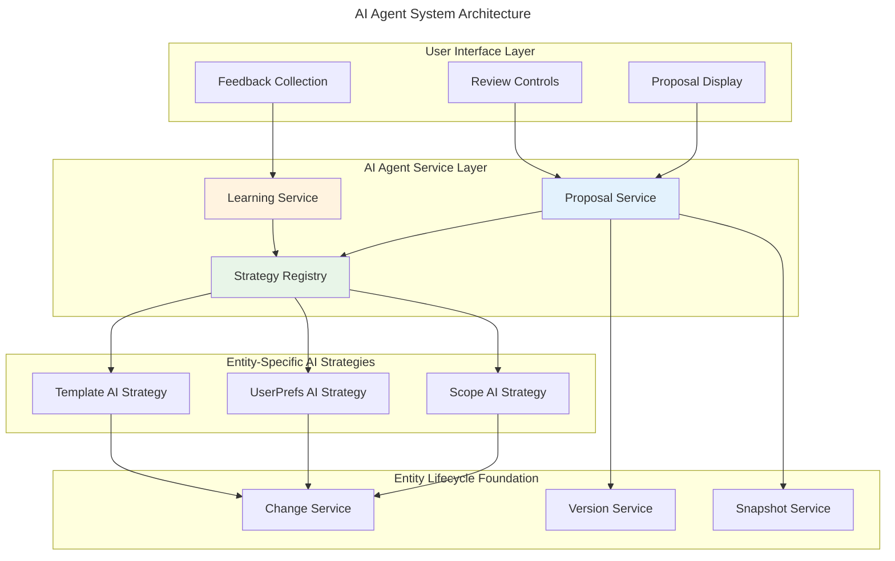

# AI Agent System Reference

## Overview

The AI Agent System enables artificial intelligence to collaborate with users on entity management through structured proposals, analysis, and feedback loops. Built on top of the Entity Lifecycle system, it provides entity-agnostic AI capabilities with pluggable strategies for different entity types.

## Key Features

- **Pluggable AI Strategies**: Entity-specific intelligence without code duplication
- **Structured Proposals**: AI suggestions with rationale, confidence, and impact assessment
- **Review Workflows**: User control over AI suggestions with accept/reject/modify options
- **Safe Experimentation**: Test AI proposals in isolated versions before applying
- **Learning Integration**: AI improves based on user feedback and decisions
- **MCP Support**: External AI agents can integrate via Model Context Protocol

## Documentation Structure

### Core Documentation

- **[Proposal Lifecycle](./proposal-lifecycle.md)** - How proposals flow from creation to application
  - Proposal states and transitions
  - Review and approval workflows
  - Testing and validation
  - Application and rollback

- **[AI Strategies](./ai-strategies.md)** - Entity-specific AI implementation patterns
  - Strategy interface and contracts
  - Entity analysis approaches
  - Proposal generation logic
  - MCP integration patterns

### Related Documentation

- **[Entity Lifecycle](../entity-lifecycle/)** - Foundation for AI to work with entities
- **[Adding New Entity Types](../../../../tmp/adding-new-entity-types.md)** - Includes AI strategy implementation
- **[Integration Patterns](../integration-patterns/)** - How AI integrates with contexts

## Architecture Overview



## Core Concepts

### Entity Change Proposal

The fundamental unit of AI collaboration - a structured suggestion for modifying an entity:

```kotlin
data class EntityChangeProposal(
    val id: ProposalId,
    val entityType: EntityType,
    val entityId: EntityId,
    val proposedChanges: List<EntityChange>,
    val metadata: ProposalMetadata,
    val status: ProposalStatus
)
```

### AI Strategy Pattern

Entity-specific intelligence implemented through a common interface:

```kotlin
interface EntityAIStrategy {
    fun canHandle(entityType: EntityType): Boolean
    suspend fun analyzeEntity(entity: EntitySnapshot, context: AIAnalysisContext): Result<EntityAnalysis, AIError>
    suspend fun generateProposals(entity: EntitySnapshot, analysis: EntityAnalysis, context: AIProposalContext): Result<List<EntityChangeProposal>, AIError>
    suspend fun validateProposal(proposal: EntityChangeProposal, entity: EntitySnapshot): Result<ValidationResult, AIError>
    suspend fun incorporateFeedback(proposal: EntityChangeProposal, feedback: ProposalFeedback): Result<Unit, AIError>
}
```

### Proposal Lifecycle States

1. **PENDING**: Waiting for user review
2. **ACCEPTED**: User approved, ready to apply
3. **REJECTED**: User declined with feedback
4. **APPLIED**: Changes have been applied
5. **SUPERSEDED**: Replaced by newer proposal
6. **EXPIRED**: No longer valid due to entity changes

## Common Use Cases

### 1. Task Breakdown (Scopes)
AI analyzes complex tasks and suggests breaking them into manageable subtasks:
- Detects high complexity scores
- Generates subtask structure
- Maintains relationships
- Preserves context

### 2. Preference Optimization (User Preferences)
AI optimizes settings based on usage patterns:
- Time-based theme switching
- Keyboard shortcut recommendations
- Accessibility improvements
- Performance optimizations

### 3. Template Enhancement (Project Templates)
AI improves template quality and completeness:
- Structure simplification
- Missing component detection
- Tag optimization
- Consistency validation

### 4. Custom Entity Support
Any new entity type can have AI capabilities:
- Implement EntityAIStrategy interface
- Register with strategy registry
- Define analysis logic
- Generate relevant proposals

## Best Practices

### Strategy Implementation

1. **Keep Strategies Focused**: One strategy per entity type
2. **Leverage Context**: Use provided context for better proposals
3. **Provide Clear Rationale**: Explain why changes are suggested
4. **Set Appropriate Confidence**: Be honest about uncertainty
5. **Validate Thoroughly**: Ensure proposals won't break entities

### Proposal Generation

1. **Quality over Quantity**: Generate fewer, better proposals
2. **Respect User Preferences**: Consider maxProposals limit
3. **Group Related Changes**: Bundle logical changes together
4. **Estimate Impact**: Provide realistic time and risk assessments
5. **Make Reversible Changes**: Allow users to undo if needed

### User Experience

1. **Progressive Disclosure**: Show summary first, details on demand
2. **Visual Diff**: Clear before/after comparisons
3. **Batch Review**: Allow reviewing multiple proposals efficiently
4. **Feedback Collection**: Make it easy to provide feedback
5. **Learning Transparency**: Show how AI is improving

## Integration with MCP

External AI agents can provide strategies via Model Context Protocol:

```kotlin
class MCPEntityAIStrategy(
    private val mcpClient: MCPClient,
    private val serverUri: String,
    private val supportedEntityTypes: Set<EntityType>
) : EntityAIStrategy {
    // MCP-based implementation
}
```

Benefits:
- Leverage specialized external AI models
- Support for proprietary AI services
- Dynamic capability discovery
- Standardized integration protocol

## Performance Considerations

- **Async Processing**: Generate proposals in background
- **Caching**: Cache analysis results for repeated access
- **Batching**: Process multiple entities together
- **Throttling**: Limit proposal generation rate
- **Priority Queues**: Process important entities first

## Security and Privacy

- **Authorization**: Verify user can modify entity before proposing
- **Data Sanitization**: Clean sensitive data from proposals
- **Audit Trail**: Track all AI actions and decisions
- **Consent**: Respect user preferences for AI assistance
- **Isolation**: Test proposals in sandboxed versions

## Next Steps

1. Read [Proposal Lifecycle](./proposal-lifecycle.md) to understand the full workflow
2. Explore [AI Strategies](./ai-strategies.md) for implementation patterns
3. See [Adding New Entity Types](../../../../tmp/adding-new-entity-types.md) for complete examples
4. Review [Entity Lifecycle](../entity-lifecycle/) for the foundation
