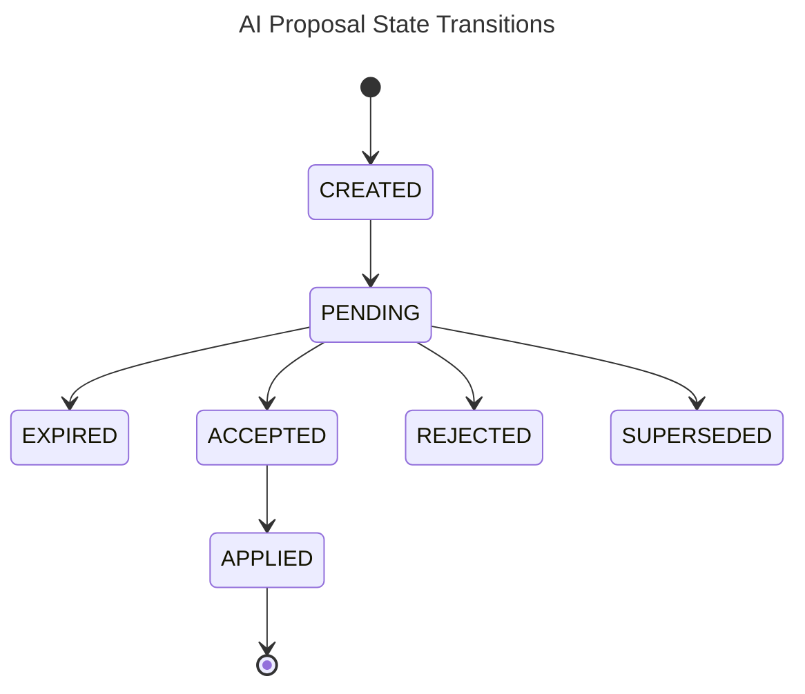

# AI Proposal Lifecycle

This document describes the complete lifecycle of AI-generated proposals, from creation through application, including review workflows, testing, and feedback integration.

## Overview

The proposal lifecycle ensures that AI suggestions are:
- **Reviewable**: Users maintain control over all changes
- **Testable**: Proposals can be validated before application
- **Traceable**: Complete audit trail of decisions and actions
- **Learnable**: Feedback improves future proposals

## Proposal States

### State Diagram



### State Definitions

```kotlin
enum class ProposalStatus {
    PENDING,        // Waiting for user review
    ACCEPTED,       // User approved, ready to apply
    REJECTED,       // User declined
    APPLIED,        // Changes have been applied to entity
    SUPERSEDED,     // Newer proposal replaces this one
    EXPIRED         // Proposal is no longer valid
}
```

## Core Entities

### EntityChangeProposal

The fundamental unit of AI collaboration:

```kotlin
data class EntityChangeProposal(
    val id: ProposalId,
    val entityType: EntityType,
    val entityId: EntityId,
    val proposedChanges: List<EntityChange>,
    val metadata: ProposalMetadata,
    val status: ProposalStatus = ProposalStatus.PENDING,
    val createdAt: Instant = Clock.System.now(),
    val reviewedAt: Instant? = null,
    val appliedAt: Instant? = null
)

data class ProposalId(val value: String) {
    companion object {
        fun generate(): ProposalId = ProposalId(ULID.generate())
    }
}
```

### ProposalMetadata

Rich context and rationale for proposals:

```kotlin
data class ProposalMetadata(
    val aiAgent: AgentId,
    val rationale: String,
    val confidence: ConfidenceLevel,
    val category: ProposalCategory,
    val impactAssessment: ImpactAssessment,
    val context: AIProposalContext,
    val alternativeOptions: List<AlternativeProposal> = emptyList(),
    val requiredApprovals: Set<ApprovalType> = emptySet()
)

enum class ConfidenceLevel(val value: Double) {
    VERY_LOW(0.0..0.2),
    LOW(0.2..0.4),
    MEDIUM(0.4..0.6), 
    HIGH(0.6..0.8),
    VERY_HIGH(0.8..1.0)
}

enum class ProposalCategory {
    OPTIMIZATION,    // Improve efficiency or performance
    BREAKDOWN,       // Break down complex tasks
    REORGANIZATION,  // Restructure hierarchy or relationships
    CLEANUP,         // Remove redundant or obsolete items
    ENHANCEMENT,     // Add missing information or features
    BUG_FIX,        // Fix detected inconsistencies
    AUTOMATION      // Automate manual processes
}
```

### Impact Assessment

Helps users understand proposal implications:

```kotlin
data class ImpactAssessment(
    val estimatedTimeToImplement: Duration,
    val riskLevel: RiskLevel,
    val affectedEntities: Set<EntityId>,
    val reversible: Boolean,
    val dependencies: List<ProposalDependency> = emptyList(),
    val potentialSideEffects: List<String> = emptyList()
)

enum class RiskLevel {
    NONE,      // No risk
    LOW,       // Minor impact if wrong
    MEDIUM,    // Moderate impact, recoverable
    HIGH,      // Significant impact, difficult recovery
    CRITICAL   // Major impact, potential data loss
}
```

## Proposal Service

Core service managing the proposal lifecycle:

```kotlin
interface ProposalService {
    suspend fun createProposal(request: CreateProposalRequest): Result<EntityChangeProposal, ProposalError>
    suspend fun reviewProposal(proposalId: ProposalId, decision: ReviewDecision): Result<Unit, ProposalError>
    suspend fun applyProposal(proposalId: ProposalId): Result<ApplyResult, ProposalError>
    suspend fun getProposalsFor(entityId: EntityId, status: ProposalStatus? = null): Result<List<EntityChangeProposal>, QueryError>
    suspend fun getProposalHistory(entityId: EntityId, limit: Int = 50): Result<List<ProposalEvent>, QueryError>
}
```

### Creating Proposals

```kotlin
class DefaultProposalService(
    private val proposalRepository: ProposalRepository,
    private val changeService: EntityChangeService,
    private val eventPublisher: DomainEventPublisher,
    private val versionService: EntityVersionService
) : ProposalService {
    
    override suspend fun createProposal(request: CreateProposalRequest): Result<EntityChangeProposal, ProposalError> {
        // Validate proposal against current entity state
        val currentEntity = getCurrentEntitySnapshot(request.entityId, request.targetVersion)
            ?: return Result.failure(ProposalError.EntityNotFound(request.entityId))
        
        val strategy = getStrategyFor(request.entityType)
            ?: return Result.failure(ProposalError.NoStrategyFound(request.entityType))
        
        val validationResult = strategy.validateProposal(request.proposal, currentEntity)
            .getOrElse { return Result.failure(ProposalError.ValidationFailed(it)) }
        
        if (!validationResult.isValid) {
            return Result.failure(ProposalError.ProposalInvalid(validationResult.errors))
        }
        
        // Store proposal
        val proposal = request.proposal.copy(status = ProposalStatus.PENDING)
        proposalRepository.save(proposal)
            .getOrElse { return Result.failure(ProposalError.PersistenceFailed(it)) }
        
        // Publish creation event
        val event = AIProposalCreatedEvent(
            proposalId = proposal.id,
            entityType = proposal.entityType,
            entityId = proposal.entityId,
            aiAgent = proposal.metadata.aiAgent,
            changes = proposal.proposedChanges,
            rationale = proposal.metadata.rationale,
            confidence = proposal.metadata.confidence.value
        )
        eventPublisher.publish(event)
        
        return Result.success(proposal)
    }
}
```

## Review Workflow

### Review Decisions

Users can respond to proposals in multiple ways:

```kotlin
sealed class ReviewDecision {
    abstract val reviewedBy: UserId
    abstract val feedback: String?
    abstract val autoApply: Boolean
    
    data class Accept(
        override val reviewedBy: UserId,
        override val feedback: String? = null,
        override val autoApply: Boolean = true
    ) : ReviewDecision()
    
    data class Reject(
        override val reviewedBy: UserId,
        override val feedback: String,
        val reason: RejectionReason,
        override val autoApply: Boolean = false
    ) : ReviewDecision()
    
    data class Modify(
        override val reviewedBy: UserId,
        val modifiedChanges: List<EntityChange>,
        override val feedback: String? = null,
        override val autoApply: Boolean = true
    ) : ReviewDecision()
}

enum class RejectionReason {
    INCORRECT_ANALYSIS,
    UNWANTED_CHANGE,
    POOR_TIMING,
    INSUFFICIENT_CONTEXT,
    BETTER_ALTERNATIVE_EXISTS,
    TOO_RISKY,
    OTHER
}
```

### Review Processing

```kotlin
override suspend fun reviewProposal(
    proposalId: ProposalId, 
    decision: ReviewDecision
): Result<Unit, ProposalError> {
    val proposal = proposalRepository.findById(proposalId)
        ?.takeIf { it.status == ProposalStatus.PENDING }
        ?: return Result.failure(ProposalError.ProposalNotFound(proposalId))
    
    val updatedProposal = when (decision) {
        is ReviewDecision.Accept -> proposal.copy(
            status = ProposalStatus.ACCEPTED,
            reviewedAt = Clock.System.now()
        )
        is ReviewDecision.Reject -> proposal.copy(
            status = ProposalStatus.REJECTED,
            reviewedAt = Clock.System.now()
        )
        is ReviewDecision.Modify -> proposal.copy(
            proposedChanges = decision.modifiedChanges,
            status = ProposalStatus.ACCEPTED,
            reviewedAt = Clock.System.now()
        )
    }
    
    proposalRepository.save(updatedProposal)
    
    // Publish review event
    val event = AIProposalReviewedEvent(
        proposalId = proposalId,
        decision = decision,
        reviewedBy = decision.reviewedBy,
        feedback = decision.feedback
    )
    eventPublisher.publish(event)
    
    // Apply immediately if accepted and auto-apply is enabled
    if (updatedProposal.status == ProposalStatus.ACCEPTED && 
        decision.autoApply) {
        applyProposal(proposalId)
    }
    
    return Result.success(Unit)
}
```

## Application Process

### Applying Accepted Proposals

```kotlin
override suspend fun applyProposal(proposalId: ProposalId): Result<ApplyResult, ProposalError> {
    val proposal = proposalRepository.findById(proposalId)
        ?.takeIf { it.status == ProposalStatus.ACCEPTED }
        ?: return Result.failure(ProposalError.ProposalNotAccepted(proposalId))
    
    // Apply changes to entity
    val appliedChanges = changeService.recordChanges(proposal.proposedChanges)
        .getOrElse { return Result.failure(ProposalError.ApplicationFailed(it)) }
    
    // Update proposal status
    val appliedProposal = proposal.copy(
        status = ProposalStatus.APPLIED,
        appliedAt = Clock.System.now()
    )
    proposalRepository.save(appliedProposal)
    
    // Publish application event
    val event = AIProposalAppliedEvent(
        proposalId = proposalId,
        appliedChanges = appliedChanges,
        appliedBy = getCurrentUser().userId
    )
    eventPublisher.publish(event)
    
    return Result.success(ApplyResult(appliedChanges))
}
```

### Application Result

```kotlin
data class ApplyResult(
    val appliedChanges: List<ChangeId>,
    val resultingVersion: VersionId? = null,
    val rollbackInformation: RollbackInfo? = null
)

data class RollbackInfo(
    val canRollback: Boolean,
    val rollbackChanges: List<EntityChange>?,
    val rollbackVersion: VersionId?
)
```

## Testing Proposals

### Proposal Testing Framework

Test proposals in isolated versions before applying:

```kotlin
class ProposalTestFramework(
    private val versionService: EntityVersionService,
    private val changeService: EntityChangeService
) {
    
    suspend fun testProposal(
        proposal: EntityChangeProposal,
        validationCriteria: List<ValidationCriterion>
    ): Result<TestResult, TestError> {
        // Create isolated version for testing
        val testVersion = versionService.createVersion(
            CreateVersionRequest(
                entityId = proposal.entityId,
                parentVersion = VersionId.MAIN,
                name = VersionName("test-${proposal.id.value}"),
                purpose = VersionPurpose.AI_TESTING
            )
        ).getOrElse { return Result.failure(TestError.VersionCreationFailed(it)) }
        
        try {
            // Apply changes in test version
            val testChanges = proposal.proposedChanges.map { change ->
                change.copy(version = testVersion.id)
            }
            
            changeService.recordChanges(testChanges)
                .getOrElse { return Result.failure(TestError.ChangeApplicationFailed(it)) }
            
            // Run validation criteria
            val validationResults = validationCriteria.map { criterion ->
                criterion.validate(proposal.entityId, testVersion.id)
            }
            
            val testResult = TestResult(
                proposalId = proposal.id,
                testVersion = testVersion.id,
                validationResults = validationResults,
                passed = validationResults.all { it.isValid },
                duration = measureTime { /* test execution time */ }
            )
            
            return Result.success(testResult)
            
        } finally {
            // Clean up test version
            versionService.deleteVersion(testVersion.id)
        }
    }
}
```

### Validation Criteria

```kotlin
interface ValidationCriterion {
    val name: String
    val description: String
    suspend fun validate(entityId: EntityId, version: VersionId): ValidationResult
}

// Example criteria
class ConsistencyValidationCriterion : ValidationCriterion {
    override val name = "consistency"
    override val description = "Ensure entity remains internally consistent"
    
    override suspend fun validate(entityId: EntityId, version: VersionId): ValidationResult {
        // Check entity consistency rules
        // Return validation result
    }
}

class PerformanceValidationCriterion : ValidationCriterion {
    override val name = "performance"
    override val description = "Ensure changes don't degrade performance"
    
    override suspend fun validate(entityId: EntityId, version: VersionId): ValidationResult {
        // Measure performance impact
        // Return validation result
    }
}
```

## Feedback Integration

### Collecting Feedback

```kotlin
data class ProposalFeedback(
    val proposalId: ProposalId,
    val userId: UserId,
    val feedbackType: FeedbackType,
    val rating: Int? = null, // 1-5 scale
    val comments: String? = null,
    val suggestedImprovements: List<String> = emptyList(),
    val timestamp: Instant = Clock.System.now()
)

enum class FeedbackType {
    ACCEPTANCE_FEEDBACK,  // Why accepted
    REJECTION_FEEDBACK,   // Why rejected
    MODIFICATION_FEEDBACK, // What was changed
    OUTCOME_FEEDBACK      // How it worked out
}
```

### Learning from Feedback

```kotlin
class FeedbackLearningService(
    private val feedbackRepository: FeedbackRepository,
    private val strategyRegistry: AIStrategyRegistry
) {
    
    suspend fun processFeedback(feedback: ProposalFeedback) {
        val proposal = getProposal(feedback.proposalId)
        val strategy = strategyRegistry.findStrategy(proposal.entityType)
        
        strategy?.incorporateFeedback(proposal, feedback)
            ?.getOrElse { error ->
                logger.warn("Failed to incorporate feedback", error)
            }
        
        // Store feedback for analysis
        feedbackRepository.save(feedback)
        
        // Update learning metrics
        updateLearningMetrics(proposal, feedback)
    }
    
    private suspend fun updateLearningMetrics(
        proposal: EntityChangeProposal,
        feedback: ProposalFeedback
    ) {
        // Track acceptance rates by category
        // Identify common rejection reasons
        // Measure confidence calibration
        // Detect improvement opportunities
    }
}
```

## Event Flow

### Proposal Events

```kotlin
// Creation
data class AIProposalCreatedEvent(
    val proposalId: ProposalId,
    val entityType: EntityType,
    val entityId: EntityId,
    val aiAgent: AgentId,
    val changes: List<EntityChange>,
    val rationale: String,
    val confidence: Double,
    override val occurredAt: Instant = Clock.System.now()
) : DomainEvent

// Review
data class AIProposalReviewedEvent(
    val proposalId: ProposalId,
    val decision: ReviewDecision,
    val reviewedBy: UserId,
    val feedback: String?,
    override val occurredAt: Instant = Clock.System.now()
) : DomainEvent

// Application
data class AIProposalAppliedEvent(
    val proposalId: ProposalId,
    val appliedChanges: List<ChangeId>,
    val appliedBy: UserId,
    override val occurredAt: Instant = Clock.System.now()
) : DomainEvent

// Expiration
data class AIProposalExpiredEvent(
    val proposalId: ProposalId,
    val reason: ExpirationReason,
    override val occurredAt: Instant = Clock.System.now()
) : DomainEvent
```

## Performance Optimization

### Async Processing

```kotlin
class AsyncProposalProcessor(
    private val proposalQueue: Queue<ProposalGenerationTask>,
    private val proposalService: ProposalService,
    private val concurrency: Int = 5
) {
    
    suspend fun processProposals() = coroutineScope {
        repeat(concurrency) {
            launch {
                while (isActive) {
                    val task = proposalQueue.poll() ?: continue
                    
                    try {
                        processProposalTask(task)
                    } catch (e: Exception) {
                        logger.error("Failed to process proposal task", e)
                        task.markFailed(e)
                    }
                }
            }
        }
    }
}
```

### Proposal Caching

```kotlin
class CachedProposalService(
    private val baseService: ProposalService,
    private val cache: Cache<ProposalId, EntityChangeProposal>
) : ProposalService {
    
    override suspend fun getProposalsFor(
        entityId: EntityId, 
        status: ProposalStatus?
    ): Result<List<EntityChangeProposal>, QueryError> {
        val cacheKey = "${entityId.value}:${status?.name ?: "ALL"}"
        
        cache.getList(cacheKey)?.let { cached ->
            return Result.success(cached)
        }
        
        return baseService.getProposalsFor(entityId, status)
            .onSuccess { proposals ->
                cache.putList(cacheKey, proposals, ttl = 5.minutes)
            }
    }
}
```

## Security Considerations

### Authorization

```kotlin
class SecureProposalService(
    private val baseService: ProposalService,
    private val authorizationService: AuthorizationService
) : ProposalService {
    
    override suspend fun reviewProposal(
        proposalId: ProposalId,
        decision: ReviewDecision
    ): Result<Unit, ProposalError> {
        val proposal = getProposal(proposalId)
        
        // Verify user can modify the entity
        val canModify = authorizationService.canModify(
            userId = decision.reviewedBy,
            entityId = proposal.entityId,
            entityType = proposal.entityType
        )
        
        if (!canModify) {
            return Result.failure(ProposalError.Unauthorized(decision.reviewedBy))
        }
        
        return baseService.reviewProposal(proposalId, decision)
    }
}
```

## Next Steps

- [AI Strategies](./ai-strategies.md) - How to implement entity-specific AI
- [Entity Lifecycle](../entity-lifecycle/) - Foundation for proposals
