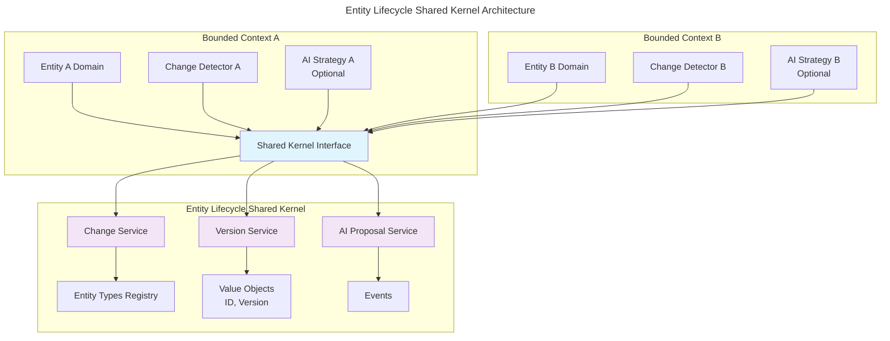

# Entity Lifecycle Reference

## Overview

The Entity Lifecycle system provides universal change management, versioning, and AI collaboration capabilities for all entity types in the Scopes system. This is implemented as a **Shared Kernel** that multiple Bounded Contexts can use to enable consistent change tracking and version management.

## Key Features

- **Universal Change Tracking**: Track field-level changes for any entity type
- **Version Management**: Git-like branching and merging for entities
- **AI Collaboration**: Structured proposals and review workflows
- **Complete Audit Trail**: Full attribution and history for compliance

## Documentation Structure

### Core Documentation

- **[Core Concepts](./core-concepts.md)** - Fundamental concepts and value objects
  - Entity types, IDs, and field paths
  - Version management basics
  - Change attribution model
  - Core domain entities

- **[Implementation Guide](./implementation.md)** - Detailed implementation patterns
  - Change detection strategies
  - Repository integration
  - Performance optimizations
  - Error handling approaches

### Related Documentation

- **[AI Agent System](../ai-agent/)** - AI proposal and strategy system
- **[Integration Patterns](../integration-patterns/)** - Shared kernel usage patterns

## Quick Start

### 1. Register Your Entity Type

```kotlin
entityLifecycleRegistry.registerEntityType(
    entityType = EntityType.YOUR_ENTITY,
    serializer = YourEntity.serializer(),
    changeDetector = YourEntityChangeDetector(),
    idExtractor = { entity -> EntityId(entity.id.value) }
)
```

### 2. Implement Change Detection

```kotlin
class YourEntityChangeDetector : ChangeDetector<YourEntity> {
    override fun detectChanges(before: YourEntity?, after: YourEntity): List<EntityChange> {
        // Implement field-by-field comparison
    }
}
```

### 3. Enable AI Collaboration (Optional)

```kotlin
class YourEntityAIStrategy : EntityAIStrategy {
    override fun canHandle(entityType: EntityType) = entityType == EntityType.YOUR_ENTITY
    override suspend fun analyzeEntity(...) = // Analysis logic
    override suspend fun generateProposals(...) = // Proposal generation
}
```

## Architecture Overview



## Common Use Cases

### 1. Enable Change Tracking
Track all changes to your entities for audit and compliance:
- Automatic field-level change detection
- Complete attribution (user, AI, or system)
- Timestamped change history

### 2. Implement Version Control
Create experimental versions of entities:
- Branch entities for safe experimentation
- Test changes in isolation
- Merge successful changes back

### 3. AI-Powered Optimization
Let AI agents suggest improvements:
- Entity-specific analysis strategies
- Structured proposal generation
- User review and approval workflow

## Best Practices

1. **Start Simple**: Begin with basic change tracking before adding versioning
2. **Be Selective**: Only track meaningful fields to avoid noise
3. **Batch Changes**: Group related changes for atomic operations
4. **Handle Failures Gracefully**: Don't fail operations if change tracking fails
5. **Test Thoroughly**: Ensure change detection works correctly for all scenarios

## Performance Considerations

- Use selective field tracking for high-frequency entities
- Implement snapshot optimization for complex entities
- Consider async change recording for better responsiveness
- Monitor change volume and adjust strategies accordingly

## Next Steps

1. Read [Core Concepts](./core-concepts.md) to understand the fundamentals
2. Follow the [Implementation Guide](./implementation.md) for detailed patterns
3. Explore [AI Integration](../ai-agent/) for advanced capabilities
