# Scopes Unified Distribution Package

## 📦 Package Contents

This unified distribution package contains everything needed to install Scopes for all platforms, suitable for enterprise and multi-platform deployments.

> **💡 Recommended**: For most users, use the platform-specific bundle packages (~20MB each) instead of this unified package (~260MB). Platform bundles provide the same security and features with 92% smaller downloads.

### Package Structure

```mermaid
graph LR
    Package[📦 scopes-v1.0.0-dist.tar.gz]
    
    Package --- Root[📄 Root Files]
    Package --- Binaries[💾 binaries/]
    Package --- Verification[🔐 verification/]
    Package --- SBOM[📋 sbom/]
    Package --- Docs[📚 docs/]
    
    Root --- README[README.md<br/>Installation guide]
    Root --- InstallSh[install.sh<br/>Unix installer]
    Root --- InstallPs1[install.ps1<br/>Windows installer]
    
    Binaries --- Linux[🐧 Linux<br/>x64/ARM64 binaries]
    Binaries --- Darwin[🍎 macOS<br/>x64/ARM64 binaries]
    Binaries --- Windows[🪟 Windows<br/>x64/ARM64 binaries]
    
    Verification --- Hashes[📝 SHA256 Hashes<br/>binary-hash-*.txt]
    Verification --- SLSA[🔒 SLSA Provenance<br/>multiple.intoto.jsonl]
    
    SBOM --- JSON[📄 JSON Format<br/>sbom-*.json]
    SBOM --- XML[📄 XML Format<br/>sbom-*.xml]
    
    Docs --- Security[🔐 SECURITY.md]
    Docs --- Install[📖 INSTALL.md]
    Docs --- Enterprise[🏢 ENTERPRISE.md]
```



## 🚀 Quick Installation

### Linux/macOS
```bash
# Extract the package
tar -xzf scopes-v1.0.0-dist.tar.gz
cd scopes-v1.0.0-dist

# Run installation with verification
./install.sh

# Or skip verification (not recommended)
./install.sh --skip-verification
```

### Windows PowerShell
```powershell
# Extract the package (Windows 10/11 built-in)
Expand-Archive scopes-v1.0.0-dist.zip -DestinationPath .
cd scopes-v1.0.0-dist

# Run installation
.\install.ps1

# Or skip verification (not recommended)
.\install.ps1 -SkipVerification
```

## 🔒 Security Verification

The offline installation performs security verification:

- **SHA256 Hash Verification**: Ensures binary integrity
- **SLSA Level 3 Provenance**: Optional verification if `slsa-verifier` is installed
- **SBOM Validation**: Software Bill of Materials for compliance

### SLSA Verification (Optional)

For SLSA provenance verification, you need to install `slsa-verifier` separately:

```bash
# Install slsa-verifier (requires Go)
go install github.com/slsa-framework/slsa-verifier/v2/cli/slsa-verifier@latest

# Or download pre-built binary
wget https://github.com/slsa-framework/slsa-verifier/releases/latest/download/slsa-verifier-linux-amd64
chmod +x slsa-verifier-linux-amd64
sudo mv slsa-verifier-linux-amd64 /usr/local/bin/slsa-verifier
```

The installer will automatically use `slsa-verifier` if available in your PATH.

## ⚙️ Installation Options

### Environment Variables

```bash
# Customize installation directory
export SCOPES_INSTALL_DIR=/opt/scopes/bin

# Force installation without prompts
export SCOPES_FORCE_INSTALL=true

# Enable verbose output
export SCOPES_VERBOSE=true

# Skip security verification (not recommended)
export SCOPES_SKIP_VERIFICATION=false
```

### Command Line Options (Unix)

```bash
./install.sh [OPTIONS]

Options:
  -d, --install-dir DIR     Installation directory (default: /usr/local/bin)
  -f, --force              Skip confirmation prompts
  -s, --skip-verification  Skip security verification (not recommended)
  -v, --verbose            Enable verbose output
  -h, --help               Show help message
```

### Command Line Options (Windows)

```powershell
.\install.ps1 [OPTIONS]

Parameters:
  -InstallDir DIR          Installation directory (default: C:\Program Files\Scopes\bin)
  -Force                   Skip confirmation prompts
  -SkipVerification        Skip security verification (not recommended)
  -Verbose                 Enable verbose output
  -Help                    Show help message
```

## 🏢 Enterprise Deployment

### Compliance Features

- **SBOM Files**: CycloneDX format for dependency tracking
- **Verification Logs**: Complete audit trail of security checks
- **Offline Operation**: No network access required after download
- **Hash Verification**: All binaries cryptographically verified

### CI/CD Integration

```yaml
# GitHub Actions example
- name: Install Scopes (Offline)
  run: |
    wget https://github.com/kamiazya/scopes/releases/download/v1.0.0/scopes-v1.0.0-offline-linux-x64.tar.gz
    tar -xzf scopes-v1.0.0-offline-linux-x64.tar.gz
    cd scopes-v1.0.0-offline
    SCOPES_FORCE_INSTALL=true ./install.sh
```

### Docker Integration

```dockerfile
# Multi-stage build for minimal image
FROM alpine:latest as installer
RUN apk add --no-cache curl tar
COPY scopes-v1.0.0-offline-linux-x64.tar.gz .
RUN tar -xzf scopes-v1.0.0-offline-linux-x64.tar.gz && \
    cd scopes-v1.0.0-offline && \
    SCOPES_FORCE_INSTALL=true SCOPES_INSTALL_DIR=/usr/local/bin ./install.sh

FROM alpine:latest
COPY --from=installer /usr/local/bin/scopes /usr/local/bin/scopes
ENTRYPOINT ["/usr/local/bin/scopes"]
```

## 🔧 Troubleshooting

### Common Issues

**Permission Denied**
```bash
# Solution: Use sudo or install to user directory
sudo ./install.sh
# OR
SCOPES_INSTALL_DIR=$HOME/.local/bin ./install.sh
```

**Verification Failures**
- Ensure package was downloaded completely
- Check file integrity with `sha256sum` or `certutil`
- Re-download if hash mismatches occur

**Missing Dependencies**
- Unix: Requires `sha256sum`/`shasum` and `bash`
- Windows: Requires PowerShell 5.1+ and `certutil`

### Verification Manual Process

If automatic verification fails, you can manually verify:

```bash
# Verify specific binary hash
cd verification
sha256sum -c binary-hash-linux-x64.txt

# Verify SLSA provenance (requires slsa-verifier)
./tools/slsa-verifier-linux-x64 verify-artifact \
  ../binaries/scopes-v1.0.0-linux-x64 \
  --provenance-path multiple.intoto.jsonl \
  --source-uri github.com/kamiazya/scopes
```

## 📚 Additional Documentation

- **[SECURITY.md](docs/SECURITY.md)**: Detailed security verification guide
- **[INSTALL.md](docs/INSTALL.md)**: Comprehensive installation instructions
- **[ENTERPRISE.md](docs/ENTERPRISE.md)**: Enterprise deployment best practices

## ❓ Support

For offline installation support:
1. Check this README for common solutions
2. Review the detailed guides in the `docs/` directory
3. Contact your system administrator for enterprise environments
4. For security-related concerns, follow responsible disclosure guidelines

---

**Security Notice**: This offline package enables the same security standards as online installation. Binaries can be cryptographically verified via SHA256 hashes and SLSA Level 3 provenance when verification is enabled and the verifier is available.
